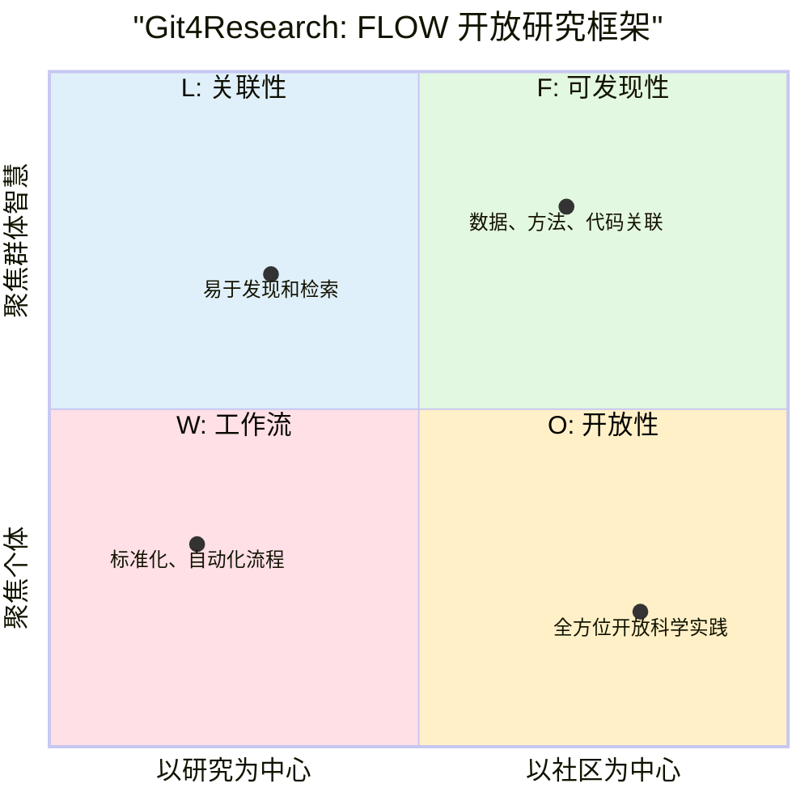

# Git4Research：重塑开放研究新范式

Git4Research不仅仅是一个开放研究的项目，它是一个旨在**彻底改变传统学术研究模式**的创新框架。我们通过集成**开放科学**的核心原则与**前沿AI技术**，构建一个去中心化、协作化、智能化的未来研究生态。

---

## **核心理念：研究要素的“乐高”组合** 🧩

想象一下，研究不再是封闭的堡垒，而是由无数可共享、可重组的“乐高积木”构成。在Git4Research，这些积木就是：

* **数据**：可自由分享、验证和复用的数据块。
* **方法**：清晰透明、可复现的实验设计和流程。
* **代码**：开源、模块化的算法和工具。
* **思想**：每个人的洞察、假设和灵感。

---

## **运作机制：AI驱动的“研究智能体”**

Git4Research项目就像一个由AI驱动的“智能体”，高效且人人可参与：

1.  **AI赋能个体**：过去需要顶级实验室才能实现的复杂任务，现在借助 **LLM、AutoML** 等AI工具，普通研究者也能轻松完成，极大降低了科研门槛。

2.  **协作生产线**：全球研究者像流水线上的工程师，贡献各自的“乐高积木”。AI辅助匹配合作者、管理项目进度，让跨学科、跨机构的协作变得前所未有的顺畅。

3.  **价值再创造**：研究成果不再是孤立的论文，而是可被AI识别、理解和再利用的**数字资产**。这些资产可以在开放协议下被二次创新、迭代，形成知识的“复利效应”。

---

## **研究领域：面向未来的“新质生产力”理论** ️

Git4Research立足于数字经济“游戏规则”的前瞻性研究和论证：

### 1. **贡献即要素：人人都是“价值创造者”**
我们打破传统角色界限，认为每一种贡献——无论是数据、代码、模型，甚至是独特见解——都是构建研究成果的关键“要素”。就像开源软件中的每一行代码，你的贡献都将被识别并融入到更大的知识体系中，并推动**合成劳动力**（AI与人类协作）的生成与分配。

### 2. **合成劳动力生成权：智能体的“劳动权益”**
随着AI智能体深度参与研究，它们的“劳动成果”如何被定义和分配？我们提出“合成劳动力生成权”，确保AI智能体通过创造性劳动获得的贡献能被公平地认可。这不仅仅是技术问题，更是关乎未来AI社会协作的**公平性**和**可持续性**。

### 3. **开源组织智能体：自治的“研究大脑”**
想象一个能够自我管理、自我优化的“研究大脑”——这就是开源组织智能体。它们通过自主协作、学习，动态响应社区需求，协调多方贡献，甚至在无人干预的情况下推动开源项目的迭代。这将彻底改变传统项目管理，实现更高效、更具适应性的**研究流程**。

---

### **愿景：一个人人都是研究员的知识图谱社区**

通过这些理念和框架，Git4Research 致力于：

* **降低门槛**：让普通开发者也能使用开放科研工具。
* **激活智慧**：汇聚全球“长尾智慧”，不再让任何好点子被埋没。
* **开源透明**：所有工具和过程都开放，确保研究可验证、可信赖。
* **范式变革**：从封闭竞争走向开放协作，加速知识创新和传播。

我们相信，未来的研究将是一个由**人类与AI智能体共同驱动、开放透明且人人可参与**的宏大协作工程。

## 许可证

本项目源代码采用MIT License，所有研究成果默认使用CC BY-NC-SA 4.0协议。

## 核心开发者&维护者

|姓名|邮件|
|---|---|
|野行僧郭晧|[guohao@gitconomy.cn](mailto:guohao@gitconomy.org)|
