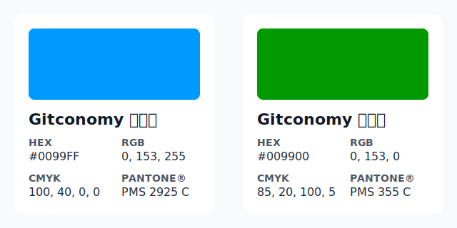
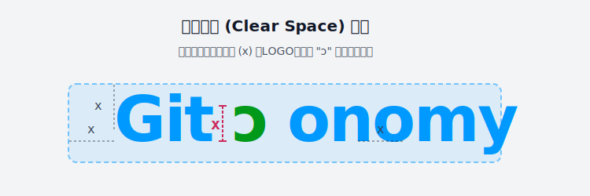

# Gitconomy Research视觉识别系统的符号学与战略解析

## 一、视觉宣言：融合开放协作与科学探究

## 1.1 核心命题

Gitconomy Research项目的视觉识别标志（LOGO），远非一个简单的图形标识。它是一份精心构思的视觉宣言，是项目核心使命——“用开源的方式研究开源”——的最高视觉表达。此设计并非仅仅为了美学上的吸引力，而是为了解决一个根本性的概念挑战：如何将两个看似迥异甚至时而冲突的世界观进行无缝融合。这两个世界分别是：以去中心化、自下而上、社群驱动为特征的开源协作文化，以及以结构化、实证主义、严谨方法论为核心的传统学术研究。该LOGO成功地将这两种文化特质提炼并统一于一个强有力的视觉符号之中，宣告了一种全新的、混合式的研究范式的诞生。

## 1.2 消解哲学张力

项目的核心目标本身蕴含着一种内在的哲学张力。一方面，“开源”（Open Source）文化常被外界理解为一种充满活力但略显混沌的、由社区自发驱动的创造过程。它强调的是自由、分享与集体智慧的涌现。另一方面，“研究”（Research）则与结构、严谨、可验证性及系统化方法论紧密相连，追求的是客观、精确与知识的权威性。

一个平庸的设计可能会将代表这两个领域的符号简单并置，从而在视觉上固化这种二元对立。然而，Gitconomy Research的LOGO通过其精巧的构图，超越了这种简单的拼接，提出了一种视觉上的解决方案。它并非将两个世界并列，而是展示了它们如何能够有机地共生与互补。这一设计有力地论证了，对开源这样一个复杂、动态、涌现的系统进行研究，必须采用一种全新的视角——一种既尊重其内在的开放精神，又秉持科学探究之严谨性的视角。

此LOGO的设计本身即构成了一种方法论层面的论证。其最深刻之处在于，它没有将研究工具（放大镜）置于开源生态（由字母‘o’所代表）的外部，以一种旁观者的姿态进行审视。恰恰相反，它将放大镜完美地融入了‘字母'c’的结构之中。这一设计决策蕴含着一个强有力的认识论立场：要真正理解像开源这样复杂的自组织系统，观察者不能仅仅作为外部的、超然的分析者。真正的洞察力必须从系统内部产生，研究者需要沉浸于其所研究的社群之中，运用系统自身的逻辑和工具来生成知识。这是一种类似于人类学中的参与式观察或民族志的研究方法，强调的是“身在其中”的理解，而非“置身事外”的评判。因此，该LOGO不仅是一个品牌标识，它本身就是对项目研究方法论——一种内生性的、沉浸式的探究范式——的视觉封装与哲学辩护。

## 二、标志字解构：一门新兴学科的词汇表

构成LOGO核心的文字“Gitconomy”本身就是一个经过精密设计的术语。通过对其进行词源学和符号学上的解构，我们可以发现它不仅是一个名称，更是一套为一门潜在的新兴学科奠定基础的词汇表。每一个组成部分都承载着丰富的内涵，共同定义了项目的独特性与宏大愿景。

### 2.1 “Git”之基石：现代协作的象征

标志字以“Git”开篇，这直接而明确地指向了项目的技术根基——Git分布式版本控制系统。然而，“Git”在此处的意义远超其作为一种软件工具的范畴。它是一个深刻的文化符号，代表了当代知识生产**3. 安全空间 (Clear Space)**

为了保护LOGO的视觉完整性和辨识度，其周围必须保留一个不可侵犯的安全空间。该空间内不得出现任何其他文字、图形或元素。安全空间的最小距离定义为LOGO中字母“o”的高度。即以“o”的高度为单位“x”，在LOGO的上下左右各留出至少“x”的间距。方式的一场范式革命。

Git的本质是去中心化的，它允许成千上万的开发者在没有中央协调机构的情况下进行高效的异步协作。它的分支与合并机制支持非线性的、探索性的开发路径，而其完整的提交历史则构成了一种不可篡改的、可追溯的知识演化记录。因此，“Git”不仅仅是代码的载体，它更是现代软件开发乃至一切数字化协作项目的“句法”。它象征着透明、可追溯性、分布式治理和集体智慧，是Gitconomy Research项目进行数据挖掘和行为分析的基石和源泉。

### 2.2 视觉意识之心：“ɔ”作为自由与开放的场域

在“Gitconomy”这个词中，字母“c”而不是'o'被赋予了独特的视觉形态和核心的象征意义，它成为了整个LOGO的视觉焦点和意识形态心脏。原始设计构想过程中思考如何体现开源的意识形态，一开始考虑的将字母'o'进行变形设计，但是Gitconomy有两个字母'o'，从视觉冲击力角度，无论对那个'o'进行设计都可能造成混淆，为什么不是另外一个’o'？因此，将字母“c”反写为“ɔ”，以此向“Copyleft”（左版）理念致敬。最终的视觉呈现出一种精妙的升华，将“用开源的方式进行开源的研究”这一理念更深层次地融入到一个更具包容性和系统性的符号之中。

因此，最终设计将字母“ɔ”塑造成一个绿色的放大镜（圆形）。将一个字面上的法律概念符号（反写的‘c’）转化为一个更宏大、更具生命力的系统性表征。在符号学中，圆形是完整性、统一体、社区和生态系统的通用象征。Copyleft理念的最终目标，正是为了创造和保护一个知识与代码可以自由流动、共享、修改的公共领域——一个自我维持、不断繁荣的知识生态系统。
战略资产战略资产
因此，LOGO中的字母‘ɔ’和放大镜组合而成的图标，完美地象征了Copyleft精神所催生并守护的那个充满活力的世界本身。它将设计的焦点从法律机制（许可证）巧妙地转移到了其所带来的积极成果（繁荣的社区生态）之上。这是一种更为积极和富有感召力的视觉叙事。放大镜被巧妙地嵌入这个代表生态系统的圆形之中，其含义不言而喻：项目的核心任务正是对这个由开源精神所构建的生态系统进行深入的、系统性的研究与探索。这一设计不仅传达了研究的对象（开源生态），也揭示了研究的方法（深入洞察），而这一切都根植于其背后的驱动力（Copyleft哲学）。这是一个在概念上层层递进、高度整合的视觉杰作。

### 2.3 “-onomy”之宣言：对系统性知识的承诺**2. 社区LOGO主字体规范**

| 属性 | 规范 |o
| :--- | :--- |
| **主字体名称** | Noto Sans |
| **字体来源** | Google Fonts (开源免费) |
| **字体权重使用建议** | **Regular (常规):** 用于正文、段落和一般性文本。\<br\>**Medium (中等):** 用于副标题或需要略微强调的文本。\<br\>**Bold (粗体):** 用于主标题、关键术语和需要强烈强调的部分。 |
| **使用说明** | Noto Sans字体以其卓越的屏幕可读性和中性、清晰的字形，完美契合项目的科技感与学术严谨性。应在所有官方文档、网站、演示文稿和宣传材料中统一使用。 |

标志字的后缀“-onomy”是整个名称的点题之笔，它为项目赋予了学术上的严肃性与宏大的抱负。该后缀源自古希腊语“νόμος”（nomos），意为“法则、规律、系统”。在学术语境中，它通常用于构建指代某一特定知识领域的学科名称，例如“Economy”（经济学）或“Astronomy”（天文学）。

在此处使用“-onomy”，是一个极具战略意义的定位行为。它清晰地表明，Gitconomy Research项目的目标远不止于“研究Git”或发表一些零散的分析报告。它的雄心在于将“Gitconomy”确立为一个全新的、独立的、被学术界所认可的科学研究领域。这一选择暗示着，项目致力于发现、阐释并系统化那些支配着Git驱动的开源生态系统内部运作的根本法则、协作模式与经济规律。

这是一种“学科构建”（Field-Building）的姿态。通过这个后缀，项目向外界宣告其长远愿景：不仅仅是成为一个参与者，而是要成为定义该领域研究议程、建立理论框架、并最终成为全球范围内研究开源生态系统的权威学术中心和知识枢纽。

### 三、色彩战略：科技与生态系统间的对话

色彩在Gitconomy Research的LOGO中扮演了至关重要的叙事角色。设计者没有采用单色方案，而是选择了一组对比鲜明而又相得益彰的色彩组合。这组色彩并非随意的装饰，而是一套经过精心编码的视觉语言，它以一种直观而感战略资产性的方式，复述了项目连接技术理性与生态活力的核心使命。

### 3.1 数字蓝的权威性

LOGO中的文字部分，即“Git”和“-nomy”，采用了明亮的蓝色调。这种颜色可以被精确地定义为“数字蓝”（Digital Blue）。它是数字时代的标志性色彩，是超链接、软件界面、数据可视化图表和技术品牌中最常见的颜色。这种蓝色首先传递了与科技、数据、信息和代码相关的核心意象。

更深层次上，蓝色在心理学上与理性、逻辑、稳定和精确等品质相关联。对于一个以“Research”和“-onomy”为标签的学术研究项目而言，建立信任感和权威性至关重要。数字蓝的使用，有效地为品牌披上了一层专业、严谨和值得信赖的外衣。它向观众承诺，项目所产出的洞察将是基于冷静的、数据驱动的分析，而非主观臆断。这种色彩选择，为项目的科学性提供了坚实的视觉支撑。

### 3.2 开源绿的生命力

与冷静的蓝色形成鲜明对比的是，作为视觉焦点的放大镜符号采用了充满活力的“开源绿”（Open-Source Green）。这种绿色具有双重意指：

首先，它是一种直接而明确的致敬。绿色是Git官方标志以及许多主流开源社区（例如，OSI）的标志性颜色。采用这种绿色，是向其所研究的开源社区表达尊重和认同的一种方式，迅速在目标受众中建立起文化上的亲和力与“内部人”的真实性。

其次，在更广泛的象征意义上，绿色是生命、成长、活力和自然的颜色。在此语境下，它完美地隐喻了开源生态系统的有机特质。开源社区如同一个数字化的生物圈（Digital Biosphere），它不断演化、自我修复、充满了自下而上的创造力，有时甚至显得有些“混乱”。这种绿色捕捉到了生态系统那生机勃勃、不断成长的内在本质。

### 3.3 色彩互动中的战略叙事

该LOGO色彩策略的真正力量，并非源于两种颜色的独立含义，而在于它们之间的互动关系。冷静、理性的数字蓝（代表结构与科学）在视觉上“包裹”并“框定”了充满活力的生态绿（代表自然与社群）。这种构图关系本身就是一个微缩的品牌故事，它完美地再现了项目的核心使命：运用结构化的、理性的科学方法（蓝色），去分析和理解那个有机的、不断演化的开源生态系统（绿色）。

这种色彩的战略性组合，使得品牌能够同时与两个不同的世界进行有效沟通。主导的蓝色框架为项目提供了专业性和可信度的“外壳”，这使得它在向传统学术界或资助机构展示其研究成果时，能够获得必要的信任。同时，核心的绿色符号又确保了它在开源社区中的文化根基和亲和力。色彩的对话，最终实现了品牌身份的平衡与统一：既是严谨的科学家，又是热情的社区成员。o

## 四、字体架构：构建现代化、易于理解的视觉声音

除了名称和色彩，字体的选择与排布是构成品牌视觉识别不可或缺的第三大支柱。在Gitconomy Research的LOGO中，字体的形态与结构并非无心之举，它经过精心选择，用以传达一种清晰、现代、客观的品牌声音，从而在潜移默化中强化项目的核心价值观。

### 4.1 字体分析：清晰与现代之声

LOGO采用了一款现代无衬线字体（Sans-serif）。通过视觉分析，其特征接近于几何无衬线体或人文主义无衬线体，例如像Montserrat或Inter这样的字体。这类字体拥有以下几个关键特征，而这些特征都与项目的品牌属性高度契合：

- 简洁的几何线条： 字母的基本笔画干净利落，几乎没有多余的装饰，这赋予了字体一种与生俱来的清晰度和技术感。
- 开放的字怀与孔径： 字母（如‘c’, ‘o’, ‘e’）的内部空间（字怀）和开口（孔径）较大，这使得字体在各种尺寸下都具有极佳的可读性，尤其是在数字屏幕上。
- 均衡的字形结构： 整体字形比例匀称，结构稳定，给人一种可靠、平易近人的感觉，避免了传统字体的威严感或花哨字体的前卫感。

这些字体特征共同塑造了一种现代、精确且易于理解的视觉声音。它传达出一种开放、透明和专注于信息本身的态度，这与项目致力于提供清晰、客观洞察的承诺完全一致。

### 4.2 字体选择对科学客观性的强化

选择这样一款现代无衬线字体，其意义超越了单纯的风格偏好，它是一种深思熟虑的、与科学和技术领域的视觉语言进行对齐的战略行为。与那些带有衬线（Serif）、常常与传统、历史、叙事和人文艺术相关联的字体不同，无衬线字体自20世纪初的包豪斯运动和瑞士国际主义设计风格以来，就一直与理性主义、功能主义和信息设计的清晰性紧密相连。

这种字体的“去人格化”和近乎数学般的构造，在视觉上排除了主观性和模糊性。它给人的感觉是客观、公正和精确的——这些正是科学方法论的基石，也是“-onomy”后缀所承诺的核心价值。从这个角度看，这款字体堪称“字形世界的白大褂”，它并非中立的背景，而是在主动地、持续地强化品牌关于严谨、无偏见和数据驱动的承诺。

### 4.3 构图与视觉层级

LOGO的整体构图也经过了精心安排，以引导观众的视线，并按预设的叙事顺序解读品牌信息。

- 稳定的起点： 大写的字母“G”以其坚实、稳重的形态，为整个标志字提供了一个强大的视觉锚点，象征着项目坚实的技术基础（Git）。
- 聚焦的核心： 观众的目光随即被色彩和形态上形成强烈反差的绿色“ɔ”所吸引。这个放大镜符号是整个LOGO的概念核心，代表着“发现”与“研究”这一核心动作，同时也是代表自由与开放。
- 系统的收尾： 最后，视线自然地滑向后缀“-onomy”，它以一种平稳、系统的方式为整个名称收尾，宣告了项目旨在构建系统化知识体系的最终目标。

整个构图引导观众完成了一次从“基础”（Git）到“行动”（开放研究‘ɔ’）再到“成果”（知识体系‘-onomy’）的认知旅程，逻辑清晰，层次分明。

## 五、格式塔：一个统一且共鸣的身份认同

对LOGO的分析不能止于对其各个组成部分的孤立审视。根据格式塔心理学（Gestalt psychology）的原则，一个成功的设计，其整体大于部分之和。Gitconomy Research的LOGO设计正是遵循这样一个典范，其所有元素——名称、符号、色彩、字体——无缝地协同工作，最终凝聚成一个单一的、易于记忆的、充满意义的、能够引发深刻共鸣的整体身份。

### 5.1 符号学密度与效率

该LOGO最卓越的成就之一在于其极高的“符号学密度”与“设计效率”。它成功地在一个极为简洁、清晰、易于复制的视觉形式中，压缩了多重且复杂的意义层次：

- 技术层面： 指向Git这一核心技术。
- 哲学层面： 暗含Copyleft的共享精神。
- 方法论层面： 以放大镜象征科学研究方法。
- 战略抱负层面： 以“-onomy”宣告建立新学科的愿景。

将如以上信息量浓缩于一个优雅的视觉符号之中。这种效率确保了LOGO在任何应用场景下都能快速、准确地传达其核心价值。

### 5.2 使命的视觉化身

最终，该LOGO能够言简意骇并视觉化了项目的核心使命与口号：“用开源的方式研究开源”。设计的每一个元素都在为这句话提供视觉注脚：

- “研究开源” ：“研究”的动作由中心的放大镜直观体现。被研究的“开源”客体，则通过开源绿、象征生态系统的字母‘o’，以及名称中的**“Git”**共同指代。
- “用开源的方式” ：这种研究的方式或精神，则由更深层的符号来传达。它体现在由Copyleft理念所支撑的、自给自足的**生态系统‘o’之中，也体现在“Git”**所代表的开放、透明、去中心化的协作精神之中。

LOGO以一种简约的视觉逻辑，将项目复杂的定位宣言转化为一句简单而有力的视觉陈述。

### 5.3 结论：作为社区符号的LOGO

Gitconomy Research的LOGO并非仅仅只是一个平面设计作品，它是社区强有力的“图腾”符号。它清晰地传达了项目独特的价值主张，在学术界和开源社区两大目标群体中同时建立了可信度。它为品牌未来的识别、传播和发展奠定了坚实而清晰的视觉基础。这个LOGO本身就是一个承诺，一个宣言，以及一个引领项目走向未来的强大符号。

# 附录：核心品牌资产规范

为了确保Gitconomy Research社区品牌形象在所有媒介和应用中的一致性、完整性和清晰度，特此制定以下核心视觉资产使用规范。严格遵守这些规范对于建立专业、可信的品牌认知至关重要。

**1. 社区LOGO标准色板**

| 色彩名称 | 视觉样本 | 十六进制 (HEX) | RGB | CMYK | 潘通色 (PMS) |o
| :--- | :--- | :--- | :--- | :--- | :--- |
| Gitconomy 数字蓝 | 🟦 | `#0099FF` | 0, 153, 255 | 100, 40, 0, 0 | PMS 2925 C |
| Gitconomy 生态绿 | 🟩 | `#009900` | 0, 153, 0 | 85, 20, 100, 5 | PMS 355 C |

**2. 社区LOGO主字体规范**

| 属性 | 规范 |
| :--- | :--- |
| **主字体名称** | Noto Sans |
| **字体来源** | Google Fonts (开源免费) |
| **字体权重使用建议** | **Regular (常规):** 用于正文、段落和一般性文本。\<br\>**Medium (中等):** 用于副标题或需要略微强调的文本。\<br\>**Bold (粗体):** 用于主标题、关键术语和需要强烈强调的部分。 |
| **使用说明** | Noto Sans字体以其卓越的屏幕可读性和中性、清晰的字形，完美契合项目的科技感与学术严谨性。应在所有官方文档、网站、演示文稿和宣传材料中统一使用。 |

**3. 安全空间 (Clear Space)规范**

为了保护LOGO的视觉完整性和辨识度，其周围必须保留一个不可侵犯的安全空间。该空间内不得出现任何其他文字、图形或元素。安全空间的最小距离定义为LOGO中字母“ɔ”的高度。即以“ɔ”的高度为单位“x”，在LOGO的上下左右各留出至少“x”的间距。

**4. 最小使用尺寸 (Minimum Size)规范**

为确保LOGO在缩小时仍能保持清晰可辨，特规定其最小使用尺寸。

- 数字应用 (屏幕显示): 最小宽度不得小于 120 像素 (pixels)。
- 印刷应用 (实体物料): 最小宽度不得小于 25 毫米 (mm)。

在任何情况下，若应用尺寸小于此规定，应考虑使用简化的品牌符号或仅使用“Gitconomy”文字标识，以避免视觉模糊，损害品牌形象。

作者：野行僧郭晧|Gitconomy Research
本作品采用CC-BY-NC-SA 4.0国际许可协议进行许可。详见 http://creativecommons.org/licenses/by-nc-sa/4.0/
