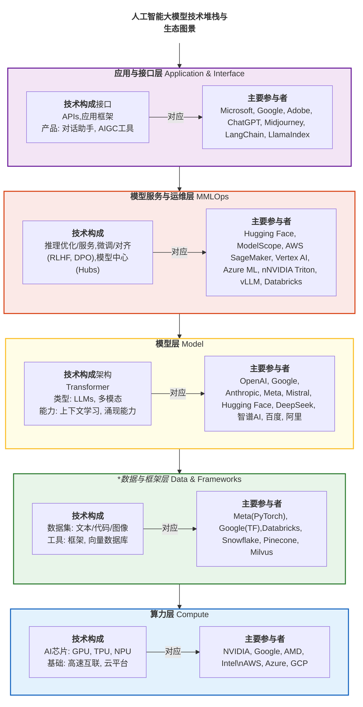

# 第一天：初识AI大模型与提示词工程

## 第1章 AI时代的来临：核心概念解析

### 1.1 AIGC：正在发生的创造力革命

我们正处在一个由人工智能（AI）驱动的深刻变革时代。这场变革最直观的体现，莫过于人工智能生成内容（AIGC, AI-Generated Content）的爆发式涌现。无论是栩栩如生、可与摄影作品媲美的数字图像，还是文笔流畅、逻辑严谨的技术文档，抑或是功能完备、结构清晰的软件代码，AI都展示出了令人惊叹的“创造”能力。

这些AIGC作品的出现，不仅在挑战我们对“创造力”的传统定义，更在重塑各行各业的生产范式。它引发了一系列根本性的探问：机器“创造”的本质是什么？人类的智慧在其中扮演何种角色？以及，个体与组织应如何利用这一新兴力量，放大自身的创造潜能？要理解这场变革的深刻性，我们不能仅将其视为一次单纯的技术升级，而应将其置于人类科技发展的宏大历史坐标中进行审视。已故的著名物理学家张首晟教授曾提出了一个精辟的理论框架，为我们理解技术革命的本质提供了独特的视角。

-----
>理论视角：技术革命的本质
>
>著名科学家张首晟教授认为，每一次推动人类文明发生跃迁的重大技术革命，其本质都可以归结为两个维度的数量级提升：能量密度与信息密度的提升。他甚至提出了一个简洁的公式来描绘这一规律：
>
>**文明的进步∝log(能量密度)+log(信息密度)**
>
>能量密度：指的是单位时间、单位空间或单位质量内，人类能够获取和利用的能量的效率。从薪柴到煤炭，再到石油和核能，每一次能源的革新都极大地解放了人类的体力，拓展了人类活动的物理边界。
>
>信息密度：指的是单位时间、单位空间或单位成本下，人类能够创造、存储、处理和传递的信息的效率。从结绳记事到文字，从印刷术到互联网，每一次信息技术的突破都极大地解放了人类的脑力，加速了知识的积累与传播。
>
>公式中的对数（log）尤为关键，它意味着真正的技术革命并非线性的、渐进的改良，而是数量级（order of magnitude）的、指数级的飞跃。只有当能量或信息的利用效率提升了十倍、百倍乃至更高时，才会引发整个社会结构和生产方式的根本性重构。

依据此理论，我们可以清晰地看到人类历史上的几次重大变革：


图：文明跃迁的“能量信息双密度定律”示意图

- 农业革命：人类学会耕种和驯养，能量来源是低密度的人力和畜力；信息依靠口耳相授和简单的符号，密度极低。
- 第一次工业革命：以蒸汽机为标志，煤炭的利用让能量密度实现了第一次巨大飞跃；而印刷术的普及则缓慢提升了信息的传播效率。
- 第二次工业革命：电力的普及和内燃机的发明，使得能量的利用效率和便捷性再次跃升；电话、电报的发明则革命性地提升了信息的传递速度。
- 第三次工业革命（信息革命）：在能源效率稳步提升的同时，计算机和互联网的出现使信息的创造、存储和处理密度发生了爆炸性的、指数级的增长，彻底改变了全球的经济和生活方式。

那么，我们今天所处的时代又位于何处？AIGC的浪潮，正是一个明确的信号，标志着我们站在了新一轮科技革命的临界点。这一次，变革的驱动力同时作用于能量和信息两个维度：

信息密度的再次爆炸：AIGC（尤其是大模型）从根本上改变了信息的性质。信息不再仅仅是被动地存储和检索，而是可以被主动地理解、综合、推理乃至生成。一个大模型所蕴含的知识，是人类数千年文明信息的压缩和提炼，其输出的一段文字或一张图片，背后是海量数据的计算和模式学习的结果。这使得“有价值信息”的获取密度和生成效率达到了前所未有的高度。

“有效能量密度”的提升：虽然AI本身不是一种新能源，但它作为一种“智力放大器”，正在极大化提升现有能量的利用效率。AI可以优化电网调度，减少能源损耗；可以改进工业流程，降低生产能耗；可以加速新材料的研发，寻找更高效的能源解决方案。这种由“智能”带来的全局效率优化，可视作一种广义上、有效能量密度的飞跃。

因此，AIGC革命并非仅仅是信息维度的单点突破，而是“智能”赋能下，信息与能源效率协同提升的又一次巨大飞跃(通过这个提示词，你将得到一个结构清晰、可以直接打印或导入到笔记软件中的周计划表格，让你的复习安排井井有条。)。我们正处在张首晟教授理论坐标系中一个剧烈向上和向右偏折的临界点上。

## 1.2 “大模型”的定义与技术本质：从注意力机制到智能涌现

驱动AIGC应用的核心技术，是近年来取得突破性进展的“大模型”（Large Model）。理解大模型，是理解当前人工智能浪潮的关键。

-----

> **概念解析 1.1：大模型 (Large Model)**
>
> **定义**：大模型，通常指参数数量巨大（从数十亿到数万亿级别）的深度学习模型。其能力来源于两个核心要素：
>
> 1.  **参数 (Parameters)**：参数是模型内部神经网络中的可调变量，可以视为模型知识存储和推理能力的物质基础。庞大的参数规模为模型赋予了学习和表达复杂模式的巨大潜力。
> 2.  **数据 (Data)**：海量的、多样化的训练数据是塑造模型能力的“养料”。大模型通过在涵盖人类知识广阔领域的数据上进行训练，学习语言、图像、代码等不同模态信息中的规律与关联。
>
> **技术本质**：从根本上看，大模型是一类先进的表示学习 (Representation Learning) 模型。在其权威综述中，深度学习先驱Bengio、Courville和Vincent阐述道¹，表示学习的核心功能是将物理世界中的信息（如文字、像素）映射（embed）到一个高维的数学向量空间中。在这个空间里，语义上相似的概念，其对应的向量在几何上也更为接近。模型通过自动学习这种从原始数据到优质向量表示的转化过程，构建起对世界的深层理解，从而能够执行复杂的生成和推理任务。

  * **1.2.1 参数规模与性能表现**

大型语言模型的核心特征体现在其庞大的参数规模上。关于模型规模与性能之间的关系，来自OpenAI的研究者Kaplan等人在其关于模型扩展定律的里程碑式研究中发现²，模型性能与参数规模、数据集大小及计算预算之间存在可预测的幂律关系（Scaling Laws）。

随后，来自DeepMind的Hoffmann等人在对Chinchilla模型的研究中³，对这一定律进行了重要的修正与补充。他们证明，在计算资源最优化的训练中，数据规模与模型参数规模应等比例增加。遵循这一“规模化”思想，现代大模型的参数量持续突破上限，例如GPT-4据估计已拥有约1.76万亿参数，从而展现出卓越的性能优势。

  * **1.2.2  数据集构建与表示学习**
	
模型的强大能力根植于其所训练的海量、多样化的文本语料。其背后的核心理论，正如前文所述，是表示学习¹。在发表于《自然》杂志的著名综述中，深度学习的三位奠基人LeCun、Bengio和Hinton进一步阐明⁴，深度神经网络正是通过堆叠多个处理层，来逐层学习和构建这些日益抽象的数据表示。

  * **1.2.3 Transformer架构突破**
	
在模型架构层面，谷歌的研究团队在他们那篇影响深远的论文《Attention Is All You Need》中，首次提出了Transformer架构⁵。其核心创新在于完全依赖自注意力机制（Self-Attention），取代了此前序列建模中常用的循环或卷积结构。正是这一突破性的架构，为后续一系列成功的预训练模型，如谷歌的BERT模型⁶和OpenAI的GPT系列⁷，奠定了坚实的技术基础。

  * **1.2.4 涌现能力现象**

当模型规模达到某一临界阈值后，会“突然”出现一些全新的能力，这一现象被称为涌现能力（Emergent Abilities）。Wei等研究者在其论文中系统地记录了这一现象⁸。然而，关于其本质，学界也存在不同观点。例如，Schaeffer等人⁹就提出，部分所谓的“涌现”可能源于评估指标选择而非模型根本性变化。对涌现能力的研究，至今仍是探索大模型机理的前沿课题。

-----

## 1.3 大模型与AIGC的关系

大模型与AIGC之间，是**引擎与应用**的关系。大模型是底层的技术基座，而AIGC是上层的应用形态。

可以设想一个场景：用户在AIGC应用（如一个智能聊天程序）的界面输入一个问题。这个问题作为“提示词”（Prompt）被发送给后台的大模型。大模型解析这个提示词的意图，调动其内部存储的庞大知识进行运算和推理，生成一段回答。最后，这段回答通过AIGC应用的界面呈现给用户。

因此，AIGC应用的能力边界和输出质量，直接受限于其背后所依赖的大模型的性能。一个更强大的模型，能够理解更复杂的指令，生成更准确、更有创造力的内容，从而支撑起更丰富的AIGC应用场景。

-----

> **概念解析 1.2：AIGC (AI-Generated Content)**
>
> **定义**：AIGC，即人工智能生成内容，是一个总称，指代任何利用人工智能技术创造或显著修改的内容。其产出形态多样，涵盖文本、代码、图像、音频、视频、3D模型等。AIGC标志着AI技术从传统的分析、识别角色，向主动生成、创造角色的重要转变。

-----

### 第1章小结

在本章中，我们奠定了理解当前人工智能浪潮的理论基石。我们首先通过张首晟教授的“能量-信息双密度”理论，从宏观视角认识到AIGC不仅是一项技术革新，更是达到了足以引发社会变革的科技革命临界点。接着，我们深入剖析了这场革命的核心引擎——大模型，明确了其能力来源于庞大的参数和海量的数据。

-----

技术层面，我们确立了其本质是一种先进的表示学习系统¹，并了解了其发展背后的三大支柱：指导模型规模化发展的扩展定律²'³，奠定其架构基础的革命性Transformer架构⁵，以及解释其能力飞跃的涌现能力⁸现象。最后，我们厘清了**大模型（引擎）与AIGC（应用）**之间的关系，为后续学习AI如何赋能创造力做好了准备。

## 第2章 技术溯源与产业生态

### 2.1 技术演进：从特征工程到表示学习

大模型的出现并非一蹴而就，而是AI技术长期演进的结果。若与此前的AI模型对比，其革命性便显而易见。


图：人工智能技术发展路线图 

这个路线图清晰地揭示了人工智能发展的几个关键趋势：

- 从“教它规则”到“让它学习”：早期AI依赖人类专家（符号主义），后来演变为让机器自己从数据中找规律（机器学习），再到如今让机器自己学习如何表示数据（深度学习）。
- 从“特定任务”到“通用能力”：AI模型从最初只能解决单一、特定问题（如下棋、图像分类），发展到今天能够处理语言、图像、逻辑等多种任务的大模型。
- 从“被动分析”到“主动创造”：AI的能力从识别和分类信息，扩展到了能够主动生成全新内容（AIGC）和做出自主决策（强化学习）。
- 从“单一模态”到“多模态融合”：当前最前沿的发展趋势是将文本、视觉、听觉等信息融合在一起，让AI更接近人类感知和理解世界的方式。

这条演进路径仍在加速向前，每一个新阶段都建立在之前所有阶段的技术积累之上，共同构成了我们今天所见的、充满活力的AI生态。

-----

> **技术前沿 2.1：Transformer架构**
>
> 促成大模型技术飞跃的核心算法突破，是2017年由Google研究人员提出的**Transformer架构**。该架构的核心创新在于其**自注意力机制 (Self-Attention Mechanism)**。
>
>在Transformer出现之前，处理文本等序列数据的标准模型是循环神经网络（RNN）。RNN通过顺序处理信息来捕捉上下文关系，但难以处理长距离的依赖，且其串行计算的特性限制了训练效率。因此，在“大模型”时代之前，构建一个AI模型往往需要耗费大量专家精力进行特征工程 (Feature Engineering)。研究人员必须手动为模型设计和提取有效的信息特征，以帮助模型理解任务。
>
>Transformer架构完全摒弃了循环结构。其自注意力机制允许模型在处理序列中的每一个元素时，都能直接计算并衡量序列中所有其他元素对当前元素的重要性，从而高效地捕捉全局的上下文信息。更关键的是，这种机制的计算可以高度并行化，完美契合现代图形处理器（GPU）的架构，使得在超大规模数据集上训练拥有数千亿甚至万亿参数的模型成为现实。
>大模型则实现了范式转换。它依托于“大数据 + 大算力 + 强算法”，能够直接从原始数据中自动学习有用的表示，省去了人工设计特征的环节。这种端到端（End-to-End）的学习方式，使得模型能够发现人类专家可能忽略的深层模式，并具备处理多种不同任务的通用能力 (Generality)。

-----

### 2.2 全球及国内产业生态

随着技术的成熟，全球范围内形成了多元化的AI大模型产业生态。


图：全球人工智能技术生态全景示意图

  * **2.2.1 闭源API模式**
    以OpenAI (GPT系列)、Google (Gemini系列)、Anthropic (Claude系列)为代表的商业巨头，主导着性能最前沿的模型研发。它们通常不公开模型权重或核心技术细节，而是通过应用程序编程接口（API）向外提供服务。开发者通过付费调用这些API，将顶尖的AI能力集成到自己的产品中。

  * **2.2.2 开源社区模式**
    与闭源模式相对应，由Meta (Llama系列)、Mistral AI以及Hugging Face等社区力量推动的开源生态同样繁荣。它们向公众开放模型权重、代码乃至训练方法，极大地降低了AI技术的准入门槛，促进了技术的快速迭代和广泛应用。全球的开发者和研究者可以自由下载、修改和部署这些开源模型。

  * **2.2.3 中国生态格局**
    国内AI产业呈现出商业与开源齐头并进的“百模争鸣”态势。阿里巴巴的**通义 (Qwen)**、深度求索的**DeepSeek**、百度的**文心 (ERNIE)**、智谱AI的**GLM**、月之暗面的**Kimi**等商业模型在中文处理和特定行业应用上持续深耕。同时，这些头部企业也将部分模型开源，与**魔搭 (ModelScope)** 、**OpenI启智**等本土开源社区一道，共同构建了富有活力的中文AI开发者生态系统。

### 2.3 主要应用场景

大模型的通用能力使其应用渗透到社会经济的众多领域。

  * **2.3.1 生产力与内容创作**
    这是AIGC应用最为广泛的领域。从自动生成营销文案、起草商业邮件，到总结冗长的会议记录、辅助学术论文写作，AIGC正成为强大的“智能助理”，显著提升了知识工作者的生产效率。

-----

> **案例分析 2.1：AIGC在软件开发中的应用**
>
> **场景**：GitHub Copilot是一款由GitHub和OpenAI共同开发的AI编程辅助工具。
> **应用方式**：它作为代码编辑器的插件，能够实时理解开发者正在编写的代码及其上下文。当开发者编写注释描述想要实现的功能（如“// function to read a csv file and return a pandas dataframe”）或开始编写一个函数时，Copilot会自动生成完整的代码建议。
> **影响**：该工具极大地提升了软件开发的效率，减少了开发者在查找API用法和编写样板代码上的时间消耗。同时，它也成为一种新的编程学习方式，开发者可以通过观察AI生成的代码来学习新的编程范式和库用法。

-----

  * **2.3.2 科学研究**
    在尖端科研领域，AIGC正在从数据分析工具转变为科学发现的引擎。

-----

> **案例分析 2.2：AlphaFold 2与蛋白质结构预测**
>
> **场景**：蛋白质的三维结构决定其生物功能，准确预测蛋白质结构是生物学领域的一大挑战。
> **应用方式**：Google DeepMind团队开发的AlphaFold 2模型，利用深度学习技术，能够根据蛋白质的氨基酸序列，以极高的精度预测其三维空间结构。
> **影响**：这一突破被誉为“解决了困扰生物学界50年的重大问题”，其预测结果的准确性可与实验方法相媲美。它极大地加速了生命科学的研究进程，在新药设计、疾病机理探索等方面具有里程碑式的意义。

-----

### 第2章小结

本章带领我们回顾了AI技术的演进脉络与当下的产业全景。我们通过技术发展路线图，清晰地看到了从依赖专家知识的“特征工程”到模型自动学习的“表示学习”这一根本性的范式转移，这也是大模型得以实现的基础。

我们还考察了全球AI产业的两种主流生态模式——以OpenAI为代表的闭源API模式和以Meta、Hugging Face社区为代表的开源社区模式，并了解了国内“百模大战”下商业与开源并存的繁荣景象。最后，通过在生产力、内容创作、软件开发和科学研究等领域的具体案例，我们直观地感受到了这项技术正在对社会各方面产生的深远影响。

-----
## 第3章 与AI对话的艺术：理论框架与核心技术

### 3.1 提示词：驾驭大模型的缰绳

大模型的强大能力需要被精确引导才能有效发挥。**提示词 (Prompt)**，即用户向模型输入的指令或问题，正是实现这种引导的关键。提示词工程 (Prompt Engineering) 则是一套旨在设计和优化提示词，以从大模型处获取高质量、高相关性输出的方法论。其核心原则可以概括为“输入决定输出”：提示词的质量直接决定了模型生成内容的质量。

  * **3.1.1 理论框架与学术基础**

提示词工程已成为与大型语言模型高效交互的核心学科。Sahoo等人¹⁰在一篇系统性的综述中，将其定义为“为了有效利用大型语言模型而设计和优化提示的过程”。这一领域的理论基石，源于Brown等人在其开创性的GPT-3论文中¹¹首次正式提出的**上下文学习（In-context Learning）**概念。与传统的模型训练不同，上下文学习指的是模型能够直接通过任务的文本描述或少数范例来执行新任务，而无需进行任何梯度更新或参数微调。

学术界对提示词的分类体系也在不断完善。一个通用的分类框架将提示词分为三类：硬提示（Hard Prompts），即人类可读、用自然语言撰写的指令；软提示（Soft Prompts），即一组可通过模型学习而优化的、不可直接解释的向量表示；以及结合二者优势的混合提示（Hybrid Prompts）。

  * **3.1.2 链式思维推理技术**
	
为了提升大模型在复杂推理任务上的表现，链式思维（Chain-of-Thought, CoT） 提示法被证明是一种极其有效的技术。Wei、Wang等人¹²的研究表明，通过引导模型在给出最终答案前，先生成一系列中间的、连贯的推理步骤（即“思维链”），能够显著增强其解决复杂问题的能力。

在教学应用中，CoT技术可以被框架化地应用在不同层面。在基础层面，可以直接使用如“让我们一步一步地思考”这样的通用指令来引导模型分解问题；在高级层面，则可以通过提供结构化的多步推理范例，来解决复杂的数学应用题或逻辑谜题。这项技术的教育价值不仅在于提升问题解决的准确率，更在于它使得模型的“思考”过程变得透明和可追溯，有助于培养使用者自身的逻辑分析与批判性思维能力。

  * **3.1.3 少量样本学习机制**

*少量样本学习（Few-shot Learning）**是上下文学习的核心体现。Brown等人¹¹的开创性研究指出，随着语言模型规模的巨幅增长，其在任务无关情境下的少量样本学习性能也得到了极大改善。Parnami和Lee¹³在其综述中进一步阐明，大语言模型中的少量样本学习与传统机器学习中的同名概念在机制上有所不同：它并非通过更新模型参数来学习，而是纯粹通过上下文中的演示范例来“领会”任务意图。基于提供范例的数量，教学策略可以分为三个层级：

- 零样本（Zero-shot）：仅提供任务的自然语言描述，不含任何具体范例。
- 单样本（One-shot）：提供任务描述外，再附带一个完整的范例。
- 少样本（Few-shot）：提供2至8个范例，通常能引导模型达到更稳定和优异的性能。

  * **3.1.4 角色扮演与元提示优化**
	
在提示词的具体实践中，角色扮演（Role-playing）是一种简单而高效的“基石技术”。通过为模型分配一个明确的专家角色（如“你是一位专业的生物学教师”），提示词为模型提供了强大的上下文基础，能够显著改善其在特定任务上的表现。一个完整的角色扮演实施框架，通常会结合专家角色分配、目标受众定向（如“向九年级学生解释这个概念”），有时还会融入跨学科视角（如“作为一位分析科学发展的历史学家…”），以生成更具深度和针对性的内容。

近年来，提示词的优化过程本身也开始走向自动化，这一领域被称为**元提示（Meta-Prompting）** 或自动提示优化。例如，微软研究院在2024年展示的PromptWizard系统和SAMMO框架，均利用一个强大的LLM来指导和迭代优化面向另一个LLM的提示。这类技术能够实现对指令内容和上下文学习范例的同步、自动化调整，代表了提示词工程领域的前沿发展方向。

### 3.2 优质提示词的四大核心要素

构建一个有效的提示词，通常需要考虑以下四个关键要素。

  * **3.2.1 清晰的角色扮演 (Role-playing)**
    为模型预设一个身份，能够有效约束其知识范围和语言风格，使其输出更加专业和聚焦。
   
	   场景：`学习复杂的物理概念“熵增定律”`
	 * **低效提示词**: 什么是熵增定律？ (这通常会得到一个像百科全书一样、干巴巴的定义，可能包含很多难以理解的专业术语。)
	 * **高效提示词**: 请你扮演一位顶尖的物理科普作家，像《时间简史》的作者霍金一样，用一个生动、有趣的比喻，向一名对物理学充满好奇但基础知识不多的大一新生，解释什么是“熵增定律”。 (通过这个提示词，你更有可能得到一个类似“房间为什么总是越来越乱”或者“将一滴墨水滴入清水”这样易于理解的类比，从而掌握概念的精髓。)

  * **3.2.2 明确的指令与上下文 (Instructions & Context)**
	指令必须具体、无歧义，并提供所有必要的背景信息（上下文），避免让模型进行不必要的猜测。这在请求AI辅助论文写作或作业时尤为重要。

	场景：需要为一篇关于”人工智能对教育影响“的课程论文撰写开篇段落”

      * **低效提示词**: `帮我写一篇关于AI对教育影响的论文开头。 (AI不知道你的课程背景、具体要求和你的核心论点，生成的开头可能会非常空洞和宽泛。`
      * **高效提示词**: `我正在为我的《教育技术学》课程写一篇期末论文，主题是“生成式AI对高等教育的机遇与挑战”。我的核心论点是：AI既是强大的个性化学习工具，也对学术诚信和批判性思维培养提出了挑战。请你根据这个上下文，为我草拟一个大约200字的开篇段落。要求：1. 开头需要引人入胜，可以引用最近的新闻或一个引人思考的场景。2. 清晰地提出我的核心论点。3. 简要预告下文将从“个性化辅导”、“研究助理”、“学术诚信”和“思维惰性”这几个方面展开论述。`

  * **3.2.3 提供格式范例 (Few-shot Learning)**
    当需要模型遵循特定的输出格式或逻辑时，直接提供一至数个完整的“输入-输出”范例，是最高效的沟通方式。模型会通过归纳学习，将范例中的模式应用到新任务中。

	场景：基于范例的命名实体识别与统计
		- 命名实体识别 (NER)：这是自然语言处理（NLP）中的一个基础且非常重要的任务。它的目标是从一段非结构化的文本中，识别出具有特定意义的“实体”（Entities），例如人名、地名（如此处的城市）、组织机构名、日期、产品名称等。在这个例子中，AI的首要任务就是准确地识别出“北京”、“上海”、“广州”等城市名称。
	- 词频统计 (Frequency Counting)：在识别出实体后，任务还要求对每个实体出现的次数进行统计。

      * **任务**: 从复杂的句子中提取出城市名称和对应的提及次数。
      * **高效提示词 (Few-shot)**:
        ```
        根据范例，从文本中提取城市和提及次数。

        范例1：
        文本：报告显示，北京的科技产业发展迅速，而上海的金融中心地位依然稳固。我们认为北京的潜力更大。
        输出：{"北京": 2, "上海": 1}

        范例2：
        文本：本次旅行我们将从广州出发，途经深圳，最后抵达香港。
        输出：{"广州": 1, "深圳": 1, "香港": 1}

        待处理文本：
        虽然我们总部在杭州，但我们的大部分业务实际上在上海展开，同时我们在南京和上海也设有分部。
        输出：
        ```

  * **3.2.4 限定输出的格式 (Format Specification)**
    明确要求模型以结构化的格式（如JSON、Markdown表格、XML等）返回结果，便于后续的程序处理和数据分析。

	场景：临近期末，需要制定一份高效的备考复习计划

      * **任务**: 生成一份项目计划。
	* **低效提示词**: `帮我下周要考高数、大学英语和C语言，帮我做一个复习计划。 (结果可能是几段建议性的文字，难以执行。)`
      * **高效提示词**: `我下周要进行三门课程的期末考试：《高等数学》、《大学英语》和《C语言程序设计》。请为我制定一份从周一到周五，共计五天的详细复习计划。请将计划以Markdown表格的形式输出，表格应包含四列：日期、上午 (9:00-12:00)、下午 (14:00-17:00)、晚上 (19:00-21:00)。请确保每天的复习内容均衡，劳逸结合。`
	 
	通过这个提示词，你将得到一个结构清晰、可以直接打印或导入到笔记软件中的周计划表格，让你的复习安排井井有条。

---
### *提示词课后思考题*

#### **A. 面向【信息与计算科学】专业的同学**

**核心技能关联：** 算法思维、数据结构、信息编码

* **问题一 (入门级)：【用AI“调试”代码】**
    * **场景**：你写了一段C++或Python代码来解决一个算法题（例如，实现一个简单的排序算法或二分查找），但程序运行出错或结果不符合预期。
    * **任务**：请设计一个提示词，将你的**完整代码**和**错误信息**一并提供给AI。你的提示词不仅要问“哪里错了？”，更要引导AI：
        1.  扮演一位资深软件工程师的角色。
        2.  **逐行解释**代码的逻辑。
        3.  指出潜在的逻辑错误或边界条件问题。
        4.  提供一个**修正后的代码版本**，并附上关键修改处的**注释**。
    * **思考**：对比AI给出的解释和修正，与你自己的思路有何不同？AI在理解代码“意图”和发现“bug”两方面，哪个做得更好？

* **问题二 (进阶级)：【用AI将“伪代码”转化为“工程代码”】**
    * **场景**：在《数据结构》课程中，老师通常会用“伪代码”来描述一个复杂的算法（例如，Dijkstra算法或AVL树的插入操作），而你需要将其用具体的编程语言实现。
    * **任务**：请设计一个提示词，将老师课件上的**伪代码描述**输入给AI。你的目标是让AI为你生成一份高质量、可运行、符合工程规范的Python代码。
    * **提示词要点**：
        1.  清晰地提供完整的伪代码。
        2.  指定目标编程语言（如Python 3）。
        3.  要求AI为关键部分（如核心循环、数据结构定义）添加详细的**代码注释**。
        4.  要求AI为生成的代码设计**2-3个测试用例**（test cases），以验证其正确性。
    * **思考**：AI在将抽象的算法逻辑，转化为具体的、包含边缘情况处理的工程代码时，表现如何？它设计的测试用例是否覆盖了关键的边界条件？

* **问题三 (挑战级)：【用AI设计“信息编码”方案】**
    * **场景**：信息论中一个有趣的问题是如何为一组出现频率不同的字符设计最高效的二进制编码（霍夫曼编码的基础思想）。
    * **任务**：假设你不知道霍夫曼编码的具体算法。请设计一个提示词，引导AI为你虚构的6个字符（A, B, C, D, E, F）及其出现频率（例如，A: 45%, B: 15%, C: 12%, D: 10%, E: 8%, F: 5%）设计一套**前缀编码**（即任何一个字符的编码不能是另一个字符编码的前缀）。
    * **提示词要点**：你要向AI解释你的**优化目标**：“我希望最终编码后的平均码长最短，这意味着出现频率越高的字符，其二进制编码应该越短。”
    * **思考**：AI能否在不被告知具体算法名称的情况下，仅通过理解你的**优化目标**和**约束条件**（前缀编码），推理出一个接近最优解的编码方案？这个过程如何体现了AI的问题解决能力？

#### **B. 面向【应用统计学】专业的同学**

**核心技能关联：** 数据分析、概率分布、假设检验、识别偏差

* **问题一 (入门级)：【用AI解释“统计学概念”】**
    * **场景**：你在学习“中心极限定理”或“P值”时感到困惑。
    * **任务**：请设计一个提示词，让AI用**非专业人士也能听懂**的方式，解释一个复杂的统计学概念。
    * **提示词要点**：
        1.  指定AI扮演“一位善于打比方的统计学教授”。
        2.  要求它使用一个**生活中的实例**（例如，抽样调查、产品质检）来贯穿整个解释过程。
        3.  明确要求它解释这个概念的“**应用价值**”和“**易错点**”。
    * **思考**：AI的比喻是否恰当？它指出的“易错点”是否和你自己的理解误区相符？

* **问题二 (进阶级)：【用AI生成“特定分布”的模拟数据】**
    * **场景**：你需要练习使用SPSS或R语言等统计软件，但手头没有合适的数据。你想生成一些符合特定统计特征的数据。
    * **任务**：请设计一个提示词，让AI为你生成一段可直接运行的Python代码（使用`numpy`和`pandas`库），这段代码需要能生成一个包含100个样本的数据集，并满足以下条件：
        1.  包含三列：'ID', 'Age', 'Score'。
        2.  'Age'列大致服从**均值为35，标准差为8的正态分布**。
        3.  'Score'列大致服从**均值为75，标准差为15的正态分布**。
        4.  最终将生成的数据**输出为CSV格式的文本**。
    * **思考**：AI能否准确理解统计分布的参数（均值、标准差）？生成的代码是否简洁、高效？这如何能加速你的统计建模和分析流程？

* **问题三 (挑战级)：【用AI识别“数据描述”中的潜在偏差】**
    * **场景**：你正在阅读一份市场调研报告，其中一段文字描述了A、B两款产品的用户画像，你怀疑描述中可能存在“幸存者偏差”或“选择性偏差”。
    * **任务**：请设计一个提示词，将这段报告的**描述文字**输入给AI。你的目标是让AI扮演一位“**经验丰富的数据分析师**”，帮你“**诊断**”这段文字中可能隐藏的统计偏差。
    * **提示词要点**：
        1.  提供原始文本。
        2.  要求AI识别出文本中**所有绝对化或带有倾向性的表述**。
        3.  引导AI提出**质疑性问题**，例如：“报告的样本是如何抽取的？未响应的用户特征是什么？这个结论是否可能忽略了某些潜在变量？”
        4.  要求AI提出**至少两种**可能导致当前结论的**潜在偏差类型**（如幸存者偏差、选择偏差、确认偏差等），并解释为什么。
    * **思考**：AI在识别语言中的主观偏见和联想统计学概念方面的能力如何？它能否成为你进行批判性数据分析的得力助手？

#### **C. 面向【数学与应用数学】专业的同学**

**核心技能关联：** 逻辑推理、符号运算、抽象思维、证明过程

* **问题一 (入门级)：【用AI辅助“求解微积分”】**
    * **场景**：你正在做一道复杂的不定积分或求极限的数学题，想核对自己的计算步骤和答案。
    * **任务**：请设计一个提示词，将这道数学题（可以使用LaTeX格式输入）交给AI。你的要求不只是得到答案。
    * **提示词要点**：
        1.  要求AI使用“**链式思维**”，**一步一步地**展示完整的求解过程。
        2.  在每一步关键的代换或使用定理时（例如，使用洛必达法则或分部积分法时），要求它明确**指出所使用的定理名称**。
        3.  最后给出最终答案。
    * **思考**：AI的解题步骤是否清晰、严谨？它对数学定理的引用是否准确？这与你使用WolframAlpha等符号计算工具有何不同体验？

* **问题二 (进阶级)：【用AI“翻译”数学语言】**
    * **场景**：你在阅读一篇数学文献时，遇到一段用形式化语言描述的、非常抽象的定义或定理（例如，群论中的拉格朗日定理或拓扑学中的紧空间定义），难以理解其直观含义。
    * **任务**：请设计一个提示词，将这段**形式化的数学定义**输入给AI。你的目标是让AI帮你“翻译”和“可视化”这个概念。
    * **提示词要点**：
        1.  让AI扮演“一位优秀的数学教师”。
        2.  要求它首先用**简洁的自然语言**重新解释这个定义。
        3.  要求它提供**1-2个具体的、简单的数学实例**（例如，用一个具体的数字集合或几何图形的例子）来说明这个抽象定义。
        4.  如果可能，要求它用一个**生活中的类比**来帮助建立直观理解。
    * **思考**：AI在连接抽象的符号世界与具体的实例、直观的类比世界之间的能力如何？它能否成为你学习高等数学的得力助手？

* **问题三 (挑战级)：【用AI进行“反例构造”】**
    * **场景**：在数学中，证伪一个命题通常只需要举出一个反例。例如，命题“所有素数都是奇数”的反例是“2”。但构造更复杂命َ题的反例则非常困难。
    * **任务**：请你向AI提出一个**错误的数学命题**，并设计一个提示词，引导AI去寻找或构造一个**反例**。
    * **示例命题**：“如果一个函数在某点连续，则它在该点一定可导。”（这是错误的）
    * **提示词要点**：
        1.  清晰地陈述这个（错误的）命题。
        2.  直接提问：“这个命题是正确的吗？如果不是，请为我**构造一个具体的函数**作为反例。”
        3.  要求AI对它构造的反例进行**解释**：即说明为什么这个函数满足“连续”的条件，却不满足“可导”的条件。
    * **思考**：AI是仅仅从其知识库中“记忆”和“检索”出了一个经典反例（如 `f(x) = |x|` 在x=0处），还是它表现出了一定的、能够主动去“寻找”和“验证”反例的推理能力？如何设计更复杂的错误命Те来测试其推理的极限？

---

#### **3.3 进阶技巧：思维链 (Chain of Thought)**

对于需要多步推理的复杂问题，直接要求模型给出答案往往容易出错。**思维链 (Chain of Thought, CoT)** 是一种有效的进阶提示技巧。

-----

> **知识链接 3.1：思维链 (Chain of Thought, CoT)**
>
> CoT的核心思想是引导模型在输出最终答案之前，先显式地输出其解决问题的中间步骤。这种方法模拟了人类的逻辑推理过程，将一个复杂问题分解为一系列可管理的小步骤，从而显著提升了模型在数学计算、逻辑推理和规划任务上的准确性 [17]。

-----

  * **案例**: 解决一个简单的逻辑应用题。
      * **标准提示词**: `一个书架上有两层书，上层书的数量是下层的3倍。如果从上层拿走60本放到下层，两层的书就一样多了。请问原来上下两层各有多少本书？` (模型可能直接给出错误答案)
      * **CoT提示词**: `一个书架上有两层书，上层书的数量是下层的3倍。如果从上层拿走60本放到下层，两层的书就一样多了。请问原来上下两层各有多少本书？**请展示你的推理步骤。**`
      * **预期的CoT输出**:
        ```
        好的，我们来一步步分析这个问题。
        1.  **设定变量**: 设原来下层的书有 x 本。
        2.  **根据题意表示上层**: 因为上层是下层的3倍，所以原来上层的书有 3x 本。
        3.  **描述变化后的状态**: 从上层拿走60本，上层还剩 3x - 60 本。这60本放到下层，下层变为 x + 60 本。
        4.  **建立等式**: 此时两层书一样多，所以 3x - 60 = x + 60。
        5.  **解方程**:
            3x - x = 60 + 60
            2x = 120
            x = 60
        6.  **求出上层的数量**: 原来上层的书是 3x = 3 * 60 = 180 本。
        7.  **最终答案**: 所以，原来上层有180本书，下层有60本书。
        ```

-----
### 第3章小结

本章我们聚焦于如何与AI进行高效沟通的核心技能——提示词工程。我们明确了“输入决定输出”的基本原则，并将提示词理解为驾驭大模型的“语言”。在理论层面，我们追溯到其学术基石，即GPT-3论文中提出的上下文学习（In-context Learning）¹¹，并了解了其关键机制，如少量样本学习（Few-shot Learning）。

我们重点学习了能显著提升模型推理能力的链式思维（Chain-of-Thought, CoT）¹²技术，并掌握了引导模型进行逐步思考的方法。同时，我们也系统梳理了构成一条优质提示词的四大核心要素：角色扮演、明确指令、提供范例和限定格式。这些理论与技巧共同构成了我们与AI协作、释放其创造潜能的基础。

-----

## 第4章 实践之路：实验环境概览

### 4.1 主流实践模式

与大模型进行交互开发，主要有三种技术路径：

1.  **纯线上模式 (云端Notebook)**

      * **描述**: 使用Google Colab、Kaggle Notebook或阿里云PAI-DSW等平台，在浏览器中直接访问一个预配置好的、带有GPU的远程编程环境。
      * **优点**: 无需本地配置，免费或低成本使用计算资源，适合快速学习和验证。
      * **缺点**: 资源有限制（时长、内存），依赖网络，数据管理不便。

2.  **完全本地化部署**

      * **描述**: 在个人或机构的本地计算机上下载开源模型，并搭建完整的运行环境。
      * **优点**: 数据隐私性强，无API费用，可深度定制，完全控制。
      * **缺点**: 对硬件（尤其是GPU显存）要求高，环境配置复杂，技术门槛高。

3.  **线上/线下结合 (API调用)**

      * **描述**: 在本地或服务器上开发应用程序，通过网络API调用云服务商（如OpenAI, 百度智能云）提供的模型服务。
      * **优点**: 可使用最强大的商业模型，无需关心模型运维，易于扩展。
      * **缺点**: 产生API调用费用，存在网络延迟，数据需传输至第三方。
---

### 4.2 主流AI开发者平台概览

选择一个合适的开发平台，是开启AI应用开发之旅的关键一步。当前，全球各大科技巨头都已推出了功能强大、一站式的AI开发者平台。这些平台通常集成了**基础模型、开发工具链、模型部署与运维（MLOps）以及底层算力**，极大地降低了开发者使用和构建AI应用的门槛。

以下，我们将对当前国内外主流的七大AI开发者平台进行介绍，并分析它们的定位与特性。

#### 1. OpenAI Platform

* **核心定位**：全球AI浪潮的引领者，以其最先进的GPT系列模型为核心，提供强大的模型API服务。
* **主要特点**：
    * **顶尖的模型能力**：提供对业界领先的 **GPT系列模型**（如GPT-4、GPT-4o）以及文生图模型 **DALL·E** 和文生视频模型 **Sora** 的API访问权限。其模型在通用推理、代码生成和多模态理解上长期保持领先地位。
    * **简洁易用的API**：其API设计已成为行业事实标准，开发者可以轻松地通过几行代码，将顶尖的AI能力集成到自己的应用中。
    * ** Assistants API 与微调**：提供了构建定制化AI智能体（Assistants）的框架，并支持用户通过自己的数据对模型进行微调（Fine-tuning），以适应特定任务。
* **目标用户**：从个人开发者、初创公司到大型企业，任何希望快速使用当前最强大AI模型能力的开发者。

#### 2. Google AI Studio & Vertex AI

* **核心定位**：一个双层平台，**Google AI Studio** 面向个人开发者提供快速、免费的模型体验和原型开发，而 **Vertex AI** 则是面向企业的、全托管的、端到端（End-to-End）的统一AI开发平台。
* **主要特点**：
    * **强大的自研模型矩阵**：核心是强大的多模态模型家族 **Gemini**。Vertex AI的“模型花园”（Model Garden）则提供了对谷歌及第三方上百个模型的访问。
    * **无缝的开发体验升级**：开发者可以在Google AI Studio中免费探索和开发，当项目需要更强的扩展性、安全性和管理能力时，可以一键将工作流迁移到企业级的Vertex AI平台。
    * **与谷歌云生态深度融合**：Vertex AI能够无缝利用Google Cloud的底层算力（包括TPU）、存储和大数据分析服务，适合构建大规模、高可靠性的AI应用。
* **目标用户**：**Google AI Studio** 面向所有希望免费体验Gemini模型的开发者和爱好者；**Vertex AI** 则面向寻求稳定、可扩展、一站式AI解决方案的企业级开发者和数据科学家。

#### 3. Microsoft Azure AI

* **核心定位**：深度整合OpenAI模型能力与微软强大云服务及企业生态的企业级AI平台。
* **主要特点**：
    * **“Azure OpenAI Service”**：其最大亮点是提供了在Azure云上安全、合规地调用OpenAI模型（如GPT-4）的服务。这使得企业可以在享受顶尖模型能力的同时，获得微软云的企业级安全和数据隐私保障。
    * **全面的AI工具套件**：Azure AI Studio 提供了从数据处理、模型训练、 Responsible AI（负责任的AI）工具到模型部署和监控的全套MLOps能力。
    * **与办公生态无缝集成**：AI能力深度集成在Microsoft 365 Copilot、GitHub Copilot、Dynamics 365等产品中，为企业用户提供了最直接的AI生产力工具。
* **目标用户**：广大的企业客户，特别是已经在使用Azure云服务或微软办公生态的企业，以及对数据安全和合规性有高要求的组织。

#### 4. 阿里巴巴 - ModelScope (魔搭社区)

* **核心定位**：一个以开源社区为核心的“模型即服务”（Model-as-a-Service）平台，被誉为中国的“Hugging Face”。
* **主要特点**：
    * **国内领先的模型开源社区**：汇聚了海量的AI模型，尤其是中文相关的模型资源非常丰富。它是阿里自家强大的**通义（Qwen）**大模型家族的主要开源阵地。
    * **对开发者和初学者友好**：极大地降低了开发者寻找、体验和使用模型的门槛。平台提供了免费的在线Notebook环境和GPU算力，便于快速进行实验和学习。
    * **“模型”为核心的服务链路**：所有工具和服务都围绕着“模型”展开，包括模型发现、在线体验、一键部署、API调用等，形成了以模型为中心的完整服务链路。
* **目标用户**：广大的个人开发者、研究人员、学生，以及希望快速集成和尝试各种开源模型的中小企业。

#### 5. 腾讯 - Hunyuan (混元) AI平台

* **核心定位**：依托于腾讯云，以自研的**混元大模型**为核心，为产业提供全栈式AI解决方案的企业级服务平台。
* **主要特点**：
    * **强大的自研混元大模型**：提供覆盖语言、图像、视频等多种模态的混元模型系列，并通过API向企业开放。其模型在中文语境和特定产业场景下经过深度优化。
    * **与腾讯生态紧密结合**：AI能力深度融入腾讯会议、腾讯文档、企业微信等内部产品，并为游戏、金融、文旅等腾讯的优势产业提供强大的行业解决方案。
    * **强调产业应用落地**：平台提供从模型精调、应用开发到部署的全套工具和服务，致力于帮助企业客户解决实际业务问题，实现AI能力的快速落地。
* **目标用户**：希望利用AI进行产业升级的企业客户，特别是那些业务与腾讯生态（社交、游戏、内容等）有紧密联系的企业。

#### 6. 华为 - ModelArts

* **核心定位**：一个全流程、一站式的AI开发与管理平台，尤其强调其从底层硬件到上层应用的“全栈自研”能力。
* **主要特点**：
    * **全栈自主技术体系**：深度整合了华为自家的**昇腾（Ascend）AI芯片**和**MindSpore深度学习框架**，为用户提供了从硬件到软件的全国产化选择，在供应链安全和性能优化上具有独特优势。
    * **覆盖AI开发全生命周期**：提供从数据准备、算法开发、模型训练到模型管理和部署的端到端工具链，支持大规模分布式训练和云、边、端协同部署。
    * **行业知识沉淀**：沉淀了华为在通信、制造、能源等多个行业的知识和实践，提供丰富的行业套件和工作流，帮助行业客户快速构建AI应用。
* **目标用户**：对供应链安全有高要求的政府和大型企业客户，以及希望在华为硬件生态（如昇腾）上进行开发的开发者。

#### 7. 百度 - Qianfan (千帆) 大模型平台

* **核心定位**：一个面向企业的、一站式的大模型开发与服务运行平台，以其强大的**文心（ERNIE）大模型**为核心。
* **主要特点**：
    * **领先的文心大模型**：提供包括文心一言（ERNIE Bot）和多个行业大模型在内的模型库，尤其在中文语言理解和生成方面表现突出。
    * **工具链与服务完备**：提供从数据管理、模型精调、评估到服务部署的完整工具链，并内置了大量安全与内容审查机制，适合企业级应用。
    * **与百度搜索生态联动**：能够利用百度在搜索、知识图谱等领域积累的数据和技术优势，打造出独特的AI原生应用，如新一代的AI搜索和智能体。
* **目标用户**：寻求成熟、稳定、安全的国产大模型解决方案的企业开发者，以及希望利用百度生态能力的合作伙伴。

---
#### **各平台横向对比总结**

| 平台 | 核心模型 | 突出特点  | 主要优势/定位 |
| :--- | :--- | :--- | :--- |
| **OpenAI Platform** | GPT-4, GPT-4o, Sora | 业界领先的模型性能，简洁标准的API | 模型能力驱动的API服务，AI浪潮的引领者 |
| **Google AI** | Gemini, Imagen | AI Studio免费体验 + Vertex AI企业级全家桶 | 双层平台设计，与谷歌云生态深度融合 |
| **Microsoft Azure AI** | GPT-4 (via Azure) | 在Azure上安全合规地使用OpenAI模型 | 面向企业的、安全合规的AI能力集成平台 |
| **阿里 ModelScope** | 通义 (Qwen) 系列 | 开放、活跃的模型社区，丰富的中文和开源模型 | 面向开发者的“模型超市”和开源创新中心 |
| **腾讯 Hunyuan** | 混元 (Hunyuan) 大模型 | 与腾讯社交、游戏、内容等生态紧密结合 | 面向产业应用的、深度整合的解决方案 |
| **华为 ModelArts** | 盘古 (Pangu) 系列 | 昇腾芯片+MindSpore框架的全栈自主技术体系 | 面向政企、强调自主可控的全流程开发平台 |
| **百度 Qianfan** | 文心 (ERNIE) 系列 | 中文理解能力强，与搜索、知识图谱等生态联动 | 企业级MaaS平台，打造AI原生应用的强大引擎 |

---
### **4.2.3 本教材的平台选型理由**

通过以上对比可以看出，各大平台各有侧重。企业级平台功能强大，但通常更适合有一定开发经验和预算的团队。对于本课程而言，我们的核心目标是**降低入门门槛，让初学者能快速上手体验和学习**。因此，我们选择**阿里ModelScope**作为主要的实验平台，主要基于其**开放、免费、社区驱动以及对中文开发者友好**的特性。

当然，我们鼓励有余力的同学在课后主动去探索和注册使用其他平台。在未来的职业生涯中，熟悉并掌握多种主流AI开发平台，将是一项非常重要的核心竞争力。

---
### 4.2.3 本教材的平台选型理由

通过以上对比可以看出，各大平台各有侧重。企业级平台（如Vertex AI、千帆等）功能强大，但通常更适合有一定开发经验和预算的企业团队。

对于本课程而言，我们的核心目标是**降低入门门槛，让初学者能快速上手体验和学习**。因此，我们选择**阿里ModelScope**作为主要的实验平台，主要基于以下考虑：

1.  **开放与免费**：提供了丰富的开源模型和免费的计算资源，无需复杂的申请和配置。
2.  **社区驱动**：可以接触到大量前沿、有趣的开源项目，有助于激发学习兴趣和创造力。
3.  **对中文友好**：拥有国内最丰富的中文模型资源，便于我们进行贴近日常应用的实验。

当然，我们鼓励有余力的同学在课后主动去探索和注册使用其他平台。在未来的职业生涯中，熟悉并掌握多种主流AI开发平台，将是一项非常重要的核心竞争力。

### 4.3 课程实验平台：ModelScope (魔搭) 社区

  * **4.2.1 平台定位与特色**
    ModelScope（魔搭）是由阿里巴巴达摩院发起和维护的AI模型开源社区，致力于“模型即服务”（Model-as-a-Service）。它不仅是阿里通义系列模型的首发平台，也汇聚了国内外众多优秀的开源模型、数据集和工具链，是国内领先的AI开发者社区。

  * **4.2.2 横向对比**

      * **vs. Hugging Face**: 二者定位相似，Hugging Face是全球最大的模型社区。ModelScope在中文模型资源、与国内云服务的集成方面更具特色。
      * **vs. Google Colab**: Colab是通用计算环境，而ModelScope则以“模型”为核心，其Notebook环境（DSW）是为便捷地实验平台上的模型而优化的。

  * **4.2.3 本教材的平台选型**
    本教材选用ModelScope作为核心实验平台，原因如下：

    1.  **易用性**: 提供免费的在线Notebook环境，免去复杂的本地环境配置。
    2.  **资源丰富**: 拥有大量高质量的中文开源模型，适合进行本土化场景的实验。
    3.  **低门槛**: 其Python库（SDK）对模型调用进行了高度封装，代码简洁，便于初学者理解和掌握。

-----

### 第4章小结

本章为我们即将开始的动手实践铺平了道路。我们首先了解了与大模型交互开发的三种主流模式：无需配置、适合学习的云端Notebook模式；保障隐私、需要专业能力的本地化部署模式；以及应用最广、可扩展性强的API调用模式。

在此基础上，我们聚焦于本课程选用的核心实验平台——ModelScope（魔搭）社区。通过与Hugging Face、Google Colab等平台的横向对比，我们明确了其作为中文模型资源枢纽的定位，并理解了选择它作为教学平台的原因：它对初学者友好、资源丰富且使用门槛低，是开启我们AI编程之旅的理想起点。

-----

## 第5章 第一次接触：基础模型调用实验

### 5.1 实验目标

本次实验将带领大家完成AI学习旅程中的第一个里程碑——成功调用一个真实的AI模型。通过这个简单却意义重大的实验，你将亲手编写代码，让计算机理解并回应你的问题。这种体验就像第一次成功编译"Hello World"程序一样令人兴奋，但意义更加深远：你正在与具有智能特征的系统进行对话。

实验结束后，你将掌握ModelScope平台的基本操作流程，理解模型加载、调用和输出的完整过程。更重要的是，这个实验将帮助你建立对AI系统运作方式的直观认识，为后续的深入学习打下坚实基础。我们特意选择了轻量级模型，确保即使在普通配置的电脑上也能流畅运行，让每位同学都能获得成功的体验。

### 5.2 实验准备

在开始编程之前，需要完成一些简单的准备工作。首先访问ModelScope官网（modelscope.cn），这是阿里巴巴开发的模型托管平台，提供了丰富的中文AI模型资源。注册过程非常简单，只需要手机号码即可完成。建议使用Chrome或Firefox浏览器，以获得最佳的使用体验。

注册成功后，你会发现平台界面设计得相当友好。左侧是模型分类导航，中间展示热门模型，右上角有创建Notebook的入口。点击"创建Notebook"按钮，系统会为你分配一个云端的Python开发环境。这个环境已经预装了所有必要的库和工具，你无需在本地安装任何软件就能开始AI编程。

平台会免费提供一定时长的GPU计算资源，对于我们的入门实验来说完全够用。如果遇到资源分配等待的情况，可以选择CPU环境，虽然运行速度稍慢，但对于轻量级模型来说影响不大。记得保存你的Notebook链接，方便下次直接访问。

---

### 动手实验 5.1："Hello, AI"——首次模型调用

### 实验环境检查

进入Notebook后，首先需要确认环境是否正常。在第一个代码单元格中输入以下测试代码：

```python
# 检查Python版本和基础库
import sys
print(f"Python版本: {sys.version}")

# 检查ModelScope库是否已安装
try:
    import modelscope
    print(f"ModelScope版本: {modelscope.__version__}")
    print("环境检查通过！可以开始实验了。")
except ImportError:
    print("需要安装ModelScope库，请运行：pip install modelscope")
```

运行这段代码（按Shift+Enter），如果看到版本信息和"环境检查通过"的提示，说明环境已经准备就绪。ModelScope的Notebook环境通常已经预装了所需的库，所以大多数情况下你会直接看到成功信息。

```
Python版本: 3.11.11 (main, Mar 11 2025, 18:25:39) [GCC 11.4.0]
ModelScope版本: 1.27.0
环境检查通过！可以开始实验了。
```

### 加载第一个AI模型

现在让我们加载一个真正的AI模型。我们选择了一个小巧但功能完整的中文对话模型，它能理解你的问题并给出回应：

```python
# 导入必要的模块
from modelscope.pipelines import pipeline
from modelscope.utils.constant import Tasks

# 创建对话生成pipeline
# 这里使用的是阿里达摩院的小型对话模型
print("正在加载模型，请稍候...")
chat_pipeline = pipeline(
    task=Tasks.text_generation,
    model='damo/nlp_gpt3_text-generation_chinese-base',
    model_revision='v1.0.1'
)
print("模型加载完成！")

# 查看模型基本信息
print(f"模型类型: {type(chat_pipeline)}")
print("现在可以开始对话了！")
```

这段代码中，`pipeline`是ModelScope提供的统一接口，它简化了模型调用的复杂性。`Tasks.text_generation`指定了我们要进行文本生成任务，而model参数指定了具体使用哪个模型。第一次运行时，系统会自动下载模型文件，可能需要等待1-2分钟。

```
模型加载完成！
模型类型: <class 'modelscope.pipelines.nlp.text_generation_pipeline.TextGenerationPipeline'>
现在可以开始对话了！
```

### 第一次对话

模型加载成功后，让我们尝试第一次与AI对话：

```python
# 定义第一个问题
my_question = "你好！请介绍一下你自己。"

# 调用模型生成回答
# 注意：不同模型的输入格式可能略有不同
result = chat_pipeline(my_question, max_length=100)

# 显示AI的回答
print(f"我的问题: {my_question}")
print(f"AI的回答: {result['text']}")
```

运行后，你会看到AI对你的问候做出了回应。这个回答可能不如ChatGPT那样流畅，但这正是学习的价值所在——从简单模型开始，逐步理解AI的工作原理。

```
我的问题: 你好！请介绍一下你自己。
AI的回答: 你好！请介绍一下你自己。人生在世不经历也不行，于是我们的生活内在，生活总是会有些波动。所以一定要先从自己开始做起，一定要把自己的精力放在享受生活中的点点滴滴
```

### 探索模型能力

让我们通过更多的例子来测试模型的能力边界：

```python
# 准备不同类型的测试问题
test_questions = [
    "今天天气怎么样？",
    "1加1等于几？",
    "请写一首关于春天的诗。",
    "Python是什么？",
    "如何学好人工智能？"
]

# 批量测试模型回答
print("="*50)
print("测试不同类型的问题：")
print("="*50)

for i, question in enumerate(test_questions, 1):
    print(f"\n问题{i}: {question}")
    
    # 生成回答
    response = chat_pipeline(
        question, 
        max_length=150,  # 限制回答长度
        do_sample=True,  # 启用随机采样，让回答更多样
        temperature=0.7  # 控制随机性，值越大越有创意
    )
    
    print(f"回答: {response['text']}")
    print("-"*30)
```

通过这些测试，你会发现模型在某些问题上表现良好，而在另一些问题上可能会给出奇怪的答案。这种不完美恰恰反映了AI技术的现状：即使是最先进的模型也有其局限性。

```
==================================================
测试不同类型的问题：
==================================================

问题1: 今天天气怎么样？
回答: 今天天气怎么样？今天天气怎么样？下面我们就来盘点一下今天天气的几点！我们来看一下今天天气是怎么样的！今天天气怎么样？今天天气怎么样？今天天气怎么样？今天天气怎么样？今天天气怎么样？今天天气怎么样？今天天气怎么样？今天天气怎么样？今天天气怎么样？今天天气怎么样？今天天气怎么样？今天天气怎么样？今天天
------------------------------

问题2: 1加1等于几？
回答: 1 加 1 等于几？ 1. 0 加 1 等于几？ 1. 0 加 1 等于几？ 1. 0 加 1 等于几？ 1. 0 加 1 等于几？ 1. 0 加 1 等于几？ 1. 0 加 1 等于几？ 1. 0 加 1 等于几？ 1. 0 加 1 等于几？ 1. 0 加 1 等于几？ 1. 0 加 1 等于几？ 1. 0 加 1 等于几？ 1. 0 加 1 等于几？ 1. 0 加 1 等于几？ 1. 0 加 1 等于几？ 1. 0 加 1 等于几？ 1. 0 加 1 等于
------------------------------

问题3: 请写一首关于春天的诗。
回答: 请写一首关于春天的诗。在我看来，这首诗可能是最好的。其实春天还有一个好处，就是我们的心情都会很好，这是我们心中的春天。在这首诗中，我们可以看到，春天是个很美的季节。因为它是我们一生中最美好的季节，可以说，春天就是我们的最好的季节。春天是个很美的季节，是一个很美的季节，因为春天是我们最美好的季节。我
------------------------------

问题4: Python是什么？
回答: python 是什么？ python 就是一个工具， python 是个工具，它的功能很强大，功能很全面，而且基本上你可以自己实现。它的优点就是能够自己实现，而且数据结构也比较简单，有很多的数据库。但是它的缺点就是需要进行处理，有时候还需要数据库。 python 数据结构大致有两个部分：一部分是数据的表示结构，即数据结构的基本概念。这部分是数据结构的
------------------------------

问题5: 如何学好人工智能？
回答: 如何学好人工智能？本书从人工智能的定义入手，分析了人工智能的基本概念、发展历程，提出了人工智能的四个发展阶段，并且在此基础上，对人工智能的基本原理进行了系统的阐述，并对人工智能的实验室和实验室组织进行了详细的分析。全书分为三大部分，第一部分为认知基础，包括人工智能的历史、人工智能的分类和基本原理，
------------------------------

```

### 理解参数的影响

模型的行为可以通过参数调整来改变。让我们通过实验来理解这些参数的作用：

```python
# 同一个问题，不同参数设置
question = "给我讲一个故事"

# 实验1：调整温度参数
print("实验1：温度参数对创造性的影响")
print("="*50)

temperatures = [0.1, 0.5, 1.0]
for temp in temperatures:
    result = chat_pipeline(
        question,
        max_length=100,
        temperature=temp,
        do_sample=True
    )
    print(f"\n温度={temp}时的故事：")
    print(result['text'])

# 实验2：调整最大长度
print("\n\n实验2：长度限制的影响")
print("="*50)

lengths = [50, 100, 200]
for length in lengths:
    result = chat_pipeline(
        question,
        max_length=length,
        temperature=0.7,
        do_sample=True
    )
    print(f"\n最大长度={length}时的故事：")
    print(result['text'])
    print(f"实际生成长度: {len(result['text'])}")
```

运行后输出的结果：

```
实验1：温度参数对创造性的影响
==================================================

温度=0.1时的故事：
给我讲一个故事。我们家是一个小县城，我们家是一个小县城，我们家是一个小县城，我们家是一个小县城，我们家是一个小县城，我们家是一个小县城，我们家是一个小县城，我们家是一个小县城，我们家是一个小县城，我

温度=0.5时的故事：
给我讲一个故事吧。我们的一个女孩子，她是一个很有爱心的女孩子，她很喜欢我，她很喜欢我，她很喜欢我。我们在一起的时候，她总是给我安慰，但是我不知道怎么办，她总是不理我，她总是让我难过，她总是让我伤心，

温度=1.0时的故事：
给我讲一个故事，以前父母在深圳工作的时候，去年已经搬家了，也就是刚搬进来的时候。后来爸妈找了个小伙伴开始，每天夜里老公熬夜就到幼儿园了。刚开始的时候家里条件不行，有很多年轻人都上班，还能偷偷睡觉，老


实验2：长度限制的影响
==================================================

最大长度=50时的故事：
给我讲一个故事。我高一的时候，喜欢上了一个女生，但是我却从来不喜欢她。因为我对她没有好感，没有足够
实际生成长度: 49

最大长度=100时的故事：
给我讲一个故事吧。某天，我和我妈从朋友家出去旅游，看到一个老头正在走路，还没走到路边，就听见一个老太太在走。他走过去，拿起一把剪刀，说：“老头，你快去找我啊！”我妈吓得，赶紧跑过去问：“你在哪里啊？
实际生成长度: 99

最大长度=200时的故事：
给我讲一个故事，我们这一代的孩子就是这样，他们父母一辈子都在给孩子上学，他们在外面上学，他们爸爸妈妈不是在给孩子上学，而是在给孩子上学，他们在外面上学，不是在给孩子上学，而是在给孩子上学，他们在外面上学，他们在外面上学，他们在外面上学，他们在外面上学，他们在外面上学，他们在外面上学，他们在外面上学，他们在外面上学，他们在外面上学，他们在外面上学，他们在外面上学，他们在外面上学，他们在外面上学，他
实际生成长度: 199


### 创建交互式对话

最后，让我们创建一个简单的交互式对话系统，这将给你更真实的AI对话体验：

```python
def chat_with_ai():
    """创建一个简单的交互式对话界面"""
    print("="*50)
    print("欢迎使用AI对话系统！")
    print("输入'退出'或'quit'结束对话")
    print("="*50)
    
    # 对话历史记录
    conversation_history = []
    
    while True:
        # 获取用户输入
        user_input = input("\n你: ")
        
        # 检查是否退出
        if user_input.lower() in ['退出', 'quit', 'exit']:
            print("\nAI: 再见！很高兴和你聊天！")
            break
        
        # 记录用户输入
        conversation_history.append(f"用户: {user_input}")
        
        # 生成AI回复
        try:
            response = chat_pipeline(
                user_input,
                max_length=150,
                temperature=0.8,
                do_sample=True
            )
            ai_response = response['text']
            
            # 显示AI回复
            print(f"\nAI: {ai_response}")
            
            # 记录AI回复
            conversation_history.append(f"AI: {ai_response}")
            
        except Exception as e:
            print(f"\nAI: 抱歉，我遇到了一些问题：{str(e)}")
    
    # 保存对话记录
    print("\n\n对话记录：")
    print("-"*50)
    for line in conversation_history:
        print(line)
    
    return conversation_history

# 启动对话系统
chat_history = chat_with_ai()
```

### 实验总结与思考

恭喜你完成了第一个AI模型调用实验！通过这个实验，你已经掌握了以下技能：

1. **环境准备**：学会了使用ModelScope平台的在线开发环境
2. **模型加载**：理解了如何通过pipeline接口加载预训练模型
3. **基础调用**：成功实现了模型的输入输出操作
4. **参数调整**：了解了temperature、max_length等参数对生成结果的影响
5. **交互设计**：创建了一个简单但完整的对话系统

这个实验虽然简单，但它展示了AI应用开发的基本模式。现代AI开发很大程度上就是选择合适的模型、调整参数、设计交互界面。随着学习的深入，你会接触到更复杂的模型和更丰富的应用场景，但基本的开发流程是相似的。

### 课后练习

为了巩固所学知识，请尝试完成以下练习：

```python
# 练习1：创建一个翻译助手
# 提示：尝试让模型将中文翻译成英文
def translation_test():
    sentences = [
        "今天天气真好",
        "我喜欢学习人工智能",
        "ModelScope平台很有用"
    ]
    
    for sentence in sentences:
        prompt = f"请将下面的中文翻译成英文：{sentence}"
        # 在这里添加你的代码
        pass

# 练习2：情感分析实验
# 尝试让模型判断句子的情感倾向
def sentiment_analysis():
    texts = [
        "这个电影太精彩了！",
        "今天心情有点糟糕",
        "这个产品质量一般般"
    ]
    
    for text in texts:
        prompt = f"判断这句话的情感是积极、消极还是中性：{text}"
        # 在这里添加你的代码
        pass

# 练习3：创意写作助手
# 让模型续写故事
def creative_writing():
    story_beginnings = [
        "在一个月黑风高的夜晚，",
        "小明打开了那扇神秘的门，",
        "当AI第一次产生自我意识时，"
    ]
    
    # 尝试不同的temperature值，观察创意程度的变化
    pass
```

通过这些练习，你将进一步熟悉模型的使用方法，并开始思考AI在不同场景下的应用可能。记住，AI技术的学习是一个循序渐进的过程，每一次成功的实验都是向前迈进的一步。在下一章中，我们将探索更高级的模型和更复杂的应用场景。

-----

### 第5章小结

在本章中，我们完成了从理论到实践的关键一跃。通过“Hello, AI”动手实验，我们达成了本次课程的首个实践里程碑。我们不仅熟悉了ModelScope Notebook这一在线开发环境，更重要的是，亲手编写了Python代码，并成功地加载和调用了一个真实的大语言模型。

我们通过代码实践，掌握了使用pipeline接口、指定模型ID、准备输入、解析输出的完整流程。通过对temperature等参数的调整，我们还直观地体验了如何影响模型的创造性。这个实验虽然基础，但它完整地覆盖了AI应用开发的核心环节，为我们后续进行更复杂的AIGC创作实验建立了坚实的操作基础和宝贵的初始信心。

-----

## 第一天课程总结：知识归纳与思考

经过第一天的学习，我们对当前的人工智能时代建立了一个根本性的认知框架。这个框架的核心，是将AI的浪潮理解为一个全新的、由数据驱动的“知识宇宙”的诞生与探索。

### 1. 时代变革的本质——我们为何在此？
   
我们认识到，当前AIGC的浪潮并非孤立的技术现象，而是一场深刻的范式革命。其核心驱动力，是AI技术完成了从依赖人类专家设计特征的“特征工程”，到模型能从数据中自动学习有效信息的“表示学习”¹的根本性跃迁。借助张首晟教授的理论，我们更从宏观视角理解了这场革命是人类社会在“信息密度”和“能量效率”两个维度上的又一次指数级飞跃，其意义堪比历史上的工业革命与信息革命。

### 2. 核心技术的机理——AI如何工作？

我们深入探究了这场革命的引擎——大型语言模型。我们了解到，其惊人能力的基础是建立在三个关键要素之上：革命性的Transformer架构⁵，它通过自注意力机制为处理复杂信息提供了可能；以“幂律关系”为特征的扩展定律²'³，它揭示了模型性能与规模之间的可预测关系；以及神秘的涌现能力⁸，它让我们看到当模型达到一定规模后，会展现出未被直接训练的、令人惊叹的新技能。这三大要素共同解释了“大力”为何能“出奇迹”。AI不再被动地等待人类专家的指令，而是主动地将我们世界的纷繁信息，压缩并映射到一个由数十亿参数构成的、结构化的数学空间中。而Transformer架构⁵的出现，通过其高效的“自注意力”机制，从根本上解决了如何在空间中精准建模万物“关系”的难题，最终构建起了一个静态但蕴含无限可能的“知识宇宙”。

### 3. 人机交互的语言——我们如何驾驭？

我们学习了驾驭这一强大工具的“魔法”——提示词工程 (Prompt Engineering)。我们明白了其理论基础是模型的上下文学习（In-context Learning）¹¹能力，即模型能通过提示中的范例“领会”任务意图。其中，链式思维（Chain-of-Thought）¹²作为一种核心技术，通过引导模型进行逐步推理，极大地提升了其解决复杂问题的能力。掌握提示词工程，本质上就是学习如何与一个全新的、强大的“物种”进行清晰、高效的沟通。我们与AI的交互，本质上不是在下达命令，而是在进行空间导航。我们手中的“提示词（Prompt）”，就是启动这次导航的“星际坐标”，而“提示词工程”就是我们必须掌握的“驾驶技术”。像链式思维¹²这样的高级技巧，则是一种更精湛的导航策略，它能引导我们穿越复杂的逻辑路径，抵达那些仅靠直觉无法触及的深邃答案。

今天的学习，我们完成了从“理解时代”，到“洞悉技术”，再到“掌握语言”的认知闭环，并通过动手实验将理论落地。这三者共同构成了我们进一步探索AI创造力的坚实地基。

-----

### *课后思考题*

1. 【启发思维】关于“推理”的本质：

我们将大模型比作一个静态的、被压缩的“知识宇宙”，它蕴含了截至其训练完成前的海量人类知识。那么，当模型面对一个它从未“见”过的新概念、新技术或全新的社会事件时，它所进行的“推理”和“回答”，究竟是一种基于已有模式的、巧妙的逻辑拟合，还是一种真正意义上的、能够理解和外推新知识的认知能力？我们应如何辨别这二者的区别，并恰当地信任或质疑它的输出？

2. 【技术与提示词】关于“组合式提示”的设计：

我们学习了“角色扮演”和“链式思维(CoT)”¹²等提示词技巧。现在，请设想一个复杂的任务：你需要让AI扮演一位‘经济学家’，来为一部你虚构的科幻小说设计一个符合物理学基本规律的、可持续的‘星际贸易体系’。单一的“角色扮演”或基础的“一步步思考”可能不足以完成这个任务。请你构思一个组合式或结构化的提示词（a structured/composite prompt），你会如何融合角色扮演、CoT、少量样本（Few-shot）等多种技巧，来引导模型同时处理经济学、物理学和世界观设定的多重约束，并生成一个有深度、有逻辑的回答？这个设计过程反映了提示词工程的哪些核心挑战？

3. 【发散性思考】关于“AI与个人”的未来：

展望未来，当AI助手（Agents）像今天的智能手机一样普及，并能够访问我们个人的全部数据（邮件、日程、健康报告、社交媒体等）时，AI将如何重塑个体的‘自我管理’与‘个人成长’？它可能成为我们完美的记忆外包、高效的决策顾问、量身定制的终身导师，还是可能因为过度优化和预测，反而削弱了我们的直觉、探索欲和做出‘非最优’但充满人性选择的自由？请你畅想一两个具体的正面或负面应用场景。

-----

### 注释与参考文献 (Notes and References)

1. Bengio, Y., Courville, A., & Vincent, P. (2013). Representation learning: A review and new perspectives. IEEE Transactions on Pattern Analysis and Machine Intelligence, 35(8), 1798–1828.
2. Kaplan, J., McCandlish, S., Henighan, T., Brown, T. B., Chess, B., Child, R., ... & Amodei, D. (2020). Scaling laws for neural language models. arXiv preprint arXiv:2001.08361.
3. Hoffmann, J., Borgeaud, S., Obika, A., Hron, A., van den Oord, A., Buchatskaya, E., ... & Sigaud, O. (2022). Training compute-optimal large language models. arXiv preprint arXiv:2203.15556.
4. LeCun, Y., Bengio, Y., & Hinton, G. (2015). Deep learning. Nature, 521(7553), 436–444.
5. Vaswani, A., Shazeer, N., Parmar, N., Uszkoreit, J., Jones, L., Gomez, A. N., ... & Polosukhin, I. (2017). Attention is all you need. In Advances in Neural Information Processing Systems 30 (pp. 5998–6008).
6. Devlin, J., Chang, M.-W., Lee, K., & Toutanova, K. (2019). BERT: Pre-training of deep bidirectional transformers for language understanding. In Proceedings of the 2019 Conference of the North American Chapter of the Association for Computational Linguistics: Human Language Technologies, Volume 1 (Long and Short Papers) (pp. 4171–4186).
7. Radford, A., Wu, J., Child, R., Luan, D., Amodei, D., & Sutskever, I. (2019). Language models are unsupervised multitask learners. OpenAI Blog, 1(8).
8. Wei, J., Tay, Y., Bommasani, R., Raffel, C., Zoph, B., Borgeaud, S., ... & Le, Q. V. (2022). Emergent abilities of large language models. Transactions on Machine Learning Research.
9. Schaeffer, R., Miranda, B., & Koyejo, S. (2023). Are emergent abilities of large language models a mirage? arXiv preprint arXiv:2304.15004.
10. Sahoo, P., Singh, A. K., Saha, S., & Tirkha, A. (2024). A systematic survey of prompt engineering in large language models. arXiv preprint arXiv:2402.07927.
11. Brown, T. B., Mann, B., Ryder, N., Subbiah, M., Kaplan, J., Dhariwal, P., ... & Amodei, D. (2020). Language models are few-shot learners. In Advances in Neural Information Processing Systems 33 (pp. 1877–1901).
12. Wei, J., Wang, X., Schuurmans, D., Bosma, M., Xia, F., Chi, E., ... & Zhou, D. (2022). Chain-of-thought prompting elicits reasoning in large language models. In Advances in Neural Information Processing Systems 35 (pp. 24824–24837).
13. Parnami, A., & Lee, M. (2022). Learning from few examples: A survey. ACM Computing Surveys, 54(9), 1–38.