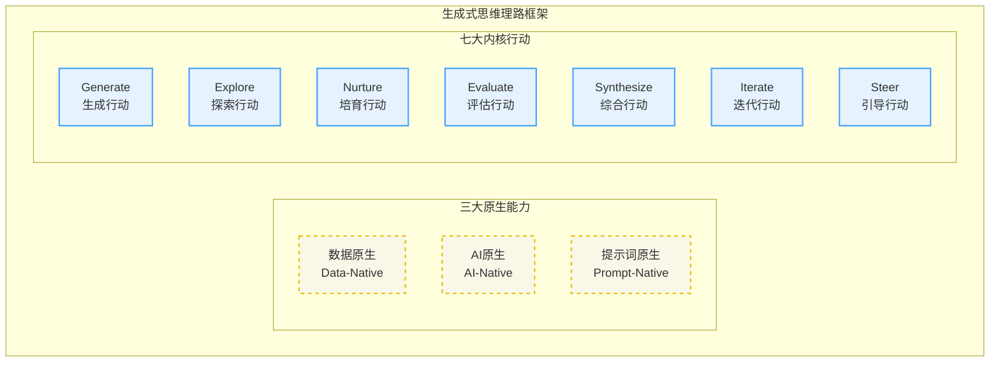

# Generative Thinking理论的初步探索——重新定义思考的过程

## 引言
当代数字智能的崛起正在重塑人类的认知边界。生成式AI不仅改变了信息处理的方式，更深刻地影响着我们思考问题的路径。在这样的背景下，我们需要一种新的思维范式——不是简单地适应技术变革，而是主动构建与智能系统共同进化的认知框架。生成式思维（Generative Thinking）理论正是基于这一洞察而诞生的探索性尝试。

## 1. 思想触发：当工具进化快于思维方式引发的思考

传统的思维模式往往建立在"搜索-选择-应用"的线性逻辑之上。我们习惯于在既有的知识库中寻找答案，通过筛选和匹配来解决问题。然而，当生成式AI展现出创造新知识、新概念甚至新问题的能力时，这种基于检索的思维模式显得越来越局限。更重要的是，人类与AI的协作正在从"人类提问-AI回答"的简单模式，演变为双向启发、共同创造的复杂交互。这种转变要求我们重新定义思维的本质——从寻找既定答案转向共同生成可能性。

生成式思维框架的提出，源于对三个根本性转变的观察。第一个转变发生在知识的本质层面：知识不再是静态的存储物，而成为动态生成的过程。第二个转变体现在问题解决的方式上：我们不再仅仅寻求单一的最优解，而是探索多样化的可能性空间。第三个转变则关乎人机关系的重构：AI不再是工具，而成为思维的伙伴和认知的延伸。

面对这种新型智能体，我们迫切需要一种思维框架，来系统性地指导人类如何更有效**沟通**，如何更智慧**引导**，以及如何更深刻**理解**AI的产出。它不再仅仅是“提示词工程”的技术技巧，而是上升为一种**战略性思维**：如何像设计师那样，以创造性的视角解构问题；如何像精益创业者那样，快速迭代验证想法；如何像敏捷开发者那样，高效协作并持续交付价值。

---

## 2. 洞察本源：生成式思维的核心理念

生成式搜索仍然囿于"有问必有答"的传统假设，它只是用生成的方式来产出答案。而生成式探索则打破了这种线性关系——它不仅生成答案，更生成新的问题维度、新的思考框架，甚至新的认知可能性。这种探索不是漫无目的的发散，而是在人机互动中不断涌现的有机过程。每一次生成都可能开启新的探索路径，每一次探索又催生新的生成需求。

### 理念一：生成优先 (Generation First)
生成优先意味着将创造置于获取之前。传统思维往往从"我需要什么信息"开始，而生成式思维从"我能创造什么可能性"出发。这种优先级的调整带来了认知模式的根本变革。当我们面对复杂问题时，不再急于寻找现成的解决方案，而是通过生成多元的视角、假设和框架来拓展问题空间。生成成为思维的起点而非终点，成为探索的方法而非结果。

生成优先还体现在对待错误和不确定性的态度上。在传统思维中，错误是需要避免的偏差；在生成式思维中，每一个"错误"的生成都可能成为新发现的种子。不确定性不再是认知的障碍，而是创新的土壤。

### 理念二：共智导向 (Co-Intelligence Oriented)
共智导向强调人类智能与人工智能的深度融合。这种融合不是简单的功能互补，而是认知层面的相互激发。人类的直觉、情感和价值判断与AI的计算能力、模式识别和知识关联形成动态的认知网络。在这个网络中，思维不再是个体的内在活动，而是跨越生物与数字边界的集体智慧涌现。

共智的核心在于建立新的认知循环。人类提出富有洞察的问题框架，AI生成多样化的可能性空间；人类进行价值判断和意义赋予，AI进行逻辑推演和关联发现。这种循环不断迭代，每一轮都在前一轮的基础上达到新的认知高度。共智不是1+1=2的简单叠加，而是产生质变的认知跃迁。

### 理念三：涌现驱动 (Emergence Driven)

涌现驱动认为最有价值的洞察往往来自于意料之外的连接和组合。生成式思维不追求预设的目标，而是创造涌现的条件。通过设置恰当的约束和开放的探索空间，让新的模式、概念和解决方案自然浮现。这种涌现不是随机的，而是在人机互动的动态场域中，通过不断的生成、选择、组合和再生成而产生的有机演化。

涌现的关键在于保持系统的开放性和适度的混沌。过度的控制会扼杀创新的可能，完全的随机又会导致无意义的噪音。生成式思维在这两极之间寻找动态平衡，通过设计恰当的生成规则和评估机制，引导涌现朝向有价值的方向发展。

---

## 3. 生成式思维的关键构成：思维能力与行为模式

在本理论框架的探索中，我们初步构想/假设Generative Thinking 的运作与高效能发挥，深植于以下三个核心的“原生”能力。这些能力为上层的方法论要素构筑了技术与认知支撑。在此基础上，我们进一步提出一系列“内核”行动构成了实践 Generative Thinking 的核心行为循环，将其命名为**GENESIS模型**。本章旨在阐述这一初步的理论构成，为后续的实践验证与深入研究奠定假设性基础。

图：生成式思维理论的基础框架示意图

### 3.1 三大“原生”基础能力

**1. 数据原生（Data-Native）**

这指明了数据在生成式思维和AI时代中，其形态、处理方式和价值创造逻辑都发生了根本性转变。数据不再仅是被动收集和分析的对象，它转变为主动参与、驱动生成，并被持续标记与结构化以服务AI模型训练与推理的生命体。高质量、细粒度的数据标记，是模型微调、AI理解用户意图、识别复杂模式的根本。人类对AI产出内容的反馈，无论采纳与否，都成为新的、高质量的标记数据，形成驱动AI持续演化的数据飞轮。

**2. AI原生（AI-Native）**

这要求我们充分适配并运用AI大模型特有的各项能力，将AI视为系统和流程的核心组成部分，而非简单的工具。这包括微调技术，使通用大模型能针对特定领域展现出专业性；多通道处理（MCP）能力，使AI能理解并产出文本、图像、音频等多模态信息；以及智能体的概念，将AI能力封装成能感知、规划、行动与反思的实体。Generative Thinking促使人类像指挥智能体一样思考，从而能更有效地构建、驾驭与协同AI智能体。

**3. 提示词原生（Prompt-Native）**

这把“提示词”提升至人机交互的根本范式。提示词不仅仅是一串输入的字符，它是人类思维结构化、意图精准表达和AI行为引导的核心载体。它的构建过程，本身就是人类对问题进行解构、重构并结构化呈现的智力活动。提示词集成了人类的意图、必要的上下文及对产出结果的各种约束，高效地传递给AI。同时，它也是进行迭代和反馈的主要接口，通过修改、追加或细化提示词，我们得以对AI的生成过程施加精准的控制。

### 3.2 七大“内核”行为：GENESIS模型

GENESIS模型将生成式思维的实践过程具象化为七个相互关联的核心行为。这些行为不是线性序列，而是动态循环的认知活动。

 **1. Generate (生成行动)**：生成是一切的起点，但它不是凭空的创造。有效的生成需要在约束与自由之间找到甜蜜点。我们通过设定创造性约束来引导生成的方向，同时保持足够的开放性以容纳意外的发现。生成的质量取决于输入的丰富性、约束的巧妙性以及对可能性空间的敏感度。

**2. Explore (探索行动)**：探索是对生成结果的深度挖掘。它不满足于表面的新颖，而是追问每个生成背后的潜在价值和延伸可能。探索需要勇气——愿意进入未知的认知领域；也需要智慧——知道何时深入、何时转向。通过系统性的探索，我们将偶然的生成转化为有意义的发现。

**3. Nurture (培育行动)**：并非所有的生成都能立即展现价值，许多富有潜力的想法需要耐心的培育。培育是一个渐进的过程，通过不断的完善、组合和重构，让初步的生成逐渐成熟。这个过程需要我们暂时搁置判断，给予新生的想法足够的成长空间。

**4. Evaluate (评估行动)**：评估不是简单的好坏判断，而是多维度的价值发现。我们需要从创新性、可行性、影响力等多个角度审视生成的结果。更重要的是，评估本身也是一个生成过程——通过评估，我们生成新的评价标准和价值维度。

**5. Synthesize (综合行动)**：综合是将分散的生成结果编织成有机整体的艺术。它要求我们超越局部优化，从系统的角度理解各个元素之间的关系。优秀的综合不是简单的拼接，而是创造性的重组，往往能产生1+1\>2的协同效应。

**6. Iterate (迭代行动)**：迭代将整个过程转化为螺旋上升的认知进化。每一轮迭代都建立在前一轮的基础上，但又不是简单的重复。通过有意识的反思和调整，我们不断优化生成策略，提升探索效率，深化认知理解。

**7. Steer (引导行动)**：引导是对整个生成式思维过程的元认知调控。它要求我们既能沉浸在具体的生成活动中，又能跳出来审视全局。通过动态调整各个行动的权重和节奏，我们确保整个过程既保持活力又不失方向。

-----

## 4. 实践方法：思维框架的工具化

Generative Thinking 框架的落地，离不开一系列配套的实践工具与方法，它们将理论转化为可操作的指导。

### 4.1 思维画布

**思维画布**是一个动态的认知工作空间，它将抽象的思维过程可视化、可操作化。不同于传统的思维导图，生成式思维画布强调流动性和可塑性。画布上的每个节点都是一个生成点，可以随时扩展、变形或重组。节点之间的连接不是固定的线条，而是动态的关系场，会随着思维的深入而不断演化。

画布的设计遵循三个原则：**层次性**——允许在不同抽象层级之间自由切换；**关联性**——支持跨领域、跨维度的连接；**生成性**——每个操作都可能触发新的创造。通过这样的画布，思维从线性的推进转变为网络的生长。

### 4.2 提示词设计模式库

在人机协作的语境下，**提示词**成为激发生成的关键界面。提示词设计不是简单的指令编写，而是认知意图的精确编码。一个优秀的提示词需要平衡明确性与开放性——既要清晰地传达意图，又要为创造性的回应留出空间。

**模式库**收集并系统化了不同场景下的提示词设计范式。比如“视角转换模式”通过引入不同的观察角度来生成多元思考；“类比桥接模式”通过跨领域的类比来激发创新连接；“反向推理模式”通过颠倒常规逻辑来发现隐藏的可能性。每个模式都经过实践检验，并配有具体的应用案例和优化建议。

### 4.3 人机共智训练方法

**共智能力**的培养需要系统的训练方法。这些方法不是教会人如何使用AI工具，而是帮助人类发展与AI协作的认知能力。训练的核心在于建立良好的认知反馈循环——人类学会识别AI生成中的价值点，AI通过人类的引导不断优化生成质量。

训练方法包括“认知乒乓”——通过快速的问答交替训练反应能力；“概念嫁接”——练习在AI生成的基础上进行创造性延伸；“意义编织”——学习将碎片化的生成结果整合成有意义的整体。这些方法都强调过程而非结果，重视能力的渐进式提升。

-----

## 5. 应用场景：理论在实践中的价值

Generative Thinking框架的运用不仅仅局限于技术领域，更是一种适用于多行业、多场景的通用思维工具，例如：

- 在创新设计领域，设计师不再局限于既定的设计语言，而是通过生成式探索发现全新的美学可能。
- 在科学研究中，研究者利用生成式思维突破学科边界，在交叉地带发现新的研究问题和方法。
- 在产品设计研发过程中，生成式思维可以帮助快速原型设计和方案探索，尤其适用于多样化且需求不明确的产品开发领域。
- 在教育培训场景中，可以帮助学习者主动创造和迭代知识，也助力教育者生成定制化内容并探索新的教学策略。
- 在商业创新中，企业通过生成式思维重新定义产品和服务，通过系统性的生成和探索发现颠覆性的商业模式。
- 在商业和政府战略决策中，生成式思维有助于在复杂的决策环境下提供多种可能的方案，并通过快速反馈进行调整。
- 在个人发展层面，生成式思维帮助个体突破认知局限，在人机协作中不断拓展自我可能性。

-----

## 下一步研究计划

Generative Thinking 理论仍处于早期探索阶段，需要更多的理论深化和实践验证。未来的研究将聚焦于三个方向。

第一，**认知机制研究**——深入理解生成式思维的神经认知基础，探索人机协作中的认知负荷分配和优化策略。

第二，**方法论开发**——基于不同领域的实践反馈，开发更精细、更有针对性的生成式思维工具和方法。

第三，**未来影响与挑战研究**——深入探讨生成式思维在社会、经济和文化层面可能带来的深远影响，包括但不限于伦理考量、潜在风险和应对策略。

研究还将关注生成式思维的**规模化应用**。如何将个体层面的认知创新扩展到组织和社会层面？如何在保持生成活力的同时建立必要的质量保障机制？这些问题的解答将决定生成式思维能否从理论构想转变为广泛的社会实践。

-----

## 总结

Generative Thinking代通过将生成置于思维的核心，我们开启了一个充满可能性的认知空间。在这个空间里，人类的创造力与AI的计算力相互激发，共同探索知识和智慧的新边界。这个理论框架仍在生长中，就像它所倡导的生成过程一样，需要在实践中不断涌现新的洞察。每一个参与其中的思考者都是这个理论的共同创造者。

作者：野行僧郭晧
许可证：本作品采用CC-BY-NC-SA 4.0国际许可协议进行许可。详见 http://creativecommons.org/licenses/by-nc-sa/4.0/
