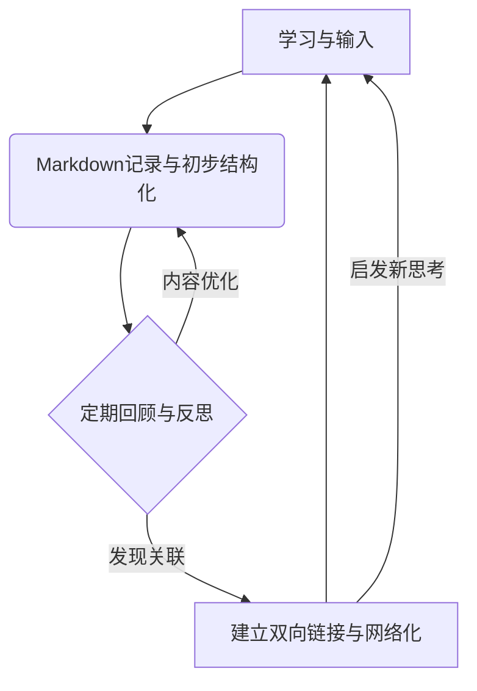

# 《Markdown Thinking：结构化思维与创作的新范式》

## 序言：思维方式的重塑

**1. 数字时代的认知挑战与高效能需求**

我们正置身于一个信息以前所未有的速度与体量汹涌而至的数字时代。每日，海量资讯、数据流与多元观点经由无数渠道冲击着我们的感知与认知系统，这无疑加剧了思维的负荷。个体在尝试筛选、理解、内化这些信息并进行有效输出时，常常陷入“信息过载”的泥沼，表现为注意力涣散、思考深度不足以及难以形成清晰的内在逻辑结构。面对此种普遍困境，对高效思考、深度创作以及实现知识持续进化的时代渴求，已成为驱动我们寻求更优认知工具与方法的根本动力。传统的线性笔记与复杂的文档处理方式，在应对这种非线性、高并发的挑战时，愈发显得力不从心。

**2. Markdown：为结构化表达而生的简洁媒介**

在此背景下，Markdown语言的出现与普及，为我们提供了一种返璞归真的可能性。由John Gruber与Aaron Swartz在2004年设计的Markdown，其初心便是创造一种极致易读易写的纯文本标记方式，旨在解放内容创作，让表达回归其本质。其核心设计哲学——“内容优先”与“易读易写”——使得创作者能将心智资源高度集中于思想的锤炼与文字的组织，而非在工具操作与格式调整上虚耗。Markdown的简洁语法赋予了它无与伦比的跨平台兼容性与信息持久性，而其纯文本特性则与版本控制系统（如Git）珠联璧合，为迭代创作和高效协作奠定了坚实的技术基石。这些关键优势，使其迅速成为全球开发者、写作者及知识工作者的共同选择。

**3. Markdown Thinking：人机认知耦合驱动知识进化的新范式**

本文所倡导的Markdown Thinking，正是基于Markdown这一简洁媒介，并将其从单纯的“写作工具”提升至“思维方法与创作增强器”的层面。其核心定义在于构建一种人机认知耦合的新范式：通过人类的创造力、洞察力与机器（Markdown及其生态工具）卓越的结构化能力、信息组织能力相结合，致力于实现知识的指数级进化。Markdown Thinking的核心价值，在于它不仅仅是辅助记录，更是主动参与、引导并优化我们的思考过程，帮助我们将抽象的、发散的思维火花，转化为清晰、有序、可迭代的知识结构，最终实现从辅助工具到思维伙伴与创作引擎的根本性跃升。从认知科学视角看，Markdown Thinking代表了一种理想的"外部认知支架"。我们的工作记忆有限（通常仅能同时处理7±2个信息块），而结构化的外部记录系统可以显著扩展我们的认知边界。当复杂思想被组织为清晰的层级结构，大脑能够更有效地处理和整合信息，从而达到超越自身限制的思考深度。本指南的使命，正是引领开发者深入体验并熟练驾驭这场以Markdown为支点的认知方式革新，开启结构化思维与高效创作的新旅程。

## 第一部分：Markdown Thinking 的核心引擎：价值、原则与认知机制

Markdown Thinking之所以能引发一场结构化思维与高效创作的范式革命，其根源在于它构建了一套独特的“核心引擎”。这个引擎由三项关键要素精密耦合而成：首先是其不言自明的核心价值，它清晰地回答了我们为何应当拥抱这一新范式；其次是一系列坚实的基石原则，它们为驾驭人机认知耦合的实践提供了行动指南；最后，则是其深植于认知科学的运作机制，揭示了Markdown如何巧妙地与人类思维特性协同，进而指数级地放大我们的创造潜能。深入理解这一核心引擎的构造与动力，是我们从Markdown使用者蜕变为Markdown Thinking驾驭者的关键。

### 1.1. 为何拥抱Markdown Thinking：认知革命的驱动力

采纳Markdown Thinking并非仅仅是选择一种新的写作工具，更深层次的动因在于它能催化一场个体的“认知革命”，显著提升我们处理信息、构建思想和进行创作的根本能力。这一革命性的驱动力，体现在它对人类认知架构的重塑、在效能上对传统工具的超越，以及最终赋能知识实现指数级进化的丰硕成果上。

首先，我们来探讨 认知架构的重构：人脑-机器的双通道处理模型。人类的创造力源于直觉洞察、联想跳跃等高度非线性的心智活动，然而这些宝贵的思维火花若不及时捕捉和结构化，极易消散无形。Markdown Thinking在此引入了一个“人脑-机器”双通道协同处理模型。在此模型中，人类大脑专注于产生原创思想和直觉判断，而 Markdown 及其生态工具则扮演了“机器”的角色，承担起将这些原生思考进行结构化编码的关键任务。


如上图所示，当“人类创造力”产生“直觉洞察与概念形成”（A）后，通过“Markdown结构化编码与外部化”（B），这些思绪被转化为条理清晰、易于审视的“知识晶体”（C）。这些结构化的“知识晶体”不仅便于创作者本人进行迭代优化，也为“机器辅助的语义解析与模式发现”（D）创造了条件（例如，通过文本分析、知识图谱构建等）。由此产生的“增强的洞찰与认知反馈”（E）将反哺给“人类创造力”，形成一个持续加速知识进化的正反馈循环。Markdown在这个模型中，正是充当了连接人类直觉思维与机器结构化处理能力的关键桥梁和催化剂，重构了传统的认知工作流。

其次，Markdown Thinking在效能对比中展现了超越传统工具的思维与创作优势。传统富文本编辑器往往将创作者的精力分散于复杂的功能区和无尽的格式选项，这种“高摩擦”的交互常导致思维中断。Markdown则凭借其“内容与表现分离”的哲学和极简的标记语法，创造了一个“低摩擦”的沉浸式创作环境。启动轻量编辑器几乎无需等待，简洁的标记让思维可以流畅地倾注于文本，结构在书写过程中自然形成，无需在内容与格式间频繁切换。这种差异使得个体能够将更多认知资源聚焦于思考的深度与广度，而非工具操作的表层。纯文本的本质还使其在内容迭代、版本控制（尤其是与Git结合时）以及跨平台迁移方面拥有传统工具难以比拟的灵活性和高效性，显著降低了知识管理和协作的隐性成本。这种专注带来了显著的效能提升，具体体现在以下几个方面，如下表所示：

|对比维度|传统富文本工具 (例如 Word)|Markdown Thinking 实践|
|---|---|---|
|**启动与输入**|软件启动相对较慢，界面元素多，寻找功能耗时|轻量编辑器快速启动，标记直观简洁，输入即思考，心流不易中断|
|**结构构建**|通常内容输入后或同步进行格式调整，结构调整较重|通过标记实时赋予结构，结构随思考演进，调整轻便活|
|**内容迭代与版本**|格式易因内容修改而错乱，版本对比与合并困难|纯文本易于修改，对版本控制系统（Git）极其友好，差异清晰可追踪|
|**专注度与认知负荷**|在内容、格式、工具操作间频繁切换，认知负荷较高|专注于内容和逻辑本身，标记学习成本低，认知负荷显著降低|
|**知识迁移与复用**|格式专有性强，跨平台、跨工具迁移易出问题，复用难|纯文本开放标准，数据可移植性极佳，知识沉淀与复用更为高效|
|**协作效率**|多人编辑易产生格式冲突和版本混乱，合并审查繁琐|基于文本的协作（如Git流程）冲突易解，支持异步及部分实时协作工具|

最后，Markdown Thinking的持续实践最终将赋能个体与团队实现知识的指数级进化。当信息被结构化、纯文本的方式记录，并通过链接形成网络时，知识的积累便不再是孤立节点的简单叠加，而是演化为一个动态的、可生长的知识生态系统。每一个Markdown文档都是这个生态中的一个活细胞，它们通过内部逻辑和外部链接相互作用、相互滋养。这种网络化的知识结构，不仅极大地提升了信息检索、关联分析的效率，更为重要的是，它为知识的交叉、融合与创新提供了丰富的可能性。个体在此基础上能够更快地构建深度理解，团队则能更有效地汇聚集体智慧，从而共同驱动知识成果以指数级的方式增长和进化，这正是人机认知耦合所追求的理想境界。

这种进化过程的背后，是特定技术与方法的支撑，它们将认知理论、结构化实践与现代技术有机结合，进一步加速了知识的深化与连接。其核心机制可被简化理解为如下的相互作用：


具体而言，以下几种关键实践在 Markdown Thinking 中扮演了重要角色：

- 双向链接 (Bidirectional Linking)：通过 [[ ]] 语法（常见于Obsidian、Logseq等工具）实现知识节点间的即时跳转与关联。例如，在阅读一篇关于“Markdown Thinking”的笔记时，可以轻松链接到 [[认知科学]] 或 [[高效协作]] 等相关理论或概念笔记，从而编织一张动态的、易于导航的个人或团队知识网络。
- 可视化图谱 (Visualized Knowledge Graph)：利用Mermaid等工具，可以将Markdown文本中描述的层级关系、流程或概念连接（如通过方向指令 graph LR/TD 定义关系流）自动生成直观的知识拓扑图。这种“文字→图形”的转换，使得复杂的知识结构和逻辑关系一目了然，有助于宏观把握和发现潜在联系。
- AI语义桥接 (AI Semantic Bridging)：结合大型语言模型（如ChatGPT等AI助手），可以对Markdown笔记库进行语义解析和理解。AI能够辅助识别不同知识节点间的潜在关系，智能推荐相关链接或内容聚合，甚至预测性地建议新的知识连接点。这极大地增强了知识网络的构建效率和智能性。

### 1.2. Markdown Thinking的七大核心原则

Markdown Thinking建立在七个核心原则之上，这些原则共同构成了这种思维方式的基础。

**1. 内容优先 (Content First)**

内容优先原则强调思想的表达和组织应优先于表现形式。在Markdown环境中，我们不再受格式调整的干扰，能够持续保持思考的流动状态。这一原则要求我们关注内容的实质价值，而非其装饰性元素。

实践内容优先并不意味着完全忽视形式，而是将形式视为内容的自然延伸。当我们使用Markdown的标题标记时，我们不是在"设置标题格式"，而是在表达"这是一个概念层级"。形式从内容的逻辑结构中自然涌现，而非外部强加。

在团队环境中，内容优先原则特别有价值——它创造了一种基于实质而非表象的评估文化。当所有人都使用统一的简洁格式，讨论自然聚焦于思想的质量和逻辑的严密性，而非表面的视觉效果。

**2. 刻意极简 (Intentional Minimalism)**

刻意极简原则强调有目的地减少复杂性，专注于本质元素。这不是缺乏深度的简单化，而是通过去除非必要元素来增强核心内容的清晰度和影响力。

这一原则在Markdown语法本身体现得淋漓尽致——仅使用少量直观符号表达丰富的结构关系。这种极简主义延伸至思维方式，鼓励我们问："这个元素是否真正必要？它是否增强了理解？"通过不断提出这些问题，我们培养了识别和保留本质的能力。

刻意极简并非否定复杂性，而是追求"适度复杂性"——足够表达深度思想，却不引入不必要的认知负担。在实践中，这意味着我们优先使用基本Markdown语法，谨慎引入扩展功能，并定期审视文档结构，去除冗余元素。

**3. 渐进式结构化 (Progressive Structuring)**

渐进式结构化原则承认思考的自然过程往往是从混沌到有序的演化。这一原则鼓励我们接受初始阶段的模糊性，让结构随着理解的深入而自然显现和发展。

传统文档创建常要求预先确定严格结构，这可能过早限制思考方向。相比之下，Markdown Thinking采用更有机的方法——我们可以从简单列表开始，随着思考深入逐步引入层级和分类，最终形成完整结构。这种方法尊重思考的进化性质，允许结构从内容中自然涌现。

在实践中，渐进式结构化通常遵循"捕捉→组织→连接→精炼"的节奏。初始阶段，我们快速记录想法，不必担心完美组织；随后逐步应用结构元素，识别模式和关系；最后精炼表达，确保逻辑清晰连贯。这一过程既符合认知发展的自然规律，又保持了足够的灵活性适应新洞见。

|认知影响|传统结构化方法|渐进式结构化|
|---|---|---|
|思维边界|预先确定固定框架|允许结构演化|
|结构设计|一次性完成结构设计|迭代发展结构|
|内容与形式关系|形式驱动内容|内容驱动形式|
|思想连贯性与概念关联|重视结构完整性|重视思想连贯性与概念关联理解|

**4. 人机双重可读性 (Dual Readability)**

人机双重可读性原则强调创建的内容应同时满足人类阅读和计算机处理的需求。Markdown的独特优势在于其源代码本身具有良好的可读性，同时又可以被渲染为丰富的格式化文档。

这一原则要求我们在创作时同时考虑两个维度：源文件的清晰度和渲染后的呈现效果。通过保持源码的可读性，我们确保内容在任何环境中都能被理解，不依赖特定的渲染器或呈现方式。这种双重考量增强了内容的适应性和持久性。

在协作环境中，人机双重可读性尤为重要——它确保所有参与者都能在不同工具和平台上有效地阅读和编辑内容。无论是在简单文本编辑器中查看源码，还是在功能完备的Markdown编辑器中享受格式化呈现，内容的核心价值都得以保留。

**5. 平台与工具中立 (Platform & Tool Agnostic)**

平台与工具中立原则强调减少对特定软件、服务或生态系统的依赖。这一原则旨在保护我们的思想和知识免受技术变迁和商业决策的影响，确保长期可访问性和可控性。

在数字工具快速迭代的时代，过度依赖特定工具可能导致"数据孤岛"或"工具锁定"。通过采用基于纯文本的Markdown，我们创建了一种跨平台、长期可访问的知识资产。即使数十年后，这些文档仍然可以被阅读和理解，不受软件变迁的影响。

实践平台中立并非拒绝工具创新，而是谨慎管理依赖关系。我们可以利用现代Markdown工具的强大功能，同时确保核心内容不依赖于这些特定功能。这种平衡为我们提供了当下的便利和长期的安全。

**6. 拥抱迭代与重构 (Embrace Iteration & Refactoring)**

拥抱迭代与重构原则认可思考的非线性本质，将持续改进视为知识发展的自然过程。这一原则鼓励我们将文档视为"永远的草稿"，不断演化而非一次性完成。

传统文档创作常追求"一次成型"，这可能导致过早完美主义和创作阻滞。相比之下，Markdown Thinking采用更敏捷的方法——我们接受并拥抱"糟糕的初稿"作为必要起点，通过持续迭代提升质量。这种方法减轻了创作压力，同时通常产生更高质量的最终成果。

在实践中，迭代原则体现为"写作-审视-重构"的循环。我们快速创建内容，定期回顾整体结构，然后调整组织和表达。版本控制系统（如Git）是这一原则的理想搭档，它记录每次变更，创造思想演化的清晰历史。

**7. 关联构建网络 (Networked Thinking via Connections)**

关联构建网络原则强调思想不是孤立的实体，而是相互连接的网络节点。这一原则鼓励我们超越线性、层级思维，构建概念间的多维关联，从而发现新洞见和创造性组合。

传统文档通常是线性的，难以表达概念间的复杂关系。Markdown通过链接系统（如内部链接、交叉引用）支持更网络化的知识结构。这些连接不仅是导航辅助，更是思想间关系的显性表达，帮助读者（和作者自己）理解概念网络。

在实践中，我们可以通过多种方式建立关联：直接链接相关文档、使用标签系统创建主题聚合、创建索引页面整合相关资源、维护思想关系图表示重要连接。这些技术共同创造了一个"活的知识网络"，而非孤立文档的集合。
刻意极简并非否定复杂性，而是追求"适度复杂性"——足够表达深度思想，却不引入不必要的认知负担。在实践中，这意味着我们优先使用基本Markdown语法，谨慎引入扩展功能，并定期审视文档结构，去除冗余元素。

## 第二部分：工具与环境：构建高效协作的Markdown生态

若将Markdown Thinking视为一场人机认知耦合的范式革命，其高效运作离不开强大而适配的“机器”端——即由编辑器、版本控制系统、协作平台及相关规范共同构成的生态系统。一个精心选择、配置并持续优化的工具与环境组合，是承载结构化思考、放大创作效能、保障团队知识流畅协同的关键。本部分将深入探讨如何明智地选择Markdown编辑器这一核心“结构化引擎”，对比分析主流工具在赋能“人机耦合”与高效协作方面的潜力，并分享构建个性化、团队友好的Markdown工作环境的实用策略与最佳实践，旨在助您打造一个能将Markdown Thinking潜能发挥到极致的数字化工作基石。

### 2.1. 编辑器生态与选择策略

Markdown编辑器百花齐放，从极简纯文本工具到功能丰富的知识管理系统，为不同需求的用户提供了多样化的选择。然而，选择最适合自己的工具，并非盲目追求功能的最大化，而应深入考量其是否与个人的工作流程、思维习惯以及团队的协作模式相契合。理想的编辑器应当如同思维的延伸，它增强而非限制思考过程，以其内在的简洁性服务于内容创作的核心，同时在必要之处提供恰到好处的功能支持。我们追求的，是那种能让我们“几乎感觉不到其存在”的工具——它们无缝融入工作流，静默地辅助思考，而非成为横亘在思想与表达之间的障碍。

在评估和选择Markdown编辑器时，我们应从多个关键维度进行考量，以确保工具能真正服务于结构化思维与高效协作。首当其冲的是编辑体验，包括流畅的语法高亮、即时或分屏预览的响应速度、以及对快捷键的良好支持，这些直接影响创作的沉浸感。其次是结构支持能力，如大纲视图（便于宏观把握文档结构）、代码/内容块的折叠功能（提升长文导航效率）、以及强大的链接系统（尤其是双向链接，对构建知识网络至关重要）。对于团队应用，协作能力是核心要素，包括与Git等版本控制系统的集成度、是否支持多人实时共同编辑、以及评论与审阅功能。同时，扩展性（如插件系统、API接口、自定义主题与片段）决定了工具的成长潜力与个性化深度。最后，平台兼容性与数据同步（跨桌面与移动设备、云端同步方案的可靠性）则保障了知识的可访问性和工作流程的连续性。值得注意的是，不同场景往往呼唤不同的工具组合，不存在一款“万能”的编辑器，关键在于构建一个适合自身需求的工具生态。

具体到用户类型和场景，选择亦有侧重。个人使用者，特别是进行博客写作或日常笔记整理时，往往倾向于那些设计优雅、轻量级且注重沉浸式写作体验的编辑器，例如Typora以其“所见即所得”的流畅编辑著称，iA Writer则以其极致简约的界面和专注模式赢得青睐。开发者或技术写作者可能会更偏爱 VS Code配合强大的Markdown扩展，因为它能无缝集成到现有的编程与版本控制工作流中。对于有构建复杂个人知识网络需求的用户，Obsidian或Logseq凭借其强大的双向链接、知识图谱可视化及高度可定制的插件生态，提供了无与伦比的深度和灵活性。而在团队协作层面，GitLab/GitHub 等代码托管平台内置的Markdown支持（用于README、Issues、Wiki）已成为技术团队的基础设；HedgeDoc (前身为CodiMD) 则为需要实时共同撰写文档的团队（如会议纪要、在线研讨）提供了优秀的开源解决方案；Notion这类一体化工作空间也在其结构化文档模块中融入了对Markdown语法的良好支持，适合需要更广泛协作功能的团队。核心在于理解每种工具的设计哲学与核心优势，从而做出最符合自身思维方式和工作流程的选择。

在复杂的现实场景中，没有任何一款 Markdown 编辑器能够完美满足所有需求。因此，拥抱一种灵活的、面向任务的工具组合策略，往往比固守单一工具更为明智和高效。核心原则是“让合适的工具做合适的事”。例如，一位技术研究员可能使用 Obsidian 进行日常的文献阅读笔记、灵感捕捉和知识网络构建，形成深度的个人思考成果；在撰写需要公开发表的学术论文或技术报告时，他可能会将 Obsidian 中的结构化内容导出，转而在 VS Code 中利用其强大的 Pandoc 集成和 Git 版本控制进行精细排版、参考文献管理和与合作者的异步协作；如果需要与团队进行一次快速的头脑风暴或共同起草项目计划，则可能会选用 HedgeDoc 进行实时在线协作。这种策略的关键在于确保核心内容（Markdown纯文本）能够在不同工具间低损耗地流转，同时充分利用每款工具在特定环节的独特优势，实现整体效能的最优化。

### 2.2. 优化“人机界面”：个性化配置与高效协作环境搭建

一个精心配置的Markdown环境，如同一个调校到最佳状态的“人机交互界面”，能够显著提升个体创作的愉悦感和效率，并为团队的高效协作奠定坚实基础。这不仅仅关乎选择工具，更关乎如何让工具更好地适应我们的思维习惯与团队的运作模式。

**1. 编辑器个性化与效率提升技巧**

深入了解并利用所选Markdown编辑器的个性化配置选项，是提升使用效率的第一步。例如，选择或定制一套令眼睛舒适、能帮助长时间专注的界面主题（包括字体、颜色方案、行距等）至关重要。其次，熟记并根据个人习惯自定义常用操作的快捷键，可以大幅减少对鼠标的依赖，保持思维的连贯性。许多编辑器支持代码片段（Snippets）功能，为常用的Markdown结构（如特定格式的表格、信息框、会议议程模板等）创建自定义的快捷输入命令，能显著提高规范化文档的撰写速度。此外，针对特定工作流（如Zettelkasten笔记法中的ID生成、文献引用格式化等），探索和使用相关的插件或脚本，也能带来显著的效率提升。

**2. 团队一致性：共享配置、规范与代码检查工具**

在团队协作中，文档风格和结构的一致性是降低沟通成本、提升内容可维护性的关键。为此，团队应共同协商并制定一份简洁实用的Markdown写作规范（Style Guide），对标题层级的使用、列表标记的统一（例如，统一使用 - 而非混用 * 和 +）、代码块语言的明确标注、图片和表格的排版约定等做出规定。更进一步，可以利用 Markdown Linter工具（如 markdownlint，许多编辑器如VS Code有其集成插件）来自动化地检查文档是否符合既定规范，并在保存或提交时给出提示甚至自动修正。对于支持工作区（Workspace）级别设置的编辑器（如VS Code），团队还可以创建并共享项目级的编辑器配置文件（例如 .vscode/settings.json 和.vscode/extensions.json），从而统一团队成员的基础编辑环境（如缩进风格、换行符、推荐插件等），从源头上保障协作文档的一致性。

**3. Git与Markdown：实现知识资产的版本化管理与协同进化**

版本控制系统（尤其是Git）与Markdown的结合堪称知识工作的理想搭档。这种组合为团队协作提供了前所未有的透明度和灵活性，同时保留了个人工作的自主性和创造力。

在基于Git的Markdown协作流程中，文档变更变得清晰可见，每次修改都有明确的作者、时间和意图记录（通过规范的commit message）。这种透明度不仅有助于追踪项目（文档）历史，也促进了团队成员的责任感和归属感。团队成员可以清晰地看到一份文档是如何一步步演变至今的，从而更好地理解其背后的决策过程和逻辑变迁，而非仅仅面对一个最终结果。

一个高效的协作工作流通常包含以下元素：

- **分支策略（Branching Strategy）：** 例如，使用主分支（如main或master）保存稳定和已发布的版本，为新的内容创作或重大修订创建特性分支（如feature/new-chapter或fix/typo-correction）。
- **合并请求（Merge/Pull Requests）：** 当特性分支上的工作完成后，通过创建合并请求来提议将其更改融入主分支。这是进行文档同行评审（Peer Review）、深入讨论和质量把控的关键环节。
- **议题跟踪（Issue Tracking）：** 利用Git托管平台（如GitHub, GitLab）的议题系统，记录待处理的文档问题、改进建议、内容需求等，并将其与相关的分支或合并请求关联起来。
- **自动化检查（Automated Checks）：** 在CI/CD（持续集成/持续部署）流程中，可以设置自动化脚本来检查Markdown文档的格式一致性（使用Linter）、链接有效性、甚至进行拼写和语法检查。
- **持续集成/部署（CI/CD）：** 对于需要发布为网站或PDF的Markdown文档，可以配置CI/CD流水线，在每次主分支更新后自动构建并部署最新版本的文档。

这种基于Git的工作流程最初主要应用于技术团队的软件开发和文档编写，但其核心原则和优势（透明、可追溯、分布式、异步协作、质量保障）同样适用于任何需要严谨协作的知识工作场景，如学术研究论文的合著、政策文件的制定、教育资源的协同开发等。它巧妙地结合了个体独立创作的灵活性与集体智慧审核的严谨性，并提供了强大的质量保障机制。

对于非技术背景的团队成员，可以鼓励采用对Git操作进行良好封装的图形化客户端工具，如GitHub Desktop、Sourcetree或GitKraken，以显著降低学习和使用Git的门槛。无论采用何种具体工具，核心在于保持版本历史的清晰可查和变更过程的公开透明，这是实现高效、高质量Markdown文档协作的关键。

## 第三部分：Markdown Thinking 核心工作流：从个体思考到团队协作

掌握了Markdown Thinking的核心价值与原则，并选择了适宜的工具与环境之后，接下来的关键便是将这些元素整合进一个连贯、高效的实践工作流中。这个工作流不仅指导个体如何运用Markdown进行深度思考与内容创作，更重要的是，它揭示了如何将这一方法论扩展至团队层面，通过结构化的信息流动与异步/同步协作，实现集体智慧的涌现与知识资产的协同进化。本部分将详细拆解一个典型的Markdown Thinking全流程模型，并分享若干核心实践技巧与方法论，旨在帮助您构建起一套既能激发个体创造力，又能赋能团队高效协作的完整运作体系。

### 3.1. “灵感捕捉 → 结构塑造 → 意义深化 → 成果创造与协同进化”全流程模型

现代认知科学研究揭示，高效知识创造遵循"发散-收敛-整合-外化"的神经模式。Markdown Thinking工作流正是这一生物认知机制的技术实现。Markdown Thinking的实践可以概括为一个动态的、可循环迭代的四阶段模型。这个模型体现了从原始想法的萌发到成熟知识成果的产出，乃至在团队协作中实现共同进化的完整路径。它强调人类创造力与机器（Markdown及其生态）结构化能力的紧密配合，在不同阶段各有侧重，共同驱动知识的增值与演进。

**1. 阶段一：灵感捕捉与发散（人类创造力的起点，机器辅助高效记录）**

一切创造性活动都始于灵感的火花与思绪的涌现。在 Markdown Thinking工作流的**捕捉与发散阶段**，核心目标是**无延迟、无评判地记录下所有相关的想法、信息片段、问题、观察以及不成熟的念头**。此时，人类的直觉、联想与发散性思维占据主导，而Markdown及其编辑器则扮演着高效、低摩擦的“速记员”角色。通过极其简洁的语法（如无序列表 `-`、简单的文本行），我们可以迅速将大脑中的内容倾倒出来，避免因工具操作复杂或担心格式完美而导致宝贵思路的遗失。这个阶段鼓励“数量优先于质量”，旨在为后续的结构化与深化积累最广泛的原始素材。许多编辑器支持“每日笔记”或快速捕获功能，非常适合此阶段的应用。

**2. 阶段二：结构塑造与聚合（机器的结构化能力辅助梳理与组织人类思绪）**

当原始素材积累到一定程度，工作流便进入**结构塑造与聚合阶段**。此阶段的核心任务是**对捕捉到的零散信息进行初步的梳理、归类与层级化**，赋予其初步的逻辑秩序。此时，Markdown的“机器结构化能力”开始发挥关键作用：通过运用标题（`#`, `##`, `###`）来划分主题模块、定义信息层级；通过调整列表类型（例如，将相关的无序列表项聚合到特定标题下，或将某些并列点转换为有序步骤）；通过段落的组织和缩进，来显化不同信息块之间的从属或并列关系。这个过程并非一次成型，而是人类大脑进行模式识别、逻辑分析与Markdown结构化标记能力之间不断交互、迭代的过程。编辑器的“大纲视图”功能在此阶段尤为重要，它能帮助我们宏观审视和调整文档的整体结构。

**3. 阶段三：意义深化与链接（人机协同探索，构建深度知识网络）**

初步的结构框架搭建完成后，便进入了**意义深化与链接阶段**。此阶段的目标是**超越表面信息的组织，深入挖掘各知识节点间的内在联系，进行批判性思考、补充论证、并构建更丰富的语义网络**。人机协同在此阶段体现得更为深入：我们可以将列表项扩展为充实的段落，对重要概念进行清晰定义，引用外部资料（通过链接 `[]()`）或内部相关笔记（通过双向链接 `[[]]`）来佐证观点或启发新思考。Markdown 的引用（`>`）、强调（`** **`, `* *`）、代码块（用于展示数据、引文或特殊说明）等标记，为这种深度的内容阐释和逻辑辨析提供了便利。通过不断地提问、反思、关联和补充，原本相对孤立的结构化信息开始编织成一张富有意义的知识网络。

**4. 阶段四：成果创造与协同进化（迭代产出高质量成果，集体智慧的涌现）**

工作流的最终阶段是**成果创造与协同进化**。在前三个阶段积累的结构化思考与深度理解的基础上，我们可以开始**将这些“半成品”转化为具有明确目的、面向特定受众的最终成果**，如文章、报告、技术文档、项目计划、演示文稿等。Markdown的易转换性（通过Pandoc等工具）为多样化的输出提供了保障。更重要的是，这一阶段强调“协同进化”：在团队环境中，产出的成果可以通过Git等版本控制系统进行共享、审阅（如Pull/Merge Request流程）和评论。团队成员的反馈与贡献，将进一步驱动内容的迭代优化和集体智慧的涌现，使得知识成果在协作中不断完善，实现超越个体能力的价值创造。

### 3.2. 核心实践技巧与方法论，强化人机耦合效能

要让上述四阶段工作流真正落地并发挥最大效能，还需要掌握一些核心的实践技巧与方法论。这些技巧旨在进一步强化 Markdown Thinking中“人机认知耦合”的效率与深度，使我们能够更自如地驾驭这一新范式。

**1. “最小可行结构”(MVS)驱动快速启动与敏捷迭代**

面对一项复杂的思考或创作任务时，追求一开始就构建完美无缺的详尽结构，往往会导致“分析瘫痪”或启动困难。“最小可行结构”（Minimum Viable Structure, MVS）的理念借鉴了敏捷开发中的“最小可行产品”（MVP），它鼓励我们**首先用最核心的Markdown标记（如几个一级、二级标题和关键的列表项）快速搭建起一个能承载核心思路的、最简化的文档骨架**。这个 MVS 就是我们思考和创作的起点。一旦有了这个基础框架，我们就可以围绕它迅速填充初步内容，然后通过小步快跑、持续迭代的方式，逐步丰富细节、调整结构、深化论证。这种方法极大地降低了启动门槛，克服了完美主义带来的拖延，并使我们能够更早地获得反馈（无论是自我反馈还是他人反馈），从而更敏捷地调整方向。

**2. 知识体系的活化：定期重构、动态共享与集体智慧维护**

以Markdown Thinking构建的个人或团队知识体系，不应是静态的资料库，而应是一个持续生长、动态演化的“活的有机体”。要实现知识体系的“活化”，关键在于**建立定期重构（Refactoring）的机制**。随着新的学习、经验和洞察的积累，我们需要定期回顾已有的Markdown笔记和文档，审视其结构是否依然合理、内容是否需要更新、链接是否仍然有效或需要补充。Markdown的纯文本特性和编辑器的灵活性使得这种重构的成本远低于传统工具。此外，通过合理的**动态共享机制**（如利用Git托管平台、发布为内部Wiki或博客、或使用支持权限控制的协作工具），可以将个体或小团队的知识成果有效地在更大范围内传播与复用。在团队层面，**集体智慧的共同维护**尤为重要，通过定期的知识梳理会、交叉审阅、以及对公共知识库的共同贡献与更新，确保知识体系与团队的认知前沿同步进化。

**3. Markdown模板赋能：标准化创作流程与提升协作效率**

对于许多重复性或具有固定结构的创作任务（如会议纪要、周报、项目提案、读书笔记、API文档、AI提示词等），**预先设计和使用 Markdown 模板**是一种极其有效的提效手段。模板通过固化文档的核心结构、关键要素提示以及格式约定，能够：1) **显著减少新建文档时的重复劳动**，让创作者能更快进入实质性内容思考；2) **确保同类文档的规范性和一致性**，特别是在团队协作中，这能极大降低阅读理解和信息查找的成本；3) **作为一种“清单式”的引导**，帮助初学者或在压力下工作的人员不容易遗漏关键信息点。设计良好的Markdown模板本身就是对特定任务结构化思考的最佳实践的凝练，它能有效提升个体的工作效率，并为团队协作的标准化和规模化奠定基础。我们将在第四部分提供更多具体场景的模板示例。

## 第四部分：Markdown Thinking 的多元创作场：场景、范例与协同进化

Markdown Thinking的力量并不仅限于理论层面，其真正的价值在于能够渗透到多元化的创作与协作场景中，通过具体的实践范式和可复用的模板，切实提升个体与团队的效能，并驱动知识成果的协同进化。本部分将深入探讨Markdown Thinking在个体知识管理、学术创新、技术传播、敏捷项目、AI时代创作以及高效团队赋能等多个关键“创作场”中的具体应用。我们将通过分析每个场景下的核心痛点与需求，展示Markdown Thinking如何提供针对性的解决方案，并辅以实用的Markdown模板范例，旨在帮助您将这一新范式灵活运用于日常工作与学习的方方面面，体验其带来的深刻变革。

### 4.1. 个体知识涌现：结构化学习与“第二大脑”的高效构建

在个体层面，Markdown Thinking是对抗信息过载、实现深度学习、并构建强大“第二大脑”的有力武器。它帮助我们将被动接收的信息转化为主动构建的、结构化的、可检索、可关联的个人知识体系。**实践范式** 上，这通常涉及到建立一套连贯的笔记习惯：例如，对阅读、听讲、观影等输入进行“深度笔记”，不仅记录要点，更要用自己的话复述、提问、联想；通过“日志反思”来结构化每日的经验、情绪与成长；对于跨越不同媒介的思考（如网页、PDF、播客），则有意识地将其核心洞察沉淀到统一的Markdown知识库中。这一过程的核心在于利用Markdown的层级（标题、列表）、链接（尤其是双向链接）和标签等特性，将孤立的知识点编织成网络，促进知识的“涌现”和个体认知能力的进化。

**模板示例**方面，一个“动态学习卡片”或“关联思考网络节点”的模板可以帮助规范化这一过程，使其更易于长期坚持和高效复用。

* **模板示例：动态学习卡片 (Zettelkasten风格)**

```markdown
    UID: {{date:YYYYMMDDHHmmss}}
    title: "[核心概念/知识点标题]"
    tags: [领域, 主题词1, 主题词2]
    aliases: [别名1, 别名2] # 可选，用于其他称呼
    type: #概念卡 #文献卡 #想法卡
    ---

    ## 定义/核心内容

    (用自己的话清晰、简洁地阐述这个概念或知识点)

    ## 上下文/背景

    (简述这个概念出现的背景、相关理论或问题域)

    ## 关键细节/支撑论据

    -   细节/论据1
    -   细节/论据2
        -   子细节/子论据

    ## 我的思考/疑问/联想

    -   > 引用相关的文献或观点 (可选)
    -   对于[某个方面]我仍有疑问...
    -   这让我想到了[[另一个相关概念]]...

    ## 参考文献/来源 (可选)

    -   [来源名称1](URL)
    -   [[文献笔记UID或标题]]

    ## 相关链接

    -   [[相关概念A]]
    -   [[相关问题B]]
```

### 4.2. 学术创新加速：研究、协作撰写与知识传播的高效模式

学术研究与创作过程复杂且周期长，涉及大量文献阅读、实验设计、数据分析、论文撰写与同行协作。Markdown Thinking能够为这一系列活动提供高效的结构化支撑。**实践范式**包括：利用 Markdown 结合 Zotero 等工具进行系统化的文献管理与深度阅读笔记，记录核心论点、方法、证据及个人评注；在实验记录中，用Markdown表格、代码块和流程图（Mermaid）清晰呈现实验设计、过程、数据和初步分析，确保可复现性；在论文撰写时，从Markdown大纲入手，逐步填充内容，利用Pandoc等工具配合LaTeX处理复杂的数学公式和专业的排版需求；在团队协作中，通过Git对论文版本进行精细管理，利用合并请求进行同行评审和修订。

- **模板示例：结构化文献综述框架**

```markdown
# 1. 文献综述：[研究主题]
### 1.1. 研究背景与问题提出
### 1.2. 文献检索策略与范围
### 1.3. 本综述的结构安排

## 2. [主题方面一] 的研究进展
### 2.1. 核心概念与理论基础
### 2.2. 主要研究流派/观点
    - 流派A: [[代表文献1]], [[代表文献2]]
        - 核心论点：
        - 主要证据：
        - 局限性：
    - 流派B: ...
### 2.3. 研究方法与技术路径
### 2.4. 尚存争议或未解决的问题

## 3. [主题方面二] 的研究进展
### ... (结构同上)

## 4. 现有研究的共性、差异与局限性分析
### 4.1. 共性趋势总结
### 4.2. 主要分歧点辨析
### 4.3. 当前研究的整体局限与不足

## 5. 未来研究方向展望
### 5.1. 理论层面的突破方向
### 5.2. 方法学上的创新可能
### 5.3. 实践应用中的潜在议题

## 参考文献 (通常使用文献管理工具配合Pandoc生成)
```

-  **模板示例：科研项目协作周报**
```markdown
# [项目名称] - 协作周报 ({{date:YYYY}}-W{{date:WW}})

**报告人：** @[你的名字]
**日期：** {{date:YYYY-MM-DD}}

## 1. 本周工作进展总结
- **任务1：[任务描述]**
  - 进展：[完成情况，如 完成80% / 已完成 / 遇到障碍]
  - 成果：[具体产出，如 [[相关文档]] / [代码提交链接](URL)]
- **任务2：[任务描述]**
  - ...

## 2. 下周工作计划
- [ ] **优先任务1：[任务描述]** (预计负责人: @[同事A], 截止日期: YYYY-MM-DD)
- [ ] **优先任务2：[任务描述]**
- [ ] 次要任务：...

## 3. 遇到的问题与挑战
- 问题1：[描述问题]
  - 当前状态：[例如：正在调研解决方案 / 已与XX沟通]
  - 需要的帮助：[例如：需要 @[同事B] 提供XX数据支持]
  - ...

## 4. 其他事项/心得体会 (可选)
-
```

### 4.3. 技术传播革新：“文档即代码”与开发者知识协同进化

技术文档是连接开发者、用户与产品的重要桥梁。Markdown Thinking，特别是结合“文档即代码”（Docs-as-Code）的理念，正在革新技术传播的方式。**实践范式**强调将技术文档（如API手册、项目README、开发者指南、代码注释提取的文档）与源代码一同纳入版本控制系统（Git），使其享受与代码同等的管理待遇：版本化、可审查、可测试、可自动化构建与部署。团队成员可以像协作开发代码一样，通过分支、合并请求来协同编写和维护文档。这种方式不仅提升了文档的准确性和时效性，也降低了开发者的文档编写门槛，促进了知识在团队内部乃至开源社区的协同进化。

**模板示例**有助于保障技术文档的规范性和易用性。

- **模板示例：开发者入门指南 (Onboarding Guide) 框架**

```markdown
# [项目/产品名称] - 开发者入门指南

## 1. 欢迎与项目概览
### 1.1. 项目简介与核心价值
### 1.2. 技术栈概览
### 1.3. 本指南适用对象与阅读前提

## 2. 环境搭建与配置
### 2.1. 系统要求
### 2.2. 依赖安装 (如 `brew install package` 或 `npm install`)
	```bash
	# 示例安装命令
	```
### 2.3. 项目克隆与初始化配置

## 3. 核心架构与模块介绍
### 3.1. 整体架构图 (可使用 Mermaid)
	```mermaid
	graph TD
		A[用户请求] --> B(API网关)
		B --> C[服务模块A]
		B --> D[服务模块B]
	```
### 3.2. 主要模块功能说明
	- 模块一：[简述]
	- 模块二：[简述]

## 4. 第一个“Hello World”示例 / 核心功能快速上手
### 4.1. 运行步骤
### 4.2. 预期结果与验证

## 5. 开发规范与流程
### 5.1. 代码风格与Linting规则
### 5.2. 分支管理与提交流程
### 5.3. 测试与CI/CD简介

## 6. 常见问题 (FAQ) 与故障排查
	- Q1: ...
    - A1: ...

## 7. 寻求帮助与社区资源
    - 内部联系人：@[核心开发者]
    - 社区论坛/邮件列表链接
```

- **模板示例：API接口规范文档 (简化版)**

```markdown
## API端点： `GET /users/{id}` - 获取用户信息

**功能描述：** 根据用户ID获取指定用户的详细信息。

**请求方法：** `GET`

**请求URL：** `/api/v1/users/{id}`

**路径参数 (Path Parameters)：**
|参数|类型|描述|是否必须|
|---|---|---|---|
|`id`|string|用户的唯一标识符|是|

**查询参数 (Query Parameters)：** (可选)
|参数|类型|描述|是否必须|默认值|
|---|---|---|---|---|
|`fields` |string|可选，指定返回的字段列表，逗号分隔|否|(所有)|

**请求头 (Request Headers)：**
|Header|值示例|描述|
|---|---|---|
|`Authorization`|`Bearer <your_access_token>`|授权凭证|

**成功响应 (Success Response)：**
	- **Code:** `200 OK`
    - **Content Example:**
      ```json
      {
        "id": "user123",
        "username": "example_user",
        "email": "user@example.com",
        "createdAt": "2024-01-15T10:30:00Z"
      }
      ```

**错误响应 (Error Responses)：**
    - **Code:** `401 Unauthorized`
	- **Reason:** 认证失败或Token无效。
    - **Code:** `404 Not Found`
	- **Reason:** 指定ID的用户不存在。
```

### 4.4. 敏捷项目共创：从需求洞察到价值交付的透明化协作

在快节奏的敏捷开发环境中，清晰、轻量、易于迭代的文档是保障团队高效协作和持续交付价值的关键。Markdown Thinking 为此提供了理想的支撑。**实践范式**包括：使用 Markdown 结构化地撰写用户故事（User Stories）和验收标准（Acceptance Criteria）；通过层级列表和任务列表构建和管理产品待办事项列表（Product Backlog）和Sprint待办事项列表（Sprint Backlog）；在迭代回顾会议（Retrospectives）中，利用共享的Markdown文档实时记录团队成员的反馈（如“做得好的”、“可以改进的”、“遇到的困惑”）并形成可追踪的改进项。这种方式确保了需求、计划、进展和反思在团队内部的透明化与同步。

**模板示例**能够固化敏捷实践中的关键沟通与记录环节。

- **模板示例：敏捷 Sprint 计划会高效模板**

```markdown
# Sprint [编号] 计划会议 - [项目名称]

**日期:** {{date:YYYY-MM-DD}}
**Sprint周期:** [开始日期] 至 [结束日期] ([X] 周)
**参与者:** @PO, @SM, @DevTeamMember1, @DevTeamMember2

## 1. Sprint目标 (Sprint Goal)
	- (由PO提出，团队共同确认为本Sprint要达成的核心商业价值)

## 2. 团队能力评估 (Team Capacity)
    - 可用人天：[总计人天，考虑假期和会议]
    - 关注点：[本Sprint是否有特殊情况影响团队能力，如成员休假、重要培训等]

## 3. 待办事项筛选与估算 (Backlog Refinement & Estimation)
|用户故事ID|描述 (简要)|优先级|故事点/估时|负责人初步认领|备注/依赖|
|---|---|---|---|---|---|
|US-101|作为用户，我希望能...|高|5| @Dev1|依赖US-100|
|US-102|作为管理员，我需要能...|中|3| @Dev2||
|...||||||
*(注：故事点/估时可在会议中讨论填写)*

## 4. Sprint承诺 (Sprint Commitment)
	- 本Sprint承诺完成以下用户故事：
	- [ ] US-101
	- [ ] US-102
	- ...
    - 风险与潜在障碍：
      -

## 5. 任务拆解初步 (Optional - 由团队在会后细化)
	- **针对 US-101:**
	- [ ] 子任务1: ...
	- [ ] 子任务2: ...
```

- **模板示例：项目复盘与洞察增效模板 (例如，采用“帆船模型”)**

```markdown
# [项目名称/Sprint编号] 复盘会议 - 帆船模型

**日期:** {{date:YYYY-MM-DD}}
**主持人:** @[主持人名字]
**参与者:** (列出所有参与者)

---
## 我们的航行目标 (Our Destination - Project/Sprint Goal)
	- (回顾本次迭代或项目的既定目标是什么？我们是否达成了？)

## 助我们前进的风 (The Wind - What Helped Us Move Forward?)
    - (记录那些做得好的、帮助团队达成目标的积极因素、成功实践)
    -
    -

## 拖累我们的锚 (The Anchors - What Slowed Us Down?)
    - (记录遇到的障碍、问题、流程瓶颈、不顺利的方面)
    -
    -

## 礁石与风险 (Rocks & Risks - Potential Future Dangers We Foresee)
    - (识别未来可能遇到的潜在风险或需要警惕的问题)
    -
    -

##  未来愿景/目标岛屿 (Island of Future - What Do We Aspire To?)
    - (对于未来，我们希望达到什么样的理想状态或目标？)
    -

## 行动计划 (Action Plan - How to Get There / Improve)
    - [ ] **行动项1:** [具体做什么] (负责人: @[名字], 截止日期: YYYY-MM-DD)
    - [ ] **行动项2:** ...
*(确保行动项具体、可衡量、可分配、相关联、有时限 - SMART)*
```

### 4.5. AI 时代创作：人机协同设计、优化提示词工程与知识生成

在人工智能飞速发展的今天，Markdown Thinking为人机协同创作提供了理想的框架，尤其在提示词工程（Prompt Engineering）和AI生成内容的管理方面。**实践范式**包括：使用 Markdown 设计结构化的提示词模板，清晰定义AI的角色、任务、上下文、输出格式和约束条件；将这些提示词模板本身作为 `.md` 文件进行版本控制（Git），方便团队共享、迭代优化和效果追踪；对于AI生成的内容（通常也可以是Markdown格式），利用Markdown工具进行二次编辑、结构化整理、事实核查、风格统一，并将其融入现有的知识库，通过链接与既有知识建立关联。这形成了一个“人定义框架与目标 → AI填充与加速 → 人优化与整合”的高效闭环。

**模板示例**能够规范提示词的设计和AI辅助创作的流程。

- **模板示例：多轮对话AI任务指令集模板 (用于复杂任务分解)**

```markdown
# AI 任务指令集：[复杂任务名称，例如：生成市场调研报告]

## 整体目标 (Overall Objective)
	- (清晰描述最终希望AI完成的成果及其目的)

## 参与角色 (Persona for AI)
    - 你将扮演一位 [角色描述，例如：拥有10年   // 阶段间的连接经验的市场分析专家，擅长数据解读和报告撰写]。

## 对话策略/阶段分解 (Conversation Strategy / Phased Approach)

### 阶段一：信息收集与确认 (Information Gathering & Confirmation)
    - **我的输入1 (User Input 1):** 我需要一份关于 [行业/产品] 的市场调研报告，重点分析 [方面A]、[方面B] 和 [方面C]。请先告诉我你需要哪些基础信息才能开始？
    - **AI预期输出1 (Expected AI Output 1):** (AI应列出所需信息清单，例如：目标市场定义、时间范围、竞品列表、关键数据源等)
    - **我的输入2 (User Input 2):** (提供AI所需的基础信息)
    - **AI预期输出2 (Expected AI Output 2):** (AI确认收到信息，并可能就模糊点进行追问)

### 阶段二：[具体分析/创作子任务1，例如：竞品分析]
    - **我的输入3 (User Input 3):** 现在，请基于以上信息，为我分析主要竞品 [竞品X] 和 [竞品Y] 的优劣势。
    - **AI预期输出3 (Expected AI Output 3):** (AI输出对竞品X和Y的分析)
	- **结构要求：** 对每个竞品，分别从 [维度1]、[维度2] 进行评价。
	- **风格要求：** 客观、数据驱动。

### 阶段三：[具体分析/创作子任务2，例如：市场趋势预测]
    - **我的输入4 (User Input 4):** ...
    - **AI预期输出4 (Expected AI Output 4):** ...

### 阶段 N：整合与初稿生成 (Integration & Draft Generation)
    - **我的输入 N (User Input N):** 请将以上所有分析结果整合成一份完整的市场调研报告初稿。
    - **AI预期输出 N (Expected AI Output N):** (AI输出符合整体目标和之前所有阶段性成果的Markdown格式报告初稿)
	- **报告结构要求：**
		1.  引言
		2.  市场概览
		3.  竞品分析
		4.  市场趋势预测
		5.  结论与建议

## 约束与提醒 (Constraints & Reminders for AI)
    - 保持 [指定语气]。
    - 数据引用需注明可能来源或提示用户核实。
    - 避免使用过于绝对的表述。
```

- **模板示例：提示词A/B测试与优化记录**

```markdown
# 提示词优化记录：[测试目标，例如：提升AI生成产品描述的吸引力]

**日期:** {{date:YYYY-MM-DD}}
**测试编号:** Test-00X

## 原始提示词 (Prompt A - Baseline)
```markdown
# 角色
	你是一个营销文案专家。
# 任务
    为以下产品写一段100字左右的描述：
    产品名称：[产品A]
    核心特性：[特性1], [特性2]
    目标用户：[用户画像]
# 输出格式
    直接输出产品描述文本。

## 优化版提示词 (Prompt B - Variant)
```markdown
# 角色
	你是一个顶级的营销文案大师，深谙消费者心理，文笔极富感染力。
# 任务
    为以下产品创作一段能激发购买欲望的描述（约100-150字）：
    产品名称：[产品A]
    核心特性及用户利益点：
    - 特性1 -> [对应的用户价值/情感连接]
    - 特性2 -> [对应的用户价值/情感连接]
    目标用户痛点：[用户面临的主要困扰]
    期望用户感受：[希望用户阅读后产生的情感共鸣，如兴奋、安心、渴望]
# 输出格式
    直接输出产品描述文本，要求包含至少一个强烈的行动召唤。

## 测试结果与对比分析
|指标维度|Prompt A输出示例与评价|Prompt B输出示例与评价|结论与洞察|
|---|---|---|---|
|**吸引力/说服力**|(粘贴输出A)|(粘贴输出B)|Prompt B显著更佳，情感连接更强|
|**行动召唤强度**|较弱|明确有力| Prompt B胜出|
|**字数控制**|符合|轻微超出，但可接受|基本符合|
|**其他观察**|语言略平淡|更具场景感||

## 后续优化方向   // 阶段间的连接   // 阶段间的连接
	- (针对Prompt B，是否还有可微调之处？或基于本次测试结果，下一步的测试方案是什么？)
```

### 4.6. 高效团队赋能：倍增知识共享、会议效能与决策质量

Markdown Thinking能够为团队构建一个透明、低噪、易于协作的知识环境，从而在知识共享、会议管理和决策制定等多个层面提升整体效能。**实践范式**包括：共同建设和维护一个基于 Markdown和Git（或支持Markdown的Wiki/知识库系统）的动态团队知识库，确保最佳实践、SOP、项目文档等核心信息得到有效沉淀和便捷访问；推广使用标准化的Markdown模板进行会议议程设计、实时会议记录（可由多人协作完成）和会后行动项追踪，提升会议的聚焦度和成果转化率；对于需要异步讨论和决策的事项，可以利用Markdown文档清晰阐述背景、方案、利弊分析，并通过版本控制或协作平台的评论功能收集反馈、记录决策过程，确保决策的透明性和可追溯性。

**模板示例**有助于固化高效团队的运作流程。

- **模板示例：团队决策会议高效模板 (例如，基于SPADE决策模型)**

```markdown
# 决策会议：[决策事项名称]

**日期:** {{date:YYYY-MM-DD}}
**会议目标:** 就 [决策事项] 达成明确结论并制定行动计划。
**主持人:** @[名字]
**决策者:** @[最终决策人名字] (若适用)
**参与者:** (列出核心参与讨论者)

---
## S - Setting (背景设定)
	- **待决策问题陈述:** (清晰、简洁地描述需要决策的问题是什么？)
    - **决策重要性/紧迫性:** (为何现在需要做此决策？不做决策的潜在影响？)
    - **相关背景信息/数据:** (提供支持决策所需的核心背景资料链接或摘要，如 [[市场分析报告]] , [[用户调研数据]] )

## P - People (人员权责)
    - **决策所有者 (Owner):** @[负责推动此决策并对结果负责的人]
    - **批准者 (Approver):** @[对决策有最终批准权的人] (若与Owner不同)
    - **贡献者 (Contributors):** (列出提供重要输入、分析或执行支持的人员)
    - **被知会者 (Informed):** (列出决策结果需要通知到的人员或团队)

## A - Alternatives (备选方案)
### 方案一：[方案名称A]
	- 核心描述：
	- 优点：
	- 缺点/风险：
	- 资源需求估算：
### 方案二：[方案名称B]
	- 核心描述：
	- ...
### (方案三，可选)

## D - Decide (决策过程与结论)
    - **评估标准/决策原则:** (团队事先约定的、用于衡量各方案优劣的标准)
    - **讨论摘要:** (简要记录各方案的主要讨论点和不同意见)
    - **最终决策:** (明确说明最终选择的方案及其理由)
        - **选择方案：** [方案X]
        - **决策理由：**
    - **未被采纳方案的简要说明:** (可选，简述为何其他方案未被采纳)

## E - Explain & Execute (解释传达与执行计划)
    - **决策传达计划:** (如何向相关人员清晰传达此决策及其背景、理由？)
    - **初步执行计划/行动项:**
      - [ ] 行动项1: [具体任务] (负责人: @[名字], 截止日期: YYYY-MM-DD)
      - [ ] 行动项2: ...
    - **衡量决策效果的指标/后续跟进机制:**
```
- **模板示例：共享SOP（标准作业流程）文档结构**

```markdown
# SOP-[流程编号]: [流程名称，例如：新员工入职流程]

**版本:** 1.0
**最后更新日期:** {{date:YYYY-MM-DD}}
**负责人/维护者:** @[部门/人员名称]
**适用范围:** [例如：全体员工 / XX部门]

---
## 1. 流程目的与目标
	(清晰说明此SOP旨在解决什么问题，达成什么目标)

## 2. 涉及角色与职责
|角色|主要职责在此流程中|
|---|---|
|新员工|配合完成各项入职手续，参与入职培训|
|人力资源部|发放入职通知，办理合同与社保，组织入职培训|
|直属上级|制定入职引导计划，分配导师，明确初期工作任务|
|IT部门|配置办公设备与系统账号|
|(其他相关角色)||

## 3. 流程步骤详解
### 阶段一：入职前准备 (负责人: 人力资源部)
1.  **步骤1.1:** [发送Offer Letter与入职须知]
   	- 注意事项：[例如：确保信息准确无误]
2.  **步骤1.2:** [收集员工基本信息，准备合同]
3.  **步骤1.3:** [通知IT部门、直属上级准备相关资源]

### 阶段二：入职当日 (负责人: 人力资源部, 直属上级, IT部门)
1.  **步骤2.1:** [员工报到，签署劳动合同与相关文件] (HR)
2.  **步骤2.2:** [领取办公设备，开通账号] (IT)
3.  **步骤2.3:** [部门介绍，引见团队成员，明确初期工作安排] (直属上级)

### 阶段三：入职后一周内 (...)
1.  ...

## 4. 关键检查点与质量标准
    - **检查点1:** [例如：入职材料完整性] - 标准：[所有表格填写无误]
    - **检查点2:** ...

## 5. 异常情况处理与升级路径
    - 若发生 [某种异常情况], 则应 [如何处理], 必要时联系 @[上一级负责人]。

## 6. 相关资源与表单链接
    - [[新员工入职信息登记表]]
    - [公司行为准则文档](URL)

## 7. 版本修订历史
|版本|更新日期|修订人|修订说明|
|---|---|---|---|
|1.0|YYYY-MM-DD|@[名字]|初始版本发布|
```

## 第五部分：进阶与未来：深化Markdown Thinking的影响力

随着对Markdown Thinking核心理念与实践方法的掌握，我们不仅能提升当下的思考与创作效能，更能着眼于其深远的潜力，通过高级技巧、自动化流程和对未来趋势的洞察，持续深化其在个人与团队知识工作中的影响力。这一部分将引领我们探索Markdown的扩展功能如何进一步增强“机器的结构化能力”，如何构建智能化的知识进化引擎，并展望Markdown Thinking在人机认知耦合持续深化的大背景下的未来图景。

### 5.1. Markdown 扩展宇宙：高级功能与定制化应用，增强机器结构化能力

虽然Markdown以其核心语法的简洁性著称，但其真正的威力在于一个不断扩展的功能宇宙。通过各种被广泛支持的扩展语法和工具集成，Markdown的表达能力和“机器结构化能力”得到了极大的增强，使其能够胜任更复杂的知识表达与信息组织任务。

**1. 动态可视化（Mermaid图表）、精准数学表达（LaTeX数学公式）、信息组织（复杂表格、脚注）**

要在Markdown文档中实现超越纯文本的丰富表达，动态可视化、精准数学公式和高级信息组织功能不可或缺。**动态可视化** 方面，通过嵌入 [Mermaid](https://mermaid.js.org/) 代码块，可以直接在Markdown中绘制流程图、序列图、甘特图、状态图等多种图表，将复杂的逻辑关系或过程直观呈现。例如，一个简化的个人知识管理反馈循环可以表示为：


这种图文结合的方式，极大地增强了Markdown文档的表现力和理解效率。对于学术研究、技术文档等需要**精准数学表达**的场景，Markdown通过集成LaTeX语法（通常由MathJax或KaTeX渲染）提供了强大的支持。无论是行内公式如 `$E=mc^2$`，还是复杂的独立公式块如：

```markdown
$$
\int_{-\infty}^{\infty} e^{-x^2} dx = \sqrt{\pi}
$$
```
都能被清晰、专业地呈现。在**信息组织**层面，除了标准表格，一些Markdown变体或工具支持更复杂的表格功能（如单元格合并，或通过嵌入HTML实现）。同时，脚注（`文本[^1]` 和 `[^1]: 这是脚注内容。`）的运用，使得在保持正文流畅性的同时，能够方便地提供补充说明、参考文献或定义解释，增强了文档的严谨性和深度。

**2. 内容的元驱动：YAML Frontmatter与自动化内容管理**

YAML Frontmatter是嵌入在Markdown文档头部（通常由 `---` 分隔）的一块结构化元数据。它允许我们为每一篇文档定义诸如标题、作者、日期、标签、分类、状态、自定义参数等丰富的上下文信息。例如：

```yaml
  ---
    title: "Markdown Thinking：第二大脑构建实践"
    date: 2025-06-15
    author: "AI助手与您"
    tags: [Markdown Thinking, PKM, Zettelkasten, Productivity]
    status: "draft"
    version: 1.2
    reviewers: ["张三", "李四"]
    ---
  (此处开始文档正文)
```
### 5.2. 自动化与智能生态：构建个性化知识进化引擎

要将Markdown Thinking的效能发挥到极致，仅仅依赖手动操作是不够的。通过引入自动化工具和利用日渐成熟的智能生态，我们可以将零散的Markdown文档和工作流程，整合成一个高度个性化、能够自我驱动知识进化的强大引擎。

**1. Pandoc深度应用：模板化、过滤器与脚本化批量转换，提升输出效能**

Pandoc作为文档格式转换的“瑞士军刀”，其潜能远不止于简单的 `.md` 转 `.pdf` 或 `.docx`。通过**深度应用 Pandoc**，我们可以实现高度定制化的输出。利用其**模板系统**（如自定义 LaTeX, HTML, Word 模板），可以精确控制最终文档的排版、样式和结构，满足专业的出版或品牌要求。**过滤器（Filters）**则更为强大，它允许我们通过编写脚本（通常使用 Lua，也支持 Python 等）在Pandoc的转换过程中，以编程方式检查、修改甚至完全重构文档的抽象语法树（AST），从而实现例如自动编号图表、生成特殊索引、内容条件化输出等高级功能。结合操作系统的**脚本化能力**（如Shell, Python），将常用的Pandoc命令封装起来，可以实现复杂文档的批量转换和自动化生产流程，极大地提升了从Markdown源到最终交付物的输出效能与一致性。

**2. CI/CD赋能：文档自动化测试、发布与协作验证流程，加速知识迭代**

在团队协作和大型文档项目中，引入持续集成/持续部署（CI/CD）的理念和工具，能够为Markdown Thinking的实践带来革命性的效率提升和质量保障，真正加速知识的迭代进化。当Markdown文档（尤其是“文档即代码”场景下的技术文档或项目知识库）存储在Git仓库中时，可以配置CI/CD流水线（如通过GitHub Actions, GitLab CI/CD, Jenkins等）来自动执行一系列任务：例如，在每次代码提交或合并请求时，自动运行 **Markdown Linter** 检查语法和风格规范，自动**检测失效链接**，甚至进行**拼写和基础语法检查**。通过测试后，CI/CD 流程可以自动调用 Pandoc 或静态网站生成器**构建文档**（生成HTML站点、PDF手册等），并将其**部署到预览环境或生产环境**。这种自动化的测试、构建、发布与协作验证流程，不仅减少了人工操作的疏漏和耗时，更重要的是，它为团队提供了一个快速反馈、持续改进、确保知识资产质量并加速其迭代演进的强大基础设施。

### 5.3 Markdown Thinking 的未来演化：趋势与展望，深化人机认知耦合**

Markdown Thinking并非静止不变的概念，它正随着技术的发展和人类认知需求的深化而不断演化。展望未来，其在人机认知耦合领域的潜力将得到更深层次的挖掘，呈现出若干激动人心的趋势。

**1. 标准化、交互性与语义化：让机器更懂你的思考与创作意图**

为了更好地实现“机器结构化能力”对“人类创造力”的辅助，Markdown本身及其应用生态正朝着更深层次的标准化、交互性和语义化方向发展。**标准化**（如 CommonMark 规范的持续完善和推广）致力于消除不同Markdown实现之间的模糊性和不兼容性，为更可靠的机器解析和数据交换奠定基础。**交互性**的增强则体现在Markdown文档将不再仅仅是静态的文本与图像，而是可能包含可执行的代码块（如 Observable JS, Starboard等探索）、可交互的数据可视化、嵌入式的小应用或动态表单，使得文档本身成为一种探索和行动的界面。更进一步，**语义化**的趋势意味着Markdown文档将承载更丰富的结构化数据和明确的语义信息（可能通过与RDFa, Microdata, JSON-LD等技术结合，或通过更智能的自然语言处理来提取），从而让机器能够更深刻地理解内容的含义、概念间的关系以及创作者的真实意图，而不仅仅是表面的格式。

**2. 人机协同新高度：AI、知识图谱与Markdown Thinking的深度融合与相互促进**

人工智能（尤其是大型语言模型和知识图谱技术）的飞速发展，为 Markdown Thinking开辟了人机协同的新高度。未来，AI 将不仅仅是辅助生成 Markdown 初稿或进行文本润色。更深层次的融合在于：AI能够基于对大量Markdown结构化知识库的学习，**智能辅助用户进行结构化思考**，例如在用户记录零散想法时，AI 实时建议可能的组织结构、标题层级或相关标签；AI 能够**从非结构化或半结构化的 Markdown 内容中自动提取实体、关系，辅助构建和扩展个人或团队的知识图谱**；AI 甚至可以基于已有的 Markdown 知识网络，进行**推理、洞察发现和创新性联想**，成为真正的“思考伙伴”。反过来，Markdown Thinking所倡导的结构化、纯文本、链接化的知识组织方式，也为AI模型提供了高质量的、易于理解和处理的训练数据与应用场景，两者将形成相互促进、共同进化的良性循环。

**3. 范式迁移的深远影响：结构化思维与高效协作在未来工作中的核心地位**

Markdown Thinking所代表的，不仅仅是一种工具或技巧的革新，更深远的是它对个体工作方式和团队协作模式的范式级影响。在日益复杂、信息爆炸、高度互联的未来工作中，**清晰的结构化思维能力、高效的信息组织与处理能力、以及流畅的跨平台协作能力**，将成为知识工作者不可或代的核心竞争力。Markdown Thinking正是通过提供一套简洁、强大且具有普适性的方法论和实践框架，系统性地培养和赋能这些核心能力。它所倡导的理念——内容为本、结构赋能、开放迭代、链接成网——将超越Markdown这一具体媒介，成为指导我们在数字时代有效学习、深刻思考、高质量创作和成功协作的普适性原则，其核心地位将愈发重要。

## 第六部分：总结与行动：内化Markdown Thinking，提升协作效能

经过前文对Markdown Thinking核心理念、实践方法、工具生态、多元应用场景及未来趋势的系统性探索，我们已共同勾勒出这一结构化思维与高效创作新范式的全貌。本章作为指南的终章，旨在再次聚焦其核心价值，为您规划一条从认知到精通的行动蓝图，并倡导通过持续学习、分享创见和生态共建，共同推动这一知识进化新范式的普及与深化，使其真正成为提升个体创造力与团队协作效能的强大引擎。

## 6.1. Markdown Thinking核心价值再聚焦：人类创造力与机器结构化能力的协奏与升华

Markdown Thinking的根本价值，在于它精妙地编排并指挥了一场人类与生俱来的创造力、直觉洞察与机器（以Markdown及其生态工具为代表）强大的结构化、自动化能力之间的宏伟协奏。这并非简单的两项能力叠加，而是一种深度的认知耦合，它通过一系列明确的原则（如内容优先、刻意极简、渐进构建等）和行之有效的工作流，实现了两者优势的有机融合与相互增强，进而将我们的思考、创作与协作实践升华至新的高度。

在此协奏中，人类贡献的是对复杂问题的理解、非线性联想、情感共鸣、价值判断以及最终的原创性突破。而Markdown及其生态则提供了将这些宝贵心智活动高效外部化、清晰结构化、便捷迭代化和广泛共享化的“机器能力”。它将易逝的灵感转化为可操作的“知识晶体”，通过版本控制记录其演化，借助自动化工具提升其处理效率，通过链接机制编织其内在关联。这种人机协同，不仅极大地提升了个体思考的深度与产出质量，更在团队层面，通过标准化的信息载体和透明化的协作流程，催化了集体智慧的涌现，共同驱动了知识成果的指数级进化，这正是Markdown Thinking所追求的范式革命的核心所在。

## 6.2. 行动蓝图：从初学者到驾驭者的Markdown Thinking实践路径与进阶策略

将Markdown Thinking的理念内化为日常工作与学习的本能，需要一个循序渐进、刻意练习的过程。以下行动蓝图勾勒了从初探到精通的实践路径，旨在为不同阶段的学习者提供清晰的指引和进阶策略，助力您稳步成长为Markdown Thinking的娴熟驾驭者。

- **阶段一：初探者 —— 掌握基础，体验简洁，培养结构化意识**

此阶段的核心是熟悉Markdown的核心语法，并在日常简单任务中开始应用，初步体会其“内容优先”的理念和“避免格式修饰性思考”带来的认知价值。选择一款如Typora或VS Code（配合基础插件）这类易上手的工具，尝试用标题组织层级，用列表梳理要点，用链接关联信息。目标是克服对富文本编辑器的依赖，习惯在纯文本环境中通过简单标记来表达结构，感受Markdown带来的流畅与专注。

- **阶段二：实践者 —— 构建工作流，拓展应用，编织知识网络**

在熟练掌握基础语法后，应着力构建一套完整的“捕捉→组织→精炼→协作”的个人Markdown Thinking工作流。通过使用模板（如会议纪要、读书笔记）提升常见任务的效率。积极探索如 Obsidian、Logseq 或 GitMind（结合其Markdown支持）等工具，体验双向链接、标签系统在构建个人知识网络方面的强大能力。尝试将Markdown应用于更复杂的场景，如项目规划、博客写作、深度学习笔记等，关注其在提升决策执行率和信息组织效能方面的作用，并可尝试将Markdown内容与思维导图等可视化工具进行转换，促进多维度思考。

- **阶段三：驾驭者 —— 优化生态，赋能创新，引领协作新范式** 

达到此阶段的标志是不仅能高效运用于个体，更能将Markdown Thinking的理念和方法论在团队中推广，优化协作生态。这包括精通Markdown扩展语法（如Mermaid 图表、LaTeX公式），利用Pandoc、GitHub Actions等工具实现文档处理与发布的自动化（CI/CD流水线）。主动制定团队Markdown写作规范与Linter规则，提升协作文档的一致性与质量。更进一步，积极探索Markdown Thinking与AI工具的深度融合，尤其在结构化提示工程（Prompt Engineering）方面，以期显著提升团队的创新密度和知识产出效率。此阶段强调的不再仅仅是使用，更是创造、优化和引领。

贯穿所有阶段的是“持续学习与反思”的闭环。技术在发展，认知在深化，我们的Markdown Thinking实践也应随之不断迭代与进化。

## 6.3. 生态共建：持续学习、分享创见，共促知识进化新范式

Markdown Thinking 不应被视为一套封闭的、一成不变的规则，而是一个充满活力、持续演进的开放生态。每一位实践者，在从中汲取价值的同时，亦是这个生态的潜在贡献者和共同塑造者。要真正让这一新范式释放其最大潜能，并惠及更广泛的个体与团队，离不开我们共同的努力：

首先，保持永续的好奇心与学习热情。Markdown的语法本身或许简单，但其应用哲学、工具链的创新以及与其他技术（如AI、知识图谱）的融合正在以前所未有的速度发展。主动关注行业动态，订阅前沿博客与资讯，参与相关的在线课程或工作坊，勇于尝试新的工具与方法，是确保自身Markdown Thinking实践不落后于时代，并能持续从中获益的关键。

其次，勇于分享个人的实践创见与经验沉淀。 当您在某一特定场景成功应用了Markdown Thinking，设计出高效的模板，构建了独特的知识组织流程，或是对某个工具的深度使用有独到心得时，不妨通过个人博客、专业论坛、社交媒体、开源项目或团队内部知识库等多种渠道，将这些宝贵的经验分享出来。您的分享不仅能为他人提供极具价值的参考，激发社群的讨论与思考，也可能在不经意间为Markdown Thinking的理论与实践宝库增添新的瑰宝。

再者，积极融入相关社群，在互助与交流中共同成长。 无论是开发者社区、知识管理兴趣小组，还是特定Markdown工具的官方或非官方用户论坛，都是学习新知、解决困惑、碰撞思想的绝佳平台。在这些社群中，积极提问，热心解答他人的疑问，参与有深度的讨论，不仅能加速个人的成长，也能为营造一个积极探索、乐于分享、互助共进的良好社群氛围贡献力量。

最后，在条件允许的情况下，尝试在团队或组织中推广Markdown Thinking的理念与实践。 如果您已亲身体验到其带来的效能提升与协作改善，可以考虑通过组织内部培训、分享会、编写团队入门指南、提供一对一辅导等方式，帮助更多同事或合作伙伴认识并掌握这一方法。当结构化思维与高效协作的理念成为团队的共同语言和行为习惯时，其所能激发的集体创造力与整体生产力将是难以估量的。

每一位Markdown Thinking的践行者，都是这场知识进化范式革命的参与者和推动者。正是通过我们每一个体的持续学习、无私分享与积极推广，才能让Markdown Thinking的生态愈发繁荣，使其赋能更多人，共同塑造一个更高效、更智慧的知识工作未来。

作者：野行僧郭晧
本作品采用CC-BY-NC-SA 4.0国际许可协议进行许可。详见 http://creativecommons.org/licenses/by-nc-sa/4.0/