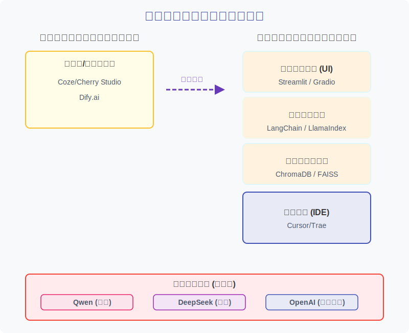
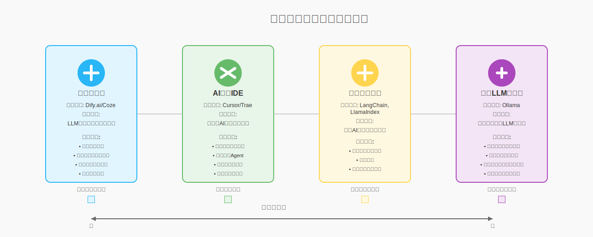

# 个人知识库智能体项目：开发工具链堆栈评估

本文档旨在评估和阐述《AI思维与创造力》课程中，“个人知识库智能体”案例项目所需的核心AI工具与技术栈。

*图：课程开发工具链堆栈示意图*

## 一、 核心选型原则

本课程在为“个人知识库智能体”项目选择核心技术栈时，遵循两大基本原则，旨在确保学习体验的开放性、前沿性与自主性：

1. **优先采用开源方案**

核心工具链将优先选择全球范围内广泛认可的开源项目。这不仅能降低学员的学习成本，更重要的是，它能让学员深入探索技术内部的工作原理，并具备根据自身需求进行修改和扩展的能力，真正践行“学习者主权”的理念。

2. **兼顾国内全球知名项目**

在开源的基础上，特别关注并引入由国内科技公司发起并具有全球影响力的开源项目。这能帮助学员紧跟国内技术生态的发展脉搏，并掌握在国际舞台上同样具备竞争力的技术栈。

## 二、 开发环境与学习路径分层评估

本课程采纳“由易到难”的渐进式学习路径，将开发环境与实践过程分为两个阶段，以实现快速上手与深度理解的有机结合。

| **学习阶段** | **推荐工具** | **阶段目标与评估** |
|---|---|---|
|第一阶段：概念构建与快速原型|Coze/Dify.ai/Cherry Studio等低代码平台|目标：无需代码，通过可视化的拖拽和配置，快速搭建一个可用的RAG应用。让学员直观地理解一个智能体由哪些部分组成（LLM、知识库、提示词、工作流），建立对系统的宏观认知。 评估： 这类平台的高度封装性，让学员可以聚焦于“做什么”和“为什么”，而非“怎么做”。这非常适合课程初期，能快速建立成就感和学习兴趣。但其“黑箱”特性也意味着，此阶段的重点是建立心智模型，而非掌握技术细节。|
|第二阶段：原理深潜与工程实践|Cursor/Trae等AI原生IDE|目标： 在理解了概念之后，利用AI原生IDE的辅助能力，高效地亲手用代码实现Agent的核心逻辑。学员将使用LangChain、ChromaDB等开源工具，深入理解数据处理、向量化、检索和链式调用的每一个细节。 评估： 这是构建“认知操作系统”的核心阶段。AI原生IDE作为“效率倍增器”，可以帮助学员更快地理解和编写代码，将更多精力聚焦于应用逻辑和系统设计上。重点是利用AI辅助来深化理解，而非简单地“外包思考”。|

## 三、 本地核心工具链

基于上述原则，我们推荐一套完全由顶级开源项目组成的本地工具链。这套工具链主要应用于学习的第二阶段（原理深潜与工程实践），以覆盖从数据处理、向量化、检索到交互的完整流程。

| **功能分类** | **推荐工具** | **评估与说明** |
|---|---|--- |
|应用编排框架|LangChain / LlamaIndex|原则评估： 两者均为全球领先的开源LLM应用框架，是开源优先原则下的首选。 为何选择： 它们将RAG的复杂流程封装为标准化的组件和链条，让开发者能聚焦于业务逻辑而非底层实现。LangChain功能更全面，社区庞大；LlamaIndex则更专注于RAG场景。课程将以LangChain为主，因为它更通用，有助于学员理解构建Agent的普遍范式。|
|向量存储与检索|ChromaDB / FAISS|原则评估： 两者均为优秀的开源项目，符合选型原则。 为何选择： 对于个人项目和原型验证，ChromaDB作为一个“开箱即用”的开源向量库，能直接在本地以文件形式存储数据，非常适合快速启动。FAISS是Facebook AI推出的顶级开源搜索库，其内存索引的性能极高，适合处理中小型数据集的快速检索任务。|
|前端交互界面|Streamlit / Gradio|原则评估： 作为Python生态中最受欢迎的开源UI框架，它们完美符合选型原则。 为何选择： 它们都允许开发者仅用几十行Python代码就构建出一个功能完善的UI界面，无需前端知识，非常适合本课程的MVP（最小可行产品）构建阶段。|

## 四、 关键工具类型适用场景对比

*图：关键工具类型适用场景示意图*

为了帮助学员在合适的场景选择合适的工具，下表对不同抽象层次的关键工具类型进行了横向对比。

| **工具类型** | **代表工具** | **核心定位** | **适用场景** |
|---|---|---|---|
|低代码平台|Dify.ai/Coze|LLM应用开发与运营平台 (PaaS)|快速验证想法：当你有一个清晰的应用想法，希望在几小时或几天内搭建出原型并让真实用户测试时。简化运营：需要一个后台来管理知识库、查看用户对话、标注数据以持续优化应用时。|
|AI原生IDE|Cursor/Trae|一站式AI应用开发与调试环境|提升专业开发效率：当你已经开始用代码（如LangChain）构建应用，希望能更高效地编写、重构和理解代码时。调试复杂Agent：当你构建的Agent包含多步逻辑链和工具调用，需要一个可视化环境来审视和优化其决策路径时。|
|应用编排框架|LangChain, LlamaIndex|开源的AI应用开发代码库|追求灵活性与深度定制：当标准平台无法满足你独特的业务逻辑，需要完全控制应用的每一个环节时。系统集成：需要将AI能力作为“发动机”深度嵌入到现有软件或复杂工作流中时。|
|本地LLM运行器|Ollama|本地运行开源LLM的工具|数据隐私与离线运行：当处理敏感数据，不希望上传到云端，或需要在无网络环境下运行AI应用时。自由、低成本的模型实验：希望无限制地、免费地测试和切换各种最新的开源大模型，为上层应用寻找最佳“大脑”时。|

## 五、 模型社区与托管平台对比

大语言模型本身需要一个“家”，这个“家”就是模型社区与托管平台。它们是开发者发现、下载、分享和讨论模型的核心枢纽。

| **对比维度** | **Hugging Face** | **ModelScope (魔搭社区)** |
|---|---|---|
|核心定位|AI领域的GitHub，全球最大、最活跃的AI模型、数据集和应用社区。|国内领先的AI模型与数据集社区，由阿里巴巴达摩院发起，背靠阿里生态。|
|生态与社区|全球化：拥有来自全球的开发者和研究者，社区讨论和资源以英文为主，覆盖面极广。|本土化：更聚焦于服务中文开发者，拥有活跃的中文社区和文档，对国内用户更友好。|
|模型与数据集|海量、全面：几乎涵盖了所有公开的AI模型和数据集，是寻找各种新奇、小众模型的首选之地。|精选、中文优化：重点收录和推荐对中文优化、在国内有影响力的模型，尤其在阿里系模型（如Qwen）的发布上拥有首发优势。|
|工具链集成|行业标准：其transformers, diffusers, datasets等库已成为事实上的行业标准，与PyTorch, TensorFlow等框架无缝集成。|兼容并蓄：拥有自家的modelscope库，方便一键调用平台上的模型。同时，其模型也大多兼容transformers库，可以融入Hugging Face生态。|
|在本课程中的角色|学习全球最佳实践：通过Hugging Face学习和使用国际上最流行的模型和工具库，与全球AI发展保持同步。|深耕中文应用场景：通过ModelScope寻找和使用最适合中文环境的模型（如Qwen），并利用其丰富的中文数据集进行微调等进阶实践。|

## 六、 三大主流LLM接入方案

在LLM的选择上，我们结合“开源优先”和“兼顾国内”的原则，同时引入行业标杆作为参照。这些LLM可以在上述两个学习阶段中灵活接入。

1. **Qwen (阿里通义千问)**

Qwen既是国内顶尖的开源大模型，也在全球范围内拥有广泛影响力，是实践中文原生AI应用的首选。对中文的理解和生成能力非常出色，尤其在处理中国文化、历史、社会相关问题时具有优势。

接入方式支持API调用（通过阿里云灵积平台DashScope）和本地部署（拥有从1.8B到72B的多种开源模型尺寸）。其模型通常在ModelScope和Hugging Face上同步发布。

Embedding模型推荐使用通义千问自家的开源文本向量模型，以确保语义空间的一致性。

2. **DeepSeek**

DeepSeek以强大的代码和逻辑能力在全球开源社区中独树一帜，是体验技术特色、探索特定应用场景的绝佳选择。以代码能力和逻辑推理能力著称，其通用对话模型在中文综合能力上也表现优异。

接入方式支持API调用和本地部署。其开源模型主要在Hugging Face上发布。Embedding模型同样建议使用DeepSeek官方提供的Embedding模型，以获得最佳的配套效果。

3. **OpenAI (GPT系列) - 作为性能基准**

在课程中引入OpenAI的核心目的是作为性能基准，帮助学员理解当前技术的最前沿水平，建立能力参照系。接入方式通过官方的 openai Python库进行API调用。

## 七、 总结：构建你的AI开发工具箱

本课程的技术栈选择旨在为学员构建一个层次化、可进化的AI开发工具箱，而非一份僵化的“必学清单”。

我们从低代码平台（如Dify.ai）入手，让学员快速建立宏观认知和成就感；随后转向以AI原生IDE（如Cursor）为核心的专业开发环境，深入到底层开源框架（如LangChain）和模型（如Qwen, DeepSeek）的工程实践中。这条“由易到难”的路径确保了学习曲线的平滑。

技术栈以开源为基石，鼓励学员探索和贡献。同时，通过引入Hugging Face和ModelScope两大模型社区，以及Ollama这样的本地运行工具，学员将学会如何在广阔的AI生态中发现、评估并使用最合适的模型资源。

我们不推崇任何单一工具的“最优论”。相反，我们强调场景驱动的工具选择能力。是快速验证想法，还是深度定制开发？是追求极致性能，还是保障数据隐私？在课程结束后，学员应能根据具体目标，自信地从这个工具箱中挑选出最合适的组合，这正是构建“认知操作系统”的最终体现。
