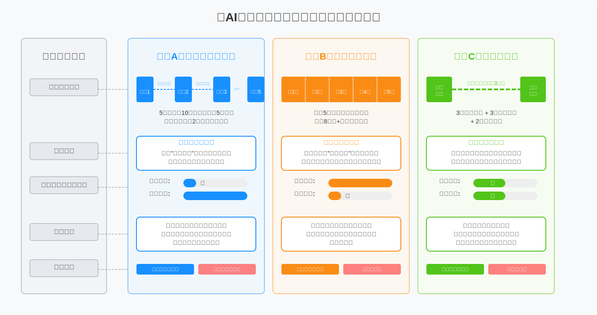
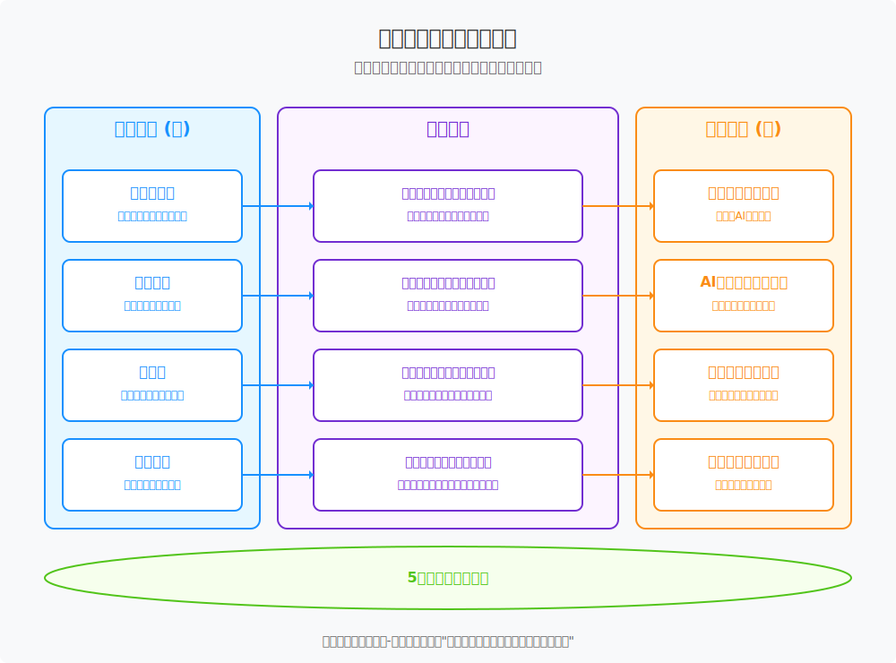

# 《AI思维与创造力第一课》教学方案

## 一、教学方案概述

在技术知识半衰期急剧缩短的AI时代，任何具体的技能教学都注定会迅速过时 。本课程设计的出发点并非“教什么”，而是回归教育的本质——“为何学”与“如何学”。我们致力于为每一位学习者构建一套可迁移、可进化的“认知操作系统”（Cognitive Operating System），这套系统旨在取代易逝的“技能清单”，赋予学习者在不确定性世界中持续学习、深度觉察、敏捷创造的核心心智模式 。我们相信，真正的教育投资，是投资于那些当所有工具都被遗忘后，依然能支撑我们独立思考和创造的“认知骨骼” 。为此，我们将整个学习过程设计为一场沉浸式的“认知健身”，学员将体验到的不是被动听讲的“教室”，而是一个鼓励实践、教练陪练、同伴共创的“健身房” 。

因此，我们的设计根植于两大核心学习科学原理。首先是**间隔效应**（Spacing Effect），大量研究证实，将学习内容分散在多个时间段内（分布式学习），比在一次性集中学习（集中练习或“填鸭式”）能带来更显著的长期记忆效果 。其次是“认知负荷理论”（Cognitive Load Theory），该理论指出，人的工作记忆容量有限，当信息过于密集或复杂时，学习效率会急剧下降 。

## 二、教学场景的设计

基于学习科学原理，设计了三种独立的认知升级路径，以满足不同学习者的目标与场景：


*图1：不同认知路径的教学场景比较*

1. **方案A （分布式学习旅程）** 充分利用“间隔效应”，通过拉长学习周期，在每次学习之间留出充足的消化、反思和实践时间，旨在实现最深刻、最持久的思维模式转变。

2. **方案B （高强度训练营）** 则是一种“集中练习”模式，它刻意将认知负荷推向极限，适合那些目标明确、希望在最短时间内快速掌握核心技能并立即投身实践的学习者，例如职业转换者。

3. **方案C （混合式冲刺）** 则是对二者的平衡，它通过初期的沉浸式体验快速建立学习动能，再结合线上的分布式项目实践，兼顾了效Flavell, J. H. (1979). Metacognition and cognitive monitoring: A new area of cognitive-developmental inquiry. American Psychologist, 34(10), 906–911.率与深度。

因此，选择哪种方案，取决于您的核心目标：是追求思维模式的根本重塑，还是高效的技能部署，亦或是二者之间的平衡。

| 特征维度 | 方案A：分布式学习旅程 | 方案B：高强度训练营 (Bootcamp) | 方案C：混合式冲刺 |
| :--- | :--- | :--- | :--- |
| **模型结构** | 5个周末（或5周），每周一个为期2天的深度工作坊 | 连续5天全日制沉浸式学习 | 3天线下开营 + 3周线上项目 + 2天线下闭营 |
| **核心理念** | 深度内化与转化：利用“间隔效应”效应，最大化长期知识留存与思维模式的根本转变。 | 快速部署与应用：通过高强度“集中练习”模式，在最短时间内完成核心技能的密集输入与项目产出。 | 动能激发与实践：结合沉浸式体验的破冰效果与线上周期的实践灵活性，在团队协作与项目交付间取得平衡。 |
| **认知负荷** | **低**：内容分块交付，学习者有充足的周中时间进行消化、反思和实践，有效管理认知负荷。 | **极高**：信息密度极大，对学习者的专注力和承压能力要求很高，优先保障技能掌握，反思时间被压缩。 | **中**：开营阶段负荷较高，但后续线上阶段提供缓冲，允许学习者按自身节奏整合。 |
| **反思深度** | **深**：周中的间隔为“学习日志”和“证据组合包”的深度反思提供了必要的时间发酵，能更好地联结理论与实践。 | **浅**：反思被整合进快速的复盘环节，更侧重于对当日任务的战术性总结，而非深层认知框架的重构。 | **中**：有结构化的反思环节，但深度可能受项目冲刺节奏的影响。 |
| **适用人群** | 寻求根本性思维模式升级的个人与组织；希望将学习与实际工作深度结合的在职专业人士；重视长期价值与可持续成长的学习者。 | 企业内部技能强化、项目启动前团队集训；时间高度受限但需快速掌握AI核心应用方法的团队；职业转换者进行初步探索。 | 企业内部创新团队孵化；需要快速建立团队共识并立即投入项目实践的场景；希望兼顾沉浸感与工作安排的学习者。 |
| **核心优势** | 真正践行“构建认知骨骼”的哲学，学习效果最持久，最能实现“价值留存”。 | 周期极短（一个工作周），见效快，能迅速提升团队在AI应用层面的战斗力，并快速交付项目原型。 | 兼具破冰效率与实践灵活性，项目成果更扎实。 |
| **潜在风险** | 战线较长，需要学习者在5周内保持持续的投入和纪律性。 | 知识“内化”程度最低，技能遗忘率可能较高，与课程“反速成”的初衷存在一定张力。 | 线上阶段需有强大的自驱力和良好的项目管理，以防动力衰减。 |

*表1：三种教学场景方案的比较*

## 三、教学大纲说明

### 3.1 方案A：分布式学习旅程 (5周模型)

#### 3.1.1 课程定位

“分布式学习旅程”方案专为寻求思维模式根本性变革的学习者设计。它充分利用学习科学中的“间隔效应”原理，通过5个周末（共10天）的深度沉浸式工作坊，并配合周间自驱式学习，旨在构建一个真正持久、可进化的“认知操作系统”。整个学习周期精心设计为5周，确保每次深度学习之间都有充足的时间进行消化、反思和在真实世界中的应用，从而实现最深刻、最持久的思维模式转变，而非短暂的技能获取 。  

本方案强调理论与实践的紧密结合，学员不仅将掌握系统思维、创造力方法与元学习等核心心智模型，还将深入AI技术的核心，学习Python编程、高级提示工程、模型微调（LoRA）理论、注意力机制实现，并掌握使用Streamlit/Gradio、Pandas/Matplotlib等工具快速构建和评估AI应用的能力。

本课程适合的学习对象：

- 追求思维模式根本转变的学习者
- 能够投入5周时间的长期学习者
- 期望将AI技术与创造思维结合的实践者
- 重视社群学习与反馈的参与者

#### 3.1.2 学习的基本要求

为确保您能从本课程中获得最大价值，我们建议您具备以下基础：

- 编程基础：具备基础的Python编程知识，理解变量、数据类型、循环、函数等基本概念 。无需成为专家，但应能编写和理解简单的脚本。  
- 工具与环境：拥有一台能够运行现代开发工具的计算机（建议16GB内存），安装和配置Jupyter Lab、Git和Python虚拟环境 。  
- 思维开放性：对探索新的思维模式充满好奇，愿意挑战自己的固有假设，并乐于通过深度反思来审视自己的学习过程 。

#### 3.1.3 学习的目标

完成本课程后，学员门将掌握的知识和具备的能力：

| 能力分类 | 学习目标 |
| :--- | :--- |
| **系统思维与问题定义能力** | **拆解AI系统：** 系统性地解构任何一个AI应用，绘制其“数据-模型-决策”的因果关系图，洞察其能力边界与潜在风险。<br>**定义核心问题：** 熟练运用MECE原则、JTBD框架，从复杂、模糊的场景中精准定义出值得解决的核心用户问题。 |
| **AI赋能的创造力** | **机会重构：** 运用“我们如何才能”（HMW）等方法，将用户痛点转化为富有潜力的创新机会点。<br>**高级人机对话：** 掌握递归式自我完善、多视角模拟等高级提示工程技术，并能通过Python脚本实现自动化，将AI的潜力发挥到极致。 |
| **全栈AI应用开发能力** | **核心理论理解：** 不仅知道如何使用AI，更能向他人清晰解释自注意力机制（Self-Attention）和LoRA微调等核心技术的运作原理。<br>**代码实现：** 能够使用Python和NumPy从零开始编写一个简化的自注意力机制，将理论知识转化为代码实践。<br>**快速原型构建：** 能够使用Streamlit或Gradio，快速将一个AI模型或想法，构建成一个可交互的Web应用原型，用于验证和展示。<br>**数据分析与可视化：** 能够使用Pandas和Matplotlib对AI应用的输出或相关数据进行分析和可视化，以评估效果和洞察趋势。 |
| **元学习与自我进化能力** | **结构化反思：** 熟练运用吉布斯反思循环等工具，对自己的学习过程进行深度复盘，将经验转化为可迁移的洞见。<br>**成长叙事：** 能够构建并展示一份有说服力的“证据组合包”，清晰地论证和展示自己在认知与能力上的成长轨迹。 |

*表2：学习目标概览*

**课程最终产出**：

- 一份深度内化的个人“证据组合包”，通过策展和叙事，生动展示5周学习旅程中的思考演进与能力成长，其中包含代码片段、项目链接等技术证据 。  
- 一个经过数周打磨、可在线演示的最终个人AI项目，综合体现系统思维、创造力方法、Python编程和AI应用开发能力。
- 一份个人化的认知操作系统1.0版蓝图与未来迭代计划，作为持续学习的起点。

#### 3.1.4 教学安排总览


*图2：分布式教学场景总揽*

| 周次 | 周末工作坊 (2天) | 周间任务（自驱学习） |
| :--- | :--- | :--- |
| **第一周** | **解构与奠基** <br> Day 1-2: 破旧立新与第一性原理、学习者主权的开启 | **反思与应用：**<br>将结构化思维应用于真实问题，完成AI开发环境搭建，启动元认知日志。 |
| **第二周** | **洞察与重构** <br> Day 3-4: 系统洞察的艺术、从问题到机遇 | **反思与应用：**<br>深化用户洞察，将挑战转化为AI产品的创新机会点。 |
| **第三周** | **人机共创与直觉AI** <br> Day 5-6: 机器的语言、让抽象变得可触 | **反思与应用：**<br>掌握高级人机对话的Python实现，并探索AI解决方案。 |
| **第四周** | **原型与评估** <br> Day 7-8: 创造的节奏与叙事、策展你的成长 | **项目冲刺与成长策展：**<br>将想法转化为可交互的AI应用原型，并开始梳理个人成长证据。 |
| **第五周** | **综合与新起点** <br> Day 9-10: 个人项目展示与质询、元认知叙事与展望 | **最终产出完善与提交：**<br>完成并展示最终AI项目与“证据组合包”。 |

*表3：教学安排概览*

#### 3.1.5 课程大纲

本课程大纲将以分布式的学习节奏，引领学员踏上一场重塑思维、驾驭AI的深度旅程，完成一次从理论内化到实践创造的完整学习闭环。

```
📁 AI思维与创造力第一课（分布式学习旅程）/
├── 📁 模块一：解构与奠基/
│   ├── 📄 1.1 课程理念与心智模式重塑
│   │   ├── “认知操作系统”核心理念导入
│   │   └── “恐惧云”与“期望墙”：重塑学习契约
│   ├── 📄 1.2 系统思维与结构化分析
│   │   ├── MECE原则入门与应用
│   │   ├── 具身认知实践：人类MECE树
│   │   └── AI产品解构：绘制“数据-模型-决策”因果图
│   ├── 📄 1.3 元学习与学习者主权
│   │   ├── “学习日志”与吉布斯反思循环工作坊
│   │   └── GitCode实践：建立个人学习版本库
│   └── 📄 1.4 AI技术基础与环境搭建
│       ├── Python核心语法与虚拟环境（venv）配置
│       └── 开发工具链：Jupyter Lab与Git入门
├── 📁 模块二：洞察与重构/
│   ├── 📄 2.1 深度用户洞察
│   │   ├── “待办任务”（JTBD）框架深度解析
│   │   └── 深度倾听与U型理论实践
│   ├── 📄 2.2 批判性思维与认知冲突
│   │   └── 结构化辩论：“JTBD是否被高估了？”
│   └── 📄 2.3 创新机会发现
│       ├── “我们如何才能”（HMW）工作坊：将问题转化为机会
│       └── 发散性思维练习：“坏主意”头脑风暴
├── 📁 模块三：人机共创与直觉AI/
│   ├── 📄 3.1 高级提示工程与API实践
│   │   ├── 高级提示技术：递归式自我完善、多视角模拟、思维链
│   │   └── Code Lab：通过Python调用LLM API实现自动化提示链
│   ├── 📄 3.2 AI核心技术内化：注意力机制
│   │   ├── 具身认知游戏：“威尼斯假面舞会”
│   │   └── Code Lab：用Python和NumPy从零实现简化版自注意力机制
│   └── 📄 3.3 AI核心技术内化：模型微调
│       ├── 理论入门：参数高效微调（PEFT）与LoRA原理
│       └── 实践体验：使用预微调模型完成特定创作任务
├── 📁 模块四：原型构建与价值验证/
│   ├── 📄 4.1 敏捷学习与创造节奏
│   │   ├── 敏捷学习冲刺方法论
│   │   └── “学习点数”估算：将焦点从“执行”转向“学习价值”
│   ├── 📄 4.2 AI应用快速原型开发
│   │   ├── 叙事性思维：最小可行故事原型（MVSP）工作坊
│   │   └── Code Lab：快速构建AI Web应用
│   └── 📄 4.3 数据分析与成长策展
│       ├── 工具入门：使用Pandas和Matplotlib进行数据分析与可视化
│       └── “证据组合包”深度工作坊：学习成长叙事与策展
└── 📁 模块五：综合应用与持续进化/
    ├── 📄 5.1 最终项目展示与质询
    │   ├── 个人AI应用项目Demo展示
    │   └── 同行深度评审与公开质询
    ├── 📄 5.2 元认知叙事与成长自证
    │   ├── “证据组合包”最终叙事与展示
    │   └── 多重思维镜片下的元认知自评
    └── 📄 5.3 “认知操作系统1.0”发布与未来规划
        ├── 个人未来学习路径规划
        └── 社区与持续学习机制建立
```

#### 3.1.6 评估与度量框架

评估的唯一目的是服务于学习，核心是“学习者自证成长”，贯穿整个学习过程，强调实践与反思。

| 评估类型 | 总权重 | 评估细项 | 评估内容与分项权重 |
| :--- | :--- | :--- | :--- |
| **形成性评估** | **60%** | 思维日志 | 全程记录认知发展与反思，评估元认知深度。(20%) |
| | | 周间实践应用 | 评估将课堂学习应用到实际场景的能力（如MECE分析、HMW生成、Python代码作业等）。(20%) |
| | | GitCode活跃度 | 评估学习路径的版本控制、代码提交质量与个人化改造。(10%) |
| | | 参与度与协作 | 评估课堂讨论深度、同伴反馈质量与集体活动贡献。(10%) |
| **总结性评估** | **40%** | 最终个人项目 | 评估问题定义的清晰度、解决方案的创新性、技术实现的完整性与展示答辩表现。(25%) |
| | | 证据组合包 | 评估成长证据的完整性、元认知反思的深度以及成长叙事的说服力。(15%) |

*表4：课程评度量框架*

#### 3.1.7 课程框架总结

本课程的各个组成部分并非孤立存在，而是通过精心的设计，形成了一个相互关联、彼此增强的有机整体。核心理论是技术实践的“灵魂”和“导航”，而技术路径则是理论思想的“骨架”和“载体”。

**1. 核心概念与方法论**

- **第一性原理 （First Principles Thinking）**[1]：一种穿透问题表象、回归事物本质，从最基础的公理、假设出发进行推导的根本性思考方法。该思想源于古希腊哲学家亚里士多德，是其物理学和形而上学探究中的核心。在课程中，它将被应用于复杂问题的深度分析、颠覆式创新构想以及技术瓶颈的突破。学习者将通过“分解问题、质疑所有假设、重构解决方案”等方法进行训练，并借鉴特斯拉在电池技术、SpaceX在火箭成本控制等经典案例进行启发。
- **MECE 原则 （Mutually Exclusive, Collectively Exhaustive）**[2]：一种确保思考“相互独立、完全穷尽”的结构化分析工具，常用于将复杂问题分解为清晰、独立且无遗漏的子部分。由时任麦肯锡顾问的芭芭拉·明托 (Barbara Minto) 在其著作《金字塔原理》中系统性地提出并推广。在课程中，它将被广泛应用于问题分析、方案设计和知识体系的搭建。学习者将通过练习使用树状结构、矩阵框架和清单列表等技巧来掌握这种结构化思维方法。
- **系统思维 （Systems Thinking）[3]：一种关注整体、元素间相互关系和动态演化过程的全局性思维模式，强调从系统的角度理解复杂现象。奥地利生物学家路德维希·冯·贝塔朗菲 (Ludwig von Bertalanffy) 为系统思维奠定了理论基础。为了应对复杂世界的挑战，课程将引入多种系统思维工具。因果循环图用于揭示系统中各元素间相互影响的反馈关系；杠杆点分析帮助识别能“四两拨千斤”的关键干预点；冰山模型引导我们从表面事件深入探究其背后的模式、结构与心智模式；库存与流量则是理解系统动态变化的基础模型。
- **JTBD 框架 （Jobs to be Done）**[4]：即“工作待完成”理论，一种深挖用户真实需求与动机的创新框架，主张顾客“雇用”产品或服务来完成某项“任务”。该理论由哈佛商学院教授克莱顿·克里斯坦森 (Clayton Christensen) 等人普及和深化。在课程中，该框架将指导学习者在构思和开发个人AI项目时，超越表面功能，深入探究潜在用户的真实目标与场景，从而设计出更具价值和针对性的解决方案。
- **HMW 方法 （How Might We）**[5]：即“我们该如何……”句式，一种将挑战重构为开放性机遇的创新提问技术，广泛应用于设计思维等领域。该方法在IDEO等创新咨询公司得到广泛应用，其思想可追溯至商业顾问 Min Basadur 在宝洁公司的工作实践以及更早的创造力研究。在课程的创新构思和项目定义阶段，学习者将运用HMW方法来发散思维，将遇到的难题或观察到的痛点转化为一系列可探索的、积极的创新问题，从而拓宽解决方案的可能性，避免过早地陷入狭隘的思维定式。
- **元认知 （Metacognition）**[6]：对自我思考过程的“思考”，即对自身认知活动的觉察、监控和调节能力，是自主学习的核心。由美国发展心理学家约翰·弗拉维尔 (John H. Flavell) 于20世纪70年代首次提出并定义。本课程将通过引导学习者定期进行学习反思、撰写思考日志以及构建“证据组合包”等实践活动，系统性地训练其元认知能力。学习者将被鼓励主动规划学习策略、监控理解程度并调整学习方法，从而真正实现从“被动接收”到“主动建构”的转变，提升自主学习的效率与深度。
- **间隔效应 （Spacing Effect）**[6]：一项经典的记忆心理学发现，指学习内容在时间上分散进行（有间隔的复习）比集中进行能带来更好、更持久的记忆效果。由德国心理学家赫尔曼·艾宾浩斯 (Hermann Ebbinghaus) 在其关于记忆与遗忘的开创性研究中首次发现。本课程的整体架构——“周末沉浸式工作坊 + 周间自驱式任务”的循环模式，正是“间隔效应”的直接应用。通过在时间上将高强度的概念输入与低强度的个人实践和反思进行分离，我们为学习者创造了理想的记忆巩固与知识内化条件，确保学习成果不仅是短暂的，更是持久和可迁移的，最终构建起稳固的认知操作系统。

**2. 核心理论与技术能力进化的关系**

我们可以用一个简单的图谱来表示这种关系：


*图3：课程核心理论与技术能力进化的关系图*

| **核心理论 (道)** | **如何赋能 (How it Empowers)** | **技术能力 (术)** |
| :--- | :--- | :--- |
| **第一性原理** | 思考根本问题，设计创新交互 | `个人项目` 的价值定义<br>`个性化AI交互设计` |
| **系统思维** | 规划应用架构，洞察数据关联 | `AI应用开发` 的顶层设计<br>`数据驱动决策` 的全局观 |
| **元认知** | 诊断学习障碍，优化学习策略 | 贯穿所有技术节点的学习过程 |
| **间隔效应** | 保证知识的长期记忆与内化 | 整个技术能力阶梯的有效攀登 |

*表5：课程核心理论与技术能力进化的关系*

总而言之，核心理论为技术能力的提升提供了方向感、深度和可持续性，确保学习者不仅仅是一个“会用工具的工匠”，而是一个“知道为何而做、如何做得更好的创造者”。


*图4：AI思维与创造力第一课-雷达知识图谱*

## 理论参考文献

[1] Aristotle. (1998). Metaphysics (H. Lawson-Tancred, Trans.). Penguin Classics. (Original work published ca. 350 B.C.E.). <br>
[2] Minto, B. (2009). The pyramid principle: Logic in writing and thinking. Financial Times/Prentice Hall.  <br>
[3] Bertalanffy, L. von. (1968). General system theory: Foundations, development, applications. George Braziller.  <br>
[4] Christensen, C. M., Hall, T., Dillon, K., & Duncan, D. S. (2016). Competing against luck: The story of innovation and customer choice. Harper Business.  <br>
[5] Basadur, M. (2004). Leading others to think innovatively together: Creative leadership. The Leadership Quarterly, 15(1), 103–121.  <br>
[6] Flavell, J. H. (1979). Metacognition and cognitive monitoring: A new area of cognitive-developmental inquiry. American Psychologist, 34(10), 906–911.  <br>
[7] Ebbinghaus, H. (2013). Memory: A contribution to experimental psychology. Dover Publications. (Original work published 1885).  <br>

---
作者：野行僧郭晧|Gitconomy Research <br>
本作品采用CC-BY-NC-SA 4.0国际许可协议进行许可。详见 http://creativecommons.org/licenses/by-nc-sa/4.0/
