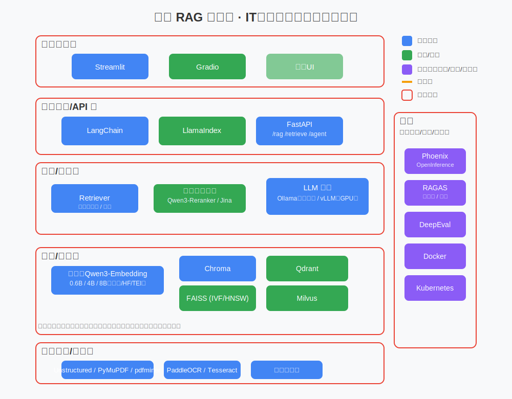
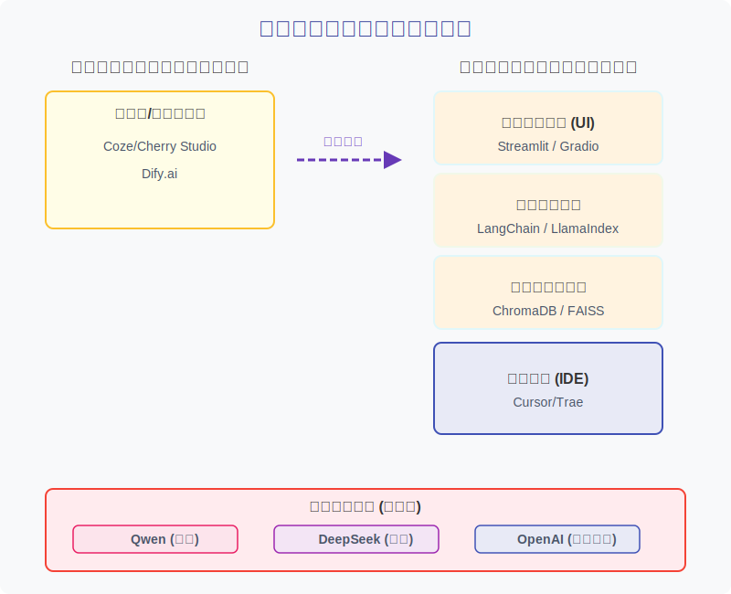
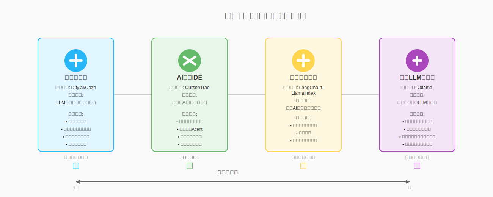

# 个人知识库智能体项目：课程工具链堆栈指南

本文档旨在评估和阐述《AI思维与创造力》课程中，“个人知识库智能体”案例项目所需的核心AI工具与技术栈。

*图：课程开发工具链堆栈示意图*

## 一、 核心选型原则

本课程在为“个人知识库智能体”项目选择核心技术栈时，遵循两大基本原则，旨在确保学习体验的开放性、前沿性与自主性：

1. **优先采用开源方案**

核心工具链将优先选择全球范围内广泛认可的开源项目。这不仅能降低学员的学习成本，更重要的是，它能让学员深入探索技术内部的工作原理，并具备根据自身需求进行修改和扩展的能力，真正践行“学习者主权”的理念。

2. **兼顾国内全球知名项目**

在开源的基础上，特别关注并引入由国内科技公司发起并具有全球影响力的开源项目。这能帮助学员紧跟国内技术生态的发展脉搏，并掌握在国际舞台上同样具备竞争力的技术栈。

## 二、 开发环境与学习路径分层评估

本课程采纳“由易到难”的渐进式学习路径，将开发环境与实践过程分为两个阶段，以实现快速上手与深度理解的有机结合。

*图：课程学习路径所使用的工具链*

| **学习阶段** | **推荐工具** | **阶段目标与评估** |
|---|---|---|
|第一阶段：概念构建与快速原型|Coze/Dify.ai/Cherry Studio等低代码平台|目标：无需代码，通过可视化的拖拽和配置，快速搭建一个可用的RAG应用。让学员直观地理解一个智能体由哪些部分组成（LLM、知识库、提示词、工作流），建立对系统的宏观认知。 评估： 这类平台的高度封装性，让学员可以聚焦于“做什么”和“为什么”，而非“怎么做”。这非常适合课程初期，能快速建立成就感和学习兴趣。但其“黑箱”特性也意味着，此阶段的重点是建立心智模型，而非掌握技术细节。|
|第二阶段：原理深潜与工程实践|Cursor/Trae等AI原生IDE|目标： 在理解了概念之后，利用AI原生IDE的辅助能力，高效地亲手用代码实现Agent的核心逻辑。学员将使用LangChain、ChromaDB等开源工具，深入理解数据处理、向量化、检索和链式调用的每一个细节。 评估： 这是构建“认知操作系统”的核心阶段。AI原生IDE作为“效率倍增器”，可以帮助学员更快地理解和编写代码，将更多精力聚焦于应用逻辑和系统设计上。重点是利用AI辅助来深化理解，而非简单地“外包思考”。|

## 三、 本地核心工具链

基于上述原则，我们推荐一套完全由顶级开源项目组成的本地工具链。这套工具链主要应用于学习的第二阶段（原理深潜与工程实践），以覆盖从数据处理、向量化、检索到交互的完整流程。

| 功能分类           | 推荐工具                                                              | 评估与说明                                                                                                                                                      |
| -------------- | ----------------------------------------------------------------- | ---------------------------------------------------------------------------------------------------------------------------------------------------------- |
| 应用编排框架         | **LangChain / LlamaIndex**                                        | 二者均成熟。LangChain 生态广、Agent/Tooling 丰富；LlamaIndex 专注文档索引/RAG。若教学强调“通用 Agent 范式”，以 LangChain 为主，辅以 LlamaIndex 的索引抽象更清晰。                                       |
| 模型运行（本地）       | **Ollama / vLLM**                                                 | Ollama 上手最省心（单机离线、模型管理简单）；vLLM 适合需要高吞吐/服务化部署（GPU）。课堂默认 Ollama，进阶项目引入 vLLM。                                                                                 |
| **嵌入模型**       | **Qwen3-Embedding（0.6B / 4B / 8B）**                               | 专用嵌入系列，支持多语与**可自定义维度 32–4096**，有轻量与高质量多档可选，课堂/CPU 推荐 0.6B，项目/GPU 可用 4B/8B。与 Qwen3-Reranker 搭配可显著提升检索质量。([Hugging Face][1], [Qwen][2], [GitHub][3])         |
| 向量存储与检索        | **Chroma / FAISS / Qdrant**                                       | Chroma：开箱即用、文件持久化，适合起步；FAISS：内存索引极快，适合中小规模与实验；Qdrant：完全开源、持久化+HNSW，兼顾易用与规模化。                                                                               |
| **重排（Rerank）** | **Qwen3-Reranker（0.6B / 4B / 8B）**                                | 与 Qwen3-Embedding 同族，面向排序任务优化，作为二阶段重排可稳定提升 Top-k 命中与答案支持度，适合课堂“一行式增强”。([Hugging Face][6])                                                                  |
|                | **Jina Reranker v2（多语）**                                          | 全开源、跨语言重排，性能/速度均衡；在不能用 Qwen3-Reranker 的环境下是稳妥替代。([jina.ai][7], [Hugging Face][8])                                                                          |
| 文档解析 & OCR     | **Unstructured / PyMuPDF / pdfminer.six / Tesseract / PaddleOCR** | 解析质量直接决定 RAG 上限。PDF→PyMuPDF，Office/网页→Unstructured，扫描件→Tesseract/PaddleOCR（中文更友好）。完全开源、离线可用。                                                               |
| 前端交互界面         | **Streamlit / Gradio**                                            | Python 友好、几十行即可出 UI。Streamlit 更适合“信息展示 + 控件”；Gradio 更像“模型演示台”。                                                                                             |
| 评测与可观测         | **RAGAS / DeepEval / OpenInference·Phoenix**                      | RAGAS：答案忠实度/支持度/召回等指标；DeepEval：面向 LLM 任务的单测；Phoenix（或 OpenInference）：请求/链路跟踪与可视化。课堂至少引入 RAGAS 做“可量化改进”。                                                    |
| 服务化与部署         | **FastAPI / Docker / uv/conda**                                   | FastAPI 替代内置 dev server；Docker 让作业可复现；建议用 `uv` 做 Python 依赖管理（更快更稳）。|                                                                              

学习者可根据具体项目需求和个人兴趣，在掌握核心工具链的基础上，逐步探索这些进阶工具。

## 四、 关键工具类型适用场景对比

*图：关键工具类型适用场景示意图*

为了帮助学员在合适的场景选择合适的工具，下表对不同抽象层次的关键工具类型进行了横向对比。

| **工具类型** | **代表工具** | **核心定位** | **适用场景** |
|---|---|---|---|
|低代码平台|Dify.ai/Coze|LLM应用开发与运营平台 (PaaS)|快速验证想法：当你有一个清晰的应用想法，希望在几小时或几天内搭建出原型并让真实用户测试时。简化运营：需要一个后台来管理知识库、查看用户对话、标注数据以持续优化应用时。|
|AI原生IDE|Cursor/Trae|一站式AI应用开发与调试环境|提升专业开发效率：当你已经开始用代码（如LangChain）构建应用，希望能更高效地编写、重构和理解代码时。调试复杂Agent：当你构建的Agent包含多步逻辑链和工具调用，需要一个可视化环境来审视和优化其决策路径时。|
|应用编排框架|LangChain, LlamaIndex|开源的AI应用开发代码库|追求灵活性与深度定制：当标准平台无法满足你独特的业务逻辑，需要完全控制应用的每一个环节时。系统集成：需要将AI能力作为“发动机”深度嵌入到现有软件或复杂工作流中时。|
|本地LLM运行器|Ollama|本地运行开源LLM的工具|数据隐私与离线运行：当处理敏感数据，不希望上传到云端，或需要在无网络环境下运行AI应用时。自由、低成本的模型实验：希望无限制地、免费地测试和切换各种最新的开源大模型，为上层应用寻找最佳“大脑”时。|本地RAG工具链 决策卡片

## 五、 模型社区与托管平台对比

大语言模型本身需要一个“家”，这个“家”就是模型社区与托管平台。它们是开发者发现、下载、分享和讨论模型的核心枢纽。

| **对比维度** | **Hugging Face** | **ModelScope (魔搭社区)** |
|---|---|---|
|核心定位|AI领域的GitHub，全球最大、最活跃的AI模型、数据集和应用社区。|国内领先的AI模型与数据集社区，由阿里巴巴达摩院发起，背靠阿里生态。|
|生态与社区|全球化：拥有来自全球的开发者和研究者，社区讨论和资源以英文为主，覆盖面极广。|本土化：更聚焦于服务中文开发者，拥有活跃的中文社区和文档，对国内用户更友好。|
|模型与数据集|海量、全面：几乎涵盖了所有公开的AI模型和数据集，是寻找各种新奇、小众模型的首选之地。|精选、中文优化：重点收录和推荐对中文优化、在国内有影响力的模型，尤其在阿里系模型（如Qwen）的发布上拥有首发优势。|
|工具链集成|行业标准：其transformers, diffusers, datasets等库已成为事实上的行业标准，与PyTorch, TensorFlow等框架无缝集成。|兼容并蓄：拥有自家的modelscope库，方便一键调用平台上的模型。同时，其模型也大多兼容transformers库，可以融入Hugging Face生态。|
|在本课程中的角色|学习全球最佳实践：通过Hugging Face学习和使用国际上最流行的模型和工具库，与全球AI发展保持同步。|深耕中文应用场景：通过ModelScope寻找和使用最适合中文环境的模型（如Qwen），并利用其丰富的中文数据集进行微调等进阶实践。|

## 六、 三大主流LLM接入方案

在LLM的选择上，我们结合“开源优先”和“兼顾国内”的原则，同时引入行业标杆作为参照。这些LLM可以在上述两个学习阶段中灵活接入。

1. **Qwen (阿里通义千问)**

Qwen既是国内顶尖的开源大模型，也在全球范围内拥有广泛影响力，是实践中文原生AI应用的首选。对中文的理解和生成能力非常出色，尤其在处理中国文化、历史、社会相关问题时具有优势。

接入方式支持API调用（通过阿里云灵积平台DashScope）和本地部署（拥有从1.8B到72B的多种开源模型尺寸）。其模型通常在ModelScope和Hugging Face上同步发布。

Embedding模型推荐使用通义千问自家的开源文本向量模型，以确保语义空间的一致性。

2. **DeepSeek**

DeepSeek以强大的代码和逻辑能力在全球开源社区中独树一帜，是体验技术特色、探索特定应用场景的绝佳选择。以代码能力和逻辑推理能力著称，其通用对话模型在中文综合能力上也表现优异。

接入方式支持API调用和本地部署。其开源模型主要在Hugging Face上发布。Embedding模型同样建议使用DeepSeek官方提供的Embedding模型，以获得最佳的配套效果。

3. **OpenAI (GPT系列) - 作为性能基准**

在课程中引入OpenAI的核心目的是作为性能基准，帮助学员理解当前技术的最前沿水平，建立能力参照系。接入方式通过官方的 openai Python库进行API调用。

## 七、 总结：构建你的AI开发工具箱

本课程的技术栈选择旨在为学员构建一个层次化、可进化的AI开发工具箱，而非一份僵化的“必学清单”：

*图：本地RAG工具链决策卡片*

1. 完全离线 & 最快起跑 → Ollama + LangChain + Chroma + Streamlit，适用于课堂实验、MVP、小型知识库、纯离线环境。

2. 速度优先 / 内存可控 → FAISS（IVF/HNSW）+ BGE-small，适用于中小规模库、CPU 或单卡 GPU 环境，要“更快的前台体验”：

3. 质量优先 → 加上 BGE-reranker；调大嵌入模型，适用于长文档、语义密集、Top-k 命中率低/答案支撑不足的场景。

4. 规模化 / 持久化 → Qdrant / Milvus，适用于≥ 百万向量、并发读写、要备份/多副本与观测。

5. 需要演示工程化 → vLLM + FastAPI + Phoenix + Docker，适用于路演/答辩/毕业设计，需要高吞吐、服务化与可观测。

---
本作品采用CC-BY-NC-SA 4.0国际许可协议进行许可, &copy; 2025 Gitconomy Research社区，保留所有权利。
