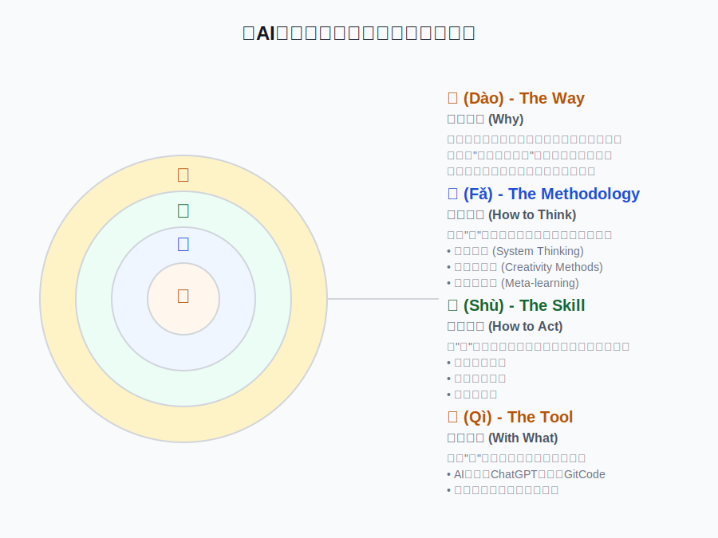

# 《AI思维与创造力第一课》课程设计指南——一份关于如何构建“人工智能认知”的蓝图

## 一、课程设计的核心哲学：“道、法、术、器”逻辑框架

在技术知识半衰期急剧缩短的AI时代，任何具体的技能教学都注定会迅速过时。因此，本课程设计的出发点并非“教什么”，而是回归教育的本质——“为何学”与“如何学”。我们的核心定位是“反速成”，致力于为学员构建一套可迁移、可进化的“认知操作系统”（Cognitive Operating System）。这套系统旨在取代易逝的“技能清单”，赋予学员在不确定性世界中持续学习、深度觉察、敏捷创造与负责任行动的核心心智模式。

为实现这一目标，整个设计过程贯穿着两大基本原则：

- **价值留存**：课程的成功，在于当所有具体案例（插件）都被遗忘后，其底层的认知框架（骨骼）依然能支撑学员独立生长。
- **自主学习能力**：学习的终极目标是让学习者成为自己认知发展的“首席架构师”，而课程的角色是提供最初的蓝图、脚手架和健身房。

为了系统性地构建这一“认知操作系统”，我们引入了“道、法、术、器”的层次化框架作为整个设计的顶层逻辑。它确保了课程的每一部分都服务于一个从抽象到具体、从内观到外用的完整体系。

| 层次 | 定义 | 在本课程中的体现 |
| :--- | :--- | :--- |
| **道 (Dào)** The Way | 为何如此 (Why) 事物的本质规律、底层哲学、世界观。 | 课程的核心哲学：构建一个能在不确定性世界中持续进化的“认知操作系统”，实现学习者主权。 |
| **法 (Fǎ)** The Methodology | 如何思考 (How to Think)  基于“道”建立的系统性方法论、思维框架。 | 三大核心能力维度（系统思维、创造力方法、元学习）与多重思维模型（U型理论、设计思维、敏捷等）的嵌套架构。 |
| **术 (Shù)** The Skill | 如何行动 (How to Act)  在“法”的指导下，可执行、可操作的具体技巧。 | 体验式教学设计：如认知冲突驱动、具身认知实践、微习惯固化等，以及人机协同的具体技巧（如提示工程）。 |
| **器 (Qì)**  The Tool | 用何实现 (With What)  实现“术”所依赖的具体工具、平台、软件。 | 教学与评估工具：如AI应用（DeepSeek、Qwen等）、GitCode、思维日志模板、证据组合包等。 |
