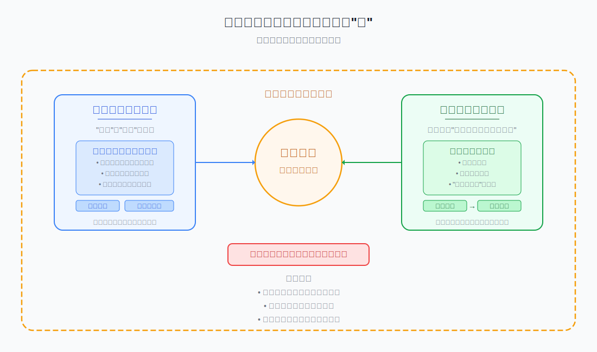
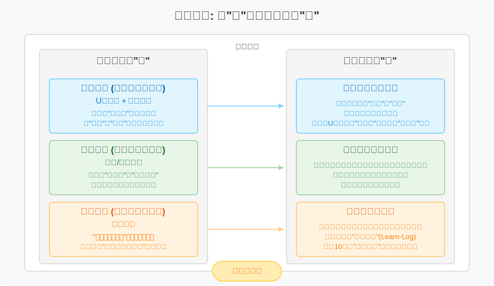
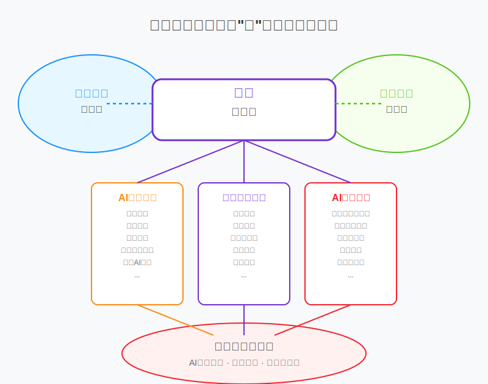
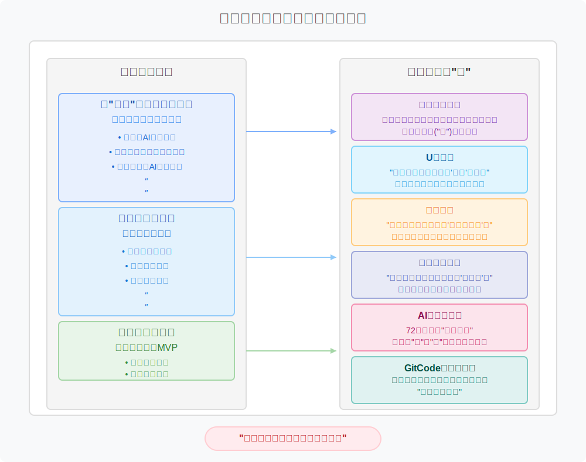

# 《AI思维与创造力第一课》课程设计指南

在技术知识半衰期急剧缩短的AI时代，任何具体的技能教学都注定会迅速过时。本课程设计的出发点并非”教什么”，而是回归教育的本质——“为何学”与”如何学”。我们致力于为学员构建一套可迁移、可进化的”认知操作系统”(Cognitive Operating System)，这套系统旨在取代易逝的”技能清单”，赋予学员在不确定性世界中持续学习、深度觉察、敏捷创造与负责任行动的核心心智模式 。

## 一、新教育学的时代需求：从专精到敏捷

我们正处在一个由工作与知识的本质发生结构性转变所定义的时代。传统的职业优势正从“专精”（Expertise）转向“敏捷”（Agility），知识的获取与应用模式也从“学习”（Learn）转向“精益”（Lean）。“教育-工作-退休”的线性人生路径正在瓦解，取而代之的是一个需要持续学习、迭代和自我调整的动态循环 。学者Heather McGowan所指出的知识半衰期急剧缩短的现象，进一步加剧了这一挑战，即今日所学可能在数年内迅速“归零”[1]。在这样一个谷歌、维基百科和AI内容生成无处不在的世界里，单纯记忆和重复知识的价值已然式微。
正是在此背景下，本课程的设计对传统教育模式提出了根本性质疑。传统教育的核心是“教什么”（What to Teach），其有效性在技术知识以前所未有的速度迭代的今天正迅速衰减 1。课程的核心出发点因此转向了教育的本质，即“为何学”（Why to Learn）与“如何学”（How to Learn）。它深刻认识到，真正的挑战不再是信息的获取，而是培养学习者筛选、整合、批判和应用这些信息的能力。

这种转变催生了一种作为刻意反叙事的课程定位。当前教育市场充斥着大量以“速成”为卖点的技能培训，承诺在短时间内让学习者掌握某项热门AI工具。这类课程迎合了即时的焦虑，但提供的却是脆弱且迅速贬值的技能。本课程明确采取“反速成”的定位，这不仅是对长远学习效率的考量，更是一种教育学上的批判 。它认为，快餐式的学习模式会强化一种被动的、消费主义的学习心态，这在根本上有害于个人长期发展。因此，课程的初始阶段必须被设计为一个“解构”与“重塑”的过程，其目的不仅是传授内容，更是从根本上重塑学习者对于“何为有价值的教育”的期望。例如，课程中设计的“恐惧云”活动，其本质并非简单的破冰环节，而是一次关键的介入，旨在将学习者的关注点从“我将学会什么工具？”转移到“我将成为怎样的思考者？” 。这是一种与学习者建立的新型社会契约，其基础是长期的心智成长，而非短期的技能收益。

## 二、课程设计的核心思想：“道、法、术、器”逻辑框架

为了系统性地构建这一“认知操作系统”，我们引入了“道、法、术、器”的层次化框架作为整个设计的顶层逻辑。它确保了课程的每一部分都服务于一个从抽象到具体、从内观到外用的完整体系。

*图1：课程设计的核心哲学理念框架*

| 层次 | 定义 | 在本课程中的体现 |
| :--- | :--- | :--- |
| **道 (Dào)** The Way | 为何如此 (Why) 事物的本质规律、底层哲学、世界观。 | 课程的核心哲学：构建一个能在不确定性世界中持续进化的“认知操作系统”，实现自主学习。 |
| **法 (Fǎ)** The Methodology | 如何思考 (How to Think)  基于“道”建立的系统性方法论、思维框架。 | 三大核心能力维度（系统思维、创造力方法、元学习）与多重思维模型（U型理论[2]、设计思维[3]、敏捷开发[4]等）的嵌套架构。 |
| **术 (Shù)** The Skill | 如何行动 (How to Act)  在“法”的指导下，可执行、可操作的具体技巧。 | 体验式教学设计：如认知冲突驱动、具身认知实践、微习惯固化等，以及人机协同的具体技巧（如提示工程）。 |
| **器 (Qì)**  The Tool | 用何实现 (With What)  实现“术”所依赖的具体工具、平台、软件。 | 教学与评估工具：如AI应用（DeepSeek、Qwen等）、GitCode、思维日志模板、证据组合包等。 |

### 2.1 构建认知操作系统——梳理AI学习之道

在技术快速迭代的AI时代，传统的技能教学模式已无法满足学习者的需求。任何具体的AI技术知识都有其有效期，但底层的认知框架却能持续支撑学习者的成长 。例如，神经网络的算法细节可能在几年内被新的模型替代，但理解”数据-模型-决策”三角关系的认知框架却能帮助学习者快速适应新的技术。构建人工智能时代的“认知操作系统”——这是本课程的“道”，是所有设计元素的源头与不变准则。

为了回应上述挑战，课程正式提出了其核心目标与隐喻：为学员构建一套“认知操作系统”（Cognitive Operating System）。这套系统被定义为“一套内化的、可迁移的心智模式、思维框架和学习策略”，是“易逝的技能清单”的对立面 。课程设计明确区分了不同层次的学习价值，将具体的工具和操作技巧（“器”与“术”）视为短期效用，而将底层的认知框架和核心哲学（“法”与“道”）视为能够支撑个人长远发展的持久资产 。

“认知操作系统”的核心在于其可迁移性。这意味着学员所学能够跨越不同的领域和情境，灵活应用于解决新问题。例如，课程中培养的系统思维能力，不仅可以帮助学员理解一个AI模型的内部结构，还可以应用于分析一个商业生态系统的复杂性；同样，课程中教授的创造力方法，不仅限于生成AI艺术作品，更可以应用于设计一个创新的商业模式 。这种设计确保了学员的投资回报是长期的、可持续的。当具体的AI工具被遗忘或淘汰后，其底层的认知框架依然能够支撑学员独立生长，适应未来的挑战。

为了确保“认知操作系统”的构建得以实现，整个课程设计贯穿着两大基本原则，它们共同构成了课程之“道” ：

**1. 原则一：价值留存**

这一原则通过一个强有力的比喻得以阐明：“骨骼”与“插件” 1。课程成功的衡量标准，并非学员在结课时掌握了多少具体的知识点或技能（插件），而在于当所有具体的案例、工具和练习都被遗忘后，其底层的认知框架（骨骼）是否依然能够支撑学员独立生长。这意味着课程的核心价值在于那些能够长期留存、具有高度可迁移性的心智模型和思维方法，这确保了课程内容的长期价值和抗过时性 。

**2. 原则二：自主学习**

这一原则将学习的终极目标定位为让学习者成为自己“认知发展的首席架构师” 1。在此原则下，课程的角色不再是知识的权威发布者，而是“认知健身房”的搭建者，为学习者提供最初的蓝图、必要的脚手架和充足的锻炼空间。它鼓励学习者从被动接收知识转变为主动建构知识，从而极大地激发了学习的内在动机，并培养了学员在未来独立面对未知挑战时所需要的自信和自主能力。

*图2：课程设计的指导原则*

这两大原则并非孤立存在，而是相互依存、互为因果的。若没有“自主学习”，学员只是被动接收知识，这些知识便无法内化为“骨骼”，从而无法实现“价值留存”。反之，若课程只传授易逝的“插件”而非具备“价值留存”的框架，学员将永远依赖于下一门课程来学习下一个工具，永远无法成为自己认知发展的“首席架构师”。这种激进的内在一致性意味着，整个教学结构的设计都在强制推动这种综合。例如，课程的评估体系“证据组合包”，正是这一关联的直接体现：学习者必须主动建构（自主学习）自己成长的叙事，并使用课程中习得的持久框架（留存）作为证据。因此，这两大原则并非一份清单，而是一个动态的、自我强化的系统，构成了课程设计的哲学内核。

### 2.2 逆向设计 —— 确立课程之“法”

课程设计彻底摒弃了从内容列表开始的传统方法，转而采用以终为始的“逆向计”（Backward Design）原则。这一原则将构成“认知操作系统”核心算法的系统性方法论与思维框架的课程之“道”转化为“法。它详细阐述了学习的“内容”，这些内容并非由知识点定义，而是由持久的能力所定义。

. Change by design: How design thinking transforms organizations and inspires innovation. HarperBusiness.考资料库/课程图表/AI-Thinking-Guide-03.svg)
*图3：课程逆向设计之法*

这种方法的核心是，在规划任何教学活动之前，首先明确学习的最终目标。设计团队从一个清晰的“北极星指标”出发，反复追问一个核心问题：“三年后，我希望学员能独立做什么？” 。这个问题的答案决定了教学的终极方向，并确保了课程的每一个环节，从教学内容到评估方式，都紧密围绕着一个具体的、可观测的长期成果展开，从而避免了教学活动的盲目性和碎片化。

| 北极星指标 (三年后行为) | 对应的核心能力之“法” | 能力描述 | 关键产出 （证据组合包） |
| :--- | :--- | :--- | :--- |
| 独立拆解能力 | 系统思维 (System Thinking) | 面对新AI工具，能在48小时内自行拆解其能力边界，设计最小可行性实验（MVE），理解组件间的相互作用、反馈回路与涌现现象。|  对比分析图（课程前后对同一AI工具的架构分析）。针对一个新工具的MVE设计文档。|
| 整合创造能力 | 创造力方法 (Creativity Methods) | 面对真实场景问题，能独立提出“人机共创”解决方案，并用“最小可行故事原型”说服利益相关者。 |  项目迭代记录（展示从问题到原型的演进过程）。最终“最小可行故事原型”的演示视频。|
| 持续进化能力 | 元学习能力 (Meta-learning) | 持续迭代和维护自己的“AI学习操作系统”，具备“学习如何学习”的能力。 | “思维日志”节选（展示元认知反思）。一份“个人化改装记录”（详述如何调整课程框架） |

 构成AI“认知操作系统”的三大支柱:

**1. 支柱一 - 系统思维：解构复杂性**

系统思维是构建“认知操作系统”的第一个核心能力维度，也是驾驭AI时代的基础技能。它旨在帮助学员超越对技术的“黑箱”式理解，深入其内部，理解其数据输入、算法逻辑、模型结构和输出形式之间的复杂关系 。这一能力的目标是让学员在面对任何新技术时，都能快速建立起系统性的认知，而不是停留在零散的、表面的功能了解上。

**2. 支柱二 - 创造力方法：设计人机共创**

在AI能够胜任越来越多重复性工作的背景下，人类的独特价值日益体现在创造性的问题解决上。本课程将创造力视为一种可以通过系统化方法培养和激发的“结构化流程”，而非神秘的天赋 。课程将引入设计思维等成熟方法论，并结合AI工具的特性，探索“人机共创”的新范式。其核心产出“最小可行故事原型”，不仅是一个技术演示，更是一个用于说服、传递核心价值并引发情感共鸣的工具 。

**3. 支柱三 - 元学习：自我进化的艺术**

元学习是第三个，也是实现“学习者主权”最关键的能力维度。它是指个体对自己学习过程的认知、监控和调节能力，即“学习如何学习” 1。在知识快速更迭的时代，具备高效学习能力比掌握任何具体知识都更为重要。课程将通过教授学习科学的基本原理、提供反思工具（如思维日志）和实践机会，帮助学员自Brown, T. (2009). Change by design: How design thinking transforms organizations and inspires innovation. HarperBusiness.主地设计和管理自己的认知成长路径，包括选择高质量的信息源、设计有效的学习实验、建立科学的复盘模板等，从而真正实现终身学习和持续进化 1。

### 2.3 体验引擎： 训练应用“法”的“术”

我们摒弃单向讲授的模式，将教学方法设计为一系列精心编排的“认知锻炼”，把教室变成一座“认知健身房”。这里的每一种锻炼，都是一种具体的“术”，其目的在于让学员通过亲身体验，将抽象的“法”内化为可应用的技能，避免了思维模型的简单堆砌 。

*图4：课程的体验引擎之术*

| 架构层面 | 核心之“法” (核心模型) | 角色与功能 | 关键实践案例 |
| :--- | :--- | :--- | :--- |
| **宏观脊梁**   (情感与认知节奏) | U型理论 + 设计思维 | 课程的“慢循环”和情感主线，引导学员经历从“唤醒”到“创造”的深度认知之旅。 | 第一幕“唤醒” = U型的“悬挂” + 设计思维的“同理”。 |
| **微观节拍**  (行为与习惯养成) | 敏捷/精益思维 | 课程的“快循环”和“肌肉记忆”，让学员在高频的反馈闭环中行动。 | 将估算“故事点”改为估算“学习点”，使敏捷框架服务于学习目标。 |
| **底层支撑**  (个性化与自主性) | 建构主义 | 为每个环节提供“可拆卸的脚手架”，鼓励学员发展出个性化的学习路径。 | 学员需提交“个人化改装记录”，以此作为建构主义理念的最终检验。 |

这种设计蓄意在“慢思考”与“快迭代”之间制造了一种富有成效的张力。复杂领域的创新既需要深刻的洞察力，也需要快速的验证。只关注“慢”会导致分析瘫痪，只关注“快”则容易高效地做出错误的东西。本课程的设计正视了这一两难困境，并迫使学习者同时驾驭这两种模式，将它们之间的摩擦转化为学习的动力。U型理论的“慢”旅程帮助定义有意义的“为何”与“何事”，而敏捷的“快”冲刺则在紧密的反馈循环中测试“如何做”。这个过程旨在培养一种“认知上的双元能力”（cognitive ambidexterity），即学员不仅学会使用不同的模型，更学会管理它们之间的内在张力。这是一种对领导力和创新至关重要的高阶执行功能。

整个教室被构想为一个“认知健身房”，学员在这里通过一系列精心编排的“认知锻炼”来训练自己的思维肌肉 1。这些具体的技巧（“术”）包括：

**1.  认知冲突驱动之术** ： 通过主动制造“矛盾”和“张力”，迫使学员进行二阶思考。例如，让学员在U型理论的“慢思考”与敏捷思维的“快迭代”之间来回切换，或通过“自动驾驶困境辩论”等活动，引发个人直觉与算法逻辑的正面碰撞 。
**2.  具身认知实践之术**： 将抽象的概念转化为可触摸、可感受的身体经验。例如，用乐高积木拼搭一个神经网络，或用即兴戏剧来表演算法偏见。这些活动让认知负荷在不同的感官通道间切换，从而获得更立体、更深刻的认知 。
**3.  微习惯固化之术**： 设计低成本的日常练习，让学习成果内化为本能。核心练习是坚持记录“思维日志”（Learn-Log）以训练元认知能力，以及通过“影子实验”（一个每日10分钟的微型任务）将新学的思维模型持续应用到日常生活中。
Brown, T. (2009). Change by design: How design thinking transforms organizations and inspires innovation. HarperBusiness.
### 2.4 评估体系 —— 以“器”为证，检验“法”与“术”的掌握

评估的唯一目的，是服务于学习。因此，我们彻底颠覆了传统的评分模式，采用一套“证据组合包”（Portfolio of Evidence）体系，将评估的权力中心从教师转移到学习者，核心是“学习者自证成长”。在这个体系中，各种评估工具（器）被用来证明学习者对方法论（法）和技巧（术）的掌握程度。

**1.  元认知自评”的机制**

这种评估体系首先强调成长轨迹的可视化。学员需要提交的不是一份完美的最终成果，而是一系列能证明自身成长的“证据”（器）。例如，一份展示了从课程初期到末期，对同一个AI产品拆解深度显著差异的对比图；或者三轮原型迭代的完整记录，清晰地呈现“问题→方案→反馈→调整”的思考闭环。

*图5：课程评估体系之器*

在此基础上，我们引入了“以‘思维镜片’进行元认知自评”的机制。结课时，学员需从课程所学的多个思维模型中，任选几个作为“反思镜片”（一种认知工具之“器”），用叙事的方式回答一系列深度问题，以此审视自己的思维转变。

| 思维镜片之“器” | 核心反思问题示例 | 评估目标 |
| :--- | :--- | :--- |
| U型镜片 | 在课程中，我是否经历了真正的‘放下’时刻？那一刻是如何发生的？证据是什么？” | 评估深度觉察与内在转变的能力 |
| 敏捷镜片 | 在项目中，我们团队扔掉了多少‘学习的浪费’？学习记录里最痛的教训是什么？ | 评估在实践中应用精益原则的能力 |
| 建构主义镜片 | “我如何改装了课程提供的‘脚手架’？这如何体现了我的个人学习路径和独立思考？” | 评估从依赖到自主的成长过程 |

最后，所有能力的检验都将汇集于一个标志性评估任务：“AI思维挑战赛”。这是一场72小时的团队“创意集市”，要求学员交付一个可体验的“最小可行故事原型”，并接受来自真实世界的公开质询。这是对所有“法”与“术”的终极综合检验。

**2. 生态化迭代机制**

一门关于AI的课程如果自身不能进化，就是对所授理念的最大讽刺。因此，我们视课程本身为一个待验证的MVP（最小可行产品），并为其注入一套生生不息的生态化迭代机制。在这个机制中，具体的工具（器）被用来承载和延续课程的终极哲学（道）。

我们将课程即版本库。通过采用GitCode这一具体的“器”，来实践课程的“道”。每个学员都会“Fork”一份官方课程库，这象征着他们获得了自己学习路径的完整主权。课程结束后，官方库会停止更新，但学员自己的“分支”可以永远进化下去，这本身就是对“学习永不毕业”这一核心“道”的深刻践行。

同时，我们以假设驱动迭代。课程的每一期都基于一个核心假设（例如：“多元背景的学员能在8周内构建起一套可迁移的认知系统”），并设立一个可量化的北极星指标（例如：“结课后3个月，若有 ≥30% 的学员仍在更新自己的GitHub学习库，则假设初步验证成功”）。这意味着课程大纲不是一份静态的PDF，而是一个包含README.md和CHANGELOG.md的开源项目，它会根据每一轮的反馈数据进行公开、透明的迭代。

## 三、课程目标体系：从表层到深层的能力培养

本课程的核心目标，并非仅仅让学员掌握AI工具的操作技巧，而是要促成一次**深度的认知进化**。我们的设计超越了传统的知识传授，旨在培养学员的**系统性思维、创造性实践和负责任的价值观**。这趟旅程分为三个递进的阶段，从理解AI的**本质**，到掌握**方法**，最终内化为个人的**价值**和信念。

*图6：课程从表层到深层能力培养的目标体系*

首先，在**认知维度**上，我们致力于让学员从表面功能走向深层原理。这不仅仅是学习术语或概念，更是培养一种**系统性理解力**。课程将引导学员洞察AI背后的“数据-模型-决策”三角关系，并能像拆解一件精密仪器一样，分析任何一个AI应用的运作逻辑。我们的目标是，当学员面对一个新工具时，他们能迅速穿透其光鲜的外表，识别其能力的边界，甚至能敏锐地察觉到其中的“技术幻觉”和潜在偏见。这种认知上的清醒，是驾驭AI时代的第一步。

其次，在**方法维度**上，我们将抽象的思维模型转化为可操作的**实践能力**。我们的课堂不是理论的堆砌，而是“认知健身房”，让学员通过实践来构建属于自己的“认知操作系统”。课程将教会他们运用**第一性原理**来拆解复杂问题，掌握**人机协同**的全新工作流，并将创造力视为一种可以通过**精益思维**迭代的结构化流程。最重要的是，学员将学会**元学习**——即“学习如何学习”。他们会自主设计学习实验，并能定期通过反思来调整自己的学习路径，从而真正成为自己认知发展的“首席架构师”，而非被动的知识消费者。

最后，也是最深刻的，是**价值维度**的塑造。在AI日益深入我们生活的今天，技术能力必须与**伦理判断力和社会责任感**并行。本课程的目标是让学员超越技术的利弊分析，形成自己的**核心价值观**。他们将学会保持一种**“创造性怀疑”**精神，既不盲目崇拜技术，也不全盘否定其潜力。通过课程中的情景剧和辩论等活动，他们将主动识别并分析AI应用带来的社会风险，并能将伦理考量融入到自己的方案设计中。最终，每个学员都能清晰地阐述自己在AI时代的长期愿景，并用行动证明，他们不仅是AI技术的运用者，更是这个技术时代的**负责任的创造者**。

以下这四个能力维度是上述三维目标体系在学员身上的具体可观测表现。它们是评估体系“证据组合包”的核心依据：

| **能力维度** | **可观测的表现** | **核心目标与关联** |
| :--- | :--- | :--- |
| **认知深度** | 学员能**绘制AI技术因果关系图**，清晰展示数据、模型、决策如何相互影响。能**识别技术幻觉与真实能力**，并在案例分析中准确指出AI的局限性。 | **认知维度：** 证明学员已从零散的知识点上升到对AI系统性本质的深刻理解。 |
| **思维弹性** | 在“如果AI没有算力”等**多角度问题重构任务**中，学员能展示快速假设、推演和迭代的能力。在人机共创项目中，能**灵活调整思路**，而非僵化地遵循最初的计划。 | **方法维度：** 证明学员已将**系统思维**和**创造力方法**内化为应对不确定性的敏捷思维习惯。 |
| **创造潜力** | 学员能**设计包含人类监督机制**的创新技术方案。能制作**可交互的低保真原型**，通过故事化叙事清晰地阐述其核心价值和用户体验。 | **方法维度：** 证明学员已掌握**人机共创**的结构化流程，并能将想法转化为可验证的原型，而非停留在概念层面。 |
| **伦理敏感度**| 在情景剧中，学员能**生动演绎技术对不同人群的影响**，并能**分析AI方案的社会风险**。在项目汇报中，能主动将伦理考量作为方案设计的关键部分进行呈现。 | **价值维度：** 证明学员已将**伦理判断力**内化为行动指南，能负责任地评估和应用技术，体现其成为“首席架构师”的责任感。 |

通过这个深化和完善后的目标体系，课程的每一项教学活动、每一个评估任务，都将有明确的上位目标和可观测的下位表现，从而形成一个逻辑严密、层层递进的完整教育闭环。

## 四、课程设计指南总结：构建面向未来的认知能力

《AI思维与创造力第一课》不是一门关于AI的技术课程，而是一门关于如何在AI时代思考的课程 。我们通过U型理论、建构主义、敏捷思维和设计思维等多重思维模型的整合，为学员构建一个可迁移、可进化的”认知操作系统”。

课程设计遵循一系列深思熟虑的原则，旨在超越传统的知识传授模式，构建一套可迁移、可进化的“认知操作系统” 。这些原则从顶层逻辑到具体实践，层层递进，确保了课程不仅教授具体的AI知识，更重要的是培养学员在不确定性世界中持续学习、深度觉察和敏捷创造的核心心智模式 。通过逆向设计确立核心能力，分层嵌套构建内在架构，体验设计训练实践技巧，并以证据组合包进行评估，最终形成一个能够自我迭代、生生不息的生态化学习体系 。

*图7：课程设计遵循的原则*

这个系统的核心价值在于：当所有具体案例（插件）都被遗忘后，其底层的认知框架（骨骼）依然能支撑学员独立生长。通过GitCode、思维日志和伦理影响矩阵等工具，学员能够将抽象的思维模型内化为可应用的技能，并在实践中不断迭代自己的认知系统。

最终，我们希望学员成为自己认知发展的”首席架构师” ，能够在不确定性世界中持续学习、深度觉察、敏捷创造与负责任行动。

## 参考文献

[1] McGowan, H. (2017). Preparing students to lose their jobs. Michigan Economic Development Corporation.
https://www.michiganbusiness.org/globalassets/documents/collaborative-development-council/preparing_students_to_lose_their_jobs.pdf  
[2] Scharmer, C. O. (2016). Theory U: Leading from the future as it emerges (2nd ed.). Berrett-Koehler Publishers.  
[3] Brown, T. (2009). Change by design: How design thinking transforms organizations and inspires innovation. HarperBusiness.  
[4] Schwaber, K., & Sutherland, J. (2020). The Scrum guide: The definitive guide to Scrum: The rules of the game (2nd ed.). Scrum.org.  

作者：野行僧郭晧|Gitconomy Research  
本作品采用CC-BY-NC-SA 4.0国际许可协议进行许可。详见 http://creativecommons.org/licenses/by-nc-sa/4.0/
