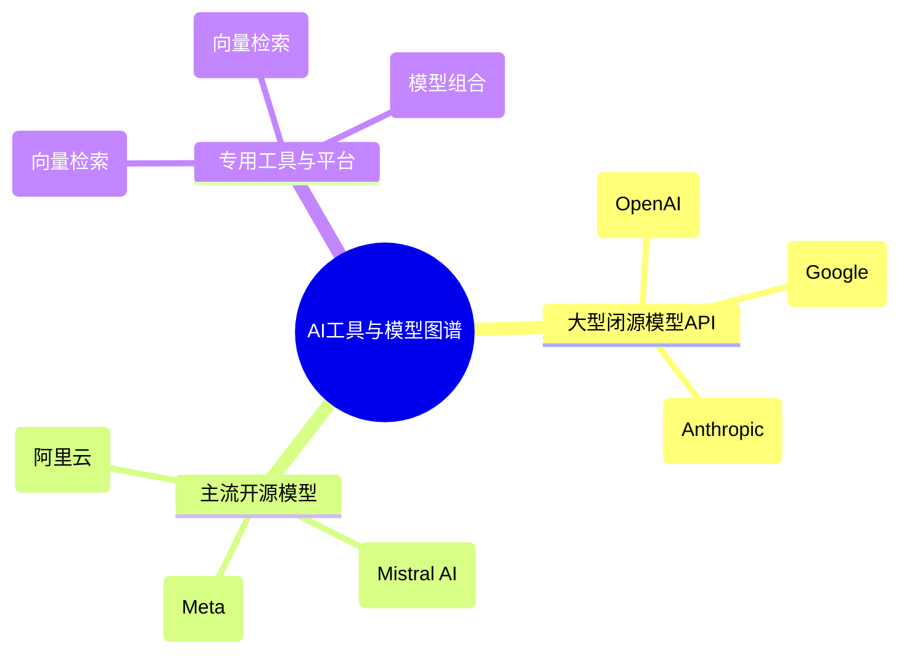
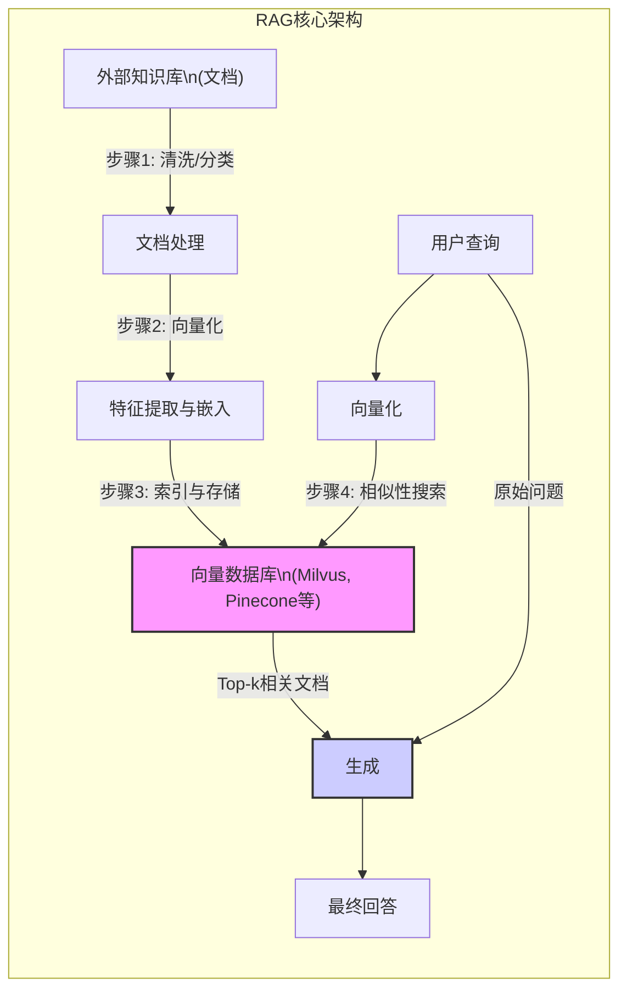
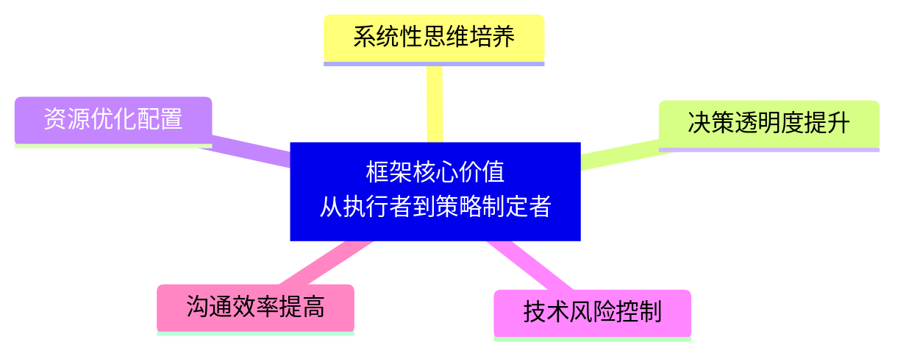
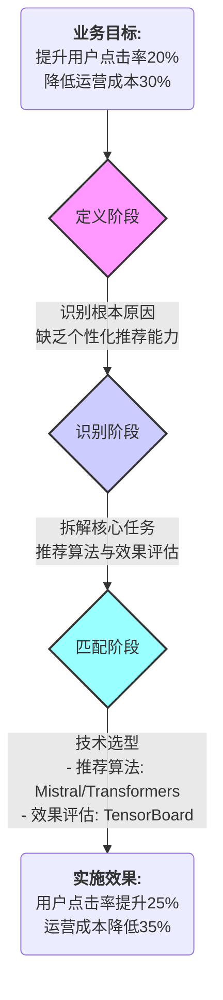

# “定义-识别-匹配”框架：AI时代的技术决策方法论

“定义-识别-匹配”框架提供了一种系统化的方法论，帮助组织在AI技术选型与应用过程中实现从问题到解决方案的无缝衔接。该框架通过三个关键阶段——问题定义、任务识别和能力匹配，将模糊的业务需求转化为具体的技术实施路径，同时确保选型方案与组织实际能力相契合。在当前AI技术爆炸式发展的背景下，这一框架的价值尤为凸显，它不仅帮助技术团队避免盲目跟风，还能使决策者从单纯的技术执行者转变为策略制定者，从而实现系统性评估新技术并有效沟通技术方案。

## 一、“定义-识别-匹配”核心框架全面解析

“定义-识别-匹配”框架是一个闭环技术决策流程，通过三个阶段的递进式分析，将业务问题转化为可执行的技术方案。每个阶段都有明确的目标、关键方法和在技术选型中的具体作用。

  * **定义阶段**：明确问题本质与边界，确保各方对问题的理解一致。关键方法包括5 Whys分析法和SMART原则。5 Whys分析法通过连续提问”为什么”，深入挖掘问题的根本原因，避免表面化解决。例如，当发现某AI客服系统响应延迟时，通过5 Whys分析可能发现根本原因是模型推理效率低下而非网络问题。SMART原则则确保定义的问题具备明确性(Specific)、可衡量性(Measurable)、可实现性(Attainable)、相关性(Relevant)和时限性(Time-bound)，为后续技术选型提供清晰标准。在定义阶段，团队需确定问题的优先级、范围和预期目标，形成可量化的技术需求文档。
  * **识别阶段**：将问题拆解为可执行的子任务，并确定任务间的依赖关系和优先级。关键方法包括IPO分析和任务优先级排序。IPO分析(输入-处理-输出)通过系统性拆分技术流程的输入数据、处理逻辑和输出结果，帮助团队清晰理解技术需求。例如，在设计RAG(检索增强生成)系统时，IPO分析可明确输入(用户问题)、处理(文档检索与生成)和输出(增强回答)的完整流程。任务优先级排序则通过AHP层次分析法或MoSCoW法则(必须有/应该有/可以有/不会有)等方法，确定不同任务的实施顺序和资源分配。在识别阶段，团队需形成任务清单、依赖关系图和优先级排序，为技术选型提供结构化依据。
  * **匹配阶段**：根据组织能力和资源约束，选择最适合的技术工具和模型。关键方法包括能力矩阵评估和成本效益分析。能力矩阵通过多维度评估(如性能、成本、易用性、可扩展性、安全性等)比较不同技术方案，帮助团队做出更全面的决策。例如，在选择向量数据库时，能力矩阵可比较Milvus、Pinecone和Chroma在检索速度、存储成本、扩展性和支持生态等方面的差异。成本效益分析则通过量化评估不同方案的投资回报率(ROI)，确保技术选型符合组织的财务和资源约束。在匹配阶段，团队需形成技术选型决策图谱，明确各任务的最佳技术方案及其组合策略。

## 二、AI工具与模型对比图谱

在匹配阶段，技术选型需考虑多种AI工具与模型的特性。根据最新市场调研和性能测试，以下对比图谱涵盖了三大类AI技术：

| 类别 | 工具/模型 | 参数规模 | 多模态支持 | 推理速度 | 安全性 | 成本 | 适用场景 |
| :--- | :--- | :--- | :--- | :--- | :--- | :--- | :--- |
| **大型闭源模型API** | GPT-4O (OpenAI) | 1.8万亿 | 强 | 低(约10秒/千字) | 高(加密传输) | 高(按token计费) | 高精度生成、复杂推理 |
| | Gemini Pro (Google) | 1.7万亿 | 强 | 中(约5秒/千字) | 高(私有云部署) | 中(按API调用计费) | 多模态任务、企业级应用 |
| | Claude 3.7 (Anthropic) | 1.5万亿 | 中 | 高(约3秒/千字) | 高(透明度高) | 中(按API调用计费) | 编程、写作、合规场景 |
| **主流开源模型** | Llama3-8B (Meta) | 80亿 | 弱 | 高(约0.5秒/千字) | 中(需自行部署) | 低(免费/开源) | 通用NLP任务、预算有限场景 |
| | Mistral-8x7B (Mistral AI) | 56亿 | 弱 | 高(约0.3秒/千字) | 中(需自行部署) | 低(免费/开源) | 低资源环境、快速原型开发 |
| | 通义千问-2.0 (阿里云) | 1.7万亿 | 中 | 中(约4秒/千字) | 高(信创适配) | 中(按API调用计费) | 中文场景、企业知识库 |
| **专用工具与平台** | Pinecone | - | 向量检索 | 高(QPS 2000+) | 高(企业级) | 中(按存储/查询计费) | 大规模向量检索、实时推荐 |
| | Milvus | - | 向量检索 | 高(QPS 1500+) | 中(开源社区) | 低(免费/开源) | 开源生态、自定义检索需求 |
| | LangChain | - | 模型组合 | 中(依赖底层模型) | 中(模块化设计) | 低(免费/开源) | 复杂流程构建、多模型协同 |

**闭源模型API** 的优势在于高精度、低开发复杂度和持续优化，但成本高且数据隐私存在风险。**开源模型** 则提供了更高的定制自由度和成本效益，但需要更多的开发和维护工作。**专用工具与平台** 则专注于特定技术领域，如向量数据库专注于高效检索，开发框架专注于简化模型组合。在实际应用中，组织往往需要根据具体需求组合使用不同类型的技术，例如在欺诈检测场景中，可能同时使用规则引擎处理实时交易，以及深度学习模型分析历史数据模式。

## 三、案例解构：框架的实际应用

### 案例一：优化内部知识库

  * **问题定义**：某企业面临知识分散、查询效率低、信息更新滞后等问题，通过5 Whys分析发现根本原因是缺乏统一的知识管理系统和智能检索能力。采用SMART原则定义目标为”在6个月内建立基于AI的内部知识库，实现80%的常见问题自动回答，响应时间\<3秒”。
  * **任务识别**：使用IPO模型拆解知识库优化任务，明确输入(用户问题)、处理(文档检索与生成)和输出(准确回答)的完整流程。进一步拆解为四个子任务：文档预处理(清洗、分类)、向量化(特征提取)、检索(相似文档匹配)和生成(基于检索结果回答)。通过优先级排序确定核心任务为检索与生成，次要任务为文档预处理与向量化。
  * **能力匹配**：在技术选型时，通过能力矩阵评估不同方案。API方案(如OpenAI的RAG服务)具备高精度和低开发复杂度，但存在数据隐私风险和高成本；私有化部署方案(如自建Milvus+通义千问)则在数据安全和成本控制方面更具优势。最终采用混合方案：核心业务数据使用私有化部署的RAG系统，非敏感数据使用API服务以提高响应速度。在模型选择上，使用通义千问进行中文语义理解，结合Mistral模型处理多轮对话，形成成本与效果的平衡。
  * **实施效果**：新知识库上线后，常见问题响应时间降至1.8秒，员工满意度提升40%，年节省人力成本约200万元。通过持续监控和A/B测试，系统不断优化，目前能够处理92%的内部咨询问题。

### 案例二：提升社交媒体营销

  * **问题定义**：某营销机构面临内容创作效率低、用户互动率不足、广告投放ROI不高等问题。通过5 Whys分析发现根本原因是缺乏智能化的内容生产和用户分析工具。采用SMART原则定义目标为”在3个月内建立AI辅助的社交媒体营销系统，提升内容生产效率50%，用户互动率提升30%，ROI达到1:6.8”。
  * **任务识别**：使用IPO模型拆解营销优化任务，明确输入(用户评论、广告数据)、处理(情感分析、内容生成、投放优化)和输出(优化策略、高潜内容)的完整流程。进一步拆解为三个子任务：情感分类(分析用户反馈情绪)、文本生成(创建广告文案和图文内容)和投放优化(根据用户画像调整广告策略)。通过优先级排序确定情感分类和文本生成为核心任务，投放优化为辅助任务。
  * **能力匹配**：在技术选型时，通过能力矩阵评估不同方案。情感分类任务选择开源BERT模型，因其成本低且适合大规模文本分析；文本生成任务选择闭源Claude 3.7模型，因其生成质量高且支持多模态内容创作；投放优化任务则采用混合方案，使用开源XGBoost模型进行离线分析，结合闭源Google Analytics API进行实时监控。在部署架构上，采用分级风控策略：主力账号使用人工+AI双审核机制，引流账号则采用自动熔断机制，平衡安全性和效率。
  * **实施效果**：新系统上线后，内容生产效率提升80%，人力成本降低60%，用户互动率提升35%，广告点击率提升25%。通过持续的数据闭环优化，系统能够根据实时反馈调整推荐策略，进一步提升营销效果。

## 四、检索增强生成(RAG)技术架构解析

**检索增强生成(RAG)** 是一种结合信息检索与生成式AI的技术框架，特别适合解决企业内部知识问答问题。其核心架构包括五个关键步骤：

1.  **文档处理**：首先对文档进行清洗、分类和结构化处理，去除冗余信息并提取关键内容。这一步确保知识库的质量和可用性，为后续的向量化和检索奠定基础。处理方法包括自然语言处理技术(如分词、实体识别)和文档结构分析(如标题、段落、表格识别)。
2.  **特征提取与嵌入**：将处理后的文档转化为向量表示，通常使用预训练的Transformer模型(如BERT、LLaMA等)进行嵌入。这一步的关键是选择合适的嵌入模型和参数，确保向量能准确捕捉文档语义。例如，对于技术文档，可能需要使用领域特定的嵌入模型；对于通用知识，标准的BERT模型可能已经足够。
3.  **向量存储**：将文档向量存储在专门的向量数据库中，如Milvus、Pinecone或Chroma等。这些数据库支持高效的相似性搜索，能够快速找到与用户查询最相关的文档片段。存储策略包括索引类型选择(如HNSW、IVF)和存储优化(如量化压缩)，直接影响检索速度和准确性。
4.  **检索**：基于用户查询的向量表示，在向量数据库中进行相似性搜索，返回最相关的文档片段。检索算法通常使用余弦相似度或欧氏距离，通过调整top\_k参数控制返回结果的数量。高级检索策略包括动态推测流水线(如RAGCache)和自适应检索(如SeaKR)，能够根据查询复杂度动态调整检索策略。
5.  **生成**：将检索到的文档片段与用户查询结合，输入到生成模型中，生成最终的回答。生成模型可以是通用的LLM(如GPT-4、Claude)，也可以是领域特定的模型。生成过程通常包含prompt工程，确保模型能够正确理解上下文并生成高质量回答。

**RAG为何是解决企业内部知识问答问题的有效方案？** 首先，它能够有效利用企业已有的知识资源，避免重新训练模型带来的数据隐私和成本问题。其次，它通过检索机制确保回答基于最新和准确的信息，减少”幻觉”现象。第三，它具备良好的扩展性，可以随着知识库的增长而持续优化。最后，它支持多模态数据(文本、图像、音频等)，能够处理更复杂的企业知识需求。

## 五、框架价值提炼：从执行者到策略制定者

“定义-识别-匹配”框架的核心价值在于**帮助使用者从技术执行者转变为策略制定者**，使其能够系统性地评估新技术并有力地沟通技术方案。这一转变体现在以下几个方面：

  * **系统性思维培养**：框架强制使用者从问题本质出发，通过结构化分析形成完整的解决方案。这避免了常见的”技术先于需求”现象，确保技术选型始终服务于业务目标。例如，在RAG系统设计中，使用者必须先明确知识问答的具体需求，再决定是否采用API方案或私有化部署，而不是简单地选择最流行的工具。
  * **决策透明度提升**：通过明确的分析流程和评估标准，框架使技术决策过程更加透明和可解释。这有助于不同部门(技术、业务、财务等)达成共识，减少因信息不对称导致的决策冲突。例如，在欺诈检测系统设计中，通过能力矩阵可以清晰展示不同技术方案在性能、成本、安全性和可解释性等方面的优劣，便于跨部门决策。
  * **资源优化配置**：框架通过任务优先级排序和能力评估，帮助组织更有效地分配有限的资源。这使得技术选型不再是简单的”追求最好”，而是基于组织实际能力和需求的”追求最合适”。例如，在社交媒体营销系统中，通过任务拆解和优先级排序，可以将有限的资源集中在情感分类和文本生成等核心任务上，而非平均分配给所有功能模块。
  * **技术风险控制**：框架通过多维度评估和A/B测试，帮助组织识别和规避技术实施中的潜在风险。这使得技术选型不再是”赌博式”的决策，而是基于数据和分析的理性选择。例如，在知识库优化项目中，通过对比API方案和私有化部署的性能、成本和安全性，可以提前识别数据隐私风险，并采取相应的缓解措施。
  * **沟通效率提高**：框架提供了一套统一的语言和工具，使得技术团队能够更有效地与业务部门和决策者沟通。这有助于减少因专业术语和思维差异导致的沟通障碍，确保技术方案能够被正确理解和采纳。例如，在欺诈检测系统设计中，通过IPO模型可以将复杂的技术流程转化为业务部门能够理解的输入-处理-输出逻辑，便于沟通和决策。

<!-- end list -->

## 六、框架在其他业务场景中的应用推演

“定义-识别-匹配”框架不仅适用于知识库优化和社交媒体营销，还可以扩展到其他业务场景。以下是两个典型场景的应用推演：

### 智能推荐系统设计

  * **定义阶段**：明确推荐系统的目标和边界。例如，“在3个月内建立电商产品推荐系统，提升用户点击率20%，降低运营成本30%”。通过5 Whys分析，识别根本原因是缺乏个性化推荐和用户行为分析能力。
  * **识别阶段**：使用IPO模型拆解推荐系统任务，明确输入(用户行为数据)、处理(用户画像构建、推荐算法)和输出(个性化推荐列表)的完整流程。进一步拆解为四个子任务：数据收集(用户行为、产品信息)、特征工程(用户偏好、产品属性)、推荐算法(协同过滤、深度学习)和效果评估(点击率、转化率)。通过优先级排序确定核心任务为推荐算法和效果评估。
  * **匹配阶段**：通过能力矩阵评估不同技术方案。数据收集任务选择开源工具(如Apache Kafka)，因其成本低且适合大规模数据流；特征工程任务选择混合方案，核心特征使用闭源工具(如Google BigQuery ML)，辅助特征使用开源工具(如Pandas)；推荐算法任务则采用分级策略，高频推荐使用轻量级模型(如Mistral)，长尾推荐使用深度学习模型(如Hugging Face Transformers)；效果评估任务选择开源工具(如TensorBoard)，因其可视化能力强且成本低。在部署架构上，采用Flink+Spark混合模式，实时推荐使用Flink(延迟\<100ms)，离线分析使用Spark(吞吐量高)。
  * **实施效果**：新推荐系统上线后，用户点击率提升25%，转化率提升15%，运营成本降低35%。通过持续的A/B测试和模型优化，系统能够根据用户行为动态调整推荐策略，进一步提升用户体验和商业价值。

<!-- end list -->

### 自动化欺诈检测流程

  * **定义阶段**：明确欺诈检测的目标和边界。例如，“在6个月内建立金融交易欺诈检测系统，将欺诈识别准确率提升至95%，误报率降低至5%以下”。通过5 Whys分析，识别根本原因是缺乏实时分析能力和复杂模式识别能力。
  * **识别阶段**：使用IPO模型拆解欺诈检测任务，明确输入(交易数据)、处理(特征提取、风险评分)和输出(欺诈警报)的完整流程。进一步拆解为五个子任务：数据采集(交易日志、用户信息)、特征工程(交易模式、用户行为)、风险评估(规则引擎、机器学习)、实时监控(流处理、告警触发)和事后分析(离线模型、策略优化)。通过优先级排序确定核心任务为实时监控和风险评估。
  * **匹配阶段**：通过能力矩阵评估不同技术方案。数据采集任务选择开源工具(如Apache NiFi)，因其灵活性高且成本低；特征工程任务选择混合方案，基础特征使用开源工具(如Pandas)，复杂特征使用闭源工具(如Google Dataflow)；风险评估任务则采用分级策略，实时风险评估使用规则引擎(如Drools)，复杂模式识别使用深度学习模型(如PyTorch)；实时监控任务选择Flink，因其低延迟(毫秒级)和高吞吐量(百万级事件/秒)；事后分析任务选择Spark，因其批处理能力强且适合大规模数据分析。在模型选择上，采用XGBoost+图神经网络(Kcore-GCN)的组合，平衡实时性和准确性。
  * **实施效果**：新欺诈检测系统上线后，欺诈识别准确率提升至96%，误报率降至4%，年节省欺诈损失约1500万元。通过持续的模型优化和规则更新，系统能够适应不断变化的欺诈模式，进一步提升检测效果。

## 七、框架实施的关键成功因素

要成功实施”定义-识别-匹配”框架，需关注以下关键成功因素：

  * **跨部门协作**：框架实施需要业务、技术、财务等部门的紧密协作。业务部门提供需求和场景，技术部门提供技术分析和方案，财务部门提供成本约束和ROI评估。例如，在欺诈检测系统设计中，业务部门提供欺诈案例和场景，技术部门分析数据特征和模型选择，财务部门评估硬件投资和运营成本。
  * **数据驱动决策**：框架实施应基于客观数据和分析，而非主观偏好或行业趋势。这需要建立完善的数据收集、分析和评估机制，确保技术选型决策有据可依。例如，在RAG系统设计中，通过对比API方案和私有化部署的性能测试数据，选择最适合的方案。
  * **持续迭代优化**：框架实施不是一次性活动，而是持续迭代的过程。技术选型应根据业务需求和技术发展不断调整和优化，确保系统始终保持竞争力。例如，在智能推荐系统中，通过A/B测试持续评估不同推荐算法的效果，并根据结果动态调整模型组合。
  * **风险管理**：框架实施应充分考虑技术风险和实施难度。技术选型不应仅关注理想效果，还应评估实际实施中的技术挑战、资源需求和时间成本。例如，在欺诈检测系统设计中，需评估实时处理和离线分析的平衡点，避免过度追求实时性而牺牲准确性。
  * **能力培养**：框架实施需要组织内部能力的培养和提升。技术团队需要掌握框架的使用方法和工具，业务部门需要理解技术方案的价值和局限。例如，在RAG系统设计中，技术团队需要掌握向量数据库和生成模型的集成方法，业务部门需要理解API方案和私有化部署的优缺点。

## 八、结论与展望

“定义-识别-匹配”框架提供了一种系统化的方法论，帮助组织在AI技术选型与应用过程中实现从问题到解决方案的无缝衔接。该框架不仅能够提高技术决策的效率和质量，还能促进组织内部的技术与业务融合，培养跨部门协作的决策文化。

随着AI技术的不断发展，框架的应用场景将更加广泛。例如，在多模态交互系统设计中，框架可以帮助团队明确语音、图像和文本等多种模态的整合需求；在自动化决策系统设计中，框架可以帮助团队平衡自动化与人工干预的比例；在AI伦理与合规管理中，框架可以帮助团队识别和应对技术应用中的伦理风险。

未来，框架可能进一步演进，结合更多自动化工具和AI辅助决策系统，实现更高效的技术选型和方案设计。例如，通过自动化基准测试工具，可以快速评估不同模型在特定任务上的性能；通过AI辅助的优先级排序系统，可以基于历史数据和业务目标自动生成任务优先级建议。

总之，“定义-识别-匹配”框架不仅是技术选型的实用工具，更是组织数字化转型的战略资产。通过系统性应用该框架，组织能够从被动应对技术变革转向主动引领创新，实现技术与业务的深度融合，最终在激烈的市场竞争中脱颖而出。
