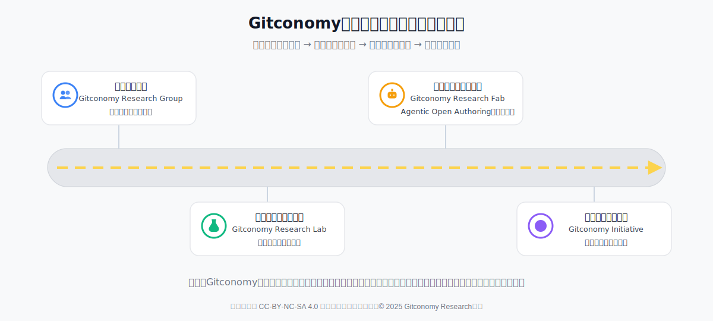

# Gitconomy社区成长路线图：我们的共同征程

## 1. 我们的愿景与核心战略

欢迎来到Gitconomy！这份路线图旨在向每一位社区成员清晰地展示我们共同的未来——一个清晰、可行且富有远见的蓝图。

我们社区的基石是“**贡献即要素**”的核心理念。我们认为，社区角色不应是固定的身份标签，而应是成员当前贡献状态的一种动态、实时的体现。为此，我们将所有对社区有价值的智力贡献——无论是思想、数据、方法、代码，还是协作与传播——都解构为构成研究工作的核心“生产要素” 。每一份可被验证的贡献，都被视为贡献者对社区共同资产的“投资行为” ，最终目标是构建一条从“贡献”到“社区所有权”的清晰、公平且可验证的转化路径。

基于这一理念，我们的核心战略是三位一体的协同进化，由三条紧密交织的路线图共同驱动：

* **组织的成长：** 我们作为一个集体的身份和使命将如何演进。
* **工具的演进：** 我们共同创造的价值载体将如何发展。
* **成员的成长：** 每一位贡献者在社区中的个人旅程将如何展开。

我们坚信，研究是社区的内核，而工具是研究的引擎与加速器。组织的不断成熟为研究提供了土壤与活力；工具的不断进化为研究注入了智能与效率；而成员的不断成长，则是驱动这一切的根本动力。这三条路径的协同发展，将指引我们从最初的概念验证小组，稳步成长为一个具有全球影响力的开放科学力量。

## 2. 社区成长路线图规划：以“贡献即要素”的创新为牵引

社区的成长将经历四个紧密相连的阶段。每个阶段，我们的组织身份都将迎来一次关键进化，并牵引着工具的演进和成员的成长。

*图：Gitconomy开放研究社区成长路线图*

### 第一阶段：Gitconomy Research Group（概念验证）

这是社区从0到1的萌芽阶段。我们像一个前沿的学术研讨小组，汇聚在一起，通过密集的思想碰撞，共同回答最根本的问题：“我们是谁？我们要解决什么？” 这一阶段的目标是形成社区的理论内核与共同愿景，为未来的漫漫征途奠定第一块基石。

- 组织身份：一个由早期核心成员组成的、小规模的、以思想探索为驱动的研究小组。
- 核心任务：聚焦于“Git for Research”的核心理念，进行深入的理论探讨，产出社区的白皮书、研究问题陈述和早期路线图，形成思想共识。
- 工具演进：此阶段尚无专属工具，协作主要依赖通用的Git平台、文档和通讯工具。
- 成员成长：成员主要是早期的 Explorer (探索者) 和 Thinker (思想者)，他们共同定义社区的愿景和核心问题，是社区思想的源头。

### 第二阶段：Gitconomy Research Lab（分布式开放协作）

在这一阶段，社区的核心任务是从理论走向实践。我们不再仅仅是思想的探讨者，而是要成为一个分布式的开放研究网络，将早期的愿景落地为具体的、可执行的研究项目。我们通过构建协作流程和基础工具，将个体贡献者连接成一个有机的整体，开始真正地协同创造价值。

- **组织身份**：一个致力于打破地域与机构壁垒的分布式开放研究网络。
- **核心任务**：建立标准化的工作流程和通信协议，实现跨团队、跨学科的高效开放协作，并将核心理念应用于具体的科研项目，产出可被引用的学术论文和工具雏形。
- **工具演进**：Gitconomy Research Studio (研究工具集) 出现。这是一个集成化的工具集，为开放协作提供基础能力，如版本化数据、协作写作、实验追踪等。
- **成员成长**：Builder (建设者) 开始涌现，他们将思想转化为具体的代码和实验。同时，Scholar (学者) 开始通过撰写教程和文档，沉淀并传播社区的知识。

### 第三阶段：Gitconomy Research Fab（智能体开放协作）

如果说“Lab”阶段解决了协作的组织问题，那么“Fab”阶段则致力于解决研究的生产力问题。我们的重点转向了“智能赋能”，通过开发由AI驱动的Agentic研究工具，将繁琐、重复的研究工作自动化、规模化。我们不再仅仅产出研究成果，更要产出可复用、可验证的“知识生产工具”，实现社区智力产出的指数级增长。

- **组织身份**：一个由AI驱动的知识生产中心。
- **核心任务**：社区重点从“连接人”转向“赋能人”。通过开发和部署基于AI的自动化、智能化研究工具，规模化产出可复用和验证的“知识生产工具”，确保科研过程的透明性与可复现性。
- **工具演进**：Gitconomy Research Agent (研究智能体) 成为核心。这些AI智能体能够自动化处理数据清洗、文献分析、代码生成等任务，构成“知识生产工具”的引擎。
- **成员成长**：社区内涌现出Fellow (学术领袖)，他们在特定领域的研究工作具有里程碑式的意义，并能指导和培养新的贡献者。成员的成长路径更加多元化。

### 第四阶段：Gitconomy Initiative（生态价值网络）

这是社区从一个内部协作组织走向全球性生态引领者的成熟阶段。我们的使命超越了自身的研究，转而致力于将我们验证过的理念、工具和标准推广至整个科学界，成为一场开放科学运动的倡孕育者和基础设施的构建者。我们的目标是定义下一个科研范式，构建一个充满活力的、由无数研究者共同参与的开放科学新生态。

- **组织身份**：一个引领全球的开放科学倡议。
- **核心任务**：将社区验证过的理念、工具和标准推广至全球，联合学术机构、基金会和产业伙伴，共同推动科研范式变革，构建下一代开放、可信的科学基础设施。
- **工具演进**：Gitconomy Research Platform (开放研究平台) 形成。它整合了所有工具集和智能体，提供一个集成果发布、开放评审、声誉管理和价值激励于一体的去中心化基础设施。
- **成员成长**：Steward (领导者) 成为社区治理的核心。他们是社区愿景、文化和长期健康的守护者，负责社区的整体战略和生态发展，带领社区实现其最终愿愿景。

## 3. 社区技术发展路线图：为研究的进化注入澎湃动力

作为社区智力产出的核心载体，我们的工具将经历一场从辅助工具到智能伙伴，最终到生态平台的演进。这条路线图的核心是不断提升研究的生产力与可信度，通过逐步增强的自动化和智能化水平，将研究者从繁琐的重复性工作中解放出来，让他们能专注于最具创造性的探索，最终构建一个能够支撑整个开放科学生命周期的强大基础设施。

技术路线图与组织发展紧密协同，为每个阶段的组织形态提供关键支撑。

- **Gitconomy Research Studio （数字工具集）**：这是一个集成化的研究工具集 (Toolset)，为 Research Lab 阶段的开放协作提供基础能力，包括用于版本化数据、协作写作、实验追踪和同行评审的模块化工具。
- **Gitconomy Research Agent （智能体应用）**：一系列具备自主能力的AI研究助理。这是 Research Fab 阶段的核心技术，负责执行自动化任务（如数据清洗、文献分析、代码生成），构成“知识生产工具”的核心引擎。
- **Gitconomy Research Platform （开放研究平台）**：支撑 Open Science Initiative 的综合性生态平台。该平台整合了工具集和智能体，提供一个集成果发布、开放评审、声誉管理和价值激励于一体的去中心化基础设施。

## 4. 社区成员成长路线图：从贡献到所有权的旅程

在Gitconomy，成员的成长并非一条线性的晋升管道，而是一个多维度的成长网络。每一位成员都可以根据自身的兴趣和专长，在六大“贡献要素”（思想、数据、方法、代码、协作、传播）和四大“价值象限”（发现、创造、引导、整合）中自由穿梭，构建自己独特的贡献画像 。

- **Explorer （探索者）**：社区的“侦察兵”和“提问者”，致力于为社区发现新的问题、引入新的数据源、定义新的研究方向 。他们的核心价值在于为社区带来新的需求与外部视角，属于“价值发现”象限 。
- **Builder / Thinker （开发者/思想者）**：社区的“工程师”与“架构师” 。Builder擅长将抽象思想转化为具体、可用的高质量工具和成果 ；Thinker则致力于构建解释框架、设计科学范式 。二者结合，构成了“价值创造”与“价值引导”的核心引擎。
- **Scholar （学者）**：社区的“知识布道者”和“档案管理员”，通过撰写高质量的文档、教程和研究报告，将社区复杂的产出变得易于理解和使用，是社区“可信研究”的守护者 。
- **Fellow （学术领袖）**：社区中学术声望最高的研究者，能够开创全新研究范式、发表奠基性工作，并深刻影响整个社区乃至外部学术领域 。其研究工作具有里程碑式的意义，是社区公认的学术领袖 。
- **Steward （领导者）**：社区的最高声誉角色，是社区领导者 。他们对社区的整体健康、长期愿景和核心价值观负有责任，是社区集体信任的最终体现和治理的核心 。

*图：Gitconomy开放研究社区贡献者旅程示意图*

这个旅程由一个强大的正向循环驱动：贡献（你的起点） → 份额（贡献转化） → 声誉（积累声誉）  → 更高价值任务（迎接挑战） → 更多贡献 （实现共振）

## 5. 我们的共同愿景

这份路线图不仅是社区发展的规划，更是对每一位成员的邀请。它清晰地展示了，你的个人成长、我们共同创造的工具，以及我们作为一个集体的演进，是如何紧密相连、相互成就的。我们坚定地相信，通过这三位一体的协同发展战略，我们可以将每一位成员的“志愿者劳动”汇聚成改变世界的“投资行为”，共同将Gitconomy从一个初创的想法，建设成一个真正由所有活跃贡献者集体拥有的、具有全球影响力的开放科学力量。

**让我们一起，踏上这段激动人心的开放研究数字化征程！**

---
本作品采用CC-BY-NC-SA 4.0国际许可协议进行许可, &copy; 2025 Gitconomy Research社区
