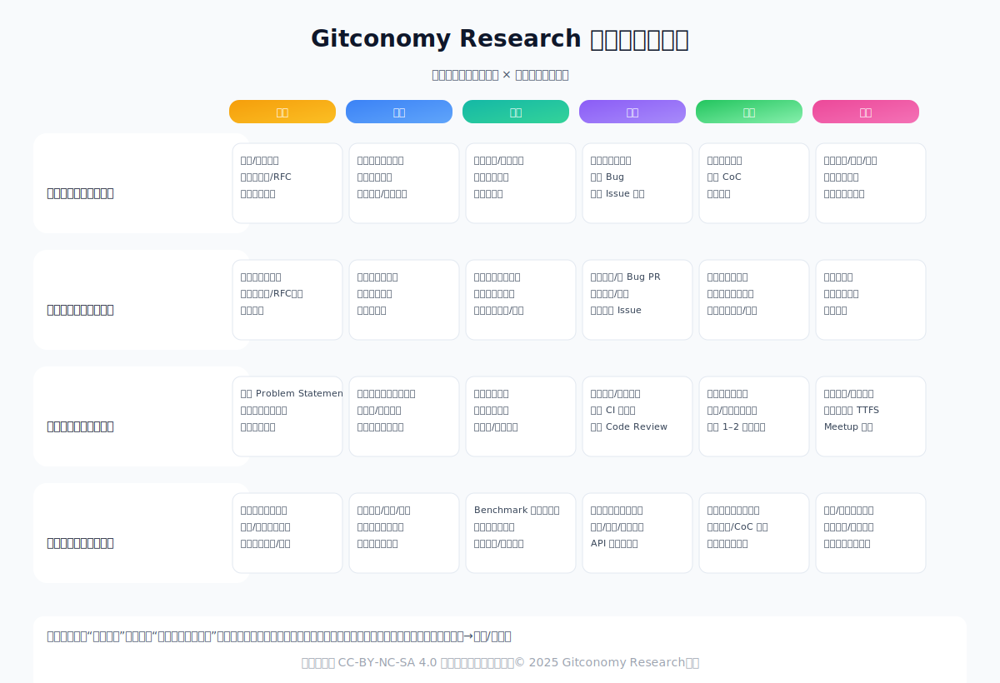
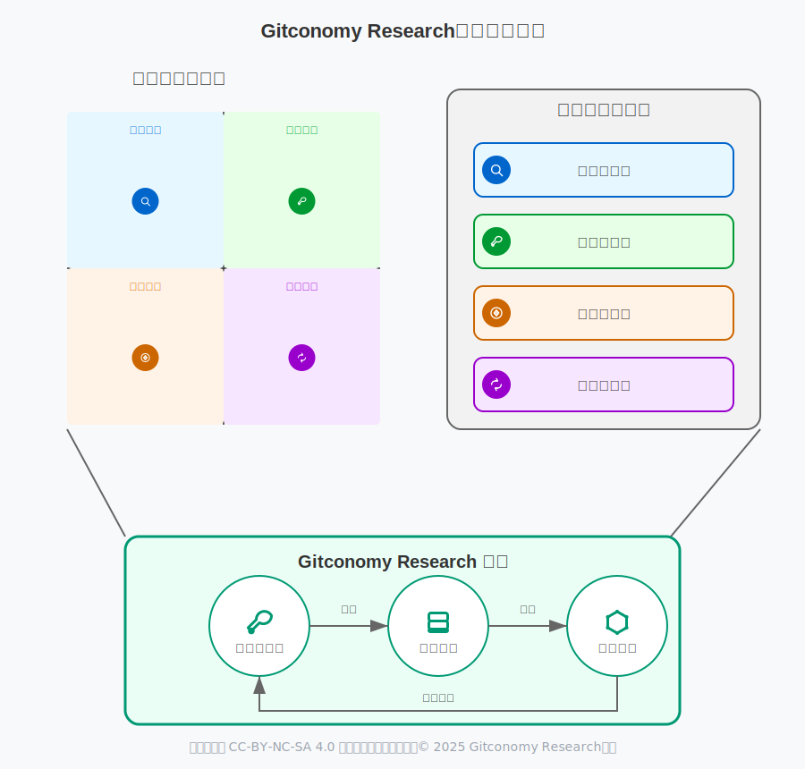
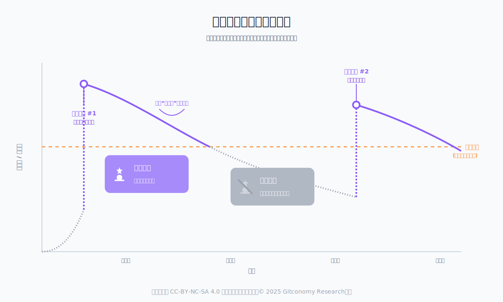

# Gitconomy社区所有制的基础——基于“贡献即要素”的社区角色重构思考

## 引言

当前社区普遍沿用的角色体系，其根基源于传统开源软件的协作模式，但在日益复杂和多元的智力贡献场景下，其内在的困境愈发凸显。传统角色往往是静态化与僵化的，一旦授予便成为一个难以调整的身份标签，它更多地反映了个体过去获得的某项权限，而非其当下的实际贡献状态。这种基于权限而非持续贡献的模式，不仅在角色之间制造了无形的孤岛效应，限制了成员进行跨领域贡献的积极性，更严重的是，它导致了激励错位。当一个体系无法准确反映成员为社区创造的真实价值和影响力时，便会不可避免地导致核心贡献者的激励不足，最终损害社区的创新活力与长期健康。

为应对这些挑战，我们提出**贡献即角色**的核心理念，旨在推动一场从“身份”到“状态”的根本性转变。我们认为，社区角色不应是固定的身份标签，而应是成员当前贡献状态的一种动态、实时的体现。在这个新范式中，角色的获得、升级乃至所有变化，其唯一依据都将是成员为社区创造的可被验证的贡献。本文的目标，正是基于这一理念，提出一套围绕“贡献要素”的全新角色框架，清晰定义其核心价值、晋升路径和动态演进机制。这不仅是对社区组织结构的重构，更是为Gitconomy未来所有权分配和去中心化治理模型，奠定最关键的“人”的基础。

## 一、贡献要素的解构——重新定义“价值”

### 1.1 为何需要重构社区角色？

1. **传统开源社区角色的困境**

在过去的几十年里，以Linux和Apache基金会为代表的开源社区，其贡献者阶梯模型（通常为：用户 → 贡献者 → 提交者 → 项目管理委员会（PMC）成员）为软件协作带来了革命性的成功。这一模型通过清晰的晋升路径和基于技术能力的特权授予，有效地组织了全球开发者的协作。然而，随着开源理念渗透到更广泛的领域，尤其是在研究、数据科学等多维协作的社区中，这一传统模型的局限性日益凸显。

其核心困境在于三大方面：首先，它过于以代码为中心，将代码提交（Commits）作为衡量价值的核心标尺，系统性地低估了文档撰写、社区管理、设计、数据标注乃至思想理论贡献的价值。其次，其层级化的结构往往是线性和单一的，无法反映贡献者在不同领域可能拥有的多元化专长。最后，这种模式在面对需要复杂智力投入（如理论创新、实验设计）的研究型社区时，显得力不从心，难以准确激励和回报那些非工程类的关键贡献。

2. **新范式：贡献即要素，贡献即通证**

为了突破传统困境，我们需要引入一种全新的社区角色和价值认知范式。Gitconomy社区所有制框架正是为此而生，其核心理念在于：将所有对社区有价值的智力贡献，无论是代码、数据、思想还是协作，都视为贡献者对社区共同资产的“投资行为”。

这一范式的目标是构建一条从“贡献”到“社区所有权”的清晰、公平且可验证的转化路径。它不再仅仅是授予贡献者在项目中的操作特权，而是要实现贡献的资本化，让每一份有效的努力都能转化为贡献者在社区中的持久股份，并最终分享社区未来的价值增长。这对于激励高质量、长周期的参与，尤其是在研究这类探索性、高风险的领域中，至关重要。

因此，认可非代码贡献的战略具有分十分重要的必要性：

**对社区健康的影响**：正式认可非代码贡献对于构建一个多元化和包容性的社区至关重要。当社区的价值体系不仅仅奖励编码能力时，拥有不同技能背景的人才——如优秀的技术文档作者、社区组织者、设计师和市场推广专家——才能找到清晰的成长路径和获得领导地位的机会。

**构建可持续的项目**：代码质量固然重要，但项目的最终成功更依赖于用户能否发现、理解并有效使用它。高质量的文档、活跃的社区支持以及有效的宣传推广是驱动用户采纳和留存的核心动力。

**降低“巴士因子”风险**：“巴士因子”（Bus Factor）指的是一个项目中，因多少关键成员的缺席会导致项目停滞的指标。一个能够赋能并奖励在不同领域（代码、文档、社区、治理）涌现出领导者的声誉体系，能够有效分散项目风险，使其变得更加稳健和有弹性。

### 1.2 建立整体价值框架——超越代码行数

一个健康的开源项目是一个由文档、社区、治理和宣传共同构成的复杂生态系统。因此，一个有效的声誉体系必须建立在对“贡献”的整体理解之上，所有为项目增加价值的活动都必须得到承认和量化。

*图：贡献即要素的整体价值框架*

为了将上述原则付诸实践，必须系统性地识别并定义广泛的贡献类型。借鉴[CHAOSS](https://chaoss.community/)的度量标准和[all-contributors](https://allcontributors.org/)规范，可以将贡献活动分为以下几大类：

| |贡献类型|主要贡献行为|
|:---|:---|:---|
|1|技术贡献 (Technical Contributions)|代码、代码审查、架构设计、安全审计。|
|2|内容与文档 (Content & Documentation)| 文档撰写/更新、教程与示例、翻译、博客与文章。|
|3|社区与支持 (Community & Support)|问题解答、问题分类、导师指导、活动组织。|
|4|治理与领导 (Governance & Leadership)| 决策参与、项目管理、公共代表。|
|5|宣传与推广 (Advocacy & Evangelism)|社交媒体管理、案例研究撰写、会议演讲。|

另外，还可以引入学术界的CRediT（贡献者角色分类法，Contributor Roles Taxonomy）。[CRediT](https://credit.niso.org/)是一项高度结构化的分类法，用于表示学术研究中不同类型的贡献。该分类法由CASRAI (Consortia Advancing Standards in Research Administration Information) 开发，现已被NISO (National Information Standards Organization) 标准化，被全球超过1,000家学术期刊采用，包括Nature、PLOS、Science等顶级期刊。

CRediT提供了14个标准化角色，每个角色代表学术研究过程中的一种特定贡献类型。这种分类法的主要目的是提高研究贡献的透明度和可信度，确保所有类型的贡献都得到适当的认可。该分类法旨在减少署名纠纷，提供清晰的贡献归属，将**焦点从“作者身份”（authorship）转向“贡献者身份”（contributorship)。**

这14个角色包括：

||角色|角色行为|
|:---|:---|:---|
|1|构想|提出想法； 确立或演进总体研究目标和宗旨。|
|2|数据管理|管理活动，如注释（生成元数据）、清洗数据和维护研究数据。|
|3|形式化分析|应用统计、数学、计算或其他形式化技术来分析或综合研究数据。|
|4|资金获取|为项目获得财务支持。|
|5|调查研究|进行研究和调查过程，特别是执行实验或收集数据/证据。|
|6|方法论|开发或设计方法； 创建模型。|
|7|项目管理|对研究活动的规划和执行负有管理和协调责任。|
|8|资源|提供研究材料、试剂、患者、实验室样本、动物、仪器、计算资源或其他分析工具。|
|9|软件|编程、软件开发； 设计计算机程序；实现计算机代码和支持算法； 测试现有代码组件。|
|10|监督指导|对研究活动的规划和执行负有监督和领导责任，包括核心团队之外的指导。|
|11|验证|对结果/实验和其他研究输出的总体复制/再现性进行核实。|
|12|可视化|准备、创作和/或呈现已发表的作品，特别是可视化/数据呈现。|
|13|初稿撰写|撰写初稿。|
|14|审阅和编辑|由原始研究团队的成员进行批判性审查、评论或修订 。|

CRediT:形式化分析的贡献与一个被标记为CRediT:项目管理的贡献在本质上是不同的。通过要求贡献者使用CRediT来分类他们的工作，社区为算法提供了其本身所缺乏的语义背景。然后，社区可以在CRediT角色的层面上设置权重（例如，权重(形式化分析) > 权重(项目管理)）六大谱示意图六大谱示意图，这比简单地为“一次提交”与“一条评论”设置权重更为精细和合理。

Gitconomy将创建一个新矩阵，该矩阵将贡献者阶梯的晋升级别与CRediT分类法的贡献类型相结合。在这种模式下，贡献者通过为自己的贡献（例如，一个GitHub PR或一篇论坛帖子）打上一个或多个CRediT角色标签来进行自我报告。这将为每个成员的活动创建一个丰富的多维数据集，远优于单一的角色头衔。例如，一个“社区贡献者”可能同时拥有被标记为CRediT:审阅和编辑和CRediT:监督指导的贡献。这种精细化的数据结构对于后续的价值量化至关重要。

### 1.3 “贡献要素”的角色光谱

在研究型社区中，价值创造是一个复杂的多维过程，远超代码提交的范畴。为了构建一个公平的所有制框架，我们必须首先将构成研究工作的核心“生产要素”进行解构和识别。我们将这些基础构件定义为六大谱系，它们共同构成了Gitconomy Research知识生态的价值网络。

*图：贡献即要素的角色光谱示意图*

1. **数据要素：研究的基石**

数据是实证研究的起点和命脉，高质量数据与标注体系决定实验的上限与可复现性，也是“可信研究”的前提。数据要素不仅包括原始观测数据，更涵盖了经过精心清洗、整理和标注的高质量数据集，以及用于指导这一过程的标注体系 。一个设计良好的数据集或标注体系本身就是一项重大的智力贡献，它能够催生无数后续研究，其价值不亚于一篇开创性的论文。

可信的数成熟的开源组织或者开源项目，如Apache基金会、Linux基金会，普遍采用“贡献者阶梯”（Contributor Ladder）模型来构建社区结构。该模型清晰地定义了成员的晋升路径，通常从用户（User）开始，逐步发展为贡献者（Contributor）、提交者/成员（Committer/Member），最终成为项目管理委员会（PMC）成员或审查者（Reviewer）。每一级别都伴随着明确的责任、资格要求和特权。例如，社区贡献者负责遵守行为准则并参与讨论，而组织成员则需要定期贡献并能独立触发持续集成（CI）。据贡献通常伴随清晰的数据卡（Data Card）与许可、采集/清洗流程记录、标注指南、版本号与提交哈希，以及基线评测与被复用/被引用的痕迹。度量上可以观察覆盖度、一致性、误差率、复现实验通过率、复用与派生数据集数量、下载量与独立用户数等。比如，成员 A 设计多语言指代消解的标注规范 v1.2 并发布 1.2 万条标注数据；两个月内被 3 个模型训练管线复用、带来 4 次引用，对应事件可落在 `data.guideline`、`dataset.release` 与 `dataset.citation`上。

2. **方法要素：科学的范式**

方法与实验设计为各类研究提供可扩展“程序”，显著降低不同研究者之间的方差与重复劳动，是确保研究可信、可复现和可扩展的核心。方法要素包括创新的研究方法、严谨的实验设计方案，以及能够被社区复用的分析框架 。提出一种新的分析视角或设计一个巧妙的实验来验证一个复杂的假设，是推动科学前进的关键步骤。这些方法论层面的贡献，为社区提供了探索未知领域的“地图”和“指南针”。  

方法要素的证据包括方法白皮书、评估协议、统计功效分析、置信区间与显著性检验，以及对照/消融实验的完整记录。度量可以关注复现成功率、误差条收敛速度、他人采纳/引用次数及对结论稳定性的提升幅度。比如，成员 B 提出一套稳健评估协议，将不同随机种子下的指标方差降低 30%，随后两项课题采纳该协议并在里程碑评审中作为必备环节。

3. **代码要素：思想的载体**

代码把理论与方法转化为可验证、可应用工具的载体，其工程质量直接影响外部采用成本。代码要素涵盖了核心算法的具体实现、用于加速研究的开源工具开发，以及支撑整个研究生态的技术架构 。在研究型社区中，代码的价值不仅在于其工程质量，更在于它对某个“思想要素”或“方法要素”的忠实表达和高效实现。  

代码要素可验证的证据包含核心库或包、CI 覆盖率、基准性能、API 稳定性承诺（SemVer）与安全响应记录；度量可看下载与留存、API 被引用或被调用的仓库数、性能/资源占用改进幅度，以及关键缺陷的平均修复时间。比如，成员 C 将论文算法实现为 Python 包并完善 CI 与文档；两周内被 5 个外部仓库引入、下载量达 2k，并关闭了 3 个历史性能瓶颈 Issue。

4. **思想要素：创新的源泉**

思想提出问题、定义概念与搭建解释框架决定研究的航向，是知识边界得以拓展的根本驱动力。思想要素代表了最高层次的原创性贡献，包括提出颠覆性的理论创新、对一个模糊问题进行清晰的定义，或是构建一个能够解释复杂现象的概念模型 。一个深刻的问题定义，其价值可能远远超过后续的所有执行工作，因为它为整个社区开辟了全新的研究航道。

思想要素证据包括研究问题陈述（Problem Statement）、概念模型图、路线图（Roadmap）、RFC 与评审记录，以及被下游工作采纳的痕迹。度量时可看被采纳/延展的数量与层级、触发的新里程碑/项目数、社区评审通过率与讨论热度（独立参与者与轮次）。例如，成员D发起“‘小样本鲁棒性’不等价于‘小样本泛化’”的问题重述RFC，推动评测指标体系重构，并孵化出1个新子项目与2个基线。

5. **协作要素：集体智慧的催化剂**

跨域整合与组织协同让多要素耦合产生超线性价值，同时减少沟通失败的交易成本。因为研究本质上是一种社会性活动，协作是放大个体智慧、达成宏大目标的催化剂。协作要素包括高效的项目组织协调、整合跨学科知识以形成新洞见，以及在社区内围绕关键问题达成共识的过程 。成功的协作能够将不同要素（如思想、代码、数据）有机地结合起来，产生远超各部分之和的价值。  

协作要素可见的证据通常是跨仓/跨组协作计划、周会纪要与决议、任务分解与依赖图，以及风险清单与缓解方案。度量可以观察跨团队里程碑达成率、关键路径缩短时长、冲突解决率与平均时间，以及参与者满意度。比如，成员 E 统筹三组完成联合发布v0.5，将关键路径由5步缩短为3步，最终提前10天交付。

6. **传播要素：影响力的放大器**

传播让研究成果被发现、被理解并成功使用，是学术积累转化为社会影响的关键通道。一项研究的最终影响力取决于其传播的广度和深度。传播要素涵盖了所有旨在扩大研究成果影响力的活动，包括撰写高质量的教育内容（如教程和文档）、面向公众的知识普及，以及在顶级学术会议上的交流 。有效的传播能将研究成果从象牙塔中解放出来，转化为更广泛的社会价值和学术影响力 。  

传播要素的可信证据包括教程与讲义、博客或视频回放、会议演讲材料、案例研究，以及文档信息架构（Docs IA）的迭代记录。度量可看阅读完成率或观看完播率、“首次成功运行”时间（TTFS）、外部引流与转化率，以及搜索可发现性的提升。比如，成员 F 重构文档信息架构并推出“10 分钟上手”教程，使TTFS 从45分钟降至12分钟，次月新手Issue数量下降35%。

### 1.4 精细化归因：让每份贡献可度量

精确地识别并记录上述六大要素的贡献，是实现“贡献即要素”所有制的前提。这要求我们建立一个去中心化的、无需信任的归因（Attribution）系统，能够将宏观的成果追溯到微观的个人贡献 。该系统要把“要素”变成可结算与可治理的输入，归因系统需做到低信任假设、证据可追溯，并与仓库工作流无缝对接。  

1. **Git 提交即归因：以事件为基础**

我们利用Git的分布式特性，将每一次commit、pull request的评审或合并、以及一次正式的发布（release）视为一个最小的、可归因的贡献事件 。这个原子化的事件记录，为所有后续的价值计算提供了最基础、最客观的数据源。  

2. **细粒度追踪：深入贡献内核**

归因不能止步于宏观的事件层面。系统需要具备细粒度追踪的能力，通过语义分析、代码依赖图谱和引用关系，将贡献定位到具体的知识块（如论文中的一个核心论点）、一个关键的数据点或一个创新的方法步骤 。这种精细度确保了即便是微小的、但至关重要的贡献也能被准确捕获。  

3. **多维记录：构建完整的贡献画像**

每一次贡献都应被多维度地记录，形成一个丰富的贡献画像。这不仅包括贡献的类型（属于六大要素中的哪一种，可借鉴CRediT等标准分类法 ）、规模（如代码行数、文档字数）、时间，还应包括它与其他贡献的关联性（如一个“代码要素”实现了哪个“思想要素”）以及其后续的影响力（如被引用、被复用次数）。  

4. **关键贡献链上存证：打造不可篡改的证据链**

为了确保归因记录的最终可信性与持久性，社区将逐步把关键的、里程碑式的贡献（如一篇被接收的论文、一个被验证的核心数据集）通过密码学哈希进行摘要，并将其存证于区块链上 。这将形成一个可公开验证、不可篡改的证据链，为后续基于贡献的所有权分配和价值结算提供坚实的、无需信任的基础。  

~~~
**端到端示例：一个“数据要素”的归因与结算旅程**

1. 贡献者提交dataset_v1.2的PR，并附数据卡与标注指南；模板中勾选Data curation与Validation。
2. 评审通过与release后，Actions把事件写入 ledgers/reputation.yml；同时更新 hypercerts/hc_dataset_v1.2.yml的参与者份额草案。
3. 两个下游项目采用该数据并在其README标注引用；机器人抓取到外部引用，更新impact.downstreams=2。
4. 月度清分时：事件分S_event = w_type × q_quality × i_impact × c_credence 被累计到“数据要素”的参与者。
5. 季度Retro评审对“影响证据”做理由化打分，并确认把hc_dataset_v1.2的分配表从草案转为正式。
6. 关键制品（压缩包、指南 PDF）计算哈希写入存证；报告中展示哈希与索引，供外界核对。
7. 若后续发现标注瑕疵，提交errata事件并触发负向修正或再训练补贴，保证账本真实。
~~~

## 二、基于贡献要素的社区贡献者阶梯模型

### 2.1 设计理念：从“线性晋升”到“矩阵式成长网络”

传统的贡献者阶梯虽然提供了清晰的晋升路径，但其线性和单一的结构往往仍会不自觉地偏向技术贡献者 。为了真正实现对多元贡献的认可，并构建一个通往“所有权”的公平网络，我们引入一个基于角色的体系。这个体系承认，社区的成功依赖于不同类型专家的协同工作，而非一条单一的晋升流水线。这个矩阵的结构是：晋升级别（行） × 贡献要素角色光谱（列）。

|对比维度|开源社区框架|Gitconomy社区框架|
|:---|:---|:---|
|核心理念|从“授予特权”出发，奖励贡献者以操作权限。|从“确认所有权”出发，将贡献转化为持久股份。|
|价值评估|以“代码为中心”，对非代码贡献评估不足。|“多维要素整体评估”，公平认可所有价值输入。|
|成长路径|“单一线性管道”，层级化且僵硬。|“灵活的矩阵网络”，允许差异化、非线性的成长。|
|最终目标|实现有效的“项目治理”。|构建“由贡献者集体拥有的数字机构”。|

这种设计的核心优势在于，它承认并鼓励成员在不同要素上形成差异化的专长和成长路径。一个成员可能在“代码要素”上是“领域贡献者”，但在“传播要素”上仍是“要素贡献者”。这种非线性的成长模式更符合真实世界中专家的成长轨迹。

*图：社区贡献者成长阶梯比较*

因此，一个具有明确角色定义和晋升标准的体系，通过将晋升标准从主观评估转变为可验证的客观成就，角色体系确保了所有权的分配是基于公开、公平的规则。

### 2.2 社区贡献者价值象限

“贡献者象限”为我们提供了一个价值地图，它将社区的所有贡献行为划分为四个核心价值领域：价值发现（输入）、价值创造（产出）、价值引导（方向）和价值整合（生态）。“社区贡献者象限”是一个分析框架，其核心目的并非要对社区成员进行严格的角色划分或贴上标签，而是提供一个理解和识别不同类型核心价值贡献的分析透镜。

*图：Gitconomy社区贡献者象价值限分析透镜*

1. **价值发现**：社区的“输入”与“感知”

- **核心定义**：此象限的贡献者是社区的“传感器”和“侦察兵”，他们的核心价值在于为社区带来新的需求、定位新的问题，并引入宝贵的外部视角。他们负责回答最根本的问题：“我们应该做什么？”以及“为什么？”
- **贡献者画像**：他们可能是敏锐的用户，能够清晰地表达现有产品无法满足的痛点；也可能是行业分析师，能洞察到未来的技术趋势或市场机会；还可能是深入社群的运营者，能从海量的用户反馈中提炼出共性的需求。他们的工作是确保社区的努力与真实世界的需求保持一致，避免闭门造车。
- **价值体现**：一份高质量的用户调研报告、一个被清晰定义的、具有普遍性的问题（Problem Statement）、一篇分析市场空白的洞察文章，都是价值发现的典型产出。

2. **价值创造**：社区的“产出”与“建设”

- 核心定义：这是最直观的贡献象限，其核心价值在于将“价值发现”阶段识别出的想法和需求，转化为具体的、可用的产品、内容或成果。他们是社区的“建设者”，负责将蓝图变为现实。
- 贡献者画像：此象限涵盖了最广泛的“创作者”，包括编写代码的开发者、构建数据集的数据科学家、撰写文档和教程的技术作家、进行UI/UX设计的设计师等。他们是社区价值主张的直接实现者。
- 价值体现：一个功能模块的PR、一个高质量的数据集、一篇详尽的入门教程、一套美观易用的UI设计稿，都是价值创造的直接成果。

3. **价值引导**：社区的“方向”与“罗盘”

- 核心定义：如果说价值创造是“把事情做对”，那么价值引导的核心就是“做对的事情”。此象限的贡献者负责定义社区的愿景、制定技术规范和社区标准，并规划战略路线图，确保整个社区的航向正确。
- 贡献者画像：他们通常是经验丰富、在社区中建立了高度信任的核心成员，如项目负责人（Leads）、架构师、项目管理委员会（PMC）成员。他们需要具备长远的眼光和做出艰难决策的魄力，以平衡短期需求和长期愿景。
- 价值体现：一份清晰的年度路线图、一套完善的代码审查规范、一份关于社区核心架构的决策文档，都是价值引导的关键产物。

4. **价值整合**：社区的“生态”与“稳定器”

- 核心定义：此象限的贡献者是社区生态的“守护者”和“系统工程师”。他们的核心价值在于整合内外部资源，维护社区基础设施，优化协作流程，保障社区作为一个复杂系统的长期健康与稳定运行。
- 贡献者画像：他们可能是负责CI/CD流水线的DevOps工程师、组织社区活动和处理冲突的社区经理、负责版本发布的Release Manager，或是建立外部合作关系的生态拓展者。他们的工作往往不那么光鲜，但对社区的平稳运行至关重要。
- 价值体现：一个稳定高效的持续集成系统、一套公平透明的社区治理流程、一次顺利的版本发布、一项与外部社区建立的成功合作，都是价值整合的宝贵成果。

社区的管理者和贡献者可以利用它，从三个主要层面来指导实践：

1. **社区健康诊断与战略规划**

首先，在社区健康诊断与战略规划层面，社区管理者可以定期使用这个框架来为社区“体检”。通过识别价值瓶颈与失衡，管理者能够诊断出社区是否过于偏重某一象限，例如，过度投入于“价值创造”（疯狂开发新功能）而忽视了“价值发现”（用户真正需要什么？）和“价值整合”（CI/CD不稳定，文档过时）。在季度复盘时，团队可以绘制贡献热力图来直观地发现问题，如果“价值发现”象限空白，就意味着社区可能正在闭门造车，需要立即投入资源进行用户调研。同时，该框架有助于进行全面的战略规划，确保在制定年度目标时，每个象限都有明确的规划，从而避免“只顾低头拉车，忘了抬头看路”的陷阱。例如，一个完善的年度规划不仅应包括开发计划，还应涵盖技术预研（价值引导）、流程优化（价值整合）和用户研究（价值发现）。此外，它还能帮助管理者发现并认可那些价值巨大但往往不那么显眼的“隐形”贡献者，如优化CI流程或解决社区冲突的成员，并通过在社区月报中公开表彰等方式，强调这些贡献的重要性。

2. **个人成长与贡献定位**

其次，对于个人成长与贡献定位，这个框架为社区贡献者提供了一张宝贵的成长地图。贡献者可以利用它进行自我评估与定位，分析自己的贡献模式，了解自己的长处和兴趣是偏向“创造者”还是“发现者”，从而找到最能发挥价值的领域。例如，一位擅长编码的开发者如果发现自己对定义项目未来方向更感兴趣，就可以有意识地尝试撰写RFC等“价值引导”象限的贡献。这个框架揭示了四条同样重要的成长路径，贡献者既可以选择在某个象限内深耕成为专家，也可以尝试跨象限发展，成为连接不同价值环节的“多面手”。一位技术作家（价值创造）可以通过参与用户访谈（价值发现）来决定文档内容，或通过制定文档规范（价值引导）来提升自己的影响力。

3. **激励与治理设计**

最后，在激励与治理设计这一高级应用层面，该框架可以作为社区经济和治理模型的基础。它有助于设计更公平的激励体系，确保在进行价值量化时，所有四种类型的贡献都能被纳入考量，而不仅仅是代码行数，这与Gitconomy贡献即所有权的理念高度对齐。例如，社区在设计贡献奖励时，可以为每个象限设立专门的奖项或权重，使一个被广泛采纳的战略路线图（价值引导）所获的奖励与一个实现其核心功能的代码模块（价值创造）相匹配。同时，它还能指导社区构建更多元化的治理结构。一个健康的治理委员会应该包含来自所有四个象限的代表，以避免决策短视。在选举核心治理成员时，依据此框架分析候选人的贡献画像，可以确保最终的治理团队中既有“引导者”，也有“发现者”和“整合者”，从而形成决策的互补与平衡。

一个公平、精确的社区价值分配模型，必须建立在一个能够准确识别“谁是核心贡献者”以及“他们贡献了何种价值”的基础之上。因此，这套基于“贡献要素”的角色框架，正是为社区的价值量化、所有权分配和去中心化治理，奠定最关键的“人”的基础。它回答了在分配社区所有权之前最根本的问题：“我们应该奖励谁？奖励什么？以及为什么？”

### 2.3 Gitconomy社区贡献者阶梯框架

社区贡献者象限定义了社区价值的版图，那么社区贡献者阶梯则为每一位成员在这张版图上探索、深耕并最终成为定义者，提供了一条清晰的成长路径。它将贡献者阶梯的**“晋升级别”与贡献要素的“角色光谱”**相结合，形成一个矩阵式的成长网络。核心目标是将所有类型的智力贡献“数据量化”和“资本化”，尤其适用于研究这类多维协作的场景 。

*图：Gitconomy社区贡献者阶梯矩阵*

1. **第一阶段：社区参与者 (Community Participant)**

这是任何社区成员进入社区的起点，类似于传统模型中的“用户 (User)” 。他们是贡献者象限价值网络的最终消费者。他们使用“价值创造”的产出（如软件、文档），体验“价值整合”的成果（如稳定的社区环境），并被“价值引导”的愿景所吸引。

- 角色定义：社区的关注者和使用者。他们是社区生态的基础，也是潜在贡献者的来源。

- 主要行为：
	- 使用社区产出的工具、数据集或方法论。
	- 阅读社区的文档、教程和研究报告 。
	- 在社区论坛或讨论区中提出问题、观察讨论。
	- 遵守社区的行为准则 。

- 晋升门槛：无。对社区感兴趣的任何人都可以成为参与者。

2. **第二阶段：要素贡献者 (Factor Contributor)**

这是社区参与者开始为社区创造可验证价值的阶段，对应传统模型中的“贡献者 (Contributor)” ，但在Gitconomy中，贡献的范畴被大大拓宽了。当一个“社区参与者”开始将自己的观察和思考转化为具体的、可被社区验证的行为时，他就成为了“要素贡献者”。这是成员从价值消费转向价值生产的激活点。

- 角色定义：在一个或多个“贡献要素”上做出具体、可归因贡献的个人。

- 主要行为：
	- 思想要素：在讨论中提出有价值的问题，或对现有研究路线图提出建设性意见。
	- 数据要素：提交高质量的标注数据，或发现并报告现有数据集的瑕疵。
	- 方法要素：对现有的实验评估协议提出改进建议 。
	- 代码要素：提交一个修复拼写错误的PR，或完善代码中的注释和文档。
	- 协作要素：积极参与社区会议，整理并分享会议纪要。
	- 传播要素：在个人博客或社交媒体上分享对社区项目的使用心得 。

- 晋升门槛：完成首次被社区接受的、可验证的贡献。该贡献会被记录在归因系统中，例如一次合并的PR、一篇被采纳的论坛建议等 。

3. **第三阶段：领域贡献者 (Domain Contributor)**

在这一阶段，一些“要素贡献者”不再是进行零散的贡献，而是开始在特定领域内持续、深入地投入，在某个或某几个象限内形成自己的专长，并能持续、稳定地输出高质量的价值。他们成为了某个象限内的领域贡献者。这类似于传统模型中的“提交者/成员 (Committer/Member)” ，但更强调领域的专业性而非仅限于代码提交权限。

- 角色定义：在一个或多个特定的“贡献要素”领域内，能够持续产出高质量贡献，并承担起部分审查和指导责任的核心成员。

- 主要行为：
	- 思想要素：起草一份研究问题陈述 (Problem Statement) 或RFC (Request for Comments)，并主导相关的社区讨论 。
	- 数据要素：设计并发布一个全新的高质量数据集，并撰写清晰的数据卡 (Data Card) 和标注指南 。
	- 方法要素：设计一套完整的实验方案，能够被社区其他成员复用以验证假设 。
	- 代码要素：独立完成一个新功能的开发，或对一个核心模块进行重构，并保证其工程质量（如CI覆盖率、性能基准） 。
	- 协作要素：负责一个小型跨领域任务的协调和项目管理，确保不同要素贡献者之间的顺畅沟通 。
	- 传播要素：撰写并发布高质量的官方教程或技术博客，显著改善新成员的学习曲线（如降低TTFS，“首次成功运行”时间） 。

- 晋升门槛：
	- 持续贡献：在特定领域内有多次被社区认可的高质量贡献记录。
	- 承担责任：开始承担审查他人的贡献（如Code Review, 文档校对），或在社区内指导新的“要素贡献者”。
	- 多维画像：贡献画像呈现出在特定领域的深度。例如，通过CRediT分类法 ，该成员的贡献记录中频繁出现如“构想”、“数据管理”、“方法论”、“软件”、“初稿撰写”等特定标签 。

4. **第四阶段：要素所有者 (Factor Owner)**

当“要素贡献者”对一个或多个价值象限的长期战略、规范和健康负有领导责任，并能通过自己的工作撬动其他象限价值流动的核心成员，就成为了社区的”要素所有者“。这是Gitconomy Research社区阶梯的最高层级，对应传统模型中的“项目管理委员会 (PMC) 成员或审查者 (Reviewer)” 。他们不仅是卓越的贡献者，更是社区特定领域的塑造者、维护者和治理者，是社区所有权的直接体现者。

- 角色定义：对一个或多个“贡献要素”的长期健康、战略发展和社区治理负有领导责任的成员。他们是社区集体所有权的代表。

- 主要行为：
	- 思想要素：定义社区中长期的研究方向和路线图 (Roadmap) 。
	- 数据要素：制定整个社区的数据标准、许可协议和隐私政策 。
	- 方法要素：建立社区的官方评估基准 (Benchmark) 和可复现性标准 。
	- 代码要素：负责核心技术架构的设计和演进，确保代码库的长期健康和稳定性 。
	- 协作要素：设计并优化社区的协作流程与治理规则，解决复杂的社区冲突 。
	- 传播要素：代表社区在顶级学术会议或行业峰会上发表演讲，建立和维护社区的外部影响力 。
	- 治理参与：深度参与社区的决策过程，对关键贡献进行价值确认和所有权分配（如确认Hypercerts草案） 。

- 晋升门槛：
	- 卓越成就：在自己核心的要素领域内做出了对社区具有里程碑意义的重大贡献。
	- 领导力：展现出卓越的领导力和社区组织能力，成功孵化出新的子项目，或培养了多位“领域贡献者” 。
	- 社区信任：通过持续的贡献和公正的判断，在整个社区中建立了极高的声誉和信任。
	- 所有权意识：深刻理解并认同“贡献即要素”的理念，能够从社区整体利益出发进行决策，而非仅仅关注个人贡献 。

*图：Gitconomy社区贡献半价值网络效应*

通过这个阶梯框架，Gitconomy Research社区能够将贡献者的努力从单纯的“志愿者劳动”转变为对社区共同资产的“投资行为” ，最终将项目从依赖少数核心成员的活动，转变为一个由其所有活跃贡献者集体拥有的数字机构 。

### 2.4 贡献衰减与角色休眠：确保社区的动态与活力

在一个健康的、不断演进的社区中，其治理结构和影响力分布应当是动态的而非静态的。如果一个社区的决策权被那些早已不再活跃的“创始元老”或早期核心贡献者所固化，社区就容易陷入僵化，无法适应新的挑战和机遇。为了解决这一问题，Gitconomy框架引入了贡献衰减与角色休眠机制，其核心目标是确保社区始终由当前最活跃、贡献最相关的成员来引领。

1. **贡献“半衰期”：一种自然的权重衰减机制**

这个机制的核心是引入了贡献**半衰期**的概念。这意味着，任何一次贡献所产生的影响力（或声誉值）都不是永恒的，它会随着时间的推移而自然衰减。例如，我们可以设定一个规则，贡献的影响力每过一年会衰减50%。这样，一年前的一项重大贡献，其在今天的影响力权重只有最初的一半；而两年前的贡献，则只剩下四分之一。

这种设计并非要抹杀历史贡献的价值——那些开创性的工作所奠定的基础是永久的。但是，它确保了在当前治理决策中，近期、持续的贡献比遥远、偶发的贡献拥有更高的权重。这就像一个自然的“新陈代谢”系统，它奖励持续的投入，并防止任何人可以凭借早期的功绩“一劳永逸”地掌握社区话语权。

2. **角色休眠：一种优雅的过渡状态**

当一个成员的活跃度下降，其历史贡献的影响力随着时间的推移而衰减，其累积的声誉值可能会跌落到维持某个角色（如“领域贡献者”）所需的门槛之下。在这种情况下，该成员的角色并不会被粗暴地“剥夺”，而是会进入一种**休眠**或**非活跃**状态。

- **保留历史承认**：角色休眠是一种优雅的过渡机制。它在社区的成员列表中依然会保留该成员曾经达到的荣誉和角色等级，以承认其历史贡献。
- **暂停治理特权**：但在休眠期间，与该角色相关联的治理特权（如在特定领域的投票权、决策权）会被暂停。
- **可被重新激活**：如果该成员在未来重新开始为社区做出贡献，其新的贡献会累积新的声誉值。一旦其总声誉值再次达到角色门槛，其角色将自动**苏醒**并被重新激活，相关的治理特权也会随之恢复。

*图：Gitconomy社区贡献半衰期与角色激活机制*

举例来说：一位“数据领域的领域贡献者”因个人原因在一年内没有进行任何社区活动。随着贡献半衰期的作用，其声誉值逐渐下降并低于门槛，其角色状态便自动转为“休眠”。此时，他依然被社区认可为一位有重要历史贡献的专家，但在关于数据集路线图的投票中，他将暂时没有投票权。半年后，他回归社区并发布了一个重要的新数据集，获得了大量新的声誉，其角色便会自动恢复为“活跃”状态，重新参与到社区治理中。

通过贡献衰减与角色休眠机制，Gitconomy社区确保了其权力和治理的核心始终掌握在当前真正投入心血、塑造社区未来的贡献者手中，从而保障了社区长久的活力与前进的动力。

## 三、Gitconomy社区声誉系统——从“所有权”到“影响力”

### 3.1 社区声誉系统的作用

贡献者阶梯框架的核心是量化与确权。它回答了“谁贡献了多少价值？”以及“这份价值应获得多少所有权？”的问题。它像一个精确的账本，记录了成员对社区资产的“投资行为”。

然而，社区的活力并不仅仅来源于可量化的产出，还源于那些难以被精确计量的无形价值，例如：信任、专长、领导力和愿景。声誉系统正是为了弥补这一环而设计的，它与贡献者阶梯并行，但发挥着不同的作用：

- 贡献者阶梯关注“产出”，声誉关注“影响”：贡献者阶梯的晋升基于可验证的产出（例如，合并一个PR，发布一个数据集）。而声誉则衡量这些产出所带来的长期影响（例如，一个PR中的代码设计被社区广泛采纳为编码范式，一个数据集催生了多个下游研究项目）。

- 贡献者阶梯是“客观的过去”，声誉是“主观的未来”：阶梯记录的是已经完成并被验证的历史贡献。而声誉系统则反映了社区成员对某个人在未来特定领域内做出正确判断和发挥积极作用的集体信任。当社区面临一个关于“方法要素”的艰难决策时，大家会自然地去咨询在该领域声誉卓著的成员，无论其在阶梯上的“所有权”份额是多少。

- 贡献者阶梯是“通用的”，声誉是“特化的”：贡献者阶梯提供了一个相对统一的成长路径（参与者 -> 要素贡献者 -> 领域贡献者 -> 要素所有者）。而声誉系统则允许成员在特定的“贡献要素”光谱上建立自己独特的、差异化的专家身份。它让社区能够清晰地识别出谁是“思想的开拓者”，谁是“代码的工匠”，谁又是“协作的粘合剂”。

因此，贡献者阶梯是社区的“股权结构”，而声誉系统则是社区的“社会资本网络”。前者决定了价值的分配，后者则引导着社区的注意力和信任流向，共同构成了Gitconomy数字机构的治理基石。

### 3.2 Gitconomy社区声誉系统角色框架

基于六大“贡献要素”和四大“价值象限”，我们设计了以下六个核心声誉角色。这些角色不是互斥的，一个成员可以同时拥有多个声誉角色，共同构成其在社区内的立体画像。

*图：Gitconomy社区贡声誉系统角色框架*

1. **Explorer (探索者)**

Explorer是社区的“侦察兵”和“提问者”。他们对未知充满好奇，致力于为社区发现新的问题、引入新的数据源、定义新的研究方向。他们通过敏锐的洞察力，确保社区的努力始终对准最有价值的航道。获得此声誉意味着该成员在“提出好问题”和“发现新大陆”方面赢得了社区的信任。

- 核心要素：思想要素、数据要素
- 价值象限：价值发现
- -代表性信号：高质量问题陈述/调研洞察、机会清单、需求验证票据

2. **Builder (开发者)**

Builder是社区的“工程师”和“工匠”。他们擅长将抽象的“思想”和“方法”转化为具体、可用、高质量的工具和成果。他们对代码质量、工程实践和实验设计的严谨性有不懈的追求。获得此声誉代表该成员在“将蓝图变为现实”方面具备卓越的技艺和可靠性。

- 核心要素：代码要素、方法要素
- 价值象限：价值创造
- 代表性信号：关键功能 PR、可复现实验/基线、可用性改进（性能/稳定/易用）

3. **Thinker (理论者)**

Thinker是社区的“架构师”和“理论家”。他们不仅能提出问题，更能构建出解释框架、设计出科学范式。他们擅长从复杂现象中抽象出核心规律，为社区提供清晰的概念模型和方法论指导。获得此声誉意味着该成员在定义社区的“世界观”和“方法论”上具有深远的影响力。

- 核心要素：思想要素、方法要素
- 价值象限：价值引导
- 代表性信号：高质量文档/教程、研究报告、数据卡/模型卡

4. **Scholar (学者)**

Scholar是社区的“知识布道者”和“档案管理员”。他们致力于将社区复杂的产出变得易于理解和使用，通过撰写高质量的文档、教程和研究报告，放大社区的影响力。同时，他们也对知识的严谨性和可追溯性负责，是社区“可信研究”的守护者。获得此声誉表明该成员在知识的“阐释”与“传播”方面做出了杰出贡献。

- 核心要素：传播要素、数据要素
- 价值象限：价值创造 & 价值整合
- 代表性信号：框架/ADR（架构决策记录）、评估标准、研究范式

5. **Fellow (学术领袖)**

Fellow是社区中学术声望最高的研究者。他们不仅是某一领域的顶尖专家，更是能够开创全新研究范式、发表奠基性工作、并深刻影响整个社区乃至外部学术领域思想走向的大师。获得此声誉，意味着该成员的研究工作具有里程碑式的意义，是社区公认的学术领袖。

- 核心要素：思想要素、方法要素、传播要素
- 价值象限：价值引导
- 代表性信号：发表被广泛引用的开创性论文、定义了新的研究范式、培养了多位领域贡献者

6. **Steward (领导者)**

Steward是社区领导者，这是社区中的最高声誉。他们不仅在某一领域是顶尖专家，更对社区的整体健康、长期愿景和核心价值观负有责任。他们深刻理解“贡献即要素”的理念，能够超越个人利益，从社区的全局出发进行决策。获得Steward声誉的成员，是社区集体信任的最终体现，是社区治理的核心。

- 核心要素：全部六大要素的综合体现
- 价值象限：价值引导 & 价值整合
- 代表性信号：愿景/路线图、治理提案与通过率、关键风险处置

## 3.3 声誉系统与阶梯框架的协同关系

声誉系统并非独立于贡献者阶梯，而是与其紧密耦合、互为补充。声誉系统与贡献者阶梯是并行互补的两套机制——阶梯侧重把**“贡献”量化为“资本”**（可累计的份额/所有权）；声誉侧重把**“人才”识别为“能力与信任”**（议题相关性与决策权重）。

*图：声誉系统与贡献者阶梯框架的协同关系*

1. **阶梯提供数据，声誉赋予意义**

贡献者阶梯的归因系统为声誉的评定提供了客观的数据基础与时间序列。例如，员贡献记录中高频出现「构想/方法论」类 CRediT 标签与被采纳比例，即是其获得 Thinker 声誉的强证据；持续跨团队推进的“协作里程碑”，支撑 Fellow 声誉。

2. **声誉指导决策，阶梯执行分配**

治理场景里，声誉用于识别在特定议题上最有发言权的专家，提升评审/投票的质量与效率；而所有权分配仍由阶梯依据“价值函数”按贡献结果来结算。例如，关键技术方案评审优先邀请 Builder/Thinker；生态合作分层授权优先参考 Fellow/Steward。评审通过后，阶梯按质量×影响×难度×稀缺进行份额结算与入账。

3. **循环驱动与健康性保障**

在 Gitconomy 的运行中，“贡献者阶梯”与“声誉系统”形成一个自洽的闭环：具体贡献首先被阶梯记录与计量，沉淀为可累计的份额与所有权；同一批事件也为声誉提供证据，使成员在相应议题上获得更高的话语权与信任。声誉再反过来影响评审与分工，把更关键、更高杠杆的任务路由给最合适的人，从而提高成功率与影响力；而一旦成果落地，阶梯又据此进行价值结算与入账，进一步强化贡献者的长期动机。由此，贡献 → 份额 → 声誉 → 更高价值任务 → 贡献构成了持续迭代的正向循环。

社区健康性通过“贡献半衰期/角色休眠”机制得到保障：当某位成员在一段时间内不再活跃，其治理权会随时间自然衰减并进入休眠，但其历史荣誉与记录被完整保留。一旦该成员重新产生与议题高度相关的贡献，声誉即可被快速激活并恢复相应权限。这样的动态阈值设计确保治理权始终分布在“当前最相关、最活跃”的人手中，同时兼顾持续性与可回溯性。

成长路径并非单向晋升通道，而是基于证据的“多通道成长网络”。成员可以从 Explorer 出发，因方向感与产出走向 Builder 或 Scholar，再在理论与协作层面演化为 Thinker 或 Fellow，最终在系统性影响与价值观守护上成为 Steward。即便个别核心成员阶段性流失，分布式的声誉结构与份额激励依然能维持决策与执行能力，降低“单点失败”，让社区在波动中保持韧性，并依靠长期激励实现持续复利。

## 四、系统实现与治理——从理论到实践

## 4.1 核心引擎：贡献归因与价值量化系统

整个体系的运转，依赖于一个能够将抽象贡献转化为可计算数据的核心引擎。这个引擎由贡献的归因与价值的量化两个层面构成。在贡献归因层面，系统需要通过技术手段来捕捉来自不同平台的贡献事件——**一个贡献识别系统**。更重要的是，贡献者需要通过标准化的提交模板和标签（如借鉴学术界的CRediT分类法），为自己的贡献行为打上“贡献要素”与“价值象限”的语义标签，清晰地说明“我贡献了什么类型的价值”。随后，这些贡献的准确性和质量将通过同行评审或拥有相关声誉角色（如相应领域的Thinker或Builder）的成员进行验证，确保归因的客观与公正。

在价值量化层面，系统需要一个概念性的“价值函数”，将已验证的贡献事件转化为具体的“所有权份额”。这个函数可以初步设计为 所有权份额 ≈ f(质量 × 影响 × 难度 × 稀缺性)。其中，“质量”由同行或高声誉角色的评审打分决定；“影响”通过可量化的下游指标（如功能使用率、文档阅读完成率、研究引用数）进行追踪；“难度”可由贡献者自评并由社区校准；而“稀缺性”则是一个动态权重，社区当前最急需的贡献类型（例如，在产品迷航时急需“价值发现”类的贡献）可以获得更高的价值系数。这个引擎确保了每一份有效的努力，都能被精确地资本化。

## 4.2 双轨治理模型在实践中的应用

社区的日常运作与关键决策，正是“贡献者阶梯”（所有权）和“声誉系统”（影响力）协同作用的舞台。

*图：声誉系统与贡献者阶梯框架的协同关系*

1. **场景一：关键技术路线（RFC）决策**

在这种场景下，治理模型既要尊重广泛的集体所有权，也要充分利用关键的专业影响力。任何成员都可以提出RFC，但拥有Thinker或Builder声誉的成员的提案会获得更高的初始关注度。在评审与投票阶段，“领域贡献者”及以上阶梯的成员拥有基础投票权，其权重可由其“所有权份额”进行加权。同时，拥有相关声誉角色的成员的投票，可以获得额外的“专家权重”，甚至在特定情况下拥有一票否决权。

2. **场景二：社区资源（如Grant）分配**

在这种场景下，决策则更偏向声誉系统。评审委员会通常由社区选举或轮值的、拥有Steward和相关领域专家声誉的成员组成。他们主要依据提案对社区四个价值象限的潜在贡献，以及申请者的历史贡献记录（阶梯数据）进行综合决策，确保资源被投向对社区长期最有利的方向。

3. **场景三：社区文化与行为准则（CoC）仲裁**

在这种场景下，治理则几乎完全由声誉驱动。处理社区文化类问题，需要的是对社区价值观的深刻理解和成员的广泛信任，而非技术能力或历史产出。社区会集体信任拥有Steward声誉的成员组成仲裁小组，因为他们的声誉正是建立在对社区文化和公正的守护之上，其历史所有权份额在此场景中几乎不作为考量依据。

## 4.3 贡献者的旅程：一个完整的成长闭环

上述治理模型并非孤立的规则集，它们共同构成了一个动态的、充满机遇的生态系统，为每一位成员的成长提供了清晰的导航。贡献者的旅程，正是在这个由“所有权”和“影响力”双轨驱动的系统中，不断探索、深耕并最终实现自我价值与社区价值共振的过程。

这个旅程并非传统意义上的线性晋升，而是一个多维度的成长网络。成员可以根据自身的兴趣和专长，在六大“贡献要素”和四大“价值象限”中自由穿梭，构建自己独特的贡献画像。每一次有效的贡献，都会通过核心引擎被转化为可量化的“所有权份额”，这是对其历史产出的客观承认；而这些贡献所积累的信任和展现出的能力，则会沉淀为特定的“声誉”，这是社区对其未来潜力的主观认可。

*图：Gitconomy贡献者旅程示意图*

闭环：贡献 → 份额（CU）→ 声誉 → 高价值任务 → 更多贡献。配合“半衰期/休眠”，治理权始终集中在“当前最相关、最活跃”的成员手中。

正是这种“份额”与“声誉”的协同作用，为贡献者打开了通往更高影响力任务的大门，形成了一个强大的正向循环，将个体的努力无缝地融入社区集体拥有的宏大愿景之中。

~~~
**一个贡献者成长旅程的示例：**

1. 起步：价值发现——作为用户提交高质量 Bug 报告（发现象限），通过验证计 0.3 CU；被标注为 Explorer 倾向。
2. 积累：知识传播——连续完善文档与教程（创造/整合），Q/I 指标优良，累计 CU 提升并赢得 Scholar 声誉；获得参与文档规范制定的机会（引导类任务）。
3. 跃迁：跨团队协作——牵头一次跨仓库的文档/示例整合，达成“协作里程碑”，获得 Fellow 声誉；在阶梯上晋升为领域贡献者。
4. 成熟：系统性影响——在发布流程与教学体系上持续贡献，被认可为要素所有者；因方向感与培养新人贡献，最终获得 Steward 声誉，进入社区治理核心。
5. 波动与回归——一段时间不活跃后，Alice 的治理权按半衰期机制自然衰减为休眠；再次贡献高相关工作后，声誉快速激活并恢复权限。
~~~

## 五、结论

这套思考框架系统性地应对了在日益复杂和多元的智力协作场景下，如何公平地评估贡献、构建角色并分配所有权的挑战。我们从第一性原理出发，首先将“价值”解构为六大核心的贡献要素，为所有类型的智力投入提供了一个统一的识别框架。在此基础上，一套并行互补的双轨系统得以设计：以“贡献者阶梯”为核心的所有权系统，它像一个精确的账本，将客观、可验证的贡献转化为成员可累积的“资本份额”；以及以“声誉角色”为核心的影响力系统，它如同一个社会资本网络，识别并放大了社区内难以被精确计量的信任、专长与领导力。

为了将这套理论付诸实践，一个由贡献归因与价值量化构成的核心引擎被提出，并通过具体的治理场景和贡献者旅程案例，展示了“所有权”与“影响力”如何在决策中协同作用。最后，通过引入“贡献衰减与角色休眠”的动态机制，整个系统能够自我调节，保持长久的活力与韧性。以下表格概括了这套框架的核心构件及其作用：

| 模块 | 关键设计 | 核心作用  |
| :--- | :--- | :--- |
| **核心构件** | 价值理论 (Value Theory) 六大贡献要素 | 解构并识别所有类型的智力贡献，为价值量化提供统一基础。 |
| **所有制系统** | 贡献者阶梯 | 将客观、可验证的贡献转化为可累积的“所有权份额”，回答“谁拥有多少？”的问题。 |
| **影响力系统** | 声誉角色 | 识别社区内的集体信任与领域专长，引导决策权重，回答“应该听谁的？”的问题。 |
| **治理模型** | 双轨协同决策 | 结合所有权（阶梯）与影响力（声誉）进行决策，确保社区治理的公平性与专业性达到平衡。 |
| **动态机制** | 贡献衰减与角色休眠 | 确保治理权始终掌握在当前最活跃、最相关的贡献者手中，保障社区的长期活力与新陈代谢。 |

综上所述，这里思考和提出的不仅是一套社区角色重构方案，更是一个构建动态、自洽、有韧性的数字机构的完整蓝图。我们承认，从蓝图到现实的道路充满挑战，尤其是在价值函数的公平性设计、系统的防作弊机制以及社区文化的培育等方面。然而，我们坚信，通过将所有类型的智力贡献系统性地资本化，并将其与社区所有权和治理权深度、动态地绑定，我们能够构建出更公平、更具活力、更可持续的下一代协作组织。这不仅将为开源及研究社区提供一个摆脱传统困境的新范式，更有可能为未来的知识经济和去中心化自治组织（DAO），探索出一种全新的、真正由价值创造者集体拥有的组织形态。
