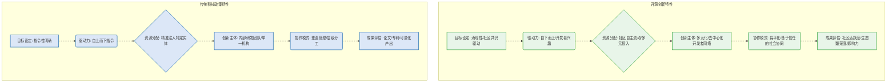

# 引言

全球科技竞争日益加剧，将开源推向了创新的核心位置。像DeepSeek这样的大型模型项目持续涌现，不仅昭示着技术迭代的迅猛，更突显了**自下而上、社区驱动、市场主导**的协同创新模式所蕴含的巨大潜能。开源，以其开放、共享的本质，日益展现出显著的**公共产品属性**，其知识溢出和生态价值远超个体贡献的回报。然而，当我们审视国内各级政府在积极拥抱这股开源浪潮的同时，一个深层矛盾却日益凸显：我们根植于工业时代的传统治理模式，正面临如何有效适应并切实赋能网络时代创新逻辑的严峻挑战。这种内在的不适配，不仅可能导致政策效能低下、资源错配，更深远地看，它可能无形中抑制了开源生态最可贵的自发创新活力，进而阻碍我国在全球开源版图中占据战略高地。本报告旨在深入剖析这一根本性矛盾，以适应性治理 （Adaptive Governance）和网络治理 （Network Governance）理论为指导，通过深度的分析和洞察，提出一套系统且具备独立研究价值的政府开源政策规划与实施建议框架。这个框架的核心目标，是构建一个更健康、可持续的开源生态，最终塑成**政策搭台、社区唱戏、市场买单**的良性循环。

# 一、 传统科技激励范式与开源创新特性的内在差异

我国长期以来的科技激励模式，其设计理念主要服务于工业时代对确定性、可控性及可量化产出的追求。这种模式在推动国家级重大工程或由单一主体主导的关键技术攻关中，无疑展现了卓越的组织效能和资源聚合力。然而，当这一固有范式尝试适应开源领域时，其与开源创新本质特征之间的内在差异便逐渐显现。这并非原有模式的缺陷，而是两种创新逻辑在机制上的不同侧重。

传统激励体系的首要特点在于指令性目标的明确与自上而下的资源配置。从项目立项到最终验收，其路径往往预先设定，资金也精准地注入特定的研发实体。这种模式擅长集中力量办大事。然而，开源项目却以其自下而上的涌现性为显著特征，其演进轨迹通常由全球开发者群体的共同兴趣、社区共识以及瞬息万变的市场需求所共同驱动。例如，DeepSeek大模型的持续迭代与性能优化，在很大程度上源于其开源社区的自发反馈与贡献，而非完全遵循预设的线性路线图。这种在目标设定与路径生成上的差异，意味着过度依赖指令性政策时，可能难以完全捕捉和激发开源最宝贵的自发创新活力，甚至可能将“开源”视为一项完成任务的指标，而非促进群体智慧汇聚的途径。

进一步审视，传统激励模式在创新主体的识别与协作方式的评估上也存在固有侧重。它习惯于将有限资源集中于单一或少数大型机构内部的研发团队，重视组织内部的垂直管理与专业分工。然而，开源项目的成功恰恰在于其多元化、去中心化的协同网络。贡献者可能遍布全球，身份各异，他们通过扁平化、基于信任的协作模式共同推动项目进展，而非传统的层级管理结构。DeepSeek的成功正是其核心团队与外部开发者、研究人员高效互动的成果。如果现有政策未能充分识别并有效激励这种无边界、基于信任的社会化协同，那么它可能会忽视开源生态中最具活力且富有潜力的部分，导致宝贵资源无法精准流向那些真正驱动项目持续演进的草根创新力量。


图：传统科技政策与开源创新特性差异对比示意图

# 二、 开源项目内生挑战：平台化模式下的发展瓶颈

即使是阿里通义、DeepSeek这类广泛使用的开源大模型项目，其自身发展亦非坦途。其看似成功的模式背后，同样潜藏着深层次、亟需系统性策略应对的挑战。这些难题并非仅限于短期运营层面，它们更是此类平台化、生态化战略在实际落地过程中普遍面临的内在瓶颈。

首要挑战在于贡献者激励的复杂性以及社区活力的持续维系。开源项目的核心生命力源自外部开发者的积极参与。然而，对于像DeepSeek这样技术门槛高企、系统复杂性巨大的大模型项目，个人贡献者的投入与他们所能获得的直接回报（如社区声望、技术挑战的满足感）之间，往往存在不对称性。相较于企业内部拥有稳定薪资和明确职业发展路径的核心团队，外部贡献者如果难以获得足够的认可或有效的职业转化机会，他们长期投入的热情势必衰减。此外，大模型本身的复杂性意味着陡峭的学习曲线，如果项目缺乏完善的文档、易用的工具链以及高效的沟通机制，外部开发者将难以有效参与，这无疑会直接影响社区的活跃度和整体协同效率。对于影响力较小、资源有限的中小型开源项目而言，这一挑战尤为突出，它们往往面临社区冷启动困难、难以吸引并挽留核心贡献者的困境。

其次是商业利益与开源目标之间平衡的艺术。像DeepSeek这样的企业，其开源大模型并非纯粹的无偿奉献，而是其更宏大平台战略的关键一环——旨在通过开源吸引开发者、构建生态，最终通过增值服务实现商业价值。这便引出了一个核心矛盾：企业必须在代码开放的广度与自身核心技术壁垒的构建之间进行精准权衡。过度开放可能稀释其未来商业化产品的独特性和竞争力，而开放不足则难以形成吸引力并构建广泛的开发者生态。此外，如何将开源大模型的巨大影响力转化为可持续的商业收入，其商业模式的探索充满了不确定性。当社区纯粹追求技术开放，而企业又必须兼顾盈利边界时，两者之间的潜在张力如果处理不当，甚至可能导致社区的流失或内部的分裂。这种在商业考量与开放原则之间寻求动态平衡的艺术，是每个平台型开源项目都必须持续面对的内生挑战。

# 三、 政府角色的深层重构：驱动开源创新正循环

鉴于传统激励范式与开源创新特性的内在差异，以及开源项目自身所面临的内生挑战，政府在开源体系与生态建设中的职能必须进行一次根本性的深层重塑。这超越了简单的职能调整，更是对公共服务理论和治理理论的深刻实践 [1, 2]。它旨在从传统的“管理者、裁判员、评价者”角色，转变为**“赋能者、协调员、支持者”，以期实现**政策搭台、社区唱戏、市场买单**的良性循环。正如总理曾强调的，政府要有“店小二”的服务意识，这正是对新时代政府角色定位的精辟概括，意味着要主动靠前服务，为市场主体提供更便捷、更高效、更具预见性的支持。

## 3.1 战略赋能：构建数字基座与优化生态环境

政府应彻底摆脱直接干预项目的传统思维模式，转而专注于提供公共的、可信赖的基础设施，并精心培育良性的制度环境，其角色定位应如同创新生态的**园丁**。

这首先体现在基础设施的系统性构建上。政府需要策略性地投资建设国家级的开源开发平台，这不仅仅是提供代码托管服务，更应是一个集开发、测试、验证到部署全生命周期管理于一体的工具链集成环境。这样的平台必须确保高安全性、高可靠性以及贡献的可追溯性，从而能够有效支撑DeepSeek这类大规模复杂项目的协同研发。同时，针对AI大模型对极限算力的需求，政府应建立或整合公共高性能计算资源，并以合理成本向开源项目和科研机构开放，以此大幅降低创新门槛。这种对基础设施的投入，正是基于公共物品理开源，以其开放、共享的本质，日益展现出显著的公共产品属性**，其知识溢出和生态价值远超个体贡献的回报。论的考量。在开源生态中，安全可靠的开发平台、高性能计算资源等具有非竞争性和非排他性，由政府提供能够有效克服市场失灵，降低个体参与成本，从而促进整体社会福利的提升 [3]。此外，对开源项目托管服务的标准化以及相关技术标准的制定支持，将为整个开源生态提供统一的基准和协同规范。

其次是生态环境的战略性优化。政府需主动营造一个对开源高度友好的政策环境。这包括：细化开源知识产权政策，明确各类开源许可证的法律效力，并提供权威的法律指引，从而消除企业在开源核心技术时的法律顾虑。推动公共数据开放共享机制的建立至关重要，在严格保障隐私和数据安全的前提下，为大模型训练提供高质量、合规的数据集，这无疑是DeepSeek等AI项目的核心**燃料**。这实质上是对制度经济学在开源领域的运用。清晰的知识产权政策、公共数据开放共享机制，以及优化的人才流动政策，构建了稳定且可预期的制度框架，有效降低了市场主体的交易成本和不确定性，从而激励更多企业和个人投入开源创新活动，促进要素的自由流动与高效配置 [4]。最后，政府应积极构建国际合作框架，吸引全球顶尖人才和项目参与国内开源生态，并优化人才流动政策，确保创新人才能够无障碍地参与到开源生态中来。

## 3.2 策略协调：平衡多方利益与构建风险管控体系

政府的职能将从单纯的规则制定和对错评判，深化为积极平衡开源生态中多元主体之间的利益关系，并构建系统性的风险应对机制，以此保障整个生态系统的和谐与韧性。

其核心在于构建精妙的平衡机制。政府需要审慎协调企业所追求的商业利益与开源项目所代表的公共利益之间的潜在张力，鼓励企业通过开源构建生态优势，同时确保开源成果能够真正惠及更广泛的社会群体。这正是利益相关者理论在公共政策领域的具体体现。开源生态涉及多方主体（企业、开发者、用户、政府），各自拥有不同的利益诉求。政府作为协调者，需要识别并平衡这些多元利益，确保政策既能激发商业活力，又能保障公共价值，避免任何一方利益的过度倾斜 [5]。最终的目标是追求一种帕累托改进的状态，即通过政策调整，使得至少有一方状况变好，而其他任何一方的状况都不会变差，逐步将整个开源生态推向帕累托最优的理想边界，以实现公共利益的最大化和各方利益的协调共赢 [6]。

同时，政府必须构建系统性的风险管控体系。这涉及到对开源软件供应链安全的前瞻性评估与严格监管，包括识别潜在的技术依赖风险点，并制定相应的法律和政策预案。对于AI大模型等可能涉及海量数据的开源项目，必须建立健全的数据安全和隐私保护监管框架，确保数据在合规、安全的前提下高效流转。这体现了现代风险治理理论的要义。在高度互联和复杂的技术生态中，单一主体难以有效应对系统性风险。政府的角色在于建立健全的风险识别、评估、应对和沟通机制，通过立法、标准和国际合作，将技术风险转化为可管理的治理挑战，为开源生态的稳定运行提供坚实保障 [7]。此外，政府还需要强化知识产权保护机制，有效应对开源领域的侵权行为，并针对可能来自外部的跨境技术风险（如出口管制）建立健全的法律应对机制，为开源生态的稳定运行提供坚实的保障。

## 3.3 深度支持：重构评价体系与完善长期支持机制

政府的职能将从过去的“考评者”模式，彻底转变为提供持续性、多维度支持与激励的“支持者”。这要求政策能够精准识别并培育开源生态的内生增长动力。

这首先意味着评价体系的深层重构。传统的评价框架偏重于论文、专利等易于量化的显性成果，但却难以准确衡量开源项目的真正价值。新的评价体系应转向多维度、综合性的评估框架，不仅关注项目的技术创新度、代码质量，更应侧重于其社区活跃度、开发者参与度、生态繁荣度（例如，DeepSeek大模型在下游应用中的广度、被集成情况）、国际影响力以及商业模式的可持续性。这种更为全面的评价体系将有效引导资源流向那些真正具有生命力、能够吸引群体贡献的开源项目，而非仅仅追求短期的“完成任务”或表面文章。这种转变是对传统新公共管理中过度强调量化KPI的反思，更注重绩效的质量与社会影响力的综合评估 [8]。

其次，政府需要构建长期、可持续的支持机制。这包括设立长周期、稳定的开源发展基金，而非碎片化、短期导向的项目资助，以持续支撑开源项目漫长的孵化和演进过程。同时，应引入滚动评估机制，根据项目的动态发展和社区反馈进行灵活调整，而非僵化的**一刀切**式结题。这种长周期的支持策略，正体现了策略性管理的理念，即政府在公共领域需要具备长期眼光和弹性机制，而非短期的项目制管理，以应对创新发展中的不确定性，确保资源的持续投入和有效再分配 [9]。此外，政府还应探索风险分担机制，鼓励企业和社区大胆探索前沿开源领域，并通过合理的退出保障机制，确保资源能够被及时重新分配到更有前景的项目上，避免无效投入，从而提升整体资源利用效率。

## 四、 政策激励的具体策略：双向赋能，协同发展

一个健康可持续发展的开源生态，其蓬勃生长必然离不开有效的激励政策。这些政策必须是双向且全面的，既要精准解决企业在拥抱开源过程中面临的痛点和瓶颈，也要实实在在地惠及广大的个人参与者和开发者。在此基础上，我们强调，开源激励政策不应被视为一个独立的、另起炉灶的增量，而应深度融入并赋能我国现有的科技、产业和人才政策体系。通过在原有政策中增设与开源相关的关键指标，可以有效发挥“指挥棒”的引导作用，将资源和精力高效引向开源领域，同时最大限度地避免政策碎片化和重复建设。

## 4.1 解决企业开源的挑战与瓶颈

企业在拥抱开源，特别是开源大模型项目时，会面临一系列独特的挑战。有效的激励政策需要精准定位这些问题。

**投入与产出的不确定性**： 企业在开源项目上投入大量研发资源，但商业回报路径不清晰，且知识产权保护、技术泄露风险令企业顾虑重重。对此，政策应提供税收优惠和专项补贴，例如对积极开源、贡献代码的企业，提供研发费用加计扣除、国家高新技术企业认定加分等政策，实质性降低其财务成本。同时，应探索混合许可模式下的知识产权保护机制，允许企业在开源的同时，通过商业化产品或服务获得收益，确保其创新成果的合理回报。在政府采购和示范项目方面，政府在采购信息技术服务时，应明确优先考虑采用开源技术和产品的企业，或设立开源大模型应用示范项目，为企业提供清晰的市场信号和可预期的商业机会。

**人才流失与团队稳定性**： 优秀开源人才往往拥有较强的独立性，企业担心投入培养的开源人才被其他公司或社区吸引，导致项目维护和迭代稳定性受影响。针对此，应建立国家级或行业级的开源贡献者荣誉体系，认可企业内部的开源贡献，鼓励企业将开源贡献纳入员工绩效考核和晋升体系，以此提升人才的内部归属感。同时，提供人才培养补贴，支持企业内部开展开源技术培训、派遣员工参与开源社区活动，帮助企业提升员工的开源技能和对企业的忠诚度。

**技术标准与互操作性**： 开源大模型领域标准缺失，企业间可能出现“重复造轮子”或兼容性问题，影响产业链的协同效率。对此，政府应引导标准制定，鼓励和支持行业龙头企业、高校、科研院所牵头或积极参与开源大模型相关标准（如模型接口、数据格式、评估基准）的制定，并通过政府背书推广这些标准，形成行业共识。此外，建立协同研发平台，在政府支持下构建跨企业、跨机构的开源大模型协同研发平台，促进技术共享和联合攻关，有效避免资源浪费和重复投入。

## 4.2 惠及广大参与者（个人开发者、研究人员、社区贡献者）

开源生态的真正活力来源于个人贡献者，他们的热情、创新和奉献是开源项目持续发展的核心驱动力。

**贡献的认可与价值转化**： 个人贡献者往往缺乏官方认可，其在开源社区的投入难以直接转化为职业发展或经济收益。为解决此问题，应建立权威贡献者认证体系，在国家层面设立开源贡献者认证、荣誉称号（如“杰出开源贡献者”），将其纳入人才评价体系，与职称评定、高层次人才引进、户籍办理等挂钩，提升其社会地位。同时，设立专门的开源奖学金，鼓励学生和研究人员积极参与开源项目；为基于开源大模型的创新性研究提供专项资助，激发学术创新。对于个人开发者发起的有潜力的开源项目，应提供个人项目孵化支持，如种子基金、导师辅导、孵化器入驻等，帮助他们将技术想法有效转化为实际应用或创业项目。

**技能提升与知识获取**： 缺乏系统性的开源技能培训，个人学习成本高，难以获取最新、高质量的开源知识。对此，应资助高校和在线教育平台开发高质量的开源大模型课程、教材和实训平台，并免费向公众开放，降低学习门槛。此外，组织和资助各类开源工作坊与黑客松活动，提供交流学习、实践演练的机会，促进技能的快速提升。

**社区参与的便利性与支持**： 个人参与开源社区可能面临语言、时区、技术门槛等障碍，缺乏必要的工具和支持。为此，应提供公共基础设施支持，如免费或低成本的云计算资源、测试环境、代码托管等，显著降低个人参与的技术门槛。同时，鼓励和资助个人开发者参与国际交流活动，如国际开源会议、项目合作，从而提升我国开源社区的国际影响力和话语权。最后，对积极维护开源大模型社区、组织社区活动、编写高质量文档的个人或团队提供社区运营经费或奖励，鼓励社区自我管理和发展。

# 五、 开源服务业的培育与发展

开源政策的视野不应仅限于开源项目本身的扶持，更应着眼于推动和引导一个新兴产业——开源服务业的发展。这一产业能够为开源生态提供持续的市场化支持，其发展模式本身就是对公共产品理论和帕累托累进理论的深刻实践。

GitHub便是这类服务的典型范例。尽管GitHub本身并非开源项目，但其提供的代码托管、协作管理、版本控制等服务，以及由此形成的“Social Coding”文化，极大推动了全球开源的普及和效率提升。它的成功证明了，通过提供高价值的配套服务，可以围绕开源这一**“公共产品”构建可持续的商业模式，有效解决开源核心项目“反公地悲剧”和“搭便车”**问题，促使私营部门在开源软件开发和维护中发挥更积极的作用。这种由市场形成的支持，具有更强的内生动力和持续性，也能避免政府的重资产投入和直接下场竞争，从而更符合“店小二”的服务精神。

政策规划应积极鼓励和激发更多企业投入到开源服务这个新兴产业中来，形成多层次、多元化的服务供给体系：

**明确开源服务业的产业地位**：在国家产业分类和支持政策中，明确将开源咨询、定制开发、运维支持、安全审计、合规服务、社区运营服务、培训认证、生态集成等开源服务业态纳入重点发展范畴。

**鼓励市场化服务创新**：设立专项引导基金，或通过税收优惠等方式，鼓励企业开发基于开源生态的创新服务产品和解决方案。例如，面向企业客户的开源治理工具、开源风险管理平台、开源人才匹配服务等。

**政府采购对开源服务的倾斜**：在政府信息系统建设和运维中，除了优先采购开源软件，更应优先采购具备开源服务能力的企业所提供的专业服务。通过政府订单培育市场，为开源服务企业提供稳定的成长空间，从而构建一个由市场需求驱动的开源服务市场。

**支持开源人才服务机构**：鼓励和扶持专注于开源人才招聘、培训、派遣的专业服务机构，弥合开源技能供需缺口，为开源生态输送高质量人才，促进人才要素的优化配置。

**促进开源服务认证与标准化**：推动行业协会或第三方机构制定开源服务质量标准和服务能力认证体系，提升开源服务市场的专业化水平和可信度，降低用户选择服务的风险，形成良性竞争。

通过这些举措，开源政策规划就不仅仅是**锦上添花**的支持，而是通过培育开源服务业，激发出更多市场力量，为开源项目的长远发展提供可持续、有活力的支持。这正是将开源的公共属性与市场机制有效结合，实现社会总福利提升的帕累托改进路径。

# 六、 结合现有政策的开  源激励策略

与其另起炉灶，不如在现有成熟的政策框架中注入开源基因。以下是一些具体的结合策略，旨在通过增设与开源相关的指标，有效发挥“指挥棒”的作用，引导资源和精力流向开源领域。

## 6.1 科技项目与人才评审中的开源权重

现行的国家和地方科技项目申报、人才引进与职称评定体系，大多侧重于论文、专利、获奖情况等传统显性成果，未能充分反映开源创新的价值。为修正这一偏颇，应在各类科技计划（如国家重点研发计划、自然科学基金等）的项目指南中，明确鼓励项目采用开源技术、贡献开源代码，并将项目成果的开源情况、社区活跃度、国际影响力及被复用程度纳入评审指标，使其成为重要的加分项甚至必要条件。在人才评价体系中，如院士评选、高层次人才引进、专业技术职称评定，应实质性增加对开源贡献的考量，设立“开源贡献”类别或显著的加分项，具体可包括核心开源项目维护者身份、在国际知名开源社区的活跃度与影响力、主导或深度参与开源标准制定、以及开源项目在产业中的实际应用案例和产生的社会经济效益。此外，鼓励并引导国家级科研机构、高校率先将开源贡献纳入科研人员的绩效考核和职称晋升体系，通过内部激励机制，形成强大的示范效应和榜样力量。

## 6.2 政府采购与产业扶持中的开源偏好

政府作为巨大的采购方和产业政策制定者，可以通过市场杠杆直接而有效地推动开源生态发展。在《政府采购法》及其实施细则中，应明确规定在同等功能、性能和安全水平下，优先采购符合国家安全标准和信创要求的开源软件和服务。此举能为国内开源企业提供稳定、可预期的市场需求，扶持其成长。同时，在现有产业引导基金、中小企业发展基金以及国家集成电路产业投资基金等框架下，开辟开源方向的子基金或专项资金，重点扶持基于开源技术的初创企业、开源基础设施服务商和提供开源解决方案的核心企业，从而促进产业链的完善。此外，鼓励各类高新技术产业园区、科技企业孵化器设立开源专业园区或孵化基地，为早期开源项目和企业提供低成本的办公空间、高性能[11] Pareto, V. (1906). Manual of Political Economy. (Translated by A. S. Schwier, 1971, Augustus M. Kelley Publishers).计算资源和专业导师辅导，构建有利的创新土壤。

## 6.3 知识产权与标准制定中的开源兼容

开源与知识产权、标准看似存在张力，但通过精巧的政策设计，二者完全可以兼容共生，甚至相互促进。在现行知识产权法律法规框架下，应进一步明确开源许可证的法律效力、侵权认定和救济途径，提供清晰的法律指引，以此消除企业采纳开源时的法律顾虑。同时，探索混合许可模式的法律适用，鼓励企业在核心技术上采用“内源+开源”或“商业许可+开源”的模式，在有效保障其商业利益的同时，促进技术知识的广泛扩散与创新。在标准制定方面，应鼓励并引导企业、科研机构在参与国家标准、行业标准制定时，积极采纳和贡献开源技术规范。对于已经通过开源实践形成的事实标准，政府应给予更快的转化通道和推广支持，将其纳入国家标准体系，以提升我国在全球技术标准领域的话语权。

## 6.4 教育与人才培养体系中的开源融入

人才是开源生态蓬勃发展的基石。将开源理念和核心技能深度融入教育体系，是从根本上培养未来创新力量的长远之计。应鼓励高校计算机、软件工程、人工智能等相关专业，将开源理论、开源项目实践、以及参与开源社区的经验纳入必修或重要选修课程，大幅提升学生的开源认知和实际操作能力。同时，鼓励企业与高校、职业院校建立紧密的合作关系，共同开发开源实训项目，为学生提供参与真实开源项目的机会，实现理论与实践的有机结合。此外，将开源相关技能，如开源项目管理、开源安全审计、开源代码贡献等，纳入国家职业技能等级认定体系，颁发权威证书，显著提升开源从业者的社会认可度和职业发展前景。

## 6.5 金融与投资政策中的开源考量

资本是科技创新的血液，有效引导金融机构关注开源领域的独特价值，是加速其发展的重要推手。应鼓励和引导风险投资（VC）、私募股权基金（PE）设立专门的开```mermaid源投资方向，对具有高成长潜力的开源项目和企业进行精准投资。政府可提供风险补偿、绩效奖励等激励措施，降低社会资本的投资风险。同时，```mermaid鼓励银行等传统金融机构开发针对开源企业的特色信贷产品，例如基于无形资产（如开源社区影响力、核心代码库价值）的质押贷款，以及基于未来商业化服务收入预期的授信，以此有效解决开源企业的融资难题。

## 七、 法律法规支撑：开源生态健康发展的基石

一个健康可持续发展的开源生态，其蓬勃生长必然离不开坚实的法治基石。政府在法律层面的支持，不仅能够明确行为底线、保障各方权益，更能厘清责任、促进规范，为开源的持续繁荣提供稳定预期。这无疑是一个中长期、需要跨学科深入论证的重大课题。鉴于当前我国部分法律法规在应对开源挑战方面存在的空白或适用不足，立即启动相关立法工作显得尤为必要且紧迫。这正是规制理论在开源领域的应用，通过设立合理的法律规范，降低市场参与者的不确定性，引导健康发展 [10]。为此，我们建议成立一个由法学、技术、经济、产业等多领域专家组成的专项课题组，以启动这项具有战略意义的工作。

**首先，是开源许可证的法律地位与效力确认。** 目前国内对各类开源许可证的法律效力、侵权认定及救济措施，尚未形成统一且权威的解释。例如，对于GPL、MIT等国际通用许可证在我国法律体系下的约束力，仍存在模糊地带，这为企业和开发者带来了不确定性。法律必须明确开源协议在中国法律体系下的约束力，为市场主体提供清晰的行为准则，从而消除因法律不确定性带来的顾虑，促进更大范围的采纳与合作。

**其次，是开源软件知识产权的保护与创新激励。** 这包括明确开源模式下，开发者对其贡献代码的著作权归属和行使方式。更具前瞻性的是，法律层面可探索鼓励开源项目中的专利策略，如支持企业采取专利不主张或专利交叉许可等机制，确保专利不成为开源协作的障碍。从法律与经济学的角度看，清晰的知识产权界定与激励机制，能够有效降低创新主体的风险，促进知识溢出和价值创造，避免因模糊的权利归属而抑制创新活力 [11]。同时，应深入研究如何通过法律框架对开源贡献者提供多元化的激励，例如在特定领域的税收优惠或在国家科技项目申报中的优先权，以认可和回馈他们的智力劳动。

**再者，开源软件供应链安全与合规管理的法律框架刻不容缓。** 随着开源组件在关键信息基础设施中的广泛应用，其潜在的安全漏洞和恶意代码风险日益凸显。现有法律对软件开发商和使用方在开源组件安全管理方面的责任划分仍不够清晰。法律应明确各方责任，建立强制性或鼓励性的安全漏洞披露机制，并支持构建国家层面的开源软件安全标准和供应链溯源体系。同时，针对可能面临的域外法管辖和出口管制风险，法律层面需要提前研究并提供应对策略，积极借鉴国际上在关键信息基础设施安全保障方面的经验。

**此外，数据开放与共享的法律规范，特别是对于AI大模型的发展至关重要。** 法律需要推动公共数据的合规开放共享，并探索数据作为新型生产要素的法律框架，规范企业间的数据共享协议和责任，确保数据在合法合规前提下流向开源创新场景。与此同时，必须持续强化数据隐私保护，确保技术进步不以牺牲公民基本权利为代价。

最后，促进开源商业模式健康发展的法律保障也必不可少。法律需要明确和鼓励基于开源的服务模式（如咨询、部署、定制、运维等）的合法性，为其提供明确的市场空间。同时，应健全反垄断和反不正当竞争的法律细则，防止大型企业利用开源形成新的市场垄断或不公平竞争优势。通过法律层面的引导和保障，确保政府和国有企业优先采购符合条件的开源软件和服务，为开源企业的成长提供公平、健康的竞争环境。

# 结语

政府在开源体系与生态建设中的角色重塑，是从工业时代治理模式向网络时代创新逻辑的深刻蜕变，其本质是理解并顺应创新规律的必然选择。通过精准定位政府的赋能、协调、支持职能，并在基础设施、生态环境、利益平衡、风险管控、评价体系与长期支持等方面进行系统性政策重构，特别是通过将开源激励策略深度融入现有科技、产业、人才、教育和金融政策，并辅以坚实的法例支撑，我们才能真正构建一个**政策搭台、社区唱戏、市场买单**的开源创新正循环。这将释放出巨大的创新潜能，推动中国科技创新迈向更高层次，更将在数字经济、产业升级和全球科技竞争中发挥关键作用，最终为实现高水平科技自立自强奠定坚实基础。

```mermaid
flowchart TD
    root[开源政策框架]
    %% 第一模块：开源数字公共基础设施建设
    subgraph 一_开源数字公共基础设施建设
	direction LR
        基础设施_1[高性能计算与专用环境]
        基础设施_2[开源工具链与服务生态]
        基础设施_3[开源项目全生命周期支持平台]
        基础设施_4[开源项目与组件知识库]
    end
    %% 第二模块：开源贡献评估体系重构
    subgraph 二_开源贡献评估体系重构
	direction LR
        评估_1[多维度综合评估框架]
        评估_2[科学量化与定性结合]
        评估_3[评价结果应用机制]
    end
    %% 第三模块：多层次激励政策体系
    subgraph 三_多层次激励政策体系
        %% 企业激励子模块
        subgraph 企业激励["企业层面激励"]
            企业_1[税收优惠和专项补贴]
            企业_2[混合许可模式下的知识产权保障]
            企业_3[政府采购和示范项目]
            企业_4[人才培养与稳定支持]
            企业_5[引导标准制定与协同研发]
            企业_6[特定产业/领域支持]
        end
        %% 个人激励子模块
        subgraph 个人激励["个人层面激励"]
            个人_1[权威贡献者认证体系]
            个人_2[开源奖学金与研究资助]
            个人_3[个人项目孵化支持]
            个人_4[开源教育资源建设]
            个人_5[开源工作坊与黑客松]
            个人_6[公共基础设施便利化]
            个人_7[国际交流活动支持]
            个人_8[社区运营经费或奖励]
        end
    end
    %% 第四模块：协同与风险治理框架
    subgraph 四_协同与风险治理框架
		direction LR
        风险_1[多方利益协调机制]
        风险_2[开源软件供应链安全监管]
        风险_3[数据安全与隐私保护]
        风险_4[跨境技术风险应对]
    end
    %% 第五模块：法治与标准保障
    subgraph 五_法治与标准保障
		direction LR
        法治_1[开源许可证的法律地位与效力确认]
        法治_2[开源软件知识产权的保护与创新激励]
        法治_3[开源软件供应链安全与合规管理法律框架]
        法治_4[数据开放与共享的法律规范]
        法治_5[促进开源商业模式健康发展的法律保障]
    end
    %% 第六模块：结合现有政策的开源激励策略
    subgraph 六_现有政策开源激励
		direction LR
        政策_1[科技项目与人才评审中的开源权重]
        政策_2[政府采购与产业扶持中的开源偏好]
        政策_3[知识产权与标准制定中的开源兼容]
        政策_4[教育与人才培养体系中的开源融入]
        政策_5[金融与投资政策中的开源考量]
    end
    %% 建立主连接关系
    root --> 一_开源数字公共基础设施建设
    root --> 二_开源贡献评估体系重构
    root --> 三_多层次激励政策体系
    root --> 四_协同与风险治理框架
    root --> 五_法治与标准保障
    root --> 六_现有政策开源激励
    %% 样式设计
    classDef root fill:#f0f8ff,stroke:#1e90ff,stroke-width:3px
    classDef module fill:#e6f7ff,stroke:#1890ff
    classDef submodule fill:#f6ffed,stroke:#52c41a
    class root root
    class 一_开源数字公共基础设施建设,二_开源贡献评估体系重构,三_多层次激励政策体系,四_协同与风险治理框架,五_法治与标准保障,六_现有政策开源激励 module
    class 企业激励,个人激励 submodule
```


图：开源政策规划建议框架示意图


# 参考文献

[1] Osborne, S. P. (2010). The New Public Governance? Emerging Perspectives on the Theory and Practice of Public Governance. Routledge.
[2] Rhodes, R. A. W. (1997). Understanding Governance: Policy Networks, Reflexivity and Accountability. Open University Press.
[3] Stiglitz, J. E. (2000). Economics of the Public Sector. W. W. Norton & Company.
[4] North, D. C. (1990). Institutions, Institutional Change and Economic Performance. Cambridge University Press.
[5] Freeman, R. E. (1984). Strategic Management: A Stakeholder Approach. Pitman.
[6] Pareto, V. (1906). Manual of Political Economy. (Translated by A. S. Schwier, 1971, Augustus M. Kelley Publishers).
[7] Renn, O. (2008). Risk Governance: Coping with Uncertainty in a Complex World. Earthscan.
[8] Hood, C. (1991). A Public Management for All Seasons?. Public Administration, 69(1), 3-19.
[9] Bryson, J. M. (2018). Strategic Planning for Public and Nonprofit Organizations: A Guide to Strengthening and Sustaining Organizational Achievement (5th ed.). Jossey-Bass.
[10] Baldwin, R., Cave, M., & Lodge, M. (2012). Understanding Regulation: Theory, Strategy, and Practice (2nd ed.). Oxford University Press.
[11] Landes, W. M., & Posner, R. A. (2003). The Economic Structure of Intellectual Property Law. Harvard University Press.

作者：野行僧郭晧
本作品采用CC-BY-NC-SA 4.0国际许可协议进行许可。详见 http://creativecommons.org/licenses/by-nc-sa/4.0/
