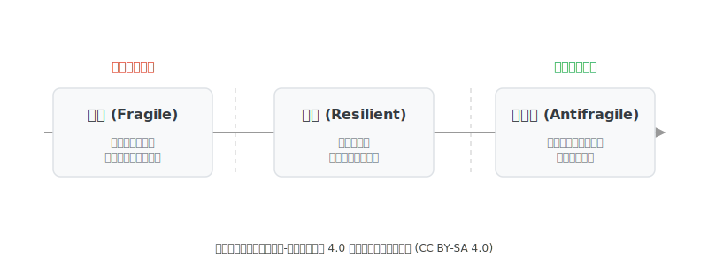
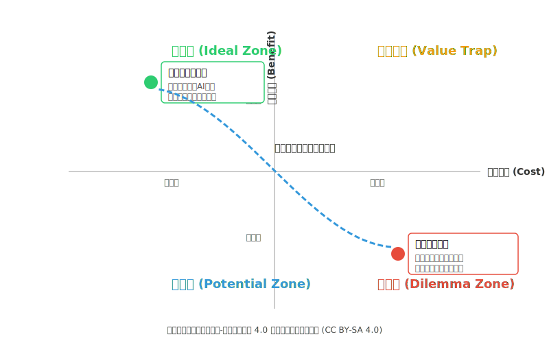
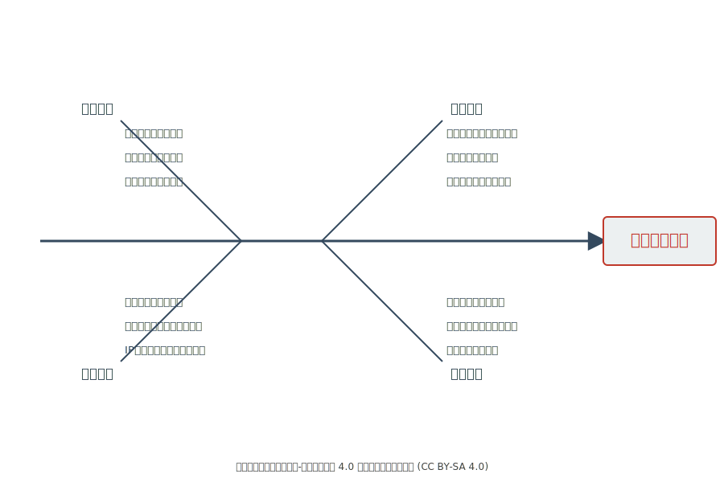
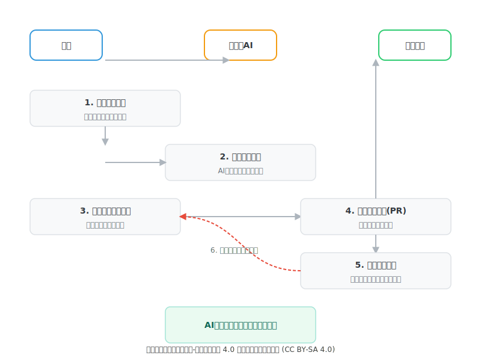
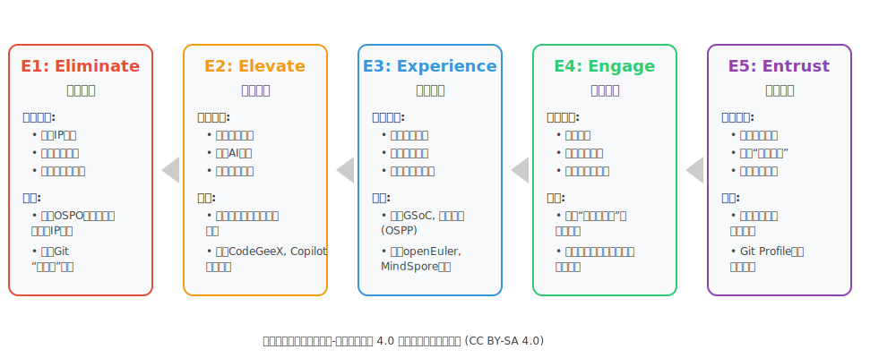
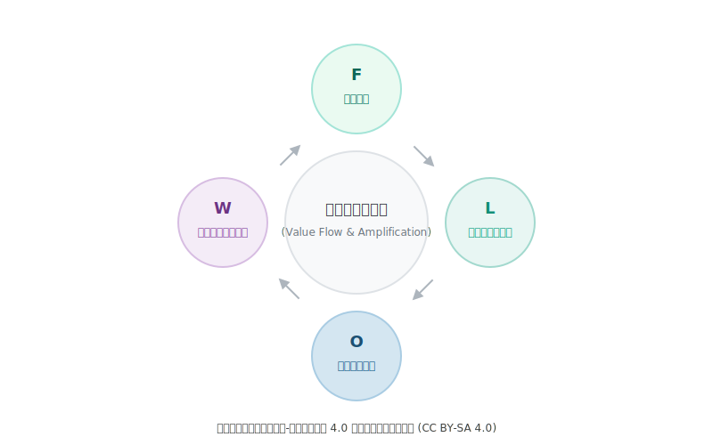
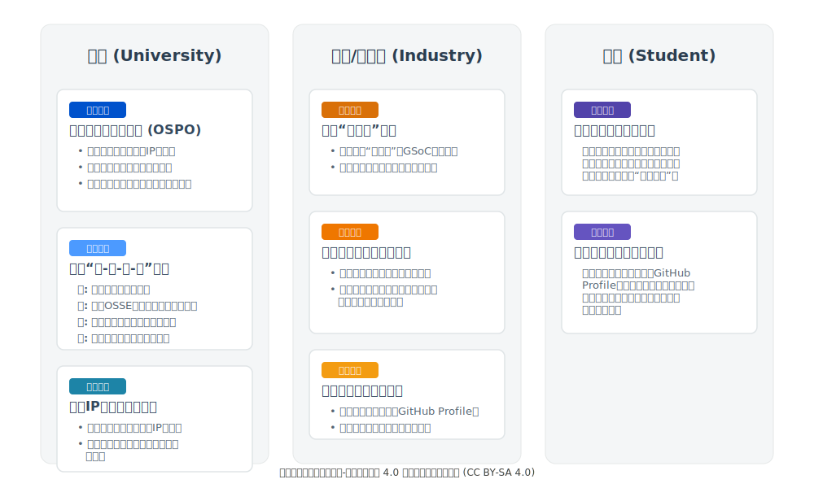

# 摘要

本报告旨在定义并阐述一个全新的交叉学科领域：开源教育工程学（Open Source Education Engineering）。这门工程学致力于研究如何系统性地设计、构建、运营和优化一个高效、可持续、可规模化的开源学习生态系统。它并非单一理论的集合，而是一个由多个核心组件构成的、自洽的工程体系。

本报告将详细解构“开源教育工程学”的四大核心组成部分：
1. 核心教学法：以生成式教育 x 开源工程学的深度融合，作为整个体系的“操作系统”，重塑知识获取与能力养成的底层逻辑。
2. 个体学习法（心法）：以U-First开源育人法，作为指导学生和教师在“第二课堂”中完成深度认知跃迁的“软件”。
3. 组织运营框架（行动纲领）：以E5四重境界开源参与框架，作为高校与企业建设和运营“第二课堂”的制度保障与“硬件”。
4. 未来基础设施：以教育开发者平台，作为“开源教育工程学”的终极实现形态，一个深度赋能学生与教师的综合性赋能环境。

通过对这一工程体系的系统性阐述，本报告旨在为解决当前开源教育困境提供一套完整的、可操作的“施工蓝图”，从而真正将开源“第二课堂”从一个美好的愿景，转变为一个能够持续培养“反脆弱”创新人才的现实。

# 第一部分：开源教育工程学的时代背景与核心问题
## 1.1 时代背景1：传统教育的“脆弱性”体现

面对一个由频繁且难以预测的“黑天鹅”事件所定义的世界，传统教育模式的局限性正变得前所未有地清晰。那种为稳定和可预测环境设计的、基于静态课程体系的教育，其培养出的毕业生在面对真实世界的波动与混乱时，往往表现出一种深刻的“脆弱性”（Fragility）。这种脆弱性并非指个人意志的薄弱，而是一种结构性的缺陷：当系统遭遇压力和冲击时，其表现会急剧恶化。因此，教育的目标需要进行一次根本性的跃迁，从追求“韧性”（Resilience）——即从冲击中恢复原状的能力，转向培养更高层次的“反脆弱性”（Antifragility）。

*图1：传统教育模式所面临的“脆弱性”问题*

“反脆弱性”这一概念，由思想家纳西姆·尼古拉斯·塔勒布（Nassim Nicholas Taleb）提出，描述了系统在经历冲击、波动、压力和错误时，不仅能抵抗伤害，反而能从中受益、变得更强大的特性 (Taleb, 2012)。一个具备反脆弱性的个体，能够在不确定性中茁壮成长，从失败中汲取养分，并持续进行自我优化与迭代。大学的使命，必须从一个倾向于“剥夺”学生接触压力源和随机性机会的封闭系统，演变为一个能够战略性地、有控制地让学生暴露于建设性挑战之中的开放生态。开源社区，以其固有的混乱、真实性与全球协作特性，恰好构成了这样一个理想的训练场。

## 1.2 时代背景2：中国开源生态的全面崛起对高等教育的影响

近年来，中国开源生态呈现出两大深刻且影响深远的新现象。首先，以OpenHarmony、openEuler等项目为代表的基础软件开源崛起，标志着中国的开源参与正从“应用”向更深层次的“创造”转变。其次，AI头部企业的战略性开源，从百度的飞桨（PaddlePaddle）和华为的昇思（MindSpore），到今天以DeepSeek、智谱ChatGLM、阿里通义千问、百度文心一言和月之暗面Kimi为代表的中国开源大模型全面崛起，正在构建自主可控的AI生态。

这两大趋势共同揭示了一个现象：我们对能够贡献于复杂系统底层的“创造者”和懂得在开放生态中协同创新的AI人才的需求，已变得空前迫切。这与创新管理领域的**开放式创新（Open Innovation）** 理论（Chesbrough, 2003）不谋而合，该理论指出，组织越来越依赖于外部知识和人才来驱动创新。高校作为知识与人才的源头，必须找到一个高效的机制与外部创新生态进行对接。“第二课堂”正是这一机制的最佳载体。然而，其建设的复杂性，要求我们必须超越零散的活动，采用工程化的思维进行顶层设计。

## 1.3 开源教育工程学要解决的核心问题：系统性的“成本效益”失衡

尽管需求迫切，但“第二课堂”的建设现状却不容乐观，其核心在于一个系统性的“成本效益”困境。我们可以借鉴经济学的交易成本理论（Transaction Cost Economics）（Coase, 1937）来深刻理解这一问题。对于学生而言，参与开源的“成本”，本质上是极高的交易成本：寻找合适项目的“搜索成本”、理解复杂代码库的“信息成本”、获得导师指导的“议价成本”等等。与此同时，其“效益”（如职业发展）却具有高度的不确定性。当交易成本过高而预期收益模糊时，理性的个体自然会选择退出。

*图2：开源进校园“成本效益”困境象限图*

因此，开源教育工程学的核心任务之一，就是设计一个能够显著降低交易成本、并提升和明确化预期收益的制度安排。下面的鱼骨图清晰地展示了这些高昂的“交易成本”是如何由学生、高校、企业和生态四个维度的因素共同构成的。

*图3：开源“第二课堂”建设的系统性挑战（鱼骨图分析）*

结论：问题的根源是系统性的、结构性的。任何单一维度的努力，都无法从根本上解决问题。必须构建一个能够同时作用于四个维度、协同解决这些根源问题的综合性教育新范式，才能建成一个真正有效的“第二课堂”。

## 第二部分：开源教育工程学的系统框架

开源教育工程学并非单一理论的集合，而是一个由多个核心组件构成的、自洽的工程体系。其核心目标，就是通过系统性的设计，来解决上述四个维度的所有挑战。

*图4：开源教育工程学系统框架图*

## 2.1 核心教学法（教法）：生成式教育方法

生成式AI的崛起，正在深刻地重塑教育的全貌。从个性化辅导到内容生成，“AI+教育”的应用场景日益广泛，为教育提质增效注入了强大的科技动能 。我们将其定义为“生成式教育”（Generative Education），即一种利用AI大规模生成个性化学习路径和内容的教育新范式。

*图5：生成式教育理论框架图*

这是开源教育工程学的“操作系统”，它从根本上改变了传统“课堂教育”的教学逻辑。这种融合根植于教育学的建构主义（Constructivism）（Piaget, 1971; Vygotsky, 1978）和联结主义（Connectivism）（Siemens, 2005）理论。建构主义认为，知识是学习者在互动中主动建构的，而开源社区正是这样一个理想的建构主义学习环境。联结主义则强调，在数字时代，学习是形成连接、构建网络的过程。生成式AI极大地增强了学生连接到庞大知识网络的能力，并扮演了维果茨基（Vygotsky）理论中*更有能力的他人（More Knowledgeable Other, MKO）的角色，帮助学生跨越其“最近发展区”（Zone of Proximal Development, ZPD）。基于开源软件工程的教学法和生成式教育的催化作用，我们构建了“FLOW流转式开源学习理论模型”（The FLOW Model for Open Source Learning）。这是一个由四个相互关联、循环促进的环节组成的实践框架，旨在系统性地破解前述的“成本效益”困境，为高校、企业和学生三方创造一个正向循环、持续发展的学习与创新生态系统。

在开源学习的语境下，生成式AI扮演着关键的“催化剂”角色。它有潜力解决前文提到的“高昂学习成本”问题。例如，AI可以：

- 充当私人代码导师：帮助初学者快速理解一个陌生的、庞大的代码库，解释复杂基于开源软件工程的教学法和生成式教育的催化作用，我们构建了“FLOW流转式开源学习理论模型”（The FLOW Model for Open Source Learning）。这是一个由四个相互关联、循环促进的环节组成的实践框架，旨在系统性地破解前述的“成本效益”困境，为高校、企业和学生三方创造一个正向循环、持续发展的学习与创新生态系统。
的函数或算法。
- 降低贡献门槛：为学生生成代码草稿、建议缺陷修复方案、辅助撰写技术文档或将文档翻译成多种语言。
- 赋能知识获取：开源的AI平台，如Hugging Face和LangChain，本身就成为了学生学习和实践的工具与社区。许多开源项目，如华为昇思MindSpore社区，也在积极探索AI大模型与开源生态的结合，例如研发出CodeGeeX这样的代码生成模型，为开发者提供强大助力。

然而，生成式教育也面临着严峻的挑战。最大的担忧在于，如果使用不当，AI可能导致学生产生思维惰性、形成依赖，甚至被用于学术不端行为，例如直接抄袭AI生成的答案或代码。目前许多“AI+教育”的应用，也存在系统设计封闭、创新生态不完善的问题，未能充分发挥其潜力。

正是在这里，开源与生成式教育的结合展现出其独特的价值。开源社区的内在机制，恰好可以化解生成式AI在教育应用中的核心风险。当AI辅助的学习过程被置于一个开放、透明、可追溯的开源工作流中时，其性质就发生了根本性的改变。

设想一个学生使用AI辅助完成一项开源贡献，其过程不再是一个封闭的“黑箱”操作。

*图6：AI辅助开源贡献的流程图*

1. 首先，学生需要向AI提出正确且具体的问题，这本身就需要对项目有初步的理解。
2. 其次，AI生成的代码仅仅是一个起点。学生必须理解这些代码，将其整合进现有的复杂代码库中，并确保其能够通过项目的自动化测试。
3. 接着，学生需要将自己的修改以“拉取请求”（Pull Request）的形式提交给社区。这意味着他们的代码，包括其背后的设计思路，将接受来自全球同伴和资深导师的公开审查。
4. 最后，学生可能需要在社区中公开回应质疑、解释自己的设计选择，并根据反馈进行多轮修改。
在这个流程中，AI从一个可能导致抄袭的“答案生成器”，转变为一个提升生产力的“智能伙伴”。学生无法简单地“抄袭”，因为开源的流程强制他们对最终的贡献负起全部责任，并进行深入的思考和协作。整个开源社区，以其固有的同行评审、透明记录（如Git的提交历史）和迭代改进的文化，为生成式教育提供了一个天然的、强大的“伦理与质量保障操作系统”。它完美地解决了“规模化”与“个性化深度学习”之间的矛盾，确保了AI在教育中的应用是建设性的、安全的、且能真正促进学生能力成长的。

## 2.2 个体学习法（心法）：U-First开源学习方法

这是开源教育工程学中的“软件”，是指导学生和教师个体如何在“第二课堂”中进行有效学习和引导的路线图。U-First方法的循环过程，与组织管理领域的双环学习（Double-Loop Learning）理论（Argyris, 1976）高度一致。真正的学习不仅是修正行为（单环学习），更是要挑战和改变底层的思维模式。U-First方法的谷底——“沉浸与构想”阶段，正是这样一个促使学习者从“如何做”转向“为何做”的双环学习过程。同时，整个循环，特别是“原型与行动”和“融合与创造”阶段，是教育心理学中反思性实践（Reflective Practice）（Schön, 1983）的典型体现。

*图7：U-First四阶段深度学习循环图*

U-First的四阶段深度学习循环详解：

学习的旅程始于感知与解构。在这个阶段，学生被引导成为社区的“人类学家”，其首要任务并非编写代码，而是通过阅读文档、贡献指南和行为准则，去记忆和理解社区的文化与规范。随后，他们被鼓励运用第一性原理的思维方式，去分析一个具体问题（如一个Bug或一项新功能）背后的根本逻辑，而不是仅仅停留在代码的表象。这个过程，恰好对应了布鲁姆认知阶梯中从“记忆”到“分析”的跃升。

在此基础上，学习者进入U型理论的谷底——沉浸与构想。这是一个连接外部观察与内在动机的关键转折点。通过导师引导或个人反思，学生需要回答一个核心问题：“我为什么想解决这个问题？”这个过程激发了他们内在的信念与激情。紧接着，他们再次运用第一性原理，去构想一个不受历史包袱束缚的、最简洁高效的解决方案。这是真正“创造”的萌芽，也是从分析到创造的又一次认知跃迁。

随之而来的是U型理论的右侧上升部分——原型与行动。这个阶段是“知行合一”理念的集中体现。学生需要快速构建一个“最小可行贡献”（原型），并以拉取请求（Pull Request）的形式提交给社区。提交、解释、回应评审意见的整个过程，就是一个集“应用”、“分析”与“评价”于一体的、在“做”中完成深刻学习的闭环。

最终，学习者在融合与创造中完成一次循环。社区的评审意见（Code Review）构成了宝贵的外部知识输入。学生必须深度评价这些反馈的有效性，将其与自己的认知融合，并采取新的行动（修改代码）。当一个有意义的贡献被合并（merged）到主分支时，学生便完成了最高层次的“创造”活动。他们不仅创造了代码，更创造了对社区、对用户、对自己都有价值的成果，并为开启新一轮更高层次的学习循环奠定了基础。

## 2.3 组织运营框架（行动纲领）：E5四重境界开源参与框架

这是开源教育工程学中的“硬件”，是高校和企业为“第二课堂”提供制度与环境保障的行动指南。我们可以将E5框架视为一个借鉴了软件工程领域能力成熟度模型（Capability Maturity Model, CMM）思想的“高校开源教育能力成熟度模型”。E1是初始级，E2是可重复级，E3是已定义级，E4是已管理级，E5是优化级。同时，E5框架中的制度化变革，如建立OSPO（E1）、改革评价体系（E5），也符合组织社会学中**制度理论（Institutional Theory）**的观点，即组织需要采纳某些结构和实践以获得外部环境的合法性与认可。

*图8：E5四重境界开源参与框架流程图*

框架的第一步是Eliminate（消除疑虑）。它的目标是为学生和教师的开源之旅移除初始障碍，创造一个规则透明、心理安全的“保护区”。这需要高校层面建立开源项目办公室（OSPO），制定清晰的知识产权（IP）政策，并为新手构建包含结构化入门指南和“安全提问区”的“新手村”。这一系列举措，旨在最大限度地降低参与的初始“交易成本”，应对学生普遍存在的“畏难情绪”和“目标模糊”。

在此基础上，**Elevate（能力提升）**环节致力于为学生的开源实践夯实知识与技能基础。这需要对现有课程体系进行现代化改造，例如将Git、代码审查等开源方法论融入专业课程，或开设专门的《开源软件工程》课程。一个同样重要的方面是，在课程中全面引入生成式AI工具作为个性化助教，这不仅能帮助学生理解复杂代码，也能将有限的教师资源从重复性答疑中解放出来，专注于更高层次的引导。

接下来，**Experience（实践赋能）**环节为U-First心法的完整循环构建了真实的“练兵场”。高校OSPO应积极组织和支持学生参与Google Summer of Code (GSoC)、开源之夏（OSPP）等全球性和全国性的品牌项目，并与头部科技企业深化合作，将openEuler、OpenHarmony等核心开源项目引入课堂，甚至作为毕业设计课题。学生不再是纸上谈兵，他们的学习过程与创造价值的过程在此合二为一。

随之而来的是Engage（生态融入）。这个环节的目标，是将学生的参与从单个项目的贡献者，提升为更广阔开源生态的积极公民。高校需要大力扶持像清华大学TUNA协会这样的学生开源社团，使其成为校园开源文化的“毛细血管”。同时，通过组织学生参与开源竞赛、鼓励其参与社区治理、资助其参加行业会议等方式，培养他们的归属感、领导力和社区影响力。

最后，**Entrust（信任建立）**环节为整个系统构建了强大的正向反馈和价值闭环。它直面高校“评价体系单一”和生态“价值认可链条断裂”的核心痛点。高校必须建立正式的制度，将学生在开源社区的有效贡献（如被合并的PR）纳入课程学分、奖学金评定和毕业设计评价体系。系统性地引导学生将GitHub Profile作为其动态、可验证的“第二张简历”进行管理。当开源世界的努力能够成功地“变现”为学术和职业上的双重价值时，一个可持续、正向循环的人才培养生态才得以最终形成。

# 第三部分：面向“人人皆为开发者”的教育开发者平台

## 3.1 平台理念：从基础设施到开发者关系

随着AI工具的普及，“人人皆为开发者”正从一句口号变为现实。这一深刻的转变要求我们的“第二课堂”也必须完成一次根本性的进化：从提供单一的课程或项目，转向构建一个为学生、教师、企业、社区和开源组织等多元主体服务的、综合性的、平台化的赋能环境。这个平台，我们称之为**“教育开发者平台”**，是开源教育工程学思想的终极承载与实现。

我们不需要重造一个GitHub或HuggingFace，但必须借鉴它们成功的核心——开发者关系（Developer Relations, De基于开源软件工程的教学法和生成式教育的催化作用，我们构建了“FLOW流转式开源学习理论模型”（The FLOW Model for Open Source Learning）。这是一个由四个相互关联、循环促进的环节组成的实践框架，旨在系统性地破解前述的“成本效益”困境，为高校、企业和学生三方创造一个正向循环、持续发展的学习与创新生态系统。
vRel）。传统的平台思维注重提供基础设施，而开发者关系的思维则更进一步，它关注如何精心设计和编排每一个参与者的体验，如何建立信任、激发贡献、促进知识的生产与流转，从而构建一个繁荣、自洽的生态系统。因此，这个平台的核心运营哲学可以被定义为**“教育开发者关系”（Educational Developer Relations, EduDevRel）**。

这一理念的构建逻辑，可以从经济学的平台经济学（Platform Economics）（Rochet & Tirole, 2003）和创新管理的创新生态系统（Innovation Ecosystem）（Moore, 1993）理论中获得深刻启示。教育开发者平台正是一个典型的多边平台，它通过降低互动成本，连接生态中的多元主体，并依靠网络效应（Network Effects）实现价值的指数级增长。它也是一个人才创新生态系统的“基石物种”（Keystone Species），通过提供核心基础设施和治理规则，赋能生态中的所有参与者共同创造和分享价值。

## 3.2 平台的价值主张：一个多边协作的生态价值网络

教育开发者平台的核心功能并非孤立的技术堆砌，而是围绕其核心参与者——学生、教师、企业、社区与开源组织——精心设计的一系列价值交换回路。平台通过编排这些回路，让每一个参与方都能在贡献价值的同时收获价值，从而驱动整个生态系统的网络效应和持续增长。

*图9：开源教育开发者平台生态系统图*

对于生态中最核心的知识生产者和学习者——教师和学生，平台必须营造无与伦比的体验。它作为一个高质量开放教育资源（OER）和真实世界项目的聚合器与策展人，能够依据学生的兴趣和能力水平，智能推荐合适的学习路径和入门项目。对于教师，平台则呈现为一个模块化的课程与案例库，允许他们像“搭乐高”一样，方便地组合现有OER模块或贡献自己的教学设计，从而快速构建出符合自身教学需求的、基于开源项目的课程。

这种体验由一个AI原生的开发与学习环境所支撑。学生可以调用深度集成的AI代码助手和AI助教，在一个从学习、编码、调试到贡献的全流程中获得智能辅助。教师同样可以调动AI助研工具，追踪前沿技术动态、分析开源项目演进趋势，并高效地准备教学材料。这种设计将AI从一个可能导致思维惰性的“答案生成器”，转变为一个激发创造力的“智能伙伴”。

平台最深刻的变革在于其过程性的能力认证与贡献认可体系。它不再仅仅关注最终的结果，而是记录和评估学生的整个学习过程。每一次代码提交、每一次有效的社区讨论、每一次被合并的贡献，都会被细致地记录下来，汇聚成一个动态、可信、多维度的能力画像。这份画像，即学生的“第二简历”，其价值远超传统的成绩单。对于教师，他们在平台上的贡献，如开发并分享了广受欢迎的课程模块、指导学生完成了高质量的开源贡献，同样被量化记录，并可作为其教学成果评估和学术声誉建设的重要依据。

最终，平台将作为一个高效的人才与机会连接器，依据这些动态的能力画像，为学生和教师自动匹配合适的实习、就业、科研合作乃至行业交流机会，从而完成价值的闭环。

## 3.3 平台的网络效应：产业与生态伙伴的价值共创

一个成功的平台，必须为所有参与方创造并传递清晰的价值，从而激发网络效应。企业不再是简单的“赞助商”，而是生态的共建者。它们可以通过平台发布真实的、经过精心设计的初级项目任务（good-first-issues），并输送宝贵的导师资源。作为回报，企业能够优先接触到经过平台认证的、具备真实项目经验的优秀学生人才，这不仅极大降低了招聘成本，更能精准地提升其在高校中的技术品牌影响力。

大型开源社区，如Apache或Linux社区，则可以通过平台，将其项目文化和贡献机会更有效地触达高校师生这一庞大的“后备军”。这种系统性的对接，能够帮助社区吸引新鲜血液，培养下一代的核心贡献者（Committer）和维护者（Maintainer），从而确保社区的长期健康与活力。

对于开放原子开源基金会等开源组织，这个平台可以作为其核心的教育拓展和生态运营阵地。它们可以在平台上发布官方活动（如“开源之夏”），推广其托管的项目，并调取平台的数据分析功能，更好地洞察高校开源生态的发展态势，进而制定更精准的扶持策略，最大化其社会影响力。

*图10：平台网络效应的价值演进路径*

这张象限图系统地阐述了平台的核心运营哲学：通过精心设计的多层次关系，驱动网络效应，达成从个体价值到生态价值的指数级增长。平台的横轴代表关系深度，从左侧的“短期/交易型”互动演进到右侧的“长期/战略型”合作。纵轴则代表价值范畴，从下半轴的“个体价值”跃升至上半轴的“生态价值”。平台的最终目标，是引导所有参与者沿着红色的“价值演进路径”，从左下角的“资源交换”象限，逐步跃迁至右上角的“生态共创”象限。

通过这种多边协作网络的设计，教育开发者平台超越了一个简单的工具集合，演变为一个能够自我增强、持续演进的人才创新生态系统。它通过精心设计的开发者关系，确保每一个参与方都能在贡献价值的同时收获价值，从而从根本上解决了“成本效益”失衡的困境，为“第二课堂”的成功建设奠定了坚实的基础。

## 第四部分：开源教育工程学的实施路径指南

基于开源软件工程的生成式教育方法和UFirst学习的催理论，并结合E5四重镜像开源参与架构，我们构建了“FLOW流转式开源教育工程学的学习模型”（The FLOW Model for Open Source Learning）。这是一个由四个相互关联、循环促进的环节组成的实践框架，旨在系统性地破解前述的“成本效益”困境，为高校、企业和学生三方创造一个正向循环、持续发展的学习与创新生态系统。

## 4.1 流转式持续学习生态系统组成

FLOW模型的核心逻辑在于，通过一个精心设计的闭环系统，让学生在开源社区的参与过程实现价值的“流转”与“增值”。其四个环节分别是：F - Fluidity of Knowledge (知识流转), L - Learner-Centric Collaboration (学习者中心协作), O - Open Ecosystem Engagement (开放生态参与), 和 W - Worthy Contribution & Recognition (有价值贡献与认可)。这四个环节共同作用，形成一个从“降低入门成本”到“实现明确回报”的完整通路。

*图11：流转式持续学习生态系统*

知识流转”（Fluidity of Knowledge）构成了FLOW模型的起点。它颠覆了传统教育中知识作为一种静态、固化资产的观念。在这里，知识不再是由教师单向“传授”给学生的固态物，而是在整个开源生态中动态生成、持续迭代、开放共享的“流体”。学习的核心方式随之转变为参与知识的创造过程，学生通过提问、讨论、撰写文档、审查代码等方式，成为知识流转网络中的一个活跃节点。生成式AI工具则极大地增强了知识流转的效率和可及性，它如同一个全天候的智能助教，帮助学生理解代码、生成内容、聚合信息。通过深度参与知识流转，学生培养出的最宝贵的能力，是在一个信息爆炸和技术飞速迭代的环境中“学会如何学习”的元技能。

紧接着，“学习者中心协作”（Learner-Centric Collaboration）成为模型的核心活动模式。它强调学习过程由学习者自身的需求和兴趣驱动，并在一个高度协作的真实环境中展开。学生不再是课程的被动接收者，而是项目的积极贡献者，他们的协作场域是真实的开源项目，而非模拟的课堂练习。这意味着学生的每一行代码、每一次提交，都可能对成千上万的真实用户产生影响，这种“真实性”带来了无与伦比的激励和责任感。在开源社区中，学习是网状的，而非线性的。学生不仅从资深导师那里学习，更在与全球同伴的代码审查等互动中学习。通过这种协作，学生不仅掌握了硬性的技术技能，更重要的是培养了开放协作精神、批判性思维、跨文化沟通能力和项目管理能力等面向未来的核心软技能。

随后，“开放生态参与”（Open Ecosystem Engagement）打破了大学的围墙，推动教育体系与全球开源创新生态系统进行深度、制度化的融合与互动。大学不再是一个孤立的知识岛屿，而是成为全球创新网络中一个活跃、开放、具有高度连接性的节点。这一环节的成功，依赖于在高校内部建立如开源项目办公室（OSPO）这样的核心支撑机构，以及在外部建立深度的产学研战略合作。通过制度化的生态参与，大学能够将最前沿的产业技术、项目和人才无缝对接到教育过程中，确保人才培养与社会需求的高度一致性。

最终，“有价值贡献与认可”（Worthy Contribution & Recognition）驱动着整个FLOW模型循环不息。它直接回应了学生和教师心中最根本的“成本效益”问题，通过建立一个多层次、清晰可见的回报体系，将参与开源的“效益”从一个模糊的期望，转变为具体、可量化、高价值的资产。这一环节的成功，标志着一种新型资格认证（credentialing）体系的崛起。学生通过开源贡献所建立的GitHub Profile，成为一种动态的、持续更新的、并由全球化专家社区共同验证的全新凭证。通过这个多层次的回报体系，FLOW模型为参与者构建了一个清晰的价值闭环，学生付出的努力，能够转化为即时的、中期的和长期的明确收益，使其成为一项高回报的战略性个人投资。

## 4.2 如何应对挑战？

下面的矩阵清晰地展示了FLOW模型的每个环节如何具体应对和解决当前高等教育所面临的核心挑战：

| 已识别的挑战  | F - 知识流转 | L - 学习者中心协作 | O - 开放生态参与 | W - 有价值贡献与认可 |
| :--- | :--- | :--- | :--- | :--- |
| **高入门门槛/陡峭学习曲线** | AI赋能的工具降低了理解代码和流程的初始技术障碍，让知识获取更平滑。 | 从“good first issue”等小而明确的任务开始，在同伴互助中逐步深入，降低畏难情绪。 | 丰富的项目生态让学生能找到与自身当前技能水平相匹配的切入点。 | 早期的微小贡献也能获得社区的即时反馈和认可，建立持续参与的信心。 |
| **缺乏导师指导** | 知识在社区论坛、文档中公开共创和沉淀，而非被少数教师垄断，形成分布式指导网络。 | 导师制内嵌于代码审查、公开讨论等项目工作流中，来自同伴和专家的指导无处不在。 | 高校OSPO和企业合作项目建立正式的导师渠道，如GSoC导师制 | 对“有价值贡献”的追求，激励学生主动寻找并与导师互动，形成良性循环。 |
| **理论与实践脱节** | 知识与鲜活、演进的项目绑定，永远保持前沿性和实用性，而非依赖过时的教科书。 | 所有学习都基于真实项目，为真实用户和组织解决真实问题，学以致用。 | “课堂”扩展为与全球产业标准和需求无缝对接的“无边界实验室”  | 贡献产生真实世界的影响力，这本身就是最强大的学习动机和简历亮点。 |
| **投资回报不明确 (ROI)** | 证明了在快节奏环境中持续学习和适应的能力，这是雇主高度重视的核心素养。 | 建立了可验证的协作项目经验组合，成为求职中的关键差异化优势。 | 在社区中直接与行业专家建立联系，创造了宝贵的职业社交机会。 | 直接提供明确的“收益”：物质激励、社区声誉，以及可量化的“职业资本”（Git Profile）。 |

## 4.2实施路径指南

将FLOW模型从蓝图转变为现实，需要大学、企业、基金会与学生三方协同行动，各自扮演不可或缺的角色。这是一份旨在激活整个生态系统的战略行动路线图。

*图12：开源教育工程学的战略行动路线示意图*

它要求每一方都打破旧有的角色定位，共同签署一份新的“社会契约”，其核心在于协同创造并分享价值。

大学在此契约中，首要的职责是从知识的“权威授予者”转变为创新生态的“核心路由器”。这一转变的制度化身，便是高校开源项目办公室（OSPO）的建立 (Wheeler, 2021)。OSPO并非一个寻常的行政部门，它是一个战略中枢，负责清除内部制度障碍。例如，当前为商业转化而设计的知识产权（IP）政策，往往会无意中束缚师生的开源贡献 (Izquierdo, 2022)。OSPO的使命就是重订规则，起草对开源友好的IP条款，并设计正式的学分认证机制，让学生在开源世界中投入的心血，能够折算为学位体系内的可见价值。这种制度层面的“破冰”，为知识在校园内的自由流动与再创，开辟了合规的航道。

然而，仅有畅通的航道而无航行其上的船只，生态依旧死寂。大学必须接着构建一个从启蒙到精通的一体化培养体系。借鉴华东师范大学等高校的探索 (Wang & Wu, 2022)，这种体系围绕“社群、课程、竞赛、认证”四个维度展开。由学生主导的开源社团是文化的发酵皿；深度融合开源工具链的课程是技能的煅烧炉；高水平的竞赛是能力的试金石；而行业认可的资格认证，则是这一切努力的最终凭证。大学通过编织这张网络，将零散的个人兴趣引导至结构化的成长路径中。

即便大学构建了最完美的内部生态，它若与产业真实需求脱节，也只能培养出技艺精湛的“屠龙者”。产业界——包括企业与开源基金会——的角色，必须从被动的“人才消费者”或一次性的“慈善赞助者”，转变为深度的“生态共建者”。这意味着，它们的投入需要从赞助会议、捐赠设备，转向投资那些能够催生长期价值的基础设施型项目，比如持续支持Google Summer of Code或“开放原子校源行”这类结构化的培养计划。

更进一步，产业界最宝贵的投入并非资金，而是其资深工程师的时间与真实世界的挑战。它们应当建立内部机制，鼓励工程师担任社区导师，并向学生开放那些具有真实商业与技术价值的核心项目，而非无关痛痒的边缘任务 (Apache Software Foundation, 2023)。当企业在招聘流程中，将对GitHub Profile的审阅和对开源项目的探讨，置于与学历同等重要的位置时，一个强有力的市场信号便已发出。这个信号会沿着整个教育链条逆向传导，直接改变学生对于“何为有价值的学习”的认知。

当大学铺设好制度的温床，产业界注入了真实的机遇与回报，最后的行动责任便落在了学生自己身上。学生需要完成一场深刻的思维跃迁：将参与开源从一项“课余爱好”，重新定义为贯穿学术生涯的“核心职业发展战略”。这种战略的日常实践，就是从入学第一天起，便有意识地将自己的GitHub Profile当作最重要的专业作品集来策划与经营 (Johnson, 2021)。每一次课程项目，每一次实验代码，每一次社区互动，都不再是孤立、散乱的事件，而是构成个人数字身份的一块块拼图。这是一种面向未来的、持续的自我投资，其复利效应将在毕业之际兑现为无可辩驳的职业竞争力。

# 最终结论：以工程学思维铸就一个反脆弱的未来

我们正处在一个深刻变革的时代，传统的、封闭的教育模式在培养能够应对未来不确定性的数字化人才方面，已显得力不从心。其培养的毕业生往往是“脆弱的”，难以适应真实世界的混乱和冲击。

本报告系统性地提出了**“开源教育工程学”这一全新的交叉学科领域，旨在以工程化的思维，系统性地解决当前“第二课堂”建设中的种种困境。我们详细阐述了该工程学的核心构成：以“生成式教育 x 开源工程学”为核心教学法**，以U-First为个体学习法，以E5为组织运营框架，并最终构想了其终极实现形态——教育开发者平台。

通过实施这一整套工程体系，我们的教育目标将发生质的飞跃。我们不再仅仅是“教授技能”，而是在创造一个能让学生沉浸于“有控制的、建设性的混乱”之中的环境。在这个环境中，学生直面真实的挑战，从公开的失败中学习，并通过全球化的协作来适应和改进。这个过程，不仅让他们掌握了前沿的技术，更重要的是，它系统性地塑造了他们的**反脆弱性**。

我们呼吁，大学、企业、开源组织和政府部门能够携手合作，共同探索和建设这样的教育新范式与新平台。这不仅是对传统教育模式的有力补充和升级，更是为智能体时代培养下一代领导者和创新者的战略性投资。让我们共同努力，打造一个真正开放、协作、持续进化的知识与人才生态。

作者：野行僧郭晧

本作品采用CC-BY-NC-SA 4.0国际许可协议进行许可。详见 http://creativecommons.org/licenses/by-nc-sa/4.0/
