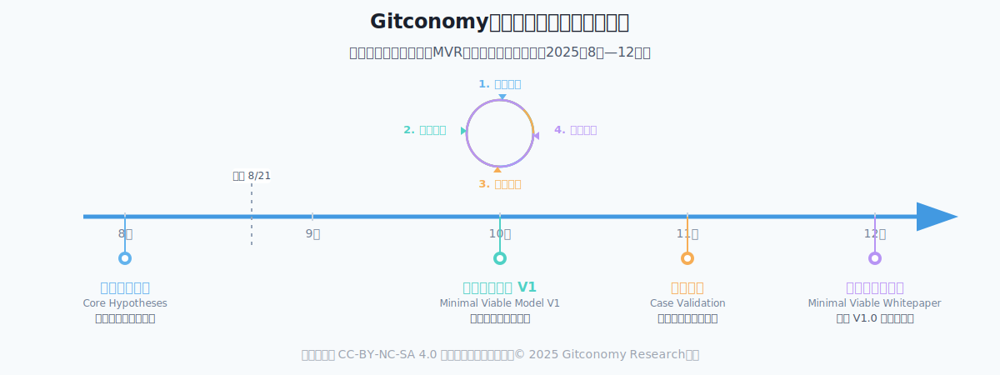

# Gitconomy社区所有制研究计划

## 1. 关于研究计划

在当今的数字世界中，许多在线社区——从开源项目到去中心化自治组织（DAO）——都在努力解决价值公平分配、可持续激励和有效治理等问题。“Gitconomy”模型旨在通过将**“贡献”视为生产的核心要素**来应对这些挑战。

我们的目标是超越象征性的奖励，创建一个将每一种有价值的贡献——无论是代码、文档、社区管理还是创意——进行量化，并直接转化为实体所有权的系统。本研究旨在为下一代数字社区构建一个公平、高效且可持续的发展框架。

*图：Gitconomy社区所有制研究计划概览*

## 2. 核心研究问题

**我们如何才能构建一个基于“贡献即要素”原则的“Gitconomy”社区所有制模式，以实现公平、高效、可持续的数字社区治理？**

## 3. 研究目标

我们的研究围绕四个主要🎯展开，每个目标对应项目的一个关键阶段：

1.  **🏛️ 理论建构：** 为Gitconomy社区所有制构建一个坚实的理论框架。
2.  **ንድ 模式设计：** 设计一套可操作的治理机制和激励体系。
3.  **🔬 实证验证：** 通过真实世界的案例研究和实验来验证理论与模型。
4.  **📜 标准制定：** 为数字社区治理提供可供参考的标准和最佳实践。

## 4. 研究框架：最小可行性研究 (MVR)

为了避免冗长的理论构建和闭门造车，本项目将采用最小可行性研究 (Minimum Viable Research, MVR) 的方法论。我们不会一次性完成所有阶段，而是通过一系列快速、迭代的研究周期来推进。每个周期都遵循“假设-构建-衡量-认知”的精益循环，旨在用最小的成本获得最核心的认知，并快速交付有价值的成果。

我们的研究活动将围绕以下迭代循环展开：

1. **提出核心假设 (Hypothesize)**：基于现有理论和观察，提出一个关于贡献、所有权与社区激励的核心假设。
2. **构建最小可行研究报告 (Build)**：围绕假设，设计一个最简化、足以进行验证的模型、工具或框架（即“MVP”，例如一个基于电子表格的贡献度量模型，或一套极简的治理规则）。
3. **进行实践衡量 (Measure)**：将MVP应用于一个真实的案例研究或小范围的试点实验中，收集关键数据和社区反馈。
4. **形成有效认知 (Learn)**：分析数据和反馈，验证或证伪我们的初始假设，形成新的认知。这些认知将直接指导我们下一轮周期的方向和假设。

通过不断重复这个循环，我们的理论框架、治理模型和最佳实践将逐步演化，变得愈加成熟和可靠

## 5. 研究路线图

本研究将遵循理论到实践，再从实践回归理论的路径，通过四个逻辑递进的阶段系统性地展开。每一个阶段都有明确的任务、研究方法和预期产出，确保研究过程的严谨性与最终成果的有效性。

### 第一阶段：理论建构

此阶段的重点是奠定理论基础。我们将通过广泛的文献研究，清晰界定“Gitconomy”及“贡献即要素”的核心概念，并融合公共池塘资源管理、利益相关者理论与机制设计等多学科理论，最终提出一个初步的Gitconomy社区所有制理论框架。关键产出是一份关于核心概念的清晰定义文档和初步的理论框架草案。

### 第二阶段：模式设计

在理论框架的指导下，本阶段将致力于设计可操作的治理方案。我们将开发一个多维度的贡献度量模型，设计一套将贡献动态映射为所有权的算法规则，并构建包含具体治理结构和激励机制的完整操作方案，包含贡献度量衡、所有权映射机制和治理激励体系的完整设计文档。

### 第三阶段：实证验证

此阶段旨在检验理论与设计的有效性。我们将选取典型的数字社区（如开源项目、DAO）进行深度案例研究，或与合作社区开展试点项目。通过收集和分析数据，评估模型在现实环境中的表现，并根据结果对理论和模型进行修正。这是是一份深度案例分析报告、试点项目的评估数据，以及对理论与模型的迭代优化方案。

### 第四阶段：标准制定

 在研究的最后阶段，我们将对经过验证的成果进行系统性总结与推广。我们将从成功实践中提炼出关键要素，形成一套可供其他社区参考的治理标准或框架，并最终撰写与发布《Gitconomy治理白皮书》。这是一份Gitconomy社区治理的最佳实践集合、一套参考标准框架以及公开发布的白皮书。

 ## 6. 研究时间表 ：第一轮冲刺 (2025年8月 - 12月)

当前阶段是我们研究的**第一轮冲刺**，目标是在年底前产出一个**最小可行白皮书” (Minimum Viable Whitepaper)**，包含核心理论、初步模型和基于首轮验证的洞察。

  * **2025年 8月：确立核心假设**

      * [x] 完成初步文献综述，提出第一轮冲刺的核心研究假设。
      * [ ] 召开社区研讨会，对核心假设进行校验和完善。

  * **2025年 9月 - 10月：构建V1版最小可行模型**

      * [ ] **9月:** 设计一个极简的、可用于案例分析的贡献度量框架 (MVP)。
      * [ ] **10月:** 基于该框架，完成一个初步的所有权映射与激励机制草案。

  * **2025年 11月：快速验证与衡量**

      * [ ] 选取1-2个典型社区作为案例，应用我们的MVP框架进行回顾性分析。
      * [ ] 收集关键数据，并通过访谈获取社区成员的定性反馈。

  * **2025年 12月：认知综合与成果发布**

      * [ ] **12月初:** 分析验证结果，总结本轮冲刺的关键认知(Learnings)。
      * [ ] **12月中:** 撰写“最小可行白皮书”V1.0，清晰呈现我们的假设、模型、验证过程和初步结论。
      * [ ] **12月31日:** 发布白皮书初稿，并规划下一轮研究冲刺的重点方向。

## 7. 参与贡献的价值 🌟

本项目本身就是“贡献即要素”理论的最佳试验场。您对本研究的任何贡献，不仅仅是帮助我们，更是亲身参与并塑造这一理论的实践过程。这是一个独特的“理论联系实践”的机会，您将获得：

- **成为理论的实践者**： 您的每一次贡献（无论是提出建议、编写代码还是提供案例）都将被视为构建Gitconomy模型的宝贵“生产要素”。您不是在研究一个外部对象，而是在通过亲身行动，成为理论本身的一部分。
- **第一视角的深度洞察**： 您将获得关于社区如何从零开始构建贡献识别与激励体系的“第一手”经验。这比任何外部观察都更加深刻，能帮助您真正理解社区治理的核心动态。
- **贡献价值的直接体现**： 我们致力于践行自己所研究的理论。因此，我们会努力记录并认可每一份贡献。杰出的贡献者不仅会在最终成果中获得署名，其贡献本身也将成为我们分析和验证贡献价值的真实案例。
- **共创未来的治理工具**： 您不仅仅是在为一个研究项目添砖加瓦，更是在为自己和广大社区建设者共同创造一套真正可用的、公平的治理工具和框架。

## 8. 如何参与？

这是一个开放的研究项目，我们欢迎来自研究人员、社区管理者、开发者以及任何对构建更优质数字社区感兴趣的朋友们的贡献。您可以通过以下方式参与：

  * **讨论 (Discussions):** 在本仓库的 `Discussions` 标签页中加入对话，分享您的想法、批评或相关工作。
  * **议题 (Issues):** 发现我们的研究计划存在不足或有任何建议？请创建一个 `Issue`。
  * **提供案例:** 您是否了解某些社区拥有有趣的贡献或治理模式？请通过创建Issue与我们分享。
  * **参与试点:** 我们将寻找合作伙伴社区以开展试点项目。敬请关注我们的后续公告。

我们期望所有贡献者都能遵守项目的 `行为准则(CODE_OF_CONDUCT.md)`。

## 9. 许可协议

- 本项目源代码采用 MIT License 进行许可，允许在满足许可证条款的前提下，自由地使用、复制、修改、合并、发布、分发、再许可和/或销售软件的副本。
- 所有研究成果（包括但不限于论文、数据、图表、模型、方法论描述等）默认使用 知识共享署名-非商业性使用-相同方式共享 4.0 国际许可协议 (CC BY-NC-SA 4.0) 进行许可。

-----

让我们共同构建社区治理的未来！
